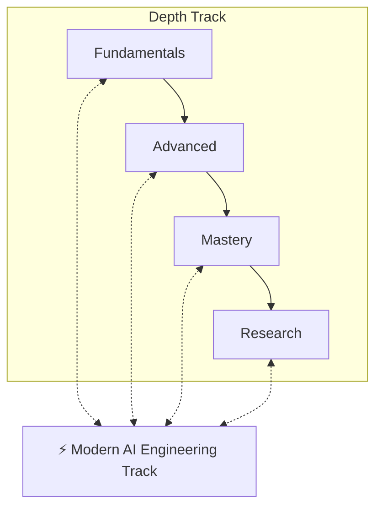
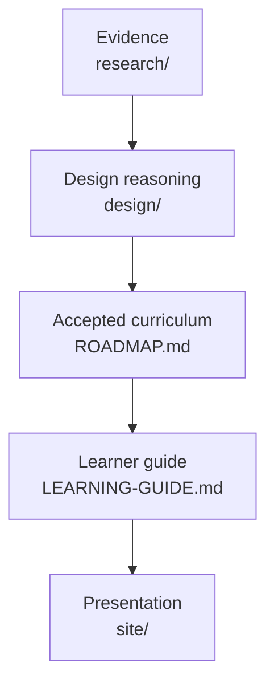
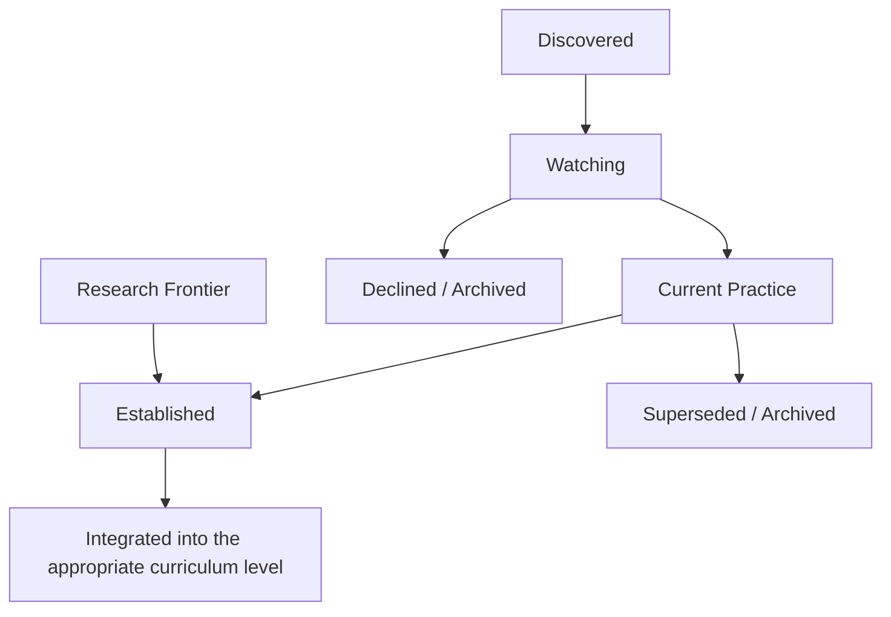
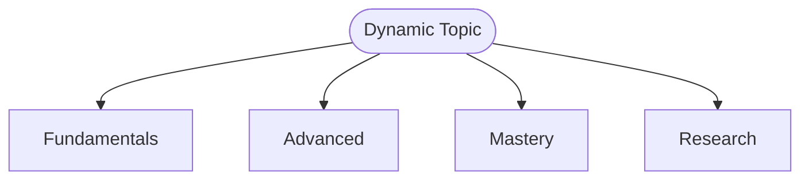
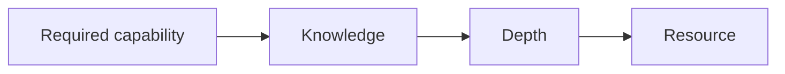
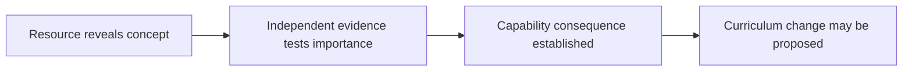
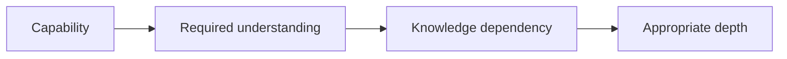
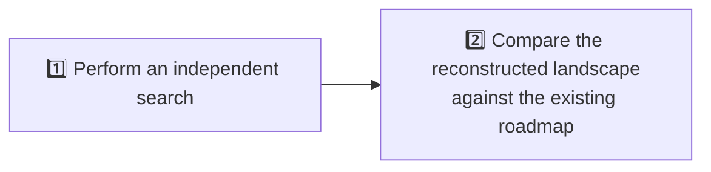
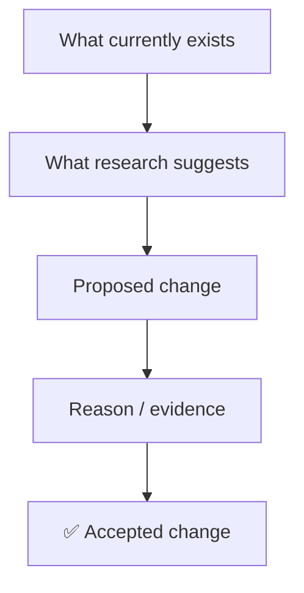

# AGENTS.md

Operating rules for AI agents working on this roadmap.

This file is the repository's constitution. The step-by-step maintenance procedure is in [MAINTENANCE.md](MAINTENANCE.md); the current project state is in [PROJECT-STATE.md](PROJECT-STATE.md).

## Contents

<b>Click to expand / collapse</b>

**Foundations**

1. [Purpose](#purpose)
2. [Core Principle](#core-principle)
3. [Canonical Truth Hierarchy](#canonical-truth-hierarchy)
4. [The Four Depth Levels](#the-four-depth-levels)
   - [Fundamentals](#fundamentals)
   - [Advanced](#advanced)
   - [Mastery](#mastery)
   - [Research](#research)
5. [Modern AI Engineering](#modern-ai-engineering)
6. [Modern Does Not Mean Important](#modern-does-not-mean-important)

**Classifying Topics**

7. [Topic Maturity](#topic-maturity)
8. [Knowledge Depth](#knowledge-depth)
9. [Three Knowledge Lenses](#three-knowledge-lenses)
   - [Model Science](#model-science)
   - [Intelligence Systems](#intelligence-systems)
   - [AI Engineering](#ai-engineering)
10. [Dynamic Topics](#dynamic-topics)

**Changing the Curriculum**

11. [Curriculum Change Rule](#curriculum-change-rule)
12. [Promotion Into the Permanent Curriculum](#promotion-into-the-permanent-curriculum)
13. [Deprecation and Supersession](#deprecation-and-supersession)
14. [Framework Policy](#framework-policy)
15. [Model and Product Release Policy](#model-and-product-release-policy)
16. [Human Approval Boundary](#human-approval-boundary)

**Resources**

17. [Resource Independence Rule](#resource-independence-rule)
18. [Resource Compression Rule](#resource-compression-rule)

**Research Practice**

19. [Research Standards](#research-standards)
20. [Independent Discovery and Falsification Rule](#independent-discovery-and-falsification-rule)
    - [Two-Pass Rule for Deep Reviews](#two-pass-rule-for-deep-reviews)
    - [Proportional Independence](#proportional-independence)
    - [Permanent Bias Checklist](#permanent-bias-checklist)
21. [Fresh-Research Rule](#fresh-research-rule)
22. [Research Recency](#research-recency)
23. [Evidence Versus Adoption](#evidence-versus-adoption)

**Review Cycles**

24. [4-Week Modern AI Scan](#4-week-modern-ai-scan)
25. [12-Week Curriculum Review](#12-week-curriculum-review)
26. [Avoid Hype-Driven Curriculum Drift](#avoid-hype-driven-curriculum-drift)

**Learning Outcomes**

27. [Career Relevance](#career-relevance)
28. [Projects](#projects)

**Boundaries and Governance**

29. [Data & Intelligence Boundary](#data--intelligence-boundary)
30. [Baselines and History](#baselines-and-history)
31. [Uncertainty](#uncertainty)
32. [Completeness Audits](#completeness-audits)
33. [Change Discipline](#change-discipline)
34. [Generated HTML](#generated-html)
35. [Formatting and Presentation Conventions](#formatting-and-presentation-conventions)
    - [Markdown Source Files](#markdown-source-files)
    - [Generated HTML Output](#generated-html-output)
    - [Formatting Changes](#formatting-changes)
36. [Current Project Stage](#current-project-stage)

---

## Purpose

This repository maintains a rigorous, continuously updated learning roadmap for becoming an AI Engineer on the **Data & Intelligence** side of the field.

The roadmap has two complementary structures:

1. **Depth Track** — Fundamentals, Advanced, Mastery, Research.
2. **Modern AI Engineering Track** — a parallel, continuously maintained track representing important contemporary AI engineering knowledge and practice.

The goal is to develop both:

- deep scientific and technical understanding; and
- the ability to build, evaluate, and reason about contemporary AI systems.

> ⚠️ Do not collapse these into a single progression.

[⬆ Back to Contents](#contents)

---

## Core Principle

The roadmap must optimize for:

> **Durable understanding + contemporary engineering competence.**

Do not optimize for:

- number of topics;
- number of papers;
- number of frameworks;
- trend coverage;
- model-release coverage;
- repository size; or
- appearing comprehensive.

Completeness matters, but only when the included material contributes meaningfully to understanding or capability.

[⬆ Back to Contents](#contents)

---

## Canonical Truth Hierarchy

Each layer of the repository has one job. Keep them separate.

| Layer | Location | Authority |
| --- | --- | --- |
| **Accepted curriculum** | [ROADMAP.md](ROADMAP.md) | **Canonical** for what the learner learns |
| **Learner guide** | [LEARNING-GUIDE.md](LEARNING-GUIDE.md) | Presents the accepted curriculum as one path for learners. Adds no curriculum; when it disagrees with ROADMAP.md, ROADMAP.md wins |
| **Evidence** | `research/` | What was found, when, and how confidently |
| **Design reasoning** | `design/` | Why curriculum and presentation decisions were made |
| **Maintenance record** | `reviews/` | Scans, curriculum reviews and maintenance state |
| **Historical baselines** | `history/` | Earlier canonical curricula, preserved unchanged |
| **Presentation** | `site/` | Generated from canonical sources; never defines curriculum |
| **Governance** | this file and [MAINTENANCE.md](MAINTENANCE.md) | How the repository is operated |

> ⚠️ Never silently reconcile disagreement between these layers.
>
> If evidence contradicts the curriculum, record the conflict and propose a change through the [Curriculum Change Rule](#curriculum-change-rule). If the site or the learner guide contradicts the curriculum, the curriculum wins; the guide is corrected and the site is regenerated.

**Evidence ≠ Decision ≠ Presentation.**

[⬆ Back to Contents](#contents)

---

## The Four Depth Levels

**In this section:** [Fundamentals](#fundamentals) · [Advanced](#advanced) · [Mastery](#mastery) · [Research](#research)

The permanent curriculum is organized by depth.

### Fundamentals

Established knowledge required to understand and work effectively with later material.

**Fundamental does not mean easy.** Fundamentals may include mathematically or technically difficult material when later knowledge depends on it.

Target capabilities may include:

- awareness;
- use;
- understanding; and
- implementation.

> ⚠️ Do not move something out of Fundamentals merely because it is difficult.
>
> Do not move something into Fundamentals merely because it is popular.

### Advanced

Material requiring the learner to understand:

- modern methods;
- interactions between concepts;
- important alternatives;
- trade-offs;
- limitations;
- failure modes; and
- complete systems.

Advanced learning should increasingly require combining concepts rather than studying them independently.

### Mastery

Material intended to develop independent technical judgment.

Expected capabilities include:

- deriving important ideas;
- implementing methods;
- designing systems;
- diagnosing failures;
- comparing alternatives;
- designing experiments;
- interpreting evidence;
- optimizing systems;
- explaining trade-offs; and
- defending technical decisions.

Mastery should combine broad advanced literacy with deeper specialization in selected areas.

> ⚠️ Do not require research-level specialization in every AI domain.

### Research

Research concerns questions for which the answer is not already established.

Expected capabilities include:

- literature review;
- identifying gaps;
- hypothesis formation;
- experimental design;
- baseline selection;
- ablation studies;
- reproducibility;
- statistical reasoning;
- interpretation;
- scientific writing; and
- peer-review literacy.

> ⚠️ Do not use “Research” as a synonym for “very difficult.”

[⬆ Back to Contents](#contents)

---

## Modern AI Engineering

Modern AI Engineering is **not** a fifth depth level. It is a parallel track that answers:

> **What should a capable AI engineer understand and be able to work with today?**

It may contain:

- recently established engineering practices;
- rapidly developing techniques;
- important contemporary system patterns;
- emerging protocols;
- modern model capabilities;
- new evaluation practices;
- changing inference techniques;
- agentic system patterns;
- multimodal engineering;
- current safety/security practices; and
- other developments that materially affect AI engineering.

A topic may exist simultaneously in Modern AI Engineering and one or more permanent depth levels.

[⬆ Back to Contents](#contents)

---

## Modern Does Not Mean Important

> ⚠️ Never add something merely because it is new.

For every emerging topic, distinguish:

1. Novelty
2. Technical significance
3. Evidence
4. Adoption
5. Durability
6. Career relevance
7. Dependency value
8. Research importance

A topic may be:

- exciting but irrelevant to this roadmap;
- commercially popular but scientifically shallow;
- scientifically important but currently unnecessary for an applied AI engineer; or
- important engineering knowledge without being foundational science.

Preserve these distinctions.

[⬆ Back to Contents](#contents)

---

## Topic Maturity

When useful, classify dynamic topics using statuses such as:

`Discovered` · `Watching` · `Current Practice` · `Established` · `Superseded` · `Declined` · `Archived`

> ⚠️ Do not treat maturity as a measure of difficulty.

- A highly advanced research topic can be immature.
- A simple engineering technique can be established.

**Lifecycle.**

> ⚠️ Modern practice does not automatically become permanent curriculum.
>
> Integration requires the [Curriculum Change Rule](#curriculum-change-rule).

[⬆ Back to Contents](#contents)

---

## Knowledge Depth

When deciding how deeply a topic should be learned, use the following ladder where appropriate:

| # | Level | Meaning |
| --- | --- | --- |
| 1 | **Awareness** | Know what it is and why it exists. |
| 2 | **Use** | Use it correctly with existing implementations. |
| 3 | **Understand** | Explain how and why it works, including important trade-offs. |
| 4 | **Implement** | Build or reproduce the important mechanism. |
| 5 | **Design** | Independently design systems or approaches using the concept. |
| 6 | **Research** | Investigate unresolved questions and potentially contribute new knowledge. |

Do not assume every topic must reach every level.

> **Example:** A Fundamentals learner may need to implement one concept while only requiring awareness of another.

[⬆ Back to Contents](#contents)

---

## Three Knowledge Lenses

**In this section:** [Model Science](#model-science) · [Intelligence Systems](#intelligence-systems) · [AI Engineering](#ai-engineering)

When useful, analyze topics through three overlapping lenses.

### Model Science

Scientific understanding of:

- learning;
- representations;
- architectures;
- optimization;
- training;
- adaptation;
- reasoning;
- model behavior; and
- related mathematical principles.

### Intelligence Systems

How intelligence emerges from combinations of:

- models;
- retrieval;
- search;
- memory;
- context;
- planning;
- reasoning;
- verification;
- computation;
- tools;
- environments; and
- feedback.

### AI Engineering

How AI capabilities become useful systems through:

- implementation;
- integration;
- reliability;
- evaluation;
- observability;
- security;
- efficiency;
- maintainability; and
- deployment-related AI practices.

These are lenses, not mutually exclusive categories.

> ⚠️ Do not force a topic into exactly one.

[⬆ Back to Contents](#contents)

---

## Dynamic Topics

Some topics evolve across multiple curriculum levels. Examples may include retrieval, reasoning, agents, multimodality, evaluation, model adaptation, and other rapidly evolving areas.

Represent them conceptually as:

Modern AI Engineering continuously observes developments that may affect any of these layers.

> ⚠️ Do not assume an entire topic belongs to a single level.

[⬆ Back to Contents](#contents)

---

## Curriculum Change Rule

A permanent curriculum change should normally require all of:

1. **Capability consequence** — what the learner can or cannot do because of the change;
2. **Evidence** appropriate to the claim (see [Research Standards](#research-standards));
3. **Dependency analysis** — what it requires and what depends on it;
4. **Required-depth analysis** on the [Knowledge Depth](#knowledge-depth) ladder;
5. **Role decision** — Universal Core, Important Extension, Specialization, Research Frontier, or Modern Practice only;
6. **Removal and anti-bloat test** — without this, the learner would be unable to ___; and would the capability survive at a lower depth?
7. **Human approval** for significant canonical changes (see [Human Approval Boundary](#human-approval-boundary)).

Do not promote material because it is merely:

- new;
- popular;
- frequently discussed;
- attached to a major model release;
- available in a good course;
- highly starred;
- commercially important; or
- fashionable.

[⬆ Back to Contents](#contents)

---

## Promotion Into the Permanent Curriculum

A topic discovered through Modern AI Engineering must **not** automatically enter the permanent curriculum.

Before promotion, evaluate:

| Criterion | Question |
| --- | --- |
| **Scientific maturity** | Is the underlying idea supported by meaningful evidence? |
| **Engineering adoption** | Is it being used meaningfully beyond isolated demonstrations? |
| **Durability** | Is the concept likely to remain useful even if today’s implementation disappears? |
| **Dependency value** | Will later knowledge assume understanding of this concept? |
| **Career relevance** | Would competent AI engineers reasonably benefit from knowing or using it? |
| **Concept versus implementation** | Is the durable knowledge the underlying concept, rather than a specific framework or vendor implementation? |
| **Appropriate depth** | Should the learner be aware of it, use it, understand it, implement it, design with it, or research it? |

Only after these questions are considered should the roadmap be modified.

[⬆ Back to Contents](#contents)

---

## Deprecation and Supersession

The roadmap must also be capable of removing or reducing emphasis on material.

During reviews, ask:

- Has this technique been superseded?
- Has its importance declined?
- Is it mainly historically useful now?
- Is it still required to understand modern approaches?
- Should it remain for conceptual lineage?
- Has an implementation disappeared while the underlying concept survived?

> ⚠️ Do not silently delete historically important material.

When useful, preserve the reason for deprecation or archival.

[⬆ Back to Contents](#contents)

---

## Framework Policy

**Concepts come before frameworks.**

Do not structure the curriculum primarily around specific frameworks, libraries, vendors, or products.

Examples of the intended distinction:

| ✅ Preferred curriculum categories | ❌ Not preferred as curriculum categories |
| --- | --- |
| Agent orchestration | A particular agent framework |
| State management | A particular vector database |
| Tool calling | A particular API provider |
| Retrieval | A particular model vendor |
| Evaluation | |
| Model serving | |
| Structured generation | |

Frameworks may still be selected for:

- implementation;
- projects;
- experimentation;
- comparison;
- industry familiarity; and
- learning exercises.

When a framework teaches a durable concept particularly well, explain that relationship.

[⬆ Back to Contents](#contents)

---

## Model and Product Release Policy

> ⚠️ Do not turn the roadmap into a chronology of model releases.

A new model matters when it provides evidence of a meaningful change in areas such as:

- architecture;
- training;
- post-training;
- reasoning;
- tool use;
- multimodality;
- efficiency;
- inference;
- evaluation;
- safety;
- agent design; or
- another durable technical direction.

Otherwise, treat the release as industry context rather than curriculum material.

[⬆ Back to Contents](#contents)

---

## Human Approval Boundary

Agents may, without prior approval: research; analyze; write scan and review reports; update maintenance state; record watch items and current-practice observations; and **propose** curriculum changes.

Agents must **not** silently make significant changes to [ROADMAP.md](ROADMAP.md). Significant changes require explicit human approval first. They include:

- adding or removing a Universal Core area;
- materially changing a block's required depth;
- changing major prerequisites;
- promoting an Important Extension into Universal Core;
- removing a required capability; and
- substantial changes to the mandatory resource burden.

After approval, agents may implement the accepted change. The narrow class of minor changes that needs no approval cycle is defined in [MAINTENANCE.md](MAINTENANCE.md).

> ⚠️ Never classify a curriculum-content change as "minor" to avoid approval.

[⬆ Back to Contents](#contents)

---

## Resource Independence Rule

**Resources support curriculum; resources do not define curriculum.**

Never reason in the opposite direction — *good resource → interesting chapters → mandatory curriculum*.

When a resource reveals a possibly missing concept:

- Scarcity of teaching resources does not prove a topic is unimportant.
- Availability of an excellent resource does not make a topic universally required.
- Resource boundaries do not determine curriculum boundaries. Assign resources by chapter or section; each assigned portion has one curriculum home.

[⬆ Back to Contents](#contents)

---

## Resource Compression Rule

For any change to mandatory resources, apply all four tests:

| Test | Question |
| --- | --- |
| **Individual removal** | If this resource were removed, what meaningful learner capability would become inadequately supported? A newly uncovered bullet is not enough |
| **Bundle compression** | Can several narrow resources be replaced by one anchor; selected sections; one anchor plus one paper; an exercise; curriculum-authored synthesis; or optional or reference material? |
| **Marginal capability gain** | What capability becomes adequately learnable only after adding this resource? "More complete coverage" is not an answer |
| **Learning cost** | Pages and time; conceptual overhead; prerequisite burden; duplication; context switching; implementation burden |

> ⚠️ Never optimize toward a predetermined resource count.

[⬆ Back to Contents](#contents)

---

## Research Standards

When performing roadmap research, do not begin by assuming the existing taxonomy is complete. Search broadly enough to discover missing areas.

Prefer evidence in roughly the following order:

1. original research papers;
2. peer-reviewed conference or journal publications;
3. official technical reports;
4. official documentation/specifications;
5. official engineering or research publications from credible organizations;
6. high-quality independent technical analysis;
7. community discussion when useful for adoption or practitioner experience.

Secondary sources may help discover topics but should not replace primary sources for important technical claims when primary evidence exists.

**Cross-check consequential claims.**

[⬆ Back to Contents](#contents)

---

## Independent Discovery and Falsification Rule

**In this section:** [Two-Pass Rule for Deep Reviews](#two-pass-rule-for-deep-reviews) · [Proportional Independence](#proportional-independence) · [Permanent Bias Checklist](#permanent-bias-checklist)

When a task is intended to assess completeness, currency, correctness, resource adequacy, or field coverage, the existing roadmap's taxonomy, topic lists, resources and prior conclusions must be treated as **hypotheses to test**, not as the search space.

> **The system must be capable of proving the roadmap wrong.**
>
> A curriculum does not survive merely because it already exists.

### Two-Pass Rule for Deep Reviews

**Pass 1 — Independent reconstruction.** Start from learner capability, current external evidence and observed engineering and scientific needs — not from the current curriculum's taxonomy. Derive:

Freeze or otherwise preserve the independent result **before** comparison wherever practical.

**Pass 2 — Adversarial comparison.** Only after the independent model exists, compare it with the current roadmap. Classify findings as, for example: Correct · Missing · Excessive · Misplaced · Outdated · Under-specified · Over-specified · Uncertain.

> ⚠️ Do not silently reconcile differences.
>
> Preserve genuine conflicts. Report strong confirmations as plainly as disagreements.

### Proportional Independence

The strength of the independence safeguard matches the stakes of the task.

| Task | Required independence |
| --- | --- |
| **4-week Modern AI Scan** | Lightweight. No full field reconstruction. Search directions must stay open to developments outside them |
| **12-week Curriculum Review** | Meaningful independent examination of what the learner now needs, performed **before** comparison with [ROADMAP.md](ROADMAP.md) |
| **Major redesign or completeness audit** | The strongest feasible safeguards, which may include fresh-agent separation — an agent that has not read the curriculum — and a frozen, checksummed Phase I artifact |

An agent that has already read or written the curriculum must not claim to have performed a blind reconstruction. Disclose the limitation, and delegate the blind pass where the task requires one.

### Permanent Bias Checklist

Every curriculum review must actively test for:

| Bias | Question |
| --- | --- |
| **Anchoring** | Did an existing taxonomy or topic list constrain what could be found? |
| **Confirmation** | Was contradicting evidence pursued as seriously as supporting evidence? |
| **Coverage** | Is the curriculum shaped by what is easy to map rather than what learners need? |
| **Resource-induced curriculum** | Did a topic enter, deepen or stay because a resource teaches it — or shrink because none does? |
| **Availability** | Are well-documented subjects over-represented relative to important but fragmented ones? |
| **LLM-centricity** | Does the critical path route non-LLM capability through LLM-specific knowledge? |
| **Recency** | Is current practice being promoted to durable curriculum before durability is shown? |
| **Historical inertia** | Is something kept because curricula traditionally contain it rather than because a capability needs it? |
| **Granularity and bloat** | Did decomposition into narrow requirements inflate the curriculum or the resource set? |
| **Tool and vendor** | Is a product, framework or vendor being taught in place of the durable concept? |
| **Maintenance lock-in** | Is the curriculum defended because changing it is effortful? |

[⬆ Back to Contents](#contents)

---

## Fresh-Research Rule

When explicitly asked to perform a comprehensive landscape review, do not simply expand the existing roadmap.

This reduces anchoring and helps discover areas that previous versions missed. The [Independent Discovery and Falsification Rule](#independent-discovery-and-falsification-rule) generalizes it to all reviews.

> Existing curriculum is evidence of previous decisions, not proof of completeness.

[⬆ Back to Contents](#contents)

---

## Research Recency

For contemporary AI engineering research, pay attention to publication and release dates.

Distinguish:

- established historical foundations;
- recent established developments;
- current engineering practice;
- active research;
- experimental work.

> ⚠️ Do not describe a development as current solely because a recent article discusses an old technique.
>
> Likewise, do not assume a new paper represents established practice.

[⬆ Back to Contents](#contents)

---

## Evidence Versus Adoption

Scientific evidence and engineering adoption are different signals.

A technique may have:

| Signal A | | Signal B |
| --- | :---: | --- |
| Strong research evidence | + | Low adoption |
| Weak evidence | + | High hype |
| High adoption | + | Limited scientific novelty |
| High scientific importance | + | Narrow practical relevance |

Record these distinctions when they matter.

[⬆ Back to Contents](#contents)

---

## 4-Week Modern AI Scan

Approximately every four weeks, conduct a lightweight **discovery** review.

**Primary question:**

> What materially changed in AI science or engineering during this period that may deserve our attention?

Look for:

- new technical directions;
- meaningful improvements to existing methods;
- emerging engineering patterns;
- new protocols or standards;
- changes in model capabilities that imply new engineering possibilities;
- notable evaluation developments;
- meaningful safety/security developments;
- emerging research directions; and
- technologies showing substantial adoption.

The scan should primarily update:

- current topics;
- watchlists;
- evidence;
- status; and
- notes.

> ⚠️ It should not normally restructure the permanent curriculum.
>
> It is not a news feed. "No curriculum-relevant change" is a valid result.

The step-by-step procedure, output location and report format are in [MAINTENANCE.md](MAINTENANCE.md).

[⬆ Back to Contents](#contents)

---

## 12-Week Curriculum Review

Approximately every twelve weeks, conduct a deeper review.

**Primary question:**

> Given the accumulated evidence, does anything in the permanent roadmap need to change?

Evaluate:

- topics discovered during recent scans;
- changes in established fields;
- newly mature techniques;
- declining techniques;
- superseded approaches;
- missing dependencies;
- career relevance;
- changes in research direction;
- changes in modern engineering practice; and
- curriculum balance.

Possible outcomes include:

| Keep | Add or promote | Reduce |
| --- | --- | --- |
| No change | Add to Modern AI Engineering | Reduce emphasis |
| Continue watching | Promote to Fundamentals | Mark superseded |
| Change required depth | Promote to Advanced | Archive |
| | Promote to Mastery | |
| | Add to Research | |

**Every significant curriculum change should have an explicit reason.**

The review applies the [Independent Discovery and Falsification Rule](#independent-discovery-and-falsification-rule): it asks what the learner needs now, independently, before asking what changed in the roadmap's own topics. The procedure is in [MAINTENANCE.md](MAINTENANCE.md).

[⬆ Back to Contents](#contents)

---

## Avoid Hype-Driven Curriculum Drift

Do not recommend curriculum changes based primarily on:

- social-media attention;
- launch announcements;
- benchmark marketing;
- isolated demonstrations;
- GitHub stars;
- company valuation;
- influencer enthusiasm;
- temporary job-posting buzz; or
- a single paper without corroborating evidence.

These may be discovery signals, but not sufficient evidence for curriculum promotion.

[⬆ Back to Contents](#contents)

---

## Career Relevance

Career relevance matters, especially for Modern AI Engineering. However, career relevance does not mean chasing every tool appearing in job descriptions.

**Prioritize capabilities that transfer across implementations.** Examples include:

- building with models;
- retrieval;
- structured generation;
- evaluation;
- tool use;
- agent architecture;
- context management;
- multimodality;
- model adaptation;
- debugging AI systems;
- reliability;
- security;
- inference awareness; and
- experimental reasoning.

Specific tools can then be learned as implementations of those capabilities.

[⬆ Back to Contents](#contents)

---

## Projects

**Projects should validate knowledge.**

Avoid collections of shallow tutorial projects. Prefer projects that progressively evolve as the learner develops.

A project may begin during Fundamentals and later incorporate:

- improved modeling;
- better retrieval;
- reranking;
- evaluation;
- tool use;
- agents;
- protocols;
- memory;
- multimodality;
- observability;
- security;
- optimization; and
- experimentation.

Projects should make it possible to explain:

1. what was built;
2. why the architecture was chosen;
3. how it works;
4. what alternatives were considered;
5. how quality was measured;
6. what failed;
7. what trade-offs were made; and
8. what would be improved next.

[⬆ Back to Contents](#contents)

---

## Data & Intelligence Boundary

This repository covers the Data & Intelligence side of AI Engineering. A separate Computer Science & Engineering roadmap will cover general computing foundations and systems engineering.

When placement is ambiguous, ask:

> Is this material primarily necessary to understand/build **intelligent and data-driven systems**, or primarily necessary to understand/build **computing systems**?

Examples:

| Topic | Placement |
| --- | --- |
| PyTorch autograd | Data & Intelligence |
| Why FlashAttention reduces attention memory complexity | Data & Intelligence |
| Writing highly optimized CUDA attention kernels | Primarily CS/Engineering or ML Systems specialization |
| Distributed-training concepts | Data & Intelligence |
| Deep distributed-systems theory | CS/Engineering |
| Retrieval algorithms for RAG | Data & Intelligence |
| Implementing a distributed vector database | CS/Engineering |

Boundary topics may appear in both roadmaps at different depths. The operational boundary for the current baseline — including ML-specific testing (D&I) versus general software testing (CS&E), and AI-specific versus general security — is stated in [ROADMAP.md](ROADMAP.md).

> ⚠️ Do not duplicate large amounts of generic CS material here merely because AI systems depend on computers.

[⬆ Back to Contents](#contents)

---

## Baselines and History

The accepted curriculum is versioned as numbered **baselines**. [ROADMAP.md](ROADMAP.md) holds the current baseline.

- **Baseline v0** — the pre-audit learning plan, preserved at [history/roadmap-baseline-v0.md](history/roadmap-baseline-v0.md).
- **Baseline 1** — accepted 2026-09-18, preserved at [history/roadmap-baseline-1.md](history/roadmap-baseline-1.md).
- **Baseline 2** — accepted 2026-09-19; current. Adds the reading plan (coherent core books read whole) and the parallel track's hands-on resources.

Rules:

- A new baseline number is created only for a **significant accepted curriculum revision**. Typo fixes, formatting, broken links, site regeneration, review reports and watchlist changes do not create a new baseline.
- Before a new baseline replaces [ROADMAP.md](ROADMAP.md), preserve the outgoing baseline verbatim in `history/`.
- Files in `history/` are **immutable**. Do not edit, reinterpret or "correct" them; they exist for comparison and provenance.

Separate, for every proposed change:

> ⚠️ Do not rewrite the accepted curriculum automatically when new research is performed.
>
> Until a proposed change is accepted, preserve the existing roadmap.

[⬆ Back to Contents](#contents)

---

## Uncertainty

When evidence is uncertain, say so.

Use language that distinguishes:

- established fact;
- strong evidence;
- emerging consensus;
- active debate;
- plausible direction;
- speculation.

**Evidence calibration.** Label important conclusions as **Observed** (directly supported by a source), **Inference** (reasoned from several observations), **Judgment** (a design conclusion that cannot be established as fact) or **Uncertain**, with **High**, **Medium** or **Low** confidence where useful.

Prefer *"No adequate resource was found in this research"* over *"No resource exists"*. Distinguish search failure from nonexistence.

> ⚠️ Do not manufacture certainty merely to produce a cleaner roadmap.

[⬆ Back to Contents](#contents)

---

## Completeness Audits

Major roadmap reviews should include deliberate attempts to find what is missing.

At minimum, ask:

| Perspective | Question |
| --- | --- |
| **Research** | What would an experienced ML/AI researcher notice is absent? |
| **Engineering** | What would an experienced AI engineer building contemporary systems notice is absent? |
| **Outside-the-hype** | What important areas are being neglected because attention is concentrated on LLMs, agents, or current industry trends? |
| **Dependency** | Are later topics relying on knowledge that was never properly introduced? |
| **Historical** | Have important conceptual predecessors been removed even though they are necessary for understanding current methods? |

Completeness audits should search outside the existing taxonomy.

[⬆ Back to Contents](#contents)

---

## Change Discipline

Prefer small, explainable roadmap changes over large uncontrolled rewrites.

When modifying important curriculum structure:

1. identify the issue;
2. gather evidence;
3. describe the proposed change;
4. explain why;
5. identify affected dependencies;
6. preserve relevant historical context; and
7. update the roadmap only after the decision is accepted.

> ⚠️ Do not optimize the roadmap merely for aesthetic symmetry.

[⬆ Back to Contents](#contents)

---

## Generated HTML

Markdown and other approved source files are the **canonical source of truth** for this repository.

The HTML site is a generated reading interface.

When content that affects the learner-facing roadmap is changed:

1. update the canonical source file first;
2. regenerate the corresponding HTML output;
3. verify that the generated HTML reflects the source accurately; and
4. report both the source changes and generated-output changes.

> ⚠️ Do not maintain independent curriculum content directly inside generated HTML.
>
> Do not fix content inconsistencies by editing generated HTML.

If Markdown and generated HTML disagree, the canonical source files take precedence and the HTML should be regenerated.

Generated HTML should prioritize readability and navigation. As the repository grows, it may provide:

- hierarchical navigation;
- table of contents;
- cross-links between topics;
- learning-stage indicators;
- topic maturity indicators;
- references;
- project links;
- review information; and
- other useful views derived from canonical source content.

**Presentation logic must remain separate from curriculum decisions.**

- A visual redesign must not silently modify curriculum content.
- A curriculum change must not be made merely to simplify HTML generation.

Unless explicitly requested otherwise, after modifying learner-facing canonical content, ensure the generated HTML is brought back into sync before considering the task complete.

[⬆ Back to Contents](#contents)

---

## Formatting and Presentation Conventions

**In this section:** [Markdown Source Files](#markdown-source-files) · [Generated HTML Output](#generated-html-output) · [Formatting Changes](#formatting-changes)

All learner-facing documents should follow one consistent presentation style so they are easy to read and navigate, both in Markdown preview and in the generated HTML.

These conventions govern presentation only. They must never be used as a reason to change curriculum content.

### Markdown Source Files

Apply the following conventions to `README.md`, `AGENTS.md`, `ROADMAP.md`, `MAINTENANCE.md`, and any future learner-facing Markdown file.

| Element | Convention |
| --- | --- |
| **Justified text** | Wrap the entire document in a single `
` placed on the first line and closed with `
` on the last line. Leave a blank line after the opening tag and before the closing tag so Markdown inside the wrapper still renders. Do not add per-paragraph alignment tags. |
| **Title** | Use exactly one `#` heading for the document title. |
| **Headings** | Use `##` for main sections, `###` for sub-sections, and `####` for deeper levels. Preserve any existing numbering in heading text (for example `2.1 Official Python Tutorial`). |
| **Table of contents** | Add a `## Contents` heading after the introduction. Place the list inside `
` with `
<b>Click to expand / collapse</b>
` so it is collapsible. Nest sub-sections under their parent entries (sub-TOC). Group long lists under bold group labels where it helps. |
| **Sub-TOC per section** | When a `##` section has sub-headings, start it with an `**In this section:**` line of links separated by ` · `. |
| **Back to Contents** | End every `##` section with `[⬆ Back to Contents](#contents)`. |
| **Section separators** | Separate `##` sections with a horizontal rule (`---`). Do not use decorative characters such as `⸻`. |
| **Anchors** | Link using GitHub-style heading slugs (lowercase, punctuation removed, spaces become hyphens; for example `Data & Intelligence Boundary` → `#data--intelligence-boundary`). Avoid duplicate heading text, because duplicates receive numbered suffixes and break links. Check every TOC link after renaming a heading. |
| **Diagrams** | Draw flows, hierarchies, and tracks as fenced `mermaid` flowcharts, not ASCII art. Node labels must use the source wording. Use plain `text` code blocks only when Mermaid cannot express the diagram. |
| **Tables** | Use tables for naturally tabular content: status lists, criteria with questions, comparisons, and mappings. Do not invent groupings or hierarchy that the source does not state. |
| **Lists** | Use `-` for bullets and `1.` for ordered steps. Keep each item's original punctuation. |
| **Callouts** | Put prohibitions and warnings (“Do not…”, “Never…”) in `> ⚠️` blockquotes. Put key principles and guiding questions in blockquotes, with bold for the central statement. Separate consecutive callout sentences with an empty `>` line so they render on separate lines. |
| **Labels and emphasis** | Bold field labels such as `**Status:**`, `**Purpose:**`, and `**Primary resource:**`. Italicize resource titles. Use bold sparingly for genuinely key phrases. |
| **Cross-file links** | Link repository files with relative Markdown links, for example `[ROADMAP.md](ROADMAP.md)`. |

### Generated HTML Output

The generated HTML should present the same structure with equivalent, and where the browser allows, richer behaviour:

| Element | HTML equivalent |
| --- | --- |
| **Justified text** | Justify long-form prose — paragraphs, list items and quotations inside the content column — through stylesheet rules, not inline per element, with `hyphens: auto` so the lines stay even. Interface text is set ragged right: headings, navigation, breadcrumbs, labels, table cells, controls, code and diagram labels, where justification only stretches short lines into gaps. Below the measure at which justification reads evenly, prose is ragged right too. The site build checks which selectors may justify and that the narrow-measure fallback exists. |
| **Readable measure** | Limit the content column to a comfortable line length (roughly `70–80ch`) with generous line height. |
| **Table of contents** | Render a hierarchical, collapsible TOC with the same nesting as the Markdown TOC. On wide screens it may be a sticky sidebar; on narrow screens it should collapse into an expandable menu. Highlight the section currently in view. |
| **Sub-TOC per section** | Render the **In this section** links for sections that have sub-headings. |
| **Back to Contents** | Provide a back-to-Contents link at the end of each main section, and a floating “back to top” button that appears after scrolling. |
| **Anchors** | Generate heading IDs identical to the Markdown slugs so links are interchangeable between Markdown and HTML. Headings should expose a copyable anchor link. |
| **Diagrams** | Render Mermaid blocks as diagrams (for example with Mermaid.js or pre-rendered SVG), readable in both light and dark themes. The diagram source must come from the Markdown file. |
| **Tables** | Style tables with clear header rows and borders, and make wide tables scroll horizontally inside their container rather than overflowing the page. |
| **Callouts** | Render `⚠️` blockquotes as visually distinct warning callouts and other blockquotes as highlighted notes. |
| **Theming** | Support light and dark modes with sufficient text contrast. |
| **Layout** | Work at phone width without horizontal page scrolling. |
| **Accessibility** | Use semantic elements (`nav`, `main`, `section`, `h1`–`h4`), keyboard-operable collapsible sections, and visible focus states. |

HTML may add navigation aids that Markdown cannot provide, but it must not add, remove, or reword curriculum content.

### Formatting Changes

When reformatting a document:

1. change layout only, keeping the original wording and the order of the content;
2. if any wording must change for formatting reasons, list every such change explicitly when reporting;
3. keep a copy of the original until the change has been reviewed;
4. verify that every original word is still present, for example with a word-level comparison;
5. verify that all TOC, sub-TOC, and back-to-Contents links resolve; and
6. regenerate and check the HTML output when it exists.

> ⚠️ Mermaid diagrams render natively on GitHub. The built-in VS Code Markdown preview needs an extension such as **Markdown Preview Mermaid Support** to display them.

[⬆ Back to Contents](#contents)

---

## Current Project Stage

**Baseline 2 is accepted and canonical in [ROADMAP.md](ROADMAP.md)** (2026-09-19; Baseline 1 was accepted on 2026-09-18). The initial broad curriculum-construction phase — landscape research, resource audits, curriculum design, independent falsification audit, correction and final review — is **complete**. Baseline v0 is historical.

The repository now operates in **maintenance mode**:

> **Read AGENTS.md and MAINTENANCE.md. Perform the maintenance action that is currently due.**

[PROJECT-STATE.md](PROJECT-STATE.md) records the exact current state.

| File or location | Role |
| --- | --- |
| [ROADMAP.md](ROADMAP.md) | The canonical accepted curriculum (Baseline 2) |
| [LEARNING-GUIDE.md](LEARNING-GUIDE.md) | The learner's path through the curriculum |
| [AGENTS.md](AGENTS.md) | Operating rules for AI agents (this constitution) |
| [MAINTENANCE.md](MAINTENANCE.md) | The maintenance operating procedure |
| [PROJECT-STATE.md](PROJECT-STATE.md) | Durable handoff: current state and next task |
| [README.md](README.md) | Project philosophy |
| `research/` | Evidence reports |
| `design/` | Design reasoning for the curriculum and the site |
| `reviews/` | Maintenance state, scans and curriculum reviews |
| `history/` | Immutable historical baselines |
| `prompts/` | Reusable research prompts |
| `scripts/` and `site/` | Site generator and its generated output |

> ⚠️ Do not create extensive new directory structures without a concrete need.

[⬆ Back to Contents](#contents)

