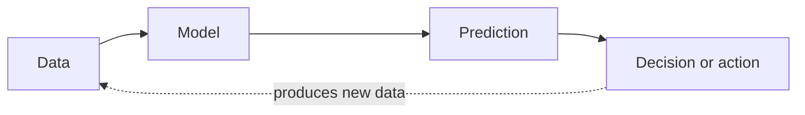
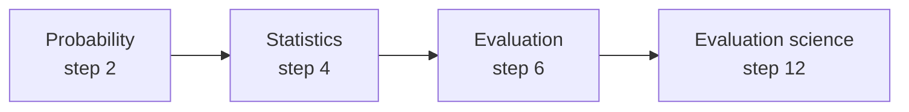
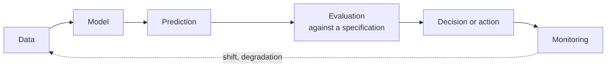
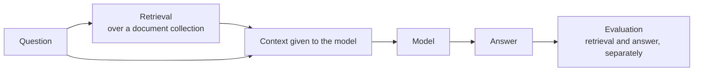
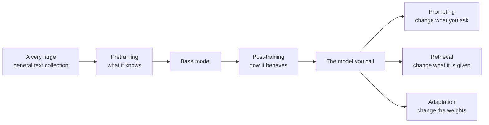
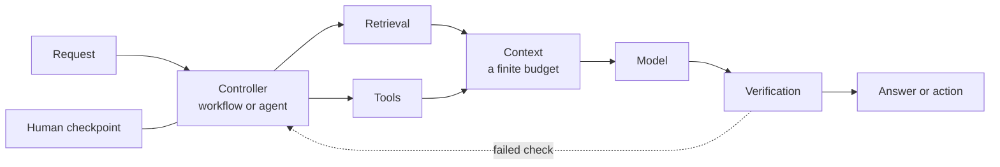
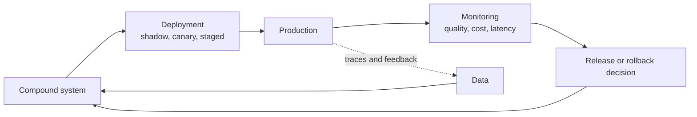
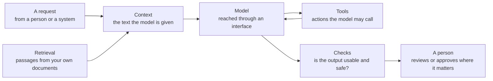

# AI Engineer Learning Guide

A Depth path through the **Data & Intelligence** side of AI engineering, with Modern AI Engineering alongside it: what to study, in what order, which resources to read and how, what to build, and how to know you are ready to move on.

This guide is the learner's view of the accepted curriculum in [ROADMAP.md](ROADMAP.md). The roadmap is the detailed specification and the [research](research/) explains why it is shaped this way; you do not need either to learn from this guide. If this guide and [ROADMAP.md](ROADMAP.md) ever disagree, the roadmap wins.

## Contents

<b>Click to expand / collapse</b>

**Before you start**

- [How to Use This Guide](#how-to-use-this-guide)

**Part 1 — Fundamentals**

1. [Python, SQL and Data Analysis](#1-python-sql-and-data-analysis)
2. [The Mathematics of Learning](#2-the-mathematics-of-learning)
3. [Machine Learning: Framing Problems and Building Models](#3-machine-learning-framing-problems-and-building-models)
4. [Statistics: Is the Difference Real?](#4-statistics-is-the-difference-real)
5. [Data You Can Defend](#5-data-you-can-defend)
6. [Evaluation and Testing](#6-evaluation-and-testing)
7. [Deep Learning](#7-deep-learning)
8. [How Language Models Work: Build One](#8-how-language-models-work-build-one)
9. [Retrieval and Search](#9-retrieval-and-search)
- [Checkpoint: Ready for Advanced](#checkpoint-ready-for-advanced)

**Part 2 — Advanced**

10. [How Foundation Models Are Made and Adapted](#10-how-foundation-models-are-made-and-adapted)
11. [Compound AI Systems: Tools, Retrieval and Verification](#11-compound-ai-systems-tools-retrieval-and-verification)
12. [Evaluation Science](#12-evaluation-science)
13. [Reading Research Critically](#13-reading-research-critically)
14. [Advanced Retrieval and Ranking](#14-advanced-retrieval-and-ranking)
15. [Trustworthy AI and Security](#15-trustworthy-ai-and-security)
16. [Operating AI Systems in Production](#16-operating-ai-systems-in-production)
- [Checkpoint: Ready for Mastery](#checkpoint-ready-for-mastery)

**Part 3 — Mastery**

17. [Independent Judgment: Design, Diagnosis and Experiment](#17-independent-judgment-design-diagnosis-and-experiment)
18. [Choose Your Depth](#18-choose-your-depth)
- [Checkpoint: Ready to Contribute Research](#checkpoint-ready-to-contribute-research)

**Part 4 — Research**

19. [Contributing Research](#19-contributing-research)

**Alongside the path**

- [Modern AI Engineering](#modern-ai-engineering)
  - [Orientation: Contemporary AI Systems](#orientation-contemporary-ai-systems)
  - [Working with Models](#working-with-models)
  - [Embeddings and Semantic Search](#embeddings-and-semantic-search)
  - [Retrieval-Augmented Systems](#retrieval-augmented-systems)
  - [Evaluating and Observing AI Applications](#evaluating-and-observing-ai-applications)
  - [Agents, Tools and Context](#agents-tools-and-context)
  - [Adapting Models in Practice](#adapting-models-in-practice)
  - [Securing AI Systems in Practice](#securing-ai-systems-in-practice)
  - [Inference, Cost and Production](#inference-cost-and-production)

---

## How to Use This Guide

**Follow the steps in order.** Each step builds on the ones before it. Where two steps can overlap, the step says so.

**Every step has the same shape**, and it puts the subject before the sources:

| Section | What it answers |
| --- | --- |
| Opening paragraph | What the subject is, what problem it solves, and why it comes here |
| **Where you are** | What you bring in, and which limitation this step removes |
| **What you'll learn** | The concepts, organized by the roadmap — not copied from a book's contents |
| **How these ideas connect** | Why those concepts belong in one step |
| **Where this fits in AI** | How your picture of an AI system changes |
| **Study** | The primary source first, then supplements, papers and current guides, each with the gap it fills |
| **Where you study each concept** | Which source teaches which concept |
| **Practise and build** | What turns understanding into capability |
| **You're ready to continue when you can** | Capability, never pages read |
| **What comes next** | Why the following step follows |
| **Also open now in Modern AI Engineering** | At the six steps where topics open (1, 7, 9, 11, 15, 16): which ones, which the path depends on, and what to take first |

**Concepts first, resources second.** The roadmap decides what you learn and how it is organized; books, papers and guides are how you study it. Where a step names only part of a resource, it says why — and where two sources are used for one subject, it says what each is for.

**How much this guide explains.** Each unit gives you a foothold and no more: in plain language, what the subject is, what problem it exists to solve, one way to picture it, and the words you need for the reading to make sense. The teaching itself — the derivations, the algorithms, the worked code — belongs to the assigned resources, which are better at it than a roadmap could be. If a page here ever seems to be replacing the reading rather than preparing you for it, that is a fault in the page.

**Come back to it.** These pages are meant to stay useful after the first pass. Months later, a step should still tell you what the subject contains, how its ideas fit together, where you learned each one and what it enabled — a map of your own knowledge, not only a route through it.

**Two dimensions, studied together.** The numbered steps follow the roadmap's four depth levels — Fundamentals → Advanced → Mastery → Research — and build durable knowledge and judgment. Alongside them runs **Modern AI Engineering**: a curriculum of current engineering practice — what a capable AI engineer should understand, use and build today — whose topics open as your depth grows. It is not a fifth level and it does not come after Research. You do not have to plan the interleaving yourself: each numbered step says when a topic opens and which topics to take before moving on, and each topic says whether the numbered path depends on it — two do — and which step to return to afterwards. Start with its [Orientation](#orientation-contemporary-ai-systems); [Modern AI Engineering](#modern-ai-engineering) sets out all nine topics together, with where each one is taken and where it returns you.

**Read good books whole.** When a step introduces a core book, read the whole book, in its own order. Start it at that step and keep reading alongside the steps that follow — you do not need to finish a book before doing a step's practice. Some chapters will show you ideas that a later step asks you to master. That is intended: reading something early is not the same as mastering it, and later steps send you back to *revisit* those chapters and put them to work. Large reference textbooks, papers and specialist material are different: for those, the step names the parts to read.

**Reading is not readiness.** Move on when you can do the things listed under "You're ready to continue when" — never because you finished a book. Reading gives you knowledge; each step's practice turns it into ability; the later parts of the guide ask for design, diagnosis and judgment. There is no calendar: go at the pace your time allows.

**Build and run systems from the start.** An AI system is framed, built, evaluated, deployed, monitored and improved — again and again. You meet that whole lifecycle early: in step 3 you read a book that walks through it end to end, and from then on you build with deployment and monitoring in mind. Each later step asks more of you, until in steps 15 and 16 you secure, deploy, monitor and roll back a system yourself. Running a system is part of building it, not a topic saved for the end.

**Understanding and building grow together.** Most steps pair a resource that explains *why* something works with one that makes you *build* it. Practice is part of every step, and much of it goes into **one system that you keep extending** from step 3 onwards: by the end you should be able to explain what you built, why, which alternatives you rejected, how you measured it, what failed, and what you would change next.

**Staying current.** Current practice changes faster than durable foundations; [Modern AI Engineering](#modern-ai-engineering) explains how this project keeps it up to date.

**What this guide does not teach.** General computing — software engineering, database design, cloud and infrastructure — belongs to a separate, future Computer Science & Engineering roadmap. Where a step depends on it, it says so.

[⬆ Back to Contents](#contents)

---

## Part 1 — Fundamentals

**In this section:** [1](#1-python-sql-and-data-analysis) · [2](#2-the-mathematics-of-learning) · [3](#3-machine-learning-framing-problems-and-building-models) · [4](#4-statistics-is-the-difference-real) · [5](#5-data-you-can-defend) · [6](#6-evaluation-and-testing) · [7](#7-deep-learning) · [8](#8-how-language-models-work-build-one) · [9](#9-retrieval-and-search) · [Checkpoint](#checkpoint-ready-for-advanced)

Build the foundations everything else rests on: code and data, the mathematics and statistics of learning, machine learning you can measure and trust, deep learning, how language models work, and retrieval. Here **Fundamentals** means durable prerequisite capability — what everything later depends on — not easy, old or introductory material. That is why language-model mechanisms and retrieval belong here. Fundamentals does not mean easy.

**What this stage asks**

*What is this? How does it work? Can I implement or use it correctly?* Fundamentals is where ideas are met directly and, where building is the cheapest route to understanding, built.

**Why these nine steps are one foundation**

They are not nine subjects; they are one chain. You need **code and data** (1) before anything can be done at all. You need the **mathematics** (2) to read what a learning method is, and **machine learning** (3) to frame a problem and build a first model. That model produces numbers, so you need **statistics** (4) to know whether a difference between two of them is real. Statistics is only as good as the sample, so **data you can defend** (5) comes next, and then **evaluation and testing** (6) turns all of it into evidence you could show someone else. At that point one complete arc is finished: a system framed, built, measured and watched. **Deep learning** (7) then changes what a model can be — representations learned rather than chosen — which makes **language models** (8) possible, and building one small model yourself is what turns them from magic into mechanism. Finally, because a model only knows what its weights encode, **retrieval** (9) supplies the rest.

**What you should be able to do by the end**

Frame a problem and decide whether learning is the right tool; build and validate models; say whether a difference is real; defend your data; specify success and measure it honestly; train neural networks; explain a language model by having built one; and retrieve information well enough to ground an answer — with your evolving system demonstrating it.

**What changes after this**

Fundamentals teaches methods that are largely settled and asks you to use them correctly. Advanced stops giving you the method: it presents alternatives, trade-offs and failure modes, and asks you to choose and to justify the choice on evidence.

### 1. Python, SQL and Data Analysis

<!-- covers: E1 -->

An AI system is built on data that already exists somewhere — in a company's database, in exported files, in logs — and almost none of it arrives in the shape a model needs. Three skills get you from *there is data somewhere* to *I understand what this data can support*, and this step builds them in this order.

**Python** is the language everything here is written in: you will use it to reshape data, train models and run experiments, and its two data libraries (NumPy and pandas) let you work on whole columns and tables at a time rather than one value at a time. **SQL** is how you ask a database for the data in the first place — a language for describing *which* rows and columns you want, and how to combine them, rather than how to fetch them. **Data analysis** is the habit of interrogating what you got before you model it: summarizing it, plotting it, and finding what is wrong with it. That last part is not a formality. Most of the ways an AI project fails quietly are already present in its data, and this is where you learn to see them.

**Where you are**

At the beginning; nothing is assumed. If you already program, move quickly — what this step is really after is fluency with *data*: getting it, reshaping it, and seeing what is wrong with it. Every later step assumes you can do that without help.

**What you'll learn**

By the end you should be able to obtain data with SQL, manipulate and clean it in Python, and use plots to find what is wrong with it — writing the code yourself rather than adapting someone else's notebook.

**How these ideas connect**

The three fit together as one working loop. SQL gets data out of the system that holds it; arrays and dataframes reshape and clean it once it is in memory; plots show you what neither a query nor a summary statistic reveals — the outlier, the missing year, the duplicate that would have quietly distorted everything downstream. Cleaning is not a chore before the real work: what you decide to drop, fill or keep is already a modelling decision, which is why step 5 returns to it as a discipline in its own right.

#### Programming in Python

Python is the language the rest of this guide is written in. The target is not syntax but fluency: being able to express an idea in code without stopping to look it up.

##### The language and its idioms

Control flow, data structures, functions, classes, modules, errors — and the idioms that make Python code readable to other people. **Studied in:** *The Python Tutorial*, complete.

##### Reading an error and finding its cause

When something fails, Python tells you where and why, in a traceback that reads from the outside in. Learning to read it — and to narrow a problem down by checking what a variable actually contains rather than what you assume it contains — is the difference between debugging and guessing. You will do this constantly from step 3 onwards. **Studied in:** *The Python Tutorial*, errors and exceptions.

##### Isolated environments

Keeping each project's dependencies separate, so that a notebook that ran last month still runs today. This is the smallest piece of reproducibility, and step 6 asks for the rest of it. **Studied in:** *The Python Tutorial*, virtual environments.

#### Relational querying

Most data you will use lives in a database, and a query is how you get exactly the part you need — often with the shaping already done.

##### Selecting, filtering and joining

The core of SQL: choosing rows and columns, and combining tables that describe different parts of the same thing. **Studied in:** *Practical SQL*, complete; PostgreSQL Exercises for drill.

##### Aggregation and grouping

Turning rows into summaries — counts, sums, averages per group — which is how most questions about data are actually answered. **Studied in:** *Practical SQL*; PostgreSQL Exercises.

##### Window functions and common table expressions

Calculations across related rows (running totals, ranks, comparisons with the previous period) and queries built in readable steps. These are what separate a working query from an unmaintainable one. **Studied in:** *Practical SQL*; PostgreSQL Exercises.

#### Arrays and dataframes

Once data is in memory, this is where it is shaped. Everything numerical later — features, embeddings, batches of examples — is one of these two objects.

##### Array computing

Vectors and matrices in NumPy: elementwise operations, broadcasting, and why loops are the wrong instinct. **Studied in:** *Python for Data Analysis*, complete.

##### Dataframes: selecting, reshaping and joining

Tabular data in pandas: indexing, grouping, pivoting and merging, which is the in-memory counterpart of the SQL you just learned. **Studied in:** *Python for Data Analysis*.

#### Cleaning data you did not create

Real data arrives broken. This area is the set of decisions you make about that, each of which quietly shapes every conclusion drawn later.

##### Missing data

What is absent, why it is absent, and what dropping or filling it does to your results. **Studied in:** *Python for Data Analysis*.

##### Duplicates and outliers

Finding repeated records and extreme values, and deciding — with a reason you could defend — what to do about them. **Studied in:** *Python for Data Analysis*.

##### Types, parsing and time

Getting values into the type they should be, especially dates and times, where a silent parsing error can invalidate an entire analysis. **Studied in:** *Python for Data Analysis*, including its time-series chapters.

#### Exploratory analysis

The habit of asking a dataset what it contains before assuming anything — and the reason most later debugging starts here.

##### Summaries that answer a question

Grouping, describing and cross-tabulating with a specific question in mind, rather than printing everything and hoping. **Studied in:** *Python for Data Analysis*, with its worked analyses.

##### Plotting to diagnose

Plots used as instruments rather than decoration: distributions, relationships and anomalies you would not see in a table. **Studied in:** *Python for Data Analysis*.

**Where this fits in AI**

An AI system is a data system before it is a model. Whatever you later build — a classifier, a retriever, a language-model application — begins with data you obtained, shaped and inspected, and ends with outputs you examine the same way. The skills here are the ones you will use in every step that follows, including when you are debugging something far more elaborate and the real problem turns out to be the data.

**Study**

Read in this order: Python first, then SQL, then data analysis.

- **Primary** · [*The Python Tutorial*](https://docs.python.org/3/tutorial/) — **read:** the complete tutorial. **Why:** the language itself, from control flow to classes, modules, errors and virtual environments. Three parts of it are used again in step 6, when your system has to run outside the notebook and be tested: modules (chapter 6), quality control (§10.11) and virtual environments (chapter 12). Read them now as language; you will apply them there.
- **Primary** · *Practical SQL* (DeBarros) — **read:** the complete book, in order, working its "Try It Yourself" exercises. **Why:** SQL for real analysis, taught on real datasets. Its later chapters on database design, transactions and maintenance give you useful exposure; mastering them belongs to the Computer Science & Engineering roadmap. **Access:** this book is paid.
- **Practice** · [PostgreSQL Exercises](https://pgexercises.com/) — **do:** all the exercises. **Why:** practice against a live database, with explained solutions.
- **Primary** · [*Python for Data Analysis*](https://wesmckinney.com/book/) (McKinney) — **read:** the complete book, in order; chapters 2–3 recap Python you already know and can be read quickly. **Why:** the everyday toolkit — NumPy, pandas, cleaning, plotting and time series — with five worked analyses.

**Where you study each concept**

| What you study | Where you study it |
| --- | --- |
| Python language and environments | *The Python Tutorial*, complete |
| Relational querying | *Practical SQL*, complete; PostgreSQL Exercises for drill |
| Arrays, dataframes, cleaning, plotting | *Python for Data Analysis*, complete |

**Practise and build**

Work the exercises as you read. Then bring the three skills together in an investigation: take an unfamiliar dataset, query it with SQL, clean and explore it with Python, and report what it contains, what is wrong with it, and what it can and cannot support.

**You're ready to continue when you can**

- write a non-trivial aggregation and window-function query;
- diagnose a data-quality problem from evidence;
- justify a cleaning decision and its effect on your conclusions.

You will have read about schema design, transactions and database maintenance, but you do not need to master them here; they belong to the Computer Science & Engineering roadmap.

**What comes next**

You can now handle data, but not yet reason about the methods that learn from it. Step 2 gives you the mathematical language those methods are written in — and, with it, the first half of the uncertainty story that steps 4 and 6 complete.

**Also open now in Modern AI Engineering**

[Orientation: Contemporary AI Systems](#orientation-contemporary-ai-systems) is open from the start and is **recommended in small doses**: a short tour of what today's AI systems are made of, so that the words you will meet everywhere mean something while you work through the early steps. Nothing later depends on it — read it alongside these steps, not instead of them, and come straight back here.

### 2. The Mathematics of Learning

<!-- covers: E2 -->

A learning method is a procedure for adjusting numbers until a model's answers improve, and that procedure is written in mathematics. **Linear algebra** is the notation for the data and the model itself — examples, features and parameters held as vectors and matrices, so that an operation on millions of numbers can be written in one line. **Calculus** answers the question the adjustment depends on: if I nudge this parameter, does the answer get better or worse, and by how much? **Probability** is the language for everything uncertain — what the data might have been, and how confident a model's output is.

You are not becoming a mathematician. You are learning to read these definitions when they appear — a loss, a gradient, a likelihood — and to reason about why training succeeds or fails, so that later steps are mechanisms you understand rather than recipes you copy. This step has no formal prerequisite and can overlap with step 1; you need enough Python to implement two small mechanisms yourself.

**Where you are**

You can obtain and inspect data. What you cannot yet do is read what a method *is*: a loss function, a gradient, a likelihood. Without that, later steps become recipes to copy rather than mechanisms to reason about — and when training misbehaves, you would have no way to tell why.

**What you'll learn**

By the end you should be able to read the definitions learning methods are written in, explain why training behaves as it does, and implement gradient descent and reverse-mode differentiation on a small computation graph. This is not a proof course: the target is fluency with the language, not theorem-proving.

**How these ideas connect**

There is one chain running through this step, and it is worth holding on to: a model defines a probability of the data (likelihood); maximizing that likelihood is the same as minimizing a cross-entropy loss; the loss is minimized by following its gradient; and the gradient of a deep composition of functions is computed by the chain rule, applied backwards — which is exactly what reverse-mode differentiation automates. Optimization behaviour is what happens when that chain meets a real loss surface: too large a step diverges, and badly scaled inputs make progress crawl. Probability also has a second life here. It is the language of uncertainty, and step 4 turns it towards a different question: not *what does the model believe*, but *what can I conclude from a finite sample*.

#### Linear algebra

The language for representing data and parameters. Everything a model holds — a batch of examples, a weight matrix, an embedding — is an array, and the operations on those arrays are what a forward pass is made of.

##### Vectors, matrices and their operations

Scalars, vectors, matrices and higher-order tensors, and the operations that combine them: products, sums along an axis, and reshaping. These are the moves every model definition is written in. **Studied in:** *Dive into Deep Learning* §2.3.

##### Length, angle and similarity

The geometric reading of the same objects: norms as length, inner products as angle, projection. This is what makes "similar vectors" a meaningful phrase, and it returns as the basis of embedding search in steps 7 and 9. **Studied in:** *Dive into Deep Learning* §22.1.

#### Calculus and gradients

Training changes parameters in the direction that reduces a loss. Calculus is how that direction is defined, and the chain rule is what makes it computable through many layers.

##### Derivatives and the chain rule

The derivative as a rate of change, and the chain rule for composed functions — the single mathematical fact that makes deep networks trainable. **Studied in:** *Dive into Deep Learning* §2.4.

##### Partial derivatives and gradients

Functions of many variables, partial derivatives, and the gradient as the vector of them: what it points at, and what a gradient of zero does and does not tell you. **Studied in:** *Dive into Deep Learning* §22.4.

#### Automatic differentiation

Nobody differentiates a network by hand. This area is about how a framework does it for you, and why you should understand the mechanism rather than trust it.

##### Computational graphs

A computation written as a graph of elementary operations, which is the form that makes mechanical differentiation possible. **Studied in:** *Hands-On ML with Scikit-Learn and PyTorch* Appendix A.

##### Reverse-mode differentiation

Applying the chain rule backwards through the graph, so that all gradients cost about one extra pass rather than one pass per parameter. This is the mechanism you implement yourself in this step, and the reason training a large model is feasible at all. **Studied in:** *Hands-On ML with Scikit-Learn and PyTorch* Appendix A, then *Dive into Deep Learning* §2.5 for the framework's version.

#### Probability

The language of uncertainty, used forwards: given a process, what outcomes should we expect? It is also where training objectives come from.

##### Probability, conditioning and Bayes

Events, conditional probability, independence and Bayes' rule — the vocabulary in which every later statement about uncertainty is phrased. **Studied in:** Piech, *Probability for Computer Scientists*, Part 1.

##### Random variables, expectation and variance

Random variables and their summaries: expectation as the long-run average, variance as spread. These two quantities carry most of the weight in step 4. **Studied in:** Piech Part 2; *Dive into Deep Learning* §2.6.

##### Common distributions

Bernoulli, binomial, Poisson, categorical, uniform, exponential and normal: the small set of shapes that model most of what you will meet, and what each assumes about the world. **Studied in:** Piech Part 2.

##### Joint and marginal distributions

Several random variables at once: joint distributions, marginalization, and what conditioning does to them — the step from single quantities to models with structure. **Studied in:** Piech Part 3, to joint and marginal distributions.

##### Likelihood and parameter estimation

The likelihood of data under a model, and maximizing it to choose parameters. This is the bridge from probability to training: the objective you minimize in step 3 and step 8 is a likelihood in disguise. **Studied in:** Piech Part 5; *Dive into Deep Learning* §22.7.

#### Optimization behaviour

Knowing the gradient is not the same as knowing what happens when you follow it. This area is about the behaviour of training, and it is what you will recognize later when a model refuses to learn.

##### What optimization means in deep learning

Why the objective you optimize is a proxy for the goal you care about, and what that mismatch implies. **Studied in:** *Dive into Deep Learning* §12.1.

##### Convexity, and why deep learning is not convex

The well-behaved case, used as a reference point for the badly behaved one. **Studied in:** *Dive into Deep Learning* §12.2.

##### Gradient descent and its stochastic form

Full-batch descent and the stochastic version that real training uses, with the noise that comes with it. You implement this yourself in this step. **Studied in:** *Dive into Deep Learning* §12.3–§12.4.

##### Learning rates, divergence and conditioning

Why too large a step diverges, why too small a step crawls, what a schedule does, and how poor conditioning slows everything down. **Studied in:** *Dive into Deep Learning* §12.11.

#### Information

The quantities that turn a probabilistic model into a loss function, and that reappear whenever two distributions are compared.

##### Entropy and surprise

Information content and entropy: how much uncertainty a distribution carries. **Studied in:** *Dive into Deep Learning* §22.11; Piech's information-theory chapter.

##### Cross-entropy as a loss

Cross-entropy between the model's distribution and the data's, and why minimizing it is the same as maximizing likelihood — the loss almost every classifier and language model is trained with. **Studied in:** *Dive into Deep Learning* §22.11.

**Where this fits in AI**

This is the layer underneath everything else: the same gradients train a logistic regression in step 3, a neural network in step 7 and a transformer in step 8; the same likelihood becomes the next-token objective a language model is trained on. You are not learning mathematics for its own sake but acquiring the reading ability that keeps later steps from becoming a sequence of library calls.

**Study**

- **Primary** · [*Dive into Deep Learning*](https://d2l.ai/) — **read:** §2.3–2.6, §12.1–12.4, §12.11, §22.1, §22.4, §22.7 and §22.11. **Why:** the linear algebra, calculus, optimization and probability you need, explained alongside code. **Selected reading:** this is a reference-scale textbook whose deep-learning chapters duplicate *Hands-On ML*, which you read whole from step 3; the sections named here are its mathematical preliminaries and its optimization and information-theory chapters.
- **Supplement** · [Piech, *Probability for Computer Scientists*](https://chrispiech.github.io/probabilityForComputerScientists/en/index.html) — **read:** Parts 1–3 (up to joint and marginal distributions), Part 5 and the information-theory chapter. Stop before sampling, the bootstrap and the central limit theorem, which step 4 teaches. **Why:** probability explained for programmers, ending in parameter estimation and the models it justifies. **Selected reading:** the omitted chapters are the probability-to-statistics bridge, which step 4 teaches with simulation in Python instead. (Whether reading Piech whole would serve you better than this split is an open question, recorded with its evidence in the [learner-experience review](reviews/2026-09-20-learner-experience-review.md) and awaiting a decision.)
- **Supplement** · [*Hands-On ML with Scikit-Learn and PyTorch*](https://github.com/ageron/handson-mlp) (Géron) — **read first:** Appendix A only. **Why:** it builds reverse-mode differentiation on a toy computation graph, so you see the mechanism working. You start the whole book, in order, in step 3; this appendix stands on its own, and you need it now.

**Where you study each concept**

| What you study | Where you study it |
| --- | --- |
| Linear algebra, calculus, optimization behaviour | *Dive into Deep Learning* §2.3–2.6, §12.1–12.4, §12.11 |
| Distributions, expectation, variance, conditioning, likelihood | Piech Parts 1–3 and Part 5; *Dive into Deep Learning* §22.1, §22.4, §22.7 |
| Entropy and cross-entropy | *Dive into Deep Learning* §22.11; Piech's information-theory chapter |
| Reverse-mode differentiation, by construction | *Hands-On ML* Appendix A |

**Practise and build**

Implement gradient descent and reverse-mode differentiation yourself. Otherwise, work the exercises.

**You're ready to continue when you can**

- explain what a gradient tells you about a loss surface;
- implement gradient descent and diagnose why it diverges;
- explain why maximizing likelihood works as a training objective.

**What comes next**

You can now read what a learning method does. Step 3 puts that to work on the decision that comes before any method: what problem are you solving, and should it be solved by learning at all?

### 3. Machine Learning: Framing Problems and Building Models

<!-- covers: E4 -->

Machine learning is what you reach for when the rule you would otherwise write by hand is too complicated, too changeable or simply unknown. Instead of specifying how to decide, you collect examples of the decision — emails that were spam and emails that were not — and a learning procedure searches for a rule that fits them. The catch, and the reason this step exists, is that fitting the examples you have is easy and worthless on its own: what matters is behaviour on the cases you have not seen yet.

So the work divides in two. First, deciding *what* to build: what exactly is being predicted, from what information, and whether learning is even the right tool. Then building it: a simple comparison that involves no learning at all, a model or two whose behaviour you can explain, and enough honesty in how you test them that the number you report survives contact with reality. This step also starts the one system you keep extending for the rest of the guide.

**Where you are**

You can work with data (step 1) and read what a learning method does (step 2). What you have never had to do is turn a vague goal into something a model could actually predict — and that decision, made badly, is the most expensive mistake in applied AI, because no amount of modelling repairs a problem framed wrongly.

**What you'll learn**

By the end you should be able to decide whether learning is the right tool for a goal, frame the problem and its unit of prediction, set a baseline that involves no learning, build and validate a supervised model, and diagnose what its errors are telling you — implementing all of it yourself.

**How these ideas connect**

Framing decides what a model is for; modelling produces a candidate; judging tells you whether the candidate is any good — and the three are not separable. The unit of prediction you choose determines which metric is meaningful; the baseline you set determines what "better" means; the split you choose determines whether the number you get is honest at all. Bias and variance give you the vocabulary for *why* a model underperforms, and error analysis turns that vocabulary into a next action. This step deliberately keeps you in classical territory: these mechanics are easier to see when the model is simple, and every one of them returns when the models get large.

#### Framing the problem

The decisions made before any model exists, which no amount of modelling can repair afterwards.

##### Whether to use learning at all

The cases where a rule, a lookup or a human process is the correct answer, and how to recognize them before building anything. **Studied in:** *Designing Machine Learning Systems* ch 1, "When to Use Machine Learning".

##### The unit of prediction, and what the output drives

What single thing the model predicts, for what entity, and which decision consumes it — the choice that silently determines your data, your metric and your evaluation. **Studied in:** *Designing Machine Learning Systems* ch 2.

##### Business objective versus model objective

Why the quantity you can optimize is rarely the quantity you care about, and what to do about the gap. **Studied in:** *Designing Machine Learning Systems* ch 2.

##### Task formulations

How a goal becomes a classification, extraction, ranking or generation problem — including the common text tasks you will meet again from step 8 onwards. **Studied in:** *Designing Machine Learning Systems* ch 2; *Hands-On ML* chs 1–3.

##### Baselines that involve no learning

The non-learned comparison that tells you whether a model earns its complexity. Every later claim in this guide is measured against something like it. **Studied in:** *Hands-On ML* chs 1–2; *Designing Machine Learning Systems* ch 6.

#### Models you should know

A working repertoire, kept deliberately classical: these are the models whose behaviour you can see.

##### Linear and logistic models

The two workhorses, and what their coefficients do and do not mean. **Studied in:** *Hands-On ML* ch 4.

##### Regularization

Penalizing complexity, and why a slightly worse fit often generalizes better. **Studied in:** *Hands-On ML* ch 4.

##### Trees, forests and gradient boosting

Why ensembles of trees remain a strong default for tabular data, and when they beat anything deeper. **Studied in:** *Hands-On ML* chs 6–7.

##### Dimensionality reduction and clustering

Finding structure without labels, and using it to understand data rather than to impress. **Studied in:** *Hands-On ML* chs 8–9.

#### Making a model generalize

Everything here is about the difference between performing on the data you have and performing on the data you will meet.

##### Bias and variance

The two ways a model fails, and how to tell which one you are looking at. **Studied in:** *Hands-On ML* ch 4.

##### Learning curves

Reading performance against training-set size to decide whether more data, a different model or better features is the next move. **Studied in:** *Hands-On ML* ch 4.

##### Cross-validation and splits that avoid leakage

How to estimate performance honestly, and the ways a careless split lets the answer leak into the question. Step 5 treats leakage as the family of failures it is. **Studied in:** *Hands-On ML* ch 2.

#### Judging a model

Turning a trained model into evidence about its quality — the habits that steps 4 and 6 then make rigorous.

##### Metrics and confusion matrices

What each metric rewards, and what a single number hides about the errors underneath it. **Studied in:** *Hands-On ML* ch 3.

##### ROC and precision–recall curves

Performance across thresholds, and which curve to trust when classes are imbalanced. **Studied in:** *Hands-On ML* ch 3.

##### Error analysis

Looking at what the model got wrong, grouping the mistakes, and deciding the next action from them — a habit that returns in step 6 and again in the Modern evaluation topic. **Studied in:** *Hands-On ML* ch 3.

**Where this fits in AI**

This is the first complete picture of an AI system, and the shape you will keep enriching:

Everything later is an elaboration of this loop: step 6 makes the arrow from prediction to decision trustworthy, step 7 changes what a model can be, step 9 adds retrieved information to the model's input, and step 11 replaces the single model with several components working together.

**Study**

- **Primary** · *Hands-On ML with Scikit-Learn and PyTorch* — **read:** the complete book, in order. Start here and keep reading alongside the next steps: this step's practice uses chapters 1–8, step 7 puts chapters 9–16 to work, and the rest — faster transformers, generative models, reinforcement learning and the appendices — gives you early exposure that later steps build on. **Why:** the core text from classical machine learning to deep learning, with runnable notebooks for every chapter. **Access:** the book is paid; its notebooks are free, and step 2 used only its free appendix.
- **Primary (framing)** · [*Designing Machine Learning Systems*](https://github.com/chiphuyen/dmls-book) (Huyen) — **read:** the complete book, in order. Chapters 1–2 — including "When to Use Machine Learning", objectives and framing — are what this step's practice needs first. **Why:** the whole life of a machine-learning system — framing, data, evaluation, deployment, monitoring, continual learning and the infrastructure around them. Reading it now means you build every system with its whole life in view; steps 5, 6 and 16 return to its chapters in depth.

**Where you study each concept**

| What you study | Where you study it |
| --- | --- |
| Framing, objectives, when not to use learning | *Designing Machine Learning Systems* chs 1–2 |
| Models, regularization, ensembles, clustering | *Hands-On ML* chs 1–8 |
| Validation, leakage-safe splits, metrics, error analysis | *Hands-On ML* chs 2–3 |

**Practise and build**

1. A framing exercise on [six cases, one of which is not a machine-learning problem](materials/framing-cases.md) — decide what each system should predict, from what, against which baseline, and at what cost per error.
2. An end-to-end project that begins with a written framing and a baseline that involves no learning. **This is the start of your evolving system.**

**You're ready to continue when you can**

- decide whether learning is appropriate for a stated goal, and justify the decision;
- frame the problem and its unit of prediction;
- select and justify a baseline;
- implement a supervised pipeline with leakage-safe validation;
- diagnose overfitting and class imbalance from evidence.

You can begin step 4 while you finish this step.

**What comes next**

You now have two models and a number for each. Step 4 asks the question that number cannot answer on its own: is the difference between them real, or an artefact of the particular data you happened to test on?

### 4. Statistics: Is the Difference Real?

<!-- covers: E3 -->

Your model scored 84% and the other one scored 81%. Is the first model better, or did it get an easier draw of test examples? You cannot tell from the two numbers, because each was measured on one finite sample of cases and a different sample would have given different numbers.

Statistics is how that question is answered: reasoning from the sample you happened to collect back to the thing you actually want to know. This step teaches you to decide whether an observed difference is real, to say how uncertain your own measurements are, and to design comparisons that answer the question you meant to ask — now with models of your own to compare.

**Where you are**

Step 2 gave you probability: the mathematics of uncertainty, used forwards — given a process, what outcomes should we expect? Step 3 gave you a model and a test-set score. This step runs probability backwards: given the finite sample you actually observed, what can you conclude about the world it came from? That is the difference between probability and statistics, and it is the difference between "my model scored 84%" and "my model is better".

**What you'll learn**

By the end you should be able to say what a finite sample supports, compare two models as a paired experiment, judge reliability across repeated runs, read a predicted probability correctly, and recognize a comparison that answers the wrong question — implementing the bootstrap and a repeated-trial simulation yourself.

**How these ideas connect**

One idea sits underneath the whole step: a measurement is a sample, and a sample would have come out differently. Sampling variability is why an interval is more honest than a point; the bootstrap is how you obtain an interval without assuming a formula; a paired comparison removes the variation the two models share, so the difference you are testing stands out; power tells you in advance whether your test set is even large enough to detect the difference you care about; and clustering warns you that a thousand questions drawn from twenty documents are not a thousand independent observations. Repeated trials extend the same reasoning from data to the system itself, which is the form the problem takes with modern models: a system that succeeds once in five attempts and a system that succeeds every time can report the same average. Calibration and agreement apply it to the two remaining sources of doubt — the probabilities a model reports, and the humans whose labels you are scoring against. Experiment design closes the loop: confounding is what makes a comparison answer a different question from the one you asked.

#### Samples and estimation

Statistics begins where probability stops: you have one finite sample, and you want to say something about the world that produced it.

##### Populations and samples

What a population is, what a sample is, and why every number you report is a property of the second used to speak about the first. **Studied in:** *Computational and Inferential Thinking* ch 10.

##### Sampling variability and the bootstrap

Why a statistic changes if you sample again, and how resampling your own data estimates that variability without a formula. You implement this. **Studied in:** *Computational and Inferential Thinking* chs 10, 13.

##### Confidence intervals, and what they do not assert

Reading an interval correctly — and the common misreadings that turn an honest result into an overclaim. **Studied in:** *Computational and Inferential Thinking* ch 13.

##### The central limit theorem and sample size

Why averages behave predictably even when the data does not, and how that determines how much data a comparison needs. **Studied in:** *Computational and Inferential Thinking* §§14.4–14.6.

#### Deciding whether a difference is real

The question you will ask hundreds of times: is this model better, or did the test set happen to favour it?

##### Hypothesis testing and error probabilities

Null and alternative, what a p-value is and is not, and the two ways a test can be wrong. **Studied in:** *Computational and Inferential Thinking* ch 11.

##### Comparing two samples

Permutation and A/B comparisons, and what randomization buys you. **Studied in:** *Computational and Inferential Thinking* ch 12.

##### Paired comparison of two models

Evaluating both models on the same items and analysing the differences, which removes the variation the two share and is the correct form for nearly every model comparison you will run. **Studied in:** Miller, "Adding Error Bars to Evals".

##### Power and the smallest difference worth detecting

Deciding in advance whether your evaluation set can detect the improvement you care about — the check that prevents months of inconclusive comparisons. **Studied in:** Miller, "Adding Error Bars to Evals"; *Computational and Inferential Thinking* §14.6.

##### Items that are not independent

Clustered items — many questions from the same document, many turns from the same conversation — and why ignoring the clustering overstates certainty. **Studied in:** Miller, "Adding Error Bars to Evals".

#### Systems that behave randomly

Classical statistics assumes the system is fixed and the data varies. With modern models, the system varies too.

##### Variance across repeated runs

Running the same input many times and treating the spread as data about the system, not noise to be averaged away. **Studied in:** [this roadmap's repeated-trial simulation](materials/repeated-trial-simulation.md), on your own system.

##### pass@k versus pass^k

Succeeding at least once in k attempts is a capability claim; succeeding every time is a reliability claim. Confusing them is the most common error in agent evaluation, and step 11 depends on the distinction. **Studied in:** [this roadmap's repeated-trial simulation](materials/repeated-trial-simulation.md).

#### Measuring probabilities and people

Two remaining sources of doubt: what the model's confidence means, and how much to trust the labels you score against.

##### Calibration and reliability diagrams

What "70% confident" should mean, how to check whether it means it, and the two standard corrections. This is also the basis for deferring when uncertain. **Studied in:** scikit-learn User Guide §1.16; [this roadmap's calibration exercise](materials/calibration-exercise.md).

##### Agreement between labellers

Cohen's and Fleiss' κ and Krippendorff's α — and why raw percentage agreement flatters, especially when one label dominates. **Studied in:** *AI Measurement Science* ch 5, agreement-coefficient sections.

#### Designing comparisons

The design decides what a comparison can mean; no analysis rescues a comparison that was set up to answer a different question.

##### Randomization and the overall evaluation criterion

What a controlled experiment randomizes, over what unit, and the single criterion a decision is made on. **Studied in:** Kohavi, Tang and Xu ch 1.

##### Why offline and online results disagree

The gap between a held-out set and a live system — and why a win in one can be a loss in the other. **Studied in:** Kohavi, Tang and Xu ch 1.

##### Confounding

The variable that explains your effect better than your explanation does, and how to spot it before publishing a claim. **Studied in:** *Computational and Inferential Thinking* ch 2.

**Where this fits in AI**

This is the middle of the arc that carries uncertainty through the whole roadmap — probability is the language of uncertainty, statistics says what a finite sample supports, evaluation measures a system honestly, and evaluation science asks whether the measurement is valid:

Nothing in AI escapes it. A benchmark score, an A/B test, an agent that passes eight of ten trials, a judge model agreeing with human raters — each is an inference from a sample, and each can be read wrongly in exactly the ways this step teaches you to spot.

**Study**

- **Primary** · [*Computational and Inferential Thinking*](https://inferentialthinking.com/) (Data 8) — **read:** chapters 2, 10–13 and 14.4–14.6. **Why:** statistical inference taught through simulation in Python: sampling, testing, comparing two samples, estimation and the bootstrap, then the central limit theorem and sample size. **Selected reading:** chapters 3–9 teach Python and tables with a course-specific library, which step 1 covers, and chapters 15–18 teach prediction, regression and classification, which *Hands-On ML* covers in more depth.
- **Paper** · [Miller, "Adding Error Bars to Evals"](https://arxiv.org/abs/2411.00640) — **read:** the whole paper. **Why:** the same statistics applied directly to model evaluations — standard errors, clustered items, paired comparison of two models on shared questions, and power. It is the only assigned source that treats a model comparison as the paired experiment it is.
- **Supplement** · [scikit-learn User Guide §1.16 Probability calibration](https://scikit-learn.org/stable/modules/calibration.html) — **read:** the whole section. **Why:** what a predicted probability should mean, reliability diagrams, and the two standard ways to correct miscalibration. Inference texts do not cover it; it lives in the machine-learning literature.
- **Supplement** · [*AI Measurement Science*](https://aimslab.stanford.edu/textbook) (Truong, Koyejo) — **read:** the agreement-coefficient sections of chapter 5. **Why:** how to measure agreement between labellers properly, and why raw percentage agreement flatters. **Selected reading:** the rest of this living textbook is measurement theory that step 12 returns to.
- **Supplement** · [Kohavi, Tang and Xu, *Trustworthy Online Controlled Experiments*](https://experimentguide.com/) — **read:** chapter 1 only (free). **Why:** what a controlled experiment is, and why an online result can overturn an offline one. **Selected reading:** the remaining chapters are paid and teach running experiments at scale, which is optional depth for this roadmap.

**Where you study each concept**

| What you study | Where you study it |
| --- | --- |
| Sampling, estimation, confidence intervals, the bootstrap | *Computational and Inferential Thinking* chs 10, 13 |
| Hypothesis testing, comparing two samples | *Computational and Inferential Thinking* chs 11–12 |
| Central limit theorem, choosing a sample size | *Computational and Inferential Thinking* 14.4–14.6 |
| Paired model comparison, clustered items, power | Miller, "Adding Error Bars to Evals" |
| Calibration and reliability diagrams | scikit-learn User Guide §1.16 |
| Agreement between labellers | *AI Measurement Science* ch 5 |
| Randomization, controlled experiments, confounding | Kohavi, Tang and Xu ch 1; *Computational and Inferential Thinking* ch 2 |
| Repeated stochastic trials, pass@k versus pass^k | [This roadmap's repeated-trial simulation](materials/repeated-trial-simulation.md) |

**Practise and build**

Investigations: decide whether a difference between two of your models is real; compute the agreement between two labellers; then work [the repeated-trial simulation](materials/repeated-trial-simulation.md) and [the calibration exercise](materials/calibration-exercise.md), which ask you to predict the result before you run them and to carry both back to your own system.

**You're ready to continue when you can**

- explain what a confidence interval does and does not assert;
- compute a paired interval for a model comparison;
- explain why ignoring clustered items overstates certainty;
- evaluate whether an average success rate predicts reliability;
- compute and interpret an agreement coefficient;
- diagnose a confounded comparison.

Running and analysing online experiments on your own is optional depth: the rest of Kohavi, Tang and Xu.

**What comes next**

You can now judge a difference. But every statistic you compute inherits the quality of the data underneath it, and a leak or a biased sample produces confident nonsense. Step 5 makes that data defensible.

### 5. Data You Can Defend

<!-- covers: E9 -->

Most failures of real AI systems start in the data, and they are rarely dramatic: a column that quietly contains the answer, a sample drawn from customers who behave differently from the ones you will serve, a source that changed format last March. The model dutifully learns all of it, and the evaluation reports a fine number.

"Data you can defend" means three things you can say out loud about a dataset: where every part of it came from, what you did to it and why, and which situations it does and does not represent. This step builds that, and adds the discipline of noticing when the world that produced the data has moved on since you collected it.

**Where you are**

You can build models (step 3) and decide whether a difference between them is real (step 4). Both rest on an assumption you have not yet examined: that the data you trained and tested on represents the situation you care about. This step examines it. It is also where the statistics of step 4 meet their most common failure in practice — a perfectly valid interval computed on a leaking or unrepresentative sample.

**What you'll learn**

By the end you should be able to build a dataset whose fitness for a claim you can defend, implement a leakage-safe split and data-validation checks, trace a system's behaviour back to its data, and detect that the world producing the data has changed.

**How these ideas connect**

Each area answers a different way the data can betray you, and they compound. A biased sample decides what the model can ever learn; noisy labels put a ceiling on measured quality and can reorder a leaderboard; leakage manufactures performance that disappears in production; missing lineage means that when something goes wrong you cannot trace which data caused it; and distribution shift means that even flawless data eventually describes a world that no longer exists. The last one is why this belongs in Fundamentals rather than operations: a model's measured quality holds only while the world that produced its data stays the same, and you need to know that before you build anything you intend to run.

#### Where data comes from

Every dataset is the result of choices about what to collect and how to label it. Those choices set the ceiling on everything built from it.

##### Sampling and its biases

How the sample was drawn, who or what it over- and under-represents, and what that does to conclusions drawn from it. **Studied in:** *Designing Machine Learning Systems* ch 4.

##### Labelling and annotation quality

Where labels come from, how much they disagree, and what weak or programmatic labelling costs you. Step 4's agreement statistics are how you measure this. **Studied in:** *Designing Machine Learning Systems* ch 4.

##### Label error and what it does to rankings

Why a few percent of wrong labels can reorder a model comparison, and why "the benchmark says so" is not the end of an argument. **Studied in:** *Designing Machine Learning Systems* ch 4.

##### Class imbalance

Rare outcomes, and why accuracy becomes meaningless before it becomes obviously wrong. **Studied in:** *Designing Machine Learning Systems* ch 4.

#### Preparing data without cheating

The mechanics of turning raw data into training data, and the single family of mistakes that makes results look far better than they are.

##### Feature engineering

Constructing the inputs a model actually sees, and keeping that construction identical between training and serving. **Studied in:** *Designing Machine Learning Systems* ch 5.

##### Splitting by time

Why random splits lie whenever the future is what you care about, and how a temporal split is built. **Studied in:** *Designing Machine Learning Systems* ch 5.

##### Data leakage as a family of failures

Target leakage, train–test contamination, group leakage, leakage through preprocessing — each a different way the answer reaches the model before evaluation does. **Studied in:** *Designing Machine Learning Systems* ch 5.

#### Being able to account for your data

When something goes wrong months later, these are the properties that decide whether you can explain it.

##### Lineage and dataset documentation

Knowing where each dataset came from, what was done to it, and which model version used it. **Studied in:** *Designing Machine Learning Systems* chs 4–5.

##### Provenance and licensing

Whether you are allowed to use the data for what you are using it for — an engineering constraint, not a legal footnote. **Studied in:** *Designing Machine Learning Systems* chs 4–5.

##### Synthetic data and its risks

When generated data helps, and how it degrades a system when it replaces rather than supplements real data. The Modern adaptation topic returns to this with current evidence. **Studied in:** *Designing Machine Learning Systems* ch 4.

#### When the world moves

The assumption underneath every evaluation — that tomorrow resembles the data you trained on — stated explicitly, so you can check it.

##### Covariate, label and concept shift

The three ways the distribution can change, and why they call for different responses. **Studied in:** *Designing Machine Learning Systems* ch 8, pp. 224–247.

##### Train–serve skew

The same input processed differently in training and in production — the most common cause of a model that was good in the notebook and bad in the product. **Studied in:** *Designing Machine Learning Systems* ch 8.

##### Feedback loops

A deployed model shaping the data it later learns from, which is how a small bias becomes a large one. Step 16 meets this again as the data flywheel. **Studied in:** *Designing Machine Learning Systems* ch 8.

**Where this fits in AI**

Data occupies the first box of the loop from step 3, but this step shows the loop closing: a deployed system's decisions shape the data it later learns from. That feedback is the most under-appreciated force in applied AI, and it reappears in step 16 as the data flywheel and in the Modern topic on adaptation, where production traces become training data.

**Study**

- **Primary · continuing** · *Designing Machine Learning Systems* — **revisit:** (you began this book in [3. Machine Learning: Framing Problems and Building Models](#3-machine-learning-framing-problems-and-building-models)) chapter 4 (training data), chapter 5 (feature engineering, including data leakage), and from chapter 8 "Causes of ML System Failures" and "Data Distribution Shifts" (pp. 224–247). **Why:** the strongest practical treatment of data for learned systems, written from production experience. You met these chapters in the complete book; now study them until you can apply them.

**Where you study each concept**

| What you study | Where you study it |
| --- | --- |
| Sampling, labelling, class imbalance | *Designing Machine Learning Systems* ch 4 |
| Feature engineering, temporal splits, leakage | *Designing Machine Learning Systems* ch 5 |
| Failure causes and distribution shift | *Designing Machine Learning Systems* ch 8, pp. 224–247 |
| Lineage, provenance, synthetic data | *Designing Machine Learning Systems* chs 4–5, read alongside the above |

**Practise and build**

Build an evaluation dataset, attack it, and report what is wrong with it. Run a shift check between a training sample and a later sample. Apply both to your evolving system.

**You're ready to continue when you can**

- implement a leakage-safe split by time;
- evaluate whether a dataset is fit for a stated claim;
- diagnose train–serve skew;
- explain how a feedback loop can corrupt future training data;
- detect a distribution shift between two samples.

**What comes next**

You can now defend your data. Step 6 turns that into the discipline of evidence itself: what success means, how to measure it so the claim survives scrutiny, and how to keep it true once the system is running.

### 6. Evaluation and Testing

<!-- covers: E10 -->

A system is only as good as the evidence that it works — and "it scored 0.91" is not that evidence until someone has said what score, on which cases, compared against what, and what result would have been bad enough to stop.

Two related activities do that work. **Evaluation** asks how well the system performs at the thing you actually care about, which is why it starts with writing down what success means before you measure anything. **Testing** asks whether the machinery behaves: whether the data arriving is what you expect, whether the model still handles the cases it handled last month, and whether a change broke something quietly. Ordinary software tests assume a fixed right answer, and a learned system rarely gives you one, so its tests have a shape of their own. This step teaches both, and what to watch after release — because an evaluation describes a moment that has already passed.

**Where you are**

You can frame a problem (step 3), judge whether a difference is real (step 4) and defend your data (step 5). What you cannot yet do is say, before you start, what "good enough" means — and then produce evidence that survives someone else's scrutiny. Until that exists, every later decision in this guide (deploy, roll back, choose an architecture, trust an agent) rests on impressions.

**What you'll learn**

By the end you should be able to state what success means for a decision with unequal error costs, build an evaluation whose result survives someone else's scrutiny, test a learned system the way its failure modes require, and say what would make you deploy it or take it back.

**How these ideas connect**

Specification comes first because measurement without it is arbitrary: a metric only means something once you have said what decision it informs and what an error costs. Measurement then has to be built so it cannot flatter you — honest baselines, slices that reveal where the average hides failure, uncontaminated test sets, reported variability (the statistics of step 4 in daily use). Testing extends the same scepticism from the metric to the machinery: data-validation and leakage tests protect the inputs, behavioural checks protect against the model being right for the wrong reason, and regression tests keep past failures from returning. The last group admits the limit of all of it: any offline number is a measurement from a frozen moment, so monitoring is not an operations afterthought but the continuation of evaluation into the running system.

#### Specifying success

Deciding, before you measure, what "good enough" means — the step most teams skip and then argue about later.

##### Acceptance criteria and costed errors

What the system must achieve, and what a false positive costs compared with a false negative. Unequal costs change which model wins. **Studied in:** *Designing Machine Learning Systems* ch 6; [this roadmap's release and rollback cases](materials/release-and-rollback-cases.md), whose first two turn a specification into a decision.

##### The population success must hold on

Which users, inputs and conditions the claim covers — and which it silently excludes. **Studied in:** *Designing Machine Learning Systems* ch 6.

##### The metric and the decision it informs

Why an offline score is evidence for a decision rather than the decision itself. **Studied in:** *Designing Machine Learning Systems* ch 6.

##### What evidence would justify deployment or rollback

Writing the threshold down in advance, so the decision is not made by whoever is most confident in the room. Step 16 exercises this on a running system. **Studied in:** [this roadmap's release and rollback cases](materials/release-and-rollback-cases.md).

#### Measuring honestly

Building a measurement that could show you are wrong.

##### Metric choice: what it rewards and distorts

Each metric optimizes something; knowing what it neglects is how you avoid optimizing the wrong thing. **Studied in:** *Hands-On ML* ch 3; *Designing Machine Learning Systems* ch 8, ML-specific metrics.

##### Baselines and validation protocols

What you compare against, and the protocol that makes the comparison fair. **Studied in:** *Designing Machine Learning Systems* ch 6, model offline evaluation.

##### Error analysis and failure taxonomies

Reading the errors, grouping them into named failure modes, and letting those modes decide what to measure next. **Studied in:** *Hands-On ML* ch 3.

##### Slices and subgroups

Where the average hides a failure that matters — by user group, input type, length or source. **Studied in:** *Designing Machine Learning Systems* ch 6.

##### Test-set hygiene and contamination

Keeping the evaluation set uncontaminated, and recognizing when a benchmark has stopped measuring anything. **Studied in:** *Speech and Language Processing* §1.9.

##### Reporting variability

Attaching uncertainty to every claim — step 4, applied daily. **Studied in:** cross-reference: step 4, with Miller, "Adding Error Bars to Evals".

#### Testing a learned system

Software tests assume deterministic behaviour and known outputs. Learned systems break both assumptions, so they need their own tests.

##### Data-validation and leakage tests

Automated checks on the inputs — schema, ranges, distributions — and tests that would catch leakage reappearing. **Studied in:** Breck et al., "The ML Test Score"; [this roadmap's testing and reproducibility checklist](materials/ml-testing-checklist.md).

##### Behavioural checks

Perturbation, invariance and directional-expectation tests: asserting how the output should change when the input changes in a known way. **Studied in:** Breck et al., "The ML Test Score".

##### Evaluation regression tests

Keeping past failures in a suite that runs on every change, so fixed problems stay fixed. **Studied in:** Breck et al.; *Designing Machine Learning Systems* ch 6.

##### Testing systems that behave randomly

Repeated trials and tolerances instead of exact assertions — the testing counterpart of step 4's repeated-trial reasoning. **Studied in:** cross-reference: step 4; [this roadmap's testing and reproducibility checklist](materials/ml-testing-checklist.md).

##### Reproducibility

Seeds, recorded environments, versioned data and models, and experiment tracking — so a result can be reproduced, and a regression attributed. **Studied in:** *Designing Machine Learning Systems* ch 6, experiment tracking and versioning.

#### Running it outside the notebook

The tests above are things you have to be able to *run*, repeatedly, on a system that changes. That takes a small amount of Python engineering — enough that your evolving system can be executed by someone else, or by you in three months. Version control for your code, continuous integration and general software engineering belong to the Computer Science & Engineering roadmap. What belongs here is the part that is specific to a system that learns: keeping track of which data, model and configuration produced a given result, and being able to run the whole thing again. The reference for the mechanics is a book you have already read.

##### From notebook to module

Moving the code out of the notebook into importable modules, so that the same function can be called by an experiment, by a test, and by whatever runs the system later. A notebook whose cells must be run in the right order cannot be tested. **Studied in:** *The Python Tutorial* ch 6, revisited from step 1.

##### Running your tests

Tests as functions that fail loudly, kept where a test runner finds them, and run as one suite with one command. This is the difference between the data-validation, behavioural and regression tests above being a suite and being a set of intentions. **Studied in:** *The Python Tutorial* §10.11 (quality control); [this roadmap's testing and reproducibility checklist](materials/ml-testing-checklist.md).

##### A small dataset you test against

Tests for a learned system need inputs, and using live data makes them slow and unrepeatable. A fixture — a handful of examples kept with the tests, including the awkward ones you have already been bitten by — is what makes a data-validation or regression test run in a second and mean the same thing tomorrow. **Studied in:** Breck et al., "The ML Test Score"; cross-reference: the evaluation dataset you built in step 5.

##### An environment you can reconstruct

Recording the dependencies and versions a result was produced with, in an environment isolated from everything else on your machine — the mechanics of the reproducibility above, and the rest of the promise made in step 1. **Studied in:** *The Python Tutorial* ch 12; *Designing Machine Learning Systems* ch 6.

#### After release

Evaluation does not end at deployment; it changes form.

##### Why an offline evaluation is not enough

The frozen-moment problem: the measurement describes a world that has already started to move. **Studied in:** *Designing Machine Learning Systems* ch 8.

##### Monitoring signals and silent degradation

What to watch so that a slow decline becomes visible before a user reports it. **Studied in:** *Designing Machine Learning Systems* ch 8, ML-specific metrics.

##### Upstream model and API changes as shift

A dependency you do not control changing underneath you — the form of shift that is unique to systems built on other people's models. Step 16 turns this into version pinning and regression gates. **Studied in:** *Designing Machine Learning Systems* ch 8.

**Where this fits in AI**

Evaluation is the arrow between prediction and decision in the picture from step 3 — and it now has a return path:

This is the fundamental loop of AI engineering. Everything you add later — deep networks, language models, retrieval, tools, agents — changes what sits in the model box, and makes the evaluation box harder, but never removes it. Step 12 examines the evaluation box itself; the Modern topic on evaluating applications is how practitioners do this for generative systems today.

**Study**

- **Primary · continuing** · *Designing Machine Learning Systems* — **revisit:** (begun in [3. Machine Learning: Framing Problems and Building Models](#3-machine-learning-framing-problems-and-building-models); step 5 studied its data chapters) from chapter 6, "Experiment Tracking and Versioning" (pp. 160–165) and "Model Offline Evaluation" (baselines and evaluation methods, pp. 176–186); from chapter 8, "ML-Specific Metrics" (pp. 248–253). **Why:** evaluation and tracking as practised in production.
- **Paper** · [Breck et al., "The ML Test Score"](https://research.google/pubs/the-ml-test-score-a-rubric-for-ml-production-readiness-and-technical-debt-reduction/) — **read:** the whole paper. **Why:** a compact checklist of the tests a learned system needs — data, model, infrastructure and monitoring. No textbook assembles this list.
- **Supplement · first use** · [*Speech and Language Processing*](https://web.stanford.edu/~jurafsky/slp3/) (Jurafsky, Martin) — **read:** §1.9. **Why:** benchmarks, contamination, model-based judges and Goodhart's law, explained by researchers. **Selected reading:** this is a large living textbook, read only in the sections each step needs rather than as a whole. This one section is your first contact with it; steps 7, 8, 9, 14 and 15 each take the sections they need.
- **Supplement · continuing** · *Hands-On ML with Scikit-Learn and PyTorch* — **revisit:** (begun in [3. Machine Learning: Framing Problems and Building Models](#3-machine-learning-framing-problems-and-building-models)) the metrics and error-analysis material of chapter 3. **Why:** you apply it now to your own system's evaluation.
- **Supplement** · [*The Python Tutorial*](https://docs.python.org/3/tutorial/) — **revisit:** chapter 6, §10.11 and chapter 12, read as part of the complete tutorial in [step 1](#1-python-sql-and-data-analysis). **Why:** modules, the test runner and isolated environments are the mechanics this step's tests and reproducibility ask for. You read these sections before you had a system that needed them; nothing new to acquire, only to apply.

**Where you study each concept**

| What you study | Where you study it |
| --- | --- |
| Success specification, costed errors, release evidence | *Designing Machine Learning Systems* ch 6; [this roadmap's release and rollback cases](materials/release-and-rollback-cases.md) |
| Metrics, baselines, error analysis, slices | *Hands-On ML* ch 3; *Designing Machine Learning Systems* chs 6, 8 |
| Benchmarks, contamination, judges, Goodhart's law | *Speech and Language Processing* §1.9 |
| Tests for learned systems, reproducibility | Breck et al.; [this roadmap's testing and reproducibility checklist](materials/ml-testing-checklist.md) |
| Modules, running a test suite, isolated environments | *The Python Tutorial* ch 6, §10.11, ch 12, revisited from step 1 |
| Monitoring signals and silent degradation | *Designing Machine Learning Systems* ch 8 |

**Practise and build**

For your evolving system: write a success specification with costed errors; build its evaluation suite, with slice analysis and tests specific to learned systems; move the code out of the notebook so that the suite runs from one command in an environment you can reconstruct; define the monitoring signals that would reveal degradation.

Work [the testing and reproducibility checklist](materials/ml-testing-checklist.md) against that system, item by item, and keep it for later releases. Then take the first two of [the release and rollback cases](materials/release-and-rollback-cases.md): they turn the specification you have just written into a decision someone has to make with incomplete evidence.

**You're ready to continue when you can**

- specify success, with unequal error costs, for a stated decision;
- design and implement an evaluation for it;
- implement data-validation, leakage and regression tests;
- run that evaluation and those tests from a single command, in an environment you can reconstruct;
- explain why an offline result may not hold after release;
- state what evidence would justify deployment and what would trigger a rollback.

**What comes next**

You have now completed one whole arc: a system that is framed, built on defensible data, measured honestly and watched after release. Everything up to here works without neural networks. Step 7 changes the model box — and with it, what can be learned from raw text, images and audio at all.

### 7. Deep Learning

<!-- covers: E5 -->

Until now you chose the features yourself: you decided that the day of the week mattered, or that this column should be a ratio of two others. On raw text, images and audio nobody can do that — the useful description of a photograph is not a list of its pixels, and no one can write down in advance what makes a sentence a complaint.

A neural network is a model built as a stack of simple layers, each turning the numbers it receives into another set of numbers, with the whole stack adjusted by the gradient methods of step 2. Its power is in what the middle layers become: **representations** — descriptions of the input, discovered during training, that make the task easy. Nobody specifies them, which is why a network trained on a large problem can often be reused on a smaller one: the description it learned is useful beyond the task it learned it for.

This step is about what such a network computes, why training succeeds or fails in practice, and how representations transfer. Its architecture story ends at attention — the mechanism step 8 takes apart.

**Where you are**

Everything so far has worked on data whose useful features you could largely choose yourself. That approach runs out on raw text, images and audio, where the useful representation is not obvious and cannot be hand-written. Deep learning is the answer to that limitation: models that learn the representation and the task together.

**What you'll learn**

By the end you should be able to implement and train a neural network, diagnose why training fails, explain what attention computes and why its cost grows as it does, use transfer learning on a new task, and say what a learned representation does and does not capture.

**How these ideas connect**

The mechanics come first because everything else depends on training actually converging — and the gradients you implemented in step 2 are what is being kept stable here. The architecture story is a story about inductive bias: convolutions assume locality, recurrence assumes order processed step by step, and attention drops both assumptions in favour of learned, direct connections between positions — which is what makes the transformer of step 8 possible. Representations are the payoff: a network trained on one task produces vectors that carry meaning for other tasks, which is simultaneously the basis of transfer learning, of the semantic search in step 9, and of pretraining — train on the structure of the data itself, with no labels, then adapt.

#### Making training work

A network that will not converge teaches you nothing about architecture. This area is the difference between code that runs and training that works.

##### Initialization and normalization

Why starting values matter, and what normalization layers do to keep activations and gradients in a workable range. **Studied in:** *Hands-On ML* ch 11.

##### Regularization

Dropout, weight decay and early stopping — controlling capacity in models large enough to memorize their training data. **Studied in:** *Hands-On ML* ch 11.

##### Optimizers and stability

Momentum, adaptive methods and learning-rate schedules, and reading a loss curve for the cause of divergence. **Studied in:** *Hands-On ML* chs 10–11.

#### Architectures, and the path to attention

Each architecture encodes an assumption about the data. Knowing the assumption is how you choose — and how you understand why transformers displaced the others for language.

##### Convolutional networks

Locality and weight sharing, the assumptions that make vision tractable. **Studied in:** *Hands-On ML* chs 13–14.

##### Recurrent networks and their limits

Processing sequences step by step, and the practical limits — long dependencies, no parallelism — that motivated what came next. **Studied in:** *Hands-On ML* ch 15.

##### Attention and the transformer block

Direct, learned connections between positions; what attention computes, and why its cost grows quadratically with sequence length. You build this from scratch in step 8. **Studied in:** *Hands-On ML* ch 16.

#### Representations

The reason deep learning changed what could be built: the model learns the features instead of you choosing them.

##### Embeddings and what they capture

Dense vectors that place related items near each other — and what they miss. This is the foundation of semantic search in step 9. **Studied in:** *Speech and Language Processing* ch 5; *Hands-On ML* ch 16.

##### Text as sequential, structured data

How text becomes something a network can consume, and why that representation choice has consequences throughout step 8. **Studied in:** *Speech and Language Processing* ch 5.

##### Transfer between tasks

Reusing a trained network for a task it was not trained on — the practice nearly all contemporary work is built on. **Studied in:** *Hands-On ML* ch 14.

##### Self-supervised pretraining

Learning from the structure of unlabelled data itself, which is where the models of step 8 come from. **Studied in:** *Hands-On ML* ch 16.

#### One modality beyond language

Enough contact with another modality to know what transfers and what does not.

##### Vision through transfer learning

Applying a pretrained vision model to a new task, and comparing the experience with the language work that follows. **Studied in:** *Hands-On ML* chs 14–15.

##### Diffusion as a second family of generative models

Awareness of how generative models other than language models work, and where they are used. **Studied in:** *Hands-On ML* ch 17.

**Where this fits in AI**

The model box in your picture is now a learned representation pipeline rather than a fixed formula, and the same shift explains the rest of the roadmap: embeddings make step 9's dense retrieval possible, self-supervision makes step 8's pretrained language model possible, and transfer learning is why contemporary practice starts from someone else's trained model rather than from scratch. Nothing about the surrounding loop — data, evaluation, monitoring — changes, which is the point: deep learning raises what you can build, not the standard of evidence.

**Study**

- **Primary · continuing** · *Hands-On ML with Scikit-Learn and PyTorch* — **revisit:** (you began this book in [3. Machine Learning: Framing Problems and Building Models](#3-machine-learning-framing-problems-and-building-models) and have been reading on since) chapters 9–16, its deep-learning chapters; if you have not reached them yet, read on to them in order. Read the transformer chapters for understanding. **Why:** deep learning with PyTorch, from a first network to vision and language transformers — built and trained, not just described.
- **Supplement** · *Speech and Language Processing* — **read:** chapter 5 (embeddings). **Why:** the theory of word embeddings: what they capture and what they miss — the conceptual half that a code-first chapter leaves out.

**Where you study each concept**

| What you study | Where you study it |
| --- | --- |
| Training mechanics, optimizers, stability | *Hands-On ML* chs 9–11 |
| Convolutional and recurrent networks, vision transfer | *Hands-On ML* chs 12–15 |
| Attention and the transformer block | *Hands-On ML* ch 16; built from scratch in step 8 |
| Embeddings and what they capture | *Speech and Language Processing* ch 5 |
| Self-supervised pretraining, diffusion (awareness) | *Hands-On ML* chs 16–17 |

**Practise and build**

Implement and train a small network. Apply transfer learning to an image task.

**You're ready to continue when you can**

- implement a training loop and diagnose why it does not converge;
- explain what attention computes and why its cost grows as it does;
- explain why an embedding supports similarity search, and what it discards;
- use transfer learning on a non-language task and justify the choice.

**What comes next**

You understand how deep networks learn representations, and you have used a transformer. Step 8 opens the box: you build a small language model yourself, because using, conditioning and adapting these models well depends on knowing what happens inside.

**Also open now in Modern AI Engineering**

[Working with Models](#working-with-models) opens now, and it is **required before step 8**: it starts *Hands-On Large Language Models* and *AI Engineering*, the two books that steps 8, 10, 11, 14 and 16 read from. Take it now, work its practice, and return to step 8 — you do not need to finish either book first; the topic says how far to read.

[Embeddings and Semantic Search](#embeddings-and-semantic-search) opens too and is **recommended** alongside it, as a small demonstration: search engineering waits for step 9.

### 8. How Language Models Work: Build One

<!-- covers: E7 -->

A language model does one thing: given a stretch of text, it predicts what comes next, a piece at a time, and then repeats. Everything else it appears to do — answering, summarizing, writing code, following instructions — is that single ability applied to text you supply. What you supply is called the model's **context**, and *conditioning* a model means choosing that context so the continuation you want becomes the likely one. This is why prompting, retrieval and context management later turn out to be the main levers you have over a model you did not train.

From the outside, all of this stays opaque: why the model costs what it costs, why it repeats itself, why it loses the middle of a long input, what fine-tuning actually changes. This step replaces those unknowns with mechanism, by building one small language model from scratch — the only full model you build in this guide.

**Where you are**

You can train neural networks and you have seen a transformer block (step 7). But a language model in use is still mostly opaque: why it costs what it costs, why it repeats itself, why it forgets the middle of a long input, what fine-tuning actually changes. This step replaces those unknowns with mechanism — by building one.

**What you'll learn**

By the end you should be able to implement and train a small transformer language model, explain how tokenization affects cost and quality across languages, diagnose a generation pathology from its decoding settings, and justify a choice between prompting, retrieval and fine-tuning.

**How these ideas connect**

Follow one sentence through the model and the step explains itself. Text becomes tokens — which fixes the cost, and quietly penalizes languages the tokenizer was not built for. Tokens become vectors with positions, and attention lets every position draw on the others, which is why the context window is finite and why cost grows the way it does. Training is the likelihood maximization of step 2, applied to predicting the next token. Decoding turns the resulting distribution into text, so sampling settings, not the model alone, explain many "failures". Fine-tuning shifts those weights — and once you have seen how little of the model it touches, the prompt-retrieve-or-tune decision stops being a matter of taste.

#### Text as the model sees it

The model never sees characters or words. What it sees is the first design decision, and it propagates into cost, quality and fairness across languages.

##### Tokenization

Subword vocabularies: how text is split, why the split is learned, and what happens at the boundaries. **Studied in:** *Build a Large Language Model (From Scratch)* ch 2; *Speech and Language Processing* ch 2.

##### The linguistic units models operate on

What tokens correspond to linguistically, and why they are not words. **Studied in:** *Speech and Language Processing* ch 2.

##### Consequences for cost and languages

Why the same sentence costs more in one language than another, and what that means for latency, price and quality. **Studied in:** *Speech and Language Processing* ch 2; your own tokenization exercise.

#### The model itself

The architecture, built rather than described — the part of this step that cannot be replaced by reading.

##### The language-modelling formulation

Predicting the next token as a probability distribution, and why that single objective produces such general behaviour. **Studied in:** *Build a Large Language Model (From Scratch)* ch 2.

##### Positional information

How order is represented when attention itself is order-blind. **Studied in:** *Build a Large Language Model (From Scratch)* ch 3.

##### The attention stack, end to end

Queries, keys and values; multiple heads; residual connections and normalization; the full decoder block. **Studied in:** *Build a Large Language Model (From Scratch)* chs 3–4.

#### Training it

Where the mathematics of step 2 becomes a running training loop you own.

##### The pretraining objective

Cross-entropy on next-token prediction — the likelihood maximization of step 2 in its most consequential application. **Studied in:** *Build a Large Language Model (From Scratch)* ch 5.

##### The training loop

Batching, loss curves, checkpoints, and loading real pretrained weights into your own implementation to check it. **Studied in:** *Build a Large Language Model (From Scratch)* ch 5.

#### Getting output from it

The model produces a distribution; text is what you do with it. Many apparent model failures live here.

##### Decoding and sampling

Greedy decoding, temperature, top-k and nucleus sampling, and the pathologies each produces. **Studied in:** *Build a Large Language Model (From Scratch)* ch 5, with your own decoding experiments.

##### Context limits

Why the window is finite, what happens at its edge, and the cost of filling it. Step 11 turns this into the context budget. **Studied in:** *Build a Large Language Model (From Scratch)* chs 3–5.

#### Changing it

The first encounter with adaptation, which step 10 then treats as a lifecycle.

##### What fine-tuning changes

Fine-tuning your own model for classification and for following instructions, and seeing exactly which weights move. **Studied in:** *Build a Large Language Model (From Scratch)* chs 6–7.

##### Prompt, retrieve or fine-tune

The decision that governs most applied work, made here on mechanism rather than fashion. **Studied in:** *AI Engineering* ch 7, "Finetuning Overview" and "When to Finetune" (pp. 307–319).

**Where this fits in AI**

This is the mechanism under most of contemporary AI engineering. The context window you meet here becomes the context *budget* of step 11; tokenization becomes the token economics of step 16; decoding becomes structured generation in the Modern track; pretraining and fine-tuning become the lifecycle of step 10. Building the model once is what lets all of those be reasoned about rather than guessed at.

**Study**

- **Primary** · [*Build a Large Language Model (From Scratch)*](https://github.com/rasbt/LLMs-from-scratch) (Raschka) — **read:** the complete book, in order. Chapters 2–5 are the build (a library tokenizer is fine); chapters 6 and 7 fine-tune your model for classification and to follow instructions; Appendix E, on low-rank adaptation (LoRA), returns in step 10. **Why:** you build every part yourself, and check it by loading real model weights into your own code. **Access:** the book is paid; its code is free.
- **Supplement** · *Speech and Language Processing* — **read:** chapter 2 (words and tokens). **Why:** what tokens are, linguistically and statistically — the build book takes tokenization as given.
- **Supplement · continuing** · *AI Engineering* — **revisit:** (begun in [Working with Models](#working-with-models), the topic you took before this step) chapter 7, "Finetuning Overview" and "When to Finetune" (pp. 307–319). **Why:** the engineering decision of when adaptation is worth it, now that you have built a model. You began this book in the Modern track; here you return to one section of it.

**Where you study each concept**

| What you study | Where you study it |
| --- | --- |
| Tokenization and its consequences | *Build a Large Language Model (From Scratch)* ch 2; *Speech and Language Processing* ch 2 |
| Attention stack, positions, the model end to end | *Build a Large Language Model (From Scratch)* chs 3–4 |
| Pretraining objective and loop; decoding | *Build a Large Language Model (From Scratch)* ch 5 |
| What fine-tuning changes | *Build a Large Language Model (From Scratch)* chs 6–7 |
| Prompt, retrieve or fine-tune | *AI Engineering* ch 7, pp. 307–319 |

**Practise and build**

Build the model. Compare several tokenizations of the same text. Run decoding experiments.

**You're ready to continue when you can**

- implement and train a small transformer language model;
- explain how tokenization affects cost and quality across languages;
- diagnose a generation problem from its decoding settings;
- justify a choice between prompting, retrieval and fine-tuning.

Optional depth: a hand-written byte-pair-encoding tokenizer, loading real pretrained weights, and modern architecture variants, from the book's companion repository.

**What comes next**

A language model knows only what its weights encode, and its context window is small. Step 9 addresses that directly: how to find the right information and put it in front of the model — the other half of almost every contemporary AI application.

### 9. Retrieval and Search

<!-- covers: E8 -->

A model knows what its training left in its weights: nothing about your documents, nothing that happened afterwards, nothing private. Retrieval is the other way to supply knowledge — search a collection for the few passages that bear on the question, and put them into the model's context so the answer is grounded in something you can point at.

Finding the right passages is a discipline of its own, older than language models, and it has two families. **Lexical** search matches the words that are actually present. **Dense** search matches meaning, using the learned representations of step 7, so that "cancel my plan" can find a passage about subscription termination. They fail in opposite ways, which is why serious systems use both. This step teaches how to retrieve well, how to measure whether you did, and how to recognize retrieval as the reason a system is wrong — because a confidently wrong answer built on the wrong passage looks exactly like a right one.

**Where you are**

You have a model that generates fluent text from what is in its context (step 8), and you know what embeddings are (step 7). What you cannot yet do is decide *what goes into that context* from a large collection of documents — and get it right often enough that the answers are grounded rather than plausible.

**What you'll learn**

By the end you should be able to build and evaluate a hybrid retriever, explain why retrieval quality bounds answer quality, choose an index with the recall–latency trade-off in mind, and tell a retrieval failure from a generation failure.

**How these ideas connect**

Lexical and dense retrieval fail in opposite directions — one matches words that are present, the other matches meanings but can miss an exact identifier — which is why combining them and then reranking the survivors is stronger than either alone. Evaluation is what makes that claim checkable rather than folklore: ranking metrics score an ordered list, not a single answer, and they are the reason you can tell a retrieval failure from a generation failure later. Indexing is where the same ideas meet scale, and the trade-off is explicit: approximate search buys latency with recall. Chunking is the quiet decision that governs all of it, because a passage that splits an idea in half can never be retrieved whole.

#### The retrieval problem

What retrieval is for, and why the oldest method in the area is still a serious baseline.

##### Matching an information need to documents

The problem statement: a query, a collection, and a ranking — and why relevance is a judgment rather than a property. **Studied in:** *Speech and Language Processing* ch 11.

##### Lexical retrieval, and why it stays competitive

Inverted indexes and BM25: cheap, interpretable, and hard to beat on exact terms, names and codes. **Studied in:** *Speech and Language Processing* ch 11.

#### Ways to retrieve

Three families with different failure modes, and the combination that current practice relies on.

##### Dense retrieval

Encoding query and document into vectors and searching by similarity — the embeddings of step 7 put to work. **Studied in:** *Speech and Language Processing* ch 11.

##### Late-interaction retrieval

Matching at the token level rather than collapsing a document into one vector, as a concept and a trade-off. **Studied in:** *Speech and Language Processing* ch 11.

##### Hybrid retrieval and two-stage reranking

Retrieving cheaply and broadly, then reranking precisely — the architecture most systems converge on, and the one step 14 tunes. **Studied in:** *Speech and Language Processing* ch 11.

#### Judging retrieval

A retriever cannot be improved by intuition; this is the measurement that makes it improvable.

##### Relevance judgments

Deciding what counts as relevant for your queries, which is the labelling problem of step 5 in another form. **Studied in:** *Speech and Language Processing* ch 11; your own evaluation set.

##### Ranking metrics

MAP, nDCG and MRR: what each rewards in an ordered list, and when to use which. **Studied in:** [this roadmap's note on measuring an ordered list](materials/ranking-metrics.md), with *Introduction to Information Retrieval* ch 8 as a reference for the definitions in full.

#### Retrieval at scale

Exact search stops being affordable; this is what you trade for speed, and how to say it out loud.

##### Approximate nearest-neighbour indexes

Graph- and quantization-based indexes, and how to choose one. **Studied in:** *Natural Language Processing in Action* §10.3.2–10.3.6.

##### The recall–latency trade-off

What approximation costs in recall, and how to measure that cost rather than assume it. **Studied in:** *Natural Language Processing in Action* §10.3.2–10.3.6; your own measurements.

#### Preparing the collection

The decisions made before any query arrives, which set the ceiling on everything after.

##### Chunking

Splitting documents so that a retrievable unit contains a complete idea — the quiet determinant of retrieval quality. **Studied in:** *Speech and Language Processing* ch 11, applied in your own build.

##### Document preparation

Getting clean text out of real documents, and noticing what the parser silently dropped. Step 14 returns to this as an upstream bottleneck. **Studied in:** your own build; cross-reference: step 14.

**Where this fits in AI**

Retrieval adds a second source of knowledge next to the model's weights:

This is the shape of most contemporary AI applications, and the reason the roadmap puts retrieval in Fundamentals: its quality bounds the quality of everything built on top. Step 14 deepens it, and the Modern topics on search and retrieval-augmented systems are where you build one with current tools.

**Study**

- **Primary** · *Speech and Language Processing* — **read:** chapter 11. **Why:** the science of retrieval — BM25, dense retrieval, late interaction, reranking and retrieval evaluation.
- **Supplement** · [*Natural Language Processing in Action*](https://gitlab.com/tangibleai/nlpia2) (Lane, Dyshel) — **read:** §10.3.2–10.3.6. **Why:** the engineering of search indexes — choosing an approximate nearest-neighbour index and quantizing vectors, with code, which the textbook does not cover. **Selected reading:** the rest of the book rebuilds classical and neural NLP on dated framework versions, which *Hands-On ML* and the from-scratch book already give you; one later chapter returns as a specialization in step 18.
- **Curriculum material** · [Measuring an Ordered List](materials/ranking-metrics.md) — **read:** the whole note and run its comparison. **Why:** the textbook covers precision, recall and mean average precision, but not nDCG or MRR, and the point is less the formulas than what each metric rewards. *Introduction to Information Retrieval* chapter 8 has the definitions in full if you want them.

**Where you study each concept**

| What you study | Where you study it |
| --- | --- |
| Lexical, dense and late-interaction retrieval; reranking | *Speech and Language Processing* ch 11 |
| Retrieval evaluation; ranking metrics | *Speech and Language Processing* ch 11; [this roadmap's note on measuring an ordered list](materials/ranking-metrics.md) |
| Approximate nearest-neighbour indexing, quantization | *Natural Language Processing in Action* §10.3.2–10.3.6 |
| Chunking and document preparation | *Speech and Language Processing* ch 11, applied in your own build |

**Practise and build**

Build a hybrid retriever, measure it with ranking metrics, and show that changing the retrieval changes the quality of your system end to end.

*End to end* means one comparison: hold the generator fixed and change only the retrieval. If you have already taken [Retrieval-Augmented Systems](#retrieval-augmented-systems), the generator is the served model that topic has you call. If you have not, use the small model you trained in [step 8](#8-how-language-models-work-build-one) and judge its answers by hand against a handful of questions you wrote before you saw the output. The second version is cruder, and it is enough: what you are measuring is the difference between two retrievals, not the quality of the generator.

**You're ready to continue when you can**

- explain why retrieval quality limits answer quality;
- compare lexical and dense retrieval on one collection of documents;
- evaluate a ranker with appropriate metrics;
- explain the recall–latency trade-off of an approximate nearest-neighbour index;
- diagnose whether a wrong answer came from retrieval or from generation.

**Also open now in Modern AI Engineering**

[Retrieval-Augmented Systems](#retrieval-augmented-systems) and [Evaluating and Observing AI Applications](#evaluating-and-observing-ai-applications) open now, and both are **recommended** here: your evolving system becomes a retrieval-augmented application that you evaluate and trace, and the search engineering deferred from the embeddings topic is done properly now that you can measure it. Take them together, then return to the checkpoint below and on to step 10; step 11 composes what you build.

**What comes next**

Fundamentals is complete: you can frame, build, measure, ground and defend a system. The checkpoint below is where you confirm that — and Advanced then changes the question from *can I build this?* to *which design should I choose, and what will it do when it fails?*

### Checkpoint: Ready for Advanced

<!-- covers: Entering Advanced -->

A checkpoint is a capability check, not an exam: read each line and ask whether you could do it now, with your own system and without looking up how. Anything you cannot do points at the step that teaches it — go back to that step's practice rather than starting Advanced and hoping. Reading more does not move a checkpoint.

You have finished Fundamentals when you can:

- decide whether learning is appropriate for a goal, frame the problem, and specify success with unequal error costs;
- select and justify a baseline that involves no learning, and a classical one;
- evaluate whether a difference between two systems is real — including with clustered items and repeated trials — and interpret an agreement coefficient;
- implement a leakage-safe evaluation with slice analysis;
- implement and train a small transformer language model, and explain what attention and tokenization do;
- implement and evaluate a retriever with ranking metrics;
- diagnose a data-quality or leakage problem;
- explain why an offline result may not hold after release, and detect a shift between two samples;
- implement data-validation, leakage and regression tests.

No checkpoint is passed by finishing a book.

[⬆ Back to Contents](#contents)

---

## Part 2 — Advanced

**In this section:** [10](#10-how-foundation-models-are-made-and-adapted) · [11](#11-compound-ai-systems-tools-retrieval-and-verification) · [12](#12-evaluation-science) · [13](#13-reading-research-critically) · [14](#14-advanced-retrieval-and-ranking) · [15](#15-trustworthy-ai-and-security) · [16](#16-operating-ai-systems-in-production) · [Checkpoint](#checkpoint-ready-for-mastery)

Advanced means handling deeper methods, alternatives, trade-offs and failure modes; combining ideas into complete systems; and justifying your technical decisions on evidence. Your evolving system becomes a secured, measured, deployed compound AI system.

**What this stage asks**

*Which approach should I choose? What are the trade-offs? What will fail, and how would I know?* Advanced increasingly requires combining concepts rather than studying them one at a time.

**How the seven steps fit together**

The foundation-model lifecycle (10) explains the models you build on. Compound systems (11) compose them with retrieval, tools and verification — the architecture most real applications have. Evaluation science (12) then examines whether your measurements of such systems mean anything, and research literacy (13) extends that scepticism to the literature. With both instruments in hand, advanced retrieval (14) makes the highest-leverage component controllable, security (15) assumes an adversary in the loop, and operations (16) puts the system in front of users at a cost, latency and reliability you can defend.

**What you should be able to do by the end**

Design a compound system and justify its autonomy decisions; measure it in a way whose validity you can defend; diagnose which component failed; threat-model it and design containment; reason quantitatively about cost against quality; and decide release or rollback from imperfect evidence — the criteria the checkpoint at the end states exactly.

**What changes after this**

Advanced still names the method for each problem. Mastery takes that away: an unfamiliar problem arrives with no stated approach, and the question becomes what *should* be done, and whether you can defend it.

### 10. How Foundation Models Are Made and Adapted

<!-- covers: F1 -->

The models you build on are not trained for your task. A **foundation model** is trained once, at great expense, on a very large amount of general data, and is then pointed at many different tasks it was never specifically taught — by prompting, by retrieval, or by a little further training. That is the economic fact underneath most contemporary AI engineering: you use capability that someone else paid to create, and your work is to shape and check it.

You continue here from the model you built in step 8, which had only the first half of that story. This step covers the rest: how pretraining puts knowledge into the weights, how post-training turns "predicts the next token" into "follows instructions, refuses some requests, and reasons before answering", and what happens when you adapt a model yourself — including the changes you did not intend and would only find by looking.

**Where you are**

You built a small language model (step 8), so you know what the weights are and what training does to them. What you have not seen is how the models you actually use were made: what happens between "predicts the next token" and "follows instructions, refuses some requests and reasons before answering" — and what you are really doing when you adapt one.

**What you'll learn**

By the end you should be able to explain why post-training algorithms are derived from reinforcement learning and what they assume, implement one adaptation of the model you built in step 8, diagnose what else that adaptation changed, and judge a scaling or capability claim against its evidence.

**How these ideas connect**

Pretraining sets what a model knows; post-training sets how it behaves — and post-training is reinforcement learning wearing engineering clothes, which is why the short RL arc comes before it rather than as background reading. Once you can read a policy-gradient update, preference optimization stops being a black box, and the KL term has an obvious job: keep the tuned model near the one that already works. The same lens explains the rest. Distillation moves capability into a smaller model; test-time compute buys capability with inference tokens instead of training; low-rank adaptation moves a little of it cheaply. The last group is the honest part: every one of these changes something you did not measure, which is why an adaptation is not finished until you have checked what *else* moved.

#### Where capability comes from

Before you can reason about adapting a model, you need an account of how it got its behaviour in the first place.

##### Pretraining data as a quality lever

What goes into pretraining, and why data curation is one of the strongest determinants of what a model can do. **Studied in:** *AI Engineering* ch 2, "Training Data" (pp. 50–58).

##### Scaling relationships, and why they are contested

What scaling results actually show, how they are read in practice, and where the disagreement lies. A good first exercise in holding a claim as contested. **Studied in:** *AI Engineering* ch 2, "Model Size" (pp. 67–78).

#### A short reinforcement-learning arc

Just enough reinforcement learning to read post-training as engineering rather than magic.

##### Decision problems, policies and rewards

Markov decision processes, policies and reward signals — the framing that post-training borrows. **Studied in:** *Hands-On ML* ch 19, Markov decision processes.

##### Credit assignment and policy gradients

Attributing an outcome to earlier actions, and the gradient estimate that makes learning from it possible. **Studied in:** *Hands-On ML* ch 19, policy gradients.

##### Why a KL-regularized objective keeps a tuned model near its base

The KL term — a penalty for drifting away from the model you started with, named after the Kullback–Leibler divergence that measures that drift. Why tuning needs it, and what happens when it is too weak. **Studied in:** [this roadmap's note on the reinforcement-learning arc](materials/reinforcement-learning-arc.md).

##### Bandits and exploration

Awareness of the simplest decision problems and the exploration–exploitation trade-off, which returns in routing and online evaluation. **Studied in:** *Hands-On ML* ch 19; cross-reference: step 4's controlled experiments.

#### Post-training

How a next-token predictor becomes something that follows instructions and refuses some requests.

##### Supervised fine-tuning

Training on demonstrations: the first and most predictable stage. **Studied in:** *AI Engineering* ch 2, "Post-Training" (pp. 78–88).

##### Preference optimization

Learning from comparisons rather than demonstrations, and what a reward model is standing in for. **Studied in:** *AI Engineering* ch 2, "Post-Training" (pp. 78–88).

##### Reinforcement learning from verifiable rewards

Training against programmatic checks, how reasoning models are produced, and why the details here are contested and move quickly. **Studied in:** [this roadmap's lifecycle brief](materials/foundation-model-lifecycle.md).

#### Other ways to move capability

Not every capability change is a weight update, and knowing the alternatives is what makes the lever choice deliberate.

##### Distillation

Training a smaller model on a larger one's behaviour, and what survives the transfer. **Studied in:** *AI Engineering* ch 2; [this roadmap's lifecycle brief](materials/foundation-model-lifecycle.md).

##### Test-time compute, and the limits of chain of thought

Spending inference computation on intermediate reasoning, and why the written reasoning is not a reliable account of how the answer was produced. **Studied in:** *AI Engineering* ch 2, "Test Time Compute" (pp. 96–99).

#### Adapting a model yourself

The part you do with your own hands, on the model you built.

##### Parameter-efficient adaptation

Low-rank adaptation: what it touches, what it leaves alone, and why it is the default when you adapt at all. You implement it. **Studied in:** *Build a Large Language Model (From Scratch)* Appendix E; *AI Engineering* ch 7 (pp. 347–361).

##### Model merging and multi-task tuning

Combining adapted models, and where that helps rather than blurs. **Studied in:** *AI Engineering* ch 7, "Model Merging and Multi-Task Finetuning".

##### Side effects: forgetting and emergent misalignment

What an adaptation changes beyond its target — including behaviour far from the tuning data — and why evaluating only the target task is not enough. **Studied in:** [this roadmap's lifecycle brief](materials/foundation-model-lifecycle.md); your own adaptation investigation.

**Where this fits in AI**

The model box in your picture now has a history behind it and three ways in:

The three levers are in increasing order of cost and of consequence, and choosing between them is one of the decisions this roadmap keeps returning to. This is the supply side of every foundation-model system you will build: it explains why the model you call behaves as it does, what a provider may have changed when quality shifts after an upgrade, and which lever — prompt, retrieval or adaptation — is the right one for a given problem. Its contested parts are also an honest first encounter with a fast-moving literature, which step 13 teaches you to read properly.

**Study**

- **Primary · continuing** · *AI Engineering* — **revisit:** (you began this book in [Working with Models](#working-with-models), before step 8) from chapter 2, "Training Data" (pp. 50–58), "Model Size" (pp. 67–78), "Post-Training" (pp. 78–88) and "Test Time Compute" (pp. 96–99); from chapter 7, "Model Merging and Multi-Task Finetuning" and "Finetuning Tactics" (pp. 347–361). **Why:** a clear, framework-free account of how foundation models are trained and adapted.
- **Practice · continuing** · *Build a Large Language Model (From Scratch)* — **revisit:** (the book you built with in [8. How Language Models Work: Build One](#8-how-language-models-work-build-one)) Appendix E (LoRA). **Why:** you now add low-rank adaptation to your own model, which is the only way to see what an adaptation really touches.
- **Supplement · continuing** · *Hands-On ML with Scikit-Learn and PyTorch* — **revisit:** (begun in [3. Machine Learning: Framing Problems and Building Models](#3-machine-learning-framing-problems-and-building-models)) from chapter 19, Markov decision processes and policy gradients. **Why:** the reinforcement-learning ideas that post-training is built on. **Selected reading:** the rest of that chapter is deep reinforcement learning, an extension path rather than part of the universal core.
- **Curriculum material** · [The Reinforcement-Learning Arc Behind Post-Training](materials/reinforcement-learning-arc.md) and [Reading the Foundation-Model Lifecycle](materials/foundation-model-lifecycle.md) — **read:** both, the arc note first. **Why:** no assigned source bridges the deep-reinforcement-learning chapter to language-model post-training, and the newest claims move faster than books.

**Where you study each concept**

| What you study | Where you study it |
| --- | --- |
| Pretraining data, scaling, post-training, test-time compute | *AI Engineering* ch 2, pp. 50–99 |
| Parameter-efficient adaptation, merging, finetuning tactics | *AI Engineering* ch 7, pp. 347–361 |
| Markov decision processes, policy gradients | *Hands-On ML* ch 19 |
| Low-rank adaptation, by construction | *Build a Large Language Model (From Scratch)* Appendix E |
| The reinforcement-learning arc; verifiable rewards, distillation, contested claims | This roadmap's planned note and brief |

**Practise and build**

Adapt your model and investigate what *else* changed.

**You're ready to continue when you can**

- explain why post-training algorithms are derived from reinforcement learning, and what they assume;
- implement one adaptation and diagnose a regression it introduced;
- evaluate a scaling or capability claim against its evidence, treating contested claims as contested.

**What comes next**

You can now reason about a single model, however it was made. But almost no useful system is a single model call. Step 11 composes models with retrieval, tools and checks — and asks how much autonomy that composition should be given.

### 11. Compound AI Systems: Tools, Retrieval and Verification

<!-- covers: F2 -->

Almost nothing that reaches real users is a single model call. A **compound AI system** is an application in which the model is one component among several: retrieval supplies the facts it does not hold, **tools** let it act — a function it can call to look something up, file a ticket, run code — checks verify what comes back, memory carries state from one turn to the next, and ordinary software decides the order in which all of that happens.

Composing parts creates problems none of the parts had. Each component can fail; a failure in one appears as nonsense from another; and the more freedom the model has to choose its own next step — its **autonomy** — the more paths the system can take and the harder it is to say which part went wrong. This step is about designing these systems on purpose: what each component is for, how to give a model a tool it uses correctly, what belongs in the context and what does not, how to find the component that actually failed, and how to choose the least autonomy that solves the problem rather than the most the model can manage.

**Where you are**

You have the parts: a model whose mechanism you understand (step 8), retrieval (step 9), evaluation (step 6) and the statistics of stochastic systems (step 4). The limitation now is architectural. A single model call cannot look things up reliably, cannot act, and cannot check itself — and the moment you connect it to tools and let it choose its own steps, the failure modes multiply.

**What you'll learn**

By the end you should be able to design a compound system and justify every autonomy decision in it, implement a tool interface and a context strategy and measure their effects, diagnose which component caused a failure, and decide whether the system is ready to release. The roadmap's required depths differ across this block — design depth for composition, understanding for the newer agentic patterns — and each area below says which applies.

**How these ideas connect**

Least autonomy is the organizing principle, and the rest is what makes it practical. A fixed workflow is easier to verify than an agent, so autonomy has to be earned with evidence; output contracts make one component's result something the next can rely on; tool interfaces decide what the system can do at all — and, with least privilege, what it can do when something goes wrong; verification catches the model being confidently wrong before a user does. Context management is the constraint underneath all of it: the window is finite and is not used uniformly, so what you put in it is a design decision with measurable consequences. Failure decomposition is what makes the whole thing operable — with several components, "it gave a bad answer" is not a diagnosis, and knowing whether retrieval, context, the tool or the model failed is what turns a demonstration into a system you can fix.

#### Composition and autonomy

Design depth. The decisions that determine what the system is before any component is chosen.

##### Workflow composition

Fixed code paths that call models: how work is decomposed, sequenced and recombined. **Studied in:** *AI Engineering* ch 10, steps 1, 2 and 5 and "AI Pipeline Orchestration" (pp. 449–474).

##### The least autonomy that solves the problem

Treating autonomy as a cost rather than a goal, and deciding it on measured evidence rather than ambition. **Studied in:** Kapoor et al., "AI Agents That Matter"; [this roadmap's autonomy rubric](materials/autonomy-rubric.md).

##### Release judgment for a compound system

Deciding that a system of interacting parts is ready — the framing strand of steps 3 and 6, applied where no single metric covers the system. **Studied in:** *AI Engineering* ch 10; cross-reference: step 6.

#### Grounding and contracts

Design depth. Making components that can be relied on by the next component.

##### Retrieval-augmented composition

Putting your step-9 retriever inside a system, and the architectural decisions that come with it. **Studied in:** *AI Engineering* ch 6, "RAG Architecture" and "Retrieval Optimization" (pp. 256–273).

##### Output contracts

Structured generation and constrained decoding: designing the contract at design depth, understanding the mechanism well enough to know its limits. **Studied in:** *AI Engineering* ch 2, "Structured Outputs" (pp. 99–105).

#### Acting on the world

Design depth. The point where a system stops answering and starts doing.

##### Tool interfaces and least privilege

Designing an interface a model can use correctly, and granting it the least access that still solves the problem. Step 15 attacks exactly this surface. **Studied in:** *AI Engineering* ch 6, "Agents" (pp. 275–300).

##### Verification and generate-and-verify

Checking output with something other than the model that produced it — tests, solvers, validators — and designing the loop around that check. **Studied in:** Kambhampati et al., "LLMs Can't Plan, But Can Help Planning in LLM-Modulo Frameworks".

##### Human checkpoints and approval gates

Where a person must approve, and how to place those gates without making the system useless. Understanding depth. **Studied in:** *AI Engineering* ch 6; cross-reference: step 15.

#### The context budget

Understand, then implement and measure. The constraint that shapes every compound system built on language models.

##### Context is finite and not used uniformly

The measured evidence that more context is not better, and that position within the context matters. **Studied in:** Liu et al., "Lost in the Middle"; *AI Engineering* ch 5, "Context Length and Context Efficiency" (pp. 218–220).

##### Choosing what enters the context

Retrieval, selection and compaction as explicit decisions with measurable effects, rather than defaults inherited from a framework. **Studied in:** *AI Engineering* ch 6, "Memory" (pp. 300–305); the Modern topic on agents, tools and context.

##### Diagnosing context failures

Recognizing when the failure was the context rather than the model — and proving it. **Studied in:** [this roadmap's fault-injection lab](materials/fault-injection-lab.md).

#### Diagnosing a system of parts

Design depth. The capability that separates a demonstration from a system anyone can operate.

##### Failure decomposition across components

Attributing a bad output to retrieval, context, tool use or generation, with evidence rather than intuition. **Studied in:** [this roadmap's fault-injection lab](materials/fault-injection-lab.md).

##### Trajectory evaluation

Judging the path a system took, not only its final answer — understood here, and questioned properly in step 12. **Studied in:** *AI Engineering* ch 6; cross-reference: step 12.

#### Patterns to know, not to reach for by default

Understanding depth. Each of these is sometimes right and often reached for too early.

##### Multi-agent orchestration, and the evidence about it

When several agents help, what they cost, and why the evidence does not support them as a default. **Studied in:** Kapoor et al., "AI Agents That Matter"; the Modern topic on agents, tools and context.

##### Agent memory architectures

What persists between sessions, where it lives, and what it does to reliability. **Studied in:** *AI Engineering* ch 6, "Memory" (pp. 300–305).

##### Interoperability standards as a concept

Standard interfaces between models and capabilities, understood as an idea independent of any particular specification. The Modern track carries the current one. **Studied in:** [this roadmap's note on tool interfaces](materials/tool-interfaces.md); the Modern topic on agents, tools and context.

**Where this fits in AI**

The single model box is now one component among several:

This is the architecture most contemporary AI products have. Step 15 attacks it, step 16 operates it, and the Modern topic on agents, tools and context is where you build it with today's patterns and protocols.

**Study**

- **Primary · continuing** · *AI Engineering* — **revisit:** (begun in [Working with Models](#working-with-models)) from chapter 2, "Structured Outputs" (pp. 99–105); from chapter 5, "Context Length and Context Efficiency" (pp. 218–220); from chapter 6, "RAG Architecture" (pp. 256–257), "Retrieval Optimization" (pp. 268–273), "Agents" (pp. 275–300) and "Memory" (pp. 300–305); from chapter 10, steps 1, 2 and 5 and "AI Pipeline Orchestration" (pp. 449–456, 463–465, 472–474). **Why:** the durable design ideas, independent of any framework.
- **Paper** · [Liu et al., "Lost in the Middle"](https://aclanthology.org/2024.tacl-1.9/) — **read:** the whole paper. **Why:** the measured evidence that models do not use their context uniformly, and that more context can make answers worse. The design advice elsewhere rests on this result.
- **Paper** · [Kambhampati et al., "LLMs Can't Plan, But Can Help Planning in LLM-Modulo Frameworks"](https://arxiv.org/abs/2402.01817) — **read:** the whole paper. **Why:** why planning needs an external verifier, put as an argument you can check rather than a claim to accept.
- **Paper** · [Kapoor et al., "AI Agents That Matter"](https://arxiv.org/abs/2407.01502) — **read:** the whole paper. **Why:** simple baselines are competitive, and cost must be measured — the evidence behind choosing the least autonomy.
- **Curriculum material** · [Build the Loop Yourself](materials/agent-loop-exercise.md), [Fault Injection](materials/fault-injection-lab.md), [How Much Freedom Does This Task Need?](materials/autonomy-rubric.md) and [A Tool Is an Interface](materials/tool-interfaces.md) — **do:** the loop first, then the lab on what you built; read the rubric and the interface note as you design. **Why:** no assigned resource teaches building an agent loop without a framework, or failure decomposition as a method.

**Where you study each concept**

| What you study | Where you study it |
| --- | --- |
| Composition, retrieval-augmented architecture, agents, memory | *AI Engineering* ch 6, pp. 256–305 |
| Output contracts and structured generation | *AI Engineering* ch 2, pp. 99–105 |
| Context as a finite, uneven budget | *AI Engineering* ch 5, pp. 218–220; Liu et al. |
| Verification and generate-and-verify | Kambhampati et al. |
| Autonomy decisions and cost-controlled evaluation | Kapoor et al.; [this roadmap's autonomy rubric](materials/autonomy-rubric.md) |
| Building an agent loop; decomposing failures | [This roadmap's agent-loop exercise](materials/agent-loop-exercise.md) and [fault-injection lab](materials/fault-injection-lab.md) |
| Orchestration inside a real architecture | *AI Engineering* ch 10, pp. 449–474 |

**Practise and build**

Extend your evolving system into a compound system. Write an agent loop from scratch, without a framework. Inject faults into components and trace their effects. Compare two architectures on evidence.

Use [the agent-loop exercise](materials/agent-loop-exercise.md) for the loop, [the fault-injection lab](materials/fault-injection-lab.md) to break what you built and diagnose it from evidence, and [the autonomy rubric](materials/autonomy-rubric.md) to decide — task by task, in writing — how much freedom each part of the system has earned.

**You're ready to continue when you can**

- design a compound system and justify each decision about autonomy;
- implement a tool interface that a model uses correctly;
- implement a context-management strategy and measure its effect;
- diagnose whether a failure started in retrieval, context, tool use or generation;
- evaluate a trajectory across repeated trials;
- justify rejecting a multi-agent design;
- decide whether the system is ready to release.

**Also open now in Modern AI Engineering**

[Agents, Tools and Context](#agents-tools-and-context) opens now and is **recommended** straight away, while these design decisions are fresh; [Adapting Models in Practice](#adapting-models-in-practice) is **recommended** too, and easy to postpone until your system has a task that needs it. Return to step 12 afterwards.

[Securing AI Systems in Practice](#securing-ai-systems-in-practice) and [Inference, Cost and Production](#inference-cost-and-production) also open here, but **wait**: take them with steps 15 and 16, whose principles they apply.

**What comes next**

You can build a compound system and measure it with the evaluation of step 6. Step 12 turns the instrument on itself: whether your measurements mean what you think they mean — the question that decides whether any evidence you have collected is worth anything.

### 12. Evaluation Science

<!-- covers: F3 -->

In step 6 you used evaluation. Here evaluation itself becomes the object of study, because the question has changed: not *what did it score*, but *does that score mean what I am about to claim it means*.

There is a name for the gap in question — **construct validity**: the distance between what you care about (is this assistant actually helpful?) and what you can practically measure (did it match a reference answer; did a judge model approve of it). The gap is where most confident wrong conclusions about AI systems live, along with benchmarks that leaked into training data, judges that agree with themselves rather than with reality, and scores that move for reasons that have nothing to do with the system. This step is how you tell a measurement you can act on from one you cannot.

**Where you are**

You have been measuring things since step 6, and you now measure a compound system whose behaviour varies from run to run. The uncomfortable question has been building up: how do you know your measurements mean what you think? A benchmark can be contaminated, a judge model can agree with itself and disagree with reality, and a score can move for reasons that have nothing to do with the system.

**What you'll learn**

By the end you should be able to design an evaluation suite and defend its construct validity, validate a model judge against human labels before relying on it, diagnose contamination, and decide where additional evaluation samples buy the most reliability.

**How these ideas connect**

Measurement theory supplies one distinction that reorganizes everything else: a measurement can be *reliable* — stable, repeatable — and still not *valid* for the claim you are making. Contamination and saturation are two ways validity quietly disappears while the numbers keep looking fine. Judges are where both problems meet practice, which is why a judge must be validated against human labels before you trust it, and why annotation quality (the agreement statistics of step 4) is part of evaluation rather than a preliminary to it. Variance-component reasoning then tells you where to spend: if most of the variation comes from the items, more repeats of the same items buy nothing. Trajectory evaluation is the current frontier, and the honest position is that its validity is unresolved — a good example of the research literacy step 13 asks for.

#### Does the measurement measure the thing?

Measurement theory, in the small amount an engineer needs — and the distinction that reorganizes everything else.

##### Construct validity

Whether the thing you measured is the thing you meant: the gap between a benchmark's task and the capability it is quoted as evidence for. **Studied in:** *AI Measurement Science* ch 1.

##### Reliability versus validity

Why a stable, repeatable measurement can still be the wrong measurement, and why reliability is necessary but never sufficient. **Studied in:** *AI Measurement Science* ch 5, reliability-concept sections.

##### Benchmark validity and saturation

What a benchmark can support as a claim, and what it means when scores cluster at the top. **Studied in:** Hardt, *The Emerging Science of Machine Learning Benchmarks*, chs 11 and 14.

#### Ways a score misleads

The failure modes that keep the numbers looking healthy while the conclusion rots.

##### Contamination

Test data reaching the training set, and what it does to model selection — the reason a leaderboard can be confidently wrong. **Studied in:** Hardt chs 11, 14; *Speech and Language Processing* §1.9.

##### Selective reporting

Choosing the slice, seed or subset that flatters, including when it is done unintentionally. **Studied in:** Hardt chs 11, 14; cross-reference: step 13.

#### Automated and human judgment

Most evaluation of generative systems now runs through a judge — model or human. Both need validating.

##### Model-based judges, and validating them

Using a model to score output, and measuring how well it agrees with people on both passes and failures before you trust it. **Studied in:** *AI Measurement Science* ch 11 §§11.1, 11.6, 11.8; Husain and Shankar, evaluation-design sections.

##### Human evaluation and annotation as an operation

Guidelines, adjudication and drift among your own raters — the labour behind every gold label. **Studied in:** Husain and Shankar, annotation sections; cross-reference: step 4's agreement coefficients.

#### Where the variation comes from

The question that decides how to spend a finite evaluation budget.

##### Variance components

Which facet — items, raters, seeds, prompts — drives the variation in a score. **Studied in:** *AI Measurement Science* ch 13; [this roadmap's variance-component simulation](materials/variance-components-simulation.md).

##### Where more samples help

Using that decomposition to decide between more items, more repeats or more raters. **Studied in:** [this roadmap's variance-component simulation](materials/variance-components-simulation.md).

#### Evaluating modern systems

Evaluation science applied to the systems you now build, including where it runs out.

##### Error analysis into failure taxonomies

Turning observed errors into a small set of named failure modes that decide what to measure. **Studied in:** Husain and Shankar, error-analysis sections.

##### Regression suites

Keeping known failures under test as the system changes. **Studied in:** Husain and Shankar; cross-reference: step 6.

##### Capability evaluation

Measuring what a system can do at its best, as distinct from what it does reliably. **Studied in:** *AI Measurement Science* ch 11; cross-reference: step 4's pass@k versus pass^k.

##### Trajectory evaluation, and its unresolved validity

Judging the path an agent took, the documented flaws in well-known agent benchmarks, and why the validity of this whole area is an open question. **Studied in:** Zhu et al., Agentic Benchmark Checklist.

**Where this fits in AI**

This step sits underneath every claim in the rest of the roadmap — your own, a paper's, a vendor's. It completes the uncertainty arc that began with probability in step 2 and statistics in step 4: probability describes randomness, statistics tells you what a sample supports, evaluation makes a system's quality measurable, and evaluation science asks whether the measurement deserves the weight you are putting on it. Nothing downstream — release decisions, model choices, agent comparisons — is better than this.

**Study**

- **Primary · returning** · *AI Measurement Science* — **read:** (you read its agreement-coefficient sections in step 4; this is the rest of what it is for) chapter 1; the reliability-concept sections of chapter 5; chapter 11 §11.1, §11.6 and §11.8; chapter 13. **Why:** measurement theory applied to AI.
- **Supplement** · [Hardt, *The Emerging Science of Machine Learning Benchmarks*](https://mlbenchmarks.org/) — **read:** chapters 11 and 14. **Why:** contamination, judge bias, and why rankings are the reliable product of a benchmark. **Selected reading:** this is a research monograph; one of its other chapters repeats step 4's paired comparisons and the rest is evaluation-specialization depth.
- **Primary (application evaluation)** · [Husain and Shankar, "AI Evals: Everything You Need to Know"](https://hamel.dev/blog/posts/evals-faq/) — **read:** the error-analysis, evaluation-design and annotation sections. **Why:** how practitioners evaluate real applications — error analysis into a failure taxonomy, judges validated on labelled splits, and annotation run as an operation. **Selected reading:** it is a FAQ, and the named sections are its teaching content.
- **Paper** · [Zhu et al., Agentic Benchmark Checklist](https://arxiv.org/abs/2507.02825) — **read:** the whole paper. **Why:** whether an agent evaluation measures the task or only the outcome — documented flaws in well-known agent benchmarks.
- **Curriculum material** · [Where the Variance Comes From](materials/variance-components-simulation.md) — **do:** the simulation, predicting each result before you run it. **Why:** the reasoning is easier to see in a simulation than in the measurement-theory chapters that formalize it.

**Where you study each concept**

| What you study | Where you study it |
| --- | --- |
| Validity, reliability, measurement theory for AI | *AI Measurement Science* chs 1, 5, 11, 13 |
| Contamination, judge bias, benchmark rankings | Hardt chs 11, 14 |
| Error analysis, judge validation, annotation operations | Husain and Shankar, named sections |
| Trajectory and agent evaluation | Zhu et al.; cross-reference: Kapoor et al. from step 11 |
| Which facet drives variance | [This roadmap's variance-component simulation](materials/variance-components-simulation.md) |

**Practise and build**

Build a durable evaluation suite for your evolving system. Validate a model-based judge against human labels. Run the variance simulation.

[The variance-component simulation](materials/variance-components-simulation.md) is where the reasoning becomes concrete: it builds a world whose truth you know, measures it the way you measure your own system, and makes you decide where the next hundred model calls should go — more items, more repeats, or more judge passes.

**You're ready to continue when you can**

- design an evaluation suite and justify its construct validity;
- evaluate a judge against human labels before relying on it;
- diagnose contamination;
- explain why a saturated benchmark stops being informative;
- decide where extra evaluation samples buy the most reliability.

Fitting generalizability-theory or random-effects models is optional depth.

**What comes next**

You can now judge whether a measurement deserves trust. Step 13 widens that scepticism from your own evaluations to the literature you depend on — the papers, benchmarks and announcements that arrive faster than anyone can verify them.

### 13. Reading Research Critically

<!-- covers: H1 -->

Much of what you will read about AI is a claim rather than a finding: a benchmark number with no interval, a demonstration with no baseline, a product announcement written as though it were a result. Research literacy is the skill of reading such material for what it actually establishes — what exactly is being claimed, what evidence is offered, what the evidence could not have shown, and how much of your practice should change because of it.

There is no separate book for this step. You practise it on the papers you have already read in steps 11, 12 and 15, and on whatever arrived this week.

**Where you are**

You have read several papers already — on context, planning, agents, evaluation — and step 12 gave you the vocabulary for what a measurement can and cannot support. This step makes that a habit rather than an occasional check, because from here on much of what you need will arrive as preprints, benchmark reports and product claims rather than as textbooks.

**What you'll learn**

By the end you should be able to trace a claim to its primary source, say whether a result is established knowledge, current practice, active research or speculation, and evaluate a published claim against its own evidence.

**How these ideas connect**

The three areas move in order. You cannot evaluate a claim you have not located; once located, where it sits — settled, current, active, speculative — determines how much weight it can bear; then the specific checks decide whether even that weight is justified. The last part is the hardest and the most valuable: much of contemporary AI is genuinely unresolved, and an engineer who can say "this is contested, and here is what would settle it" is more useful than one who picks a side.

#### Finding the actual claim

Most claims reach you through a summary of a summary. This area is about getting back to the thing itself.

##### Locating the primary source

Following a claim from a post or announcement to the paper, report or specification that actually makes it. **Studied in:** the papers you already read in steps 11, 12 and 15.

##### Reading what the claim says, not what it suggests

Separating the stated result from its framing — what was measured, on what, under which conditions. **Studied in:** the papers of steps 11, 12 and 15.

#### Checking the evidence

The questions that decide whether a result supports the claim attached to it.

##### Baselines and ablations

Whether the comparison was fair, and whether the paper shows which part of the method did the work. **Studied in:** Kapoor et al. and Zhu et al. from steps 11 and 12, read as examples of the checks.

##### Variance and uncertainty

Whether the result would survive a rerun — step 4's reasoning applied to other people's numbers. **Studied in:** Miller, "Adding Error Bars to Evals" (step 4), applied to new papers.

##### Contamination, leakage and selective reporting

The three ways a real measurement produces an unreal conclusion. **Studied in:** cross-reference: steps 6 and 12.

#### Judging status and holding uncertainty

The output of this step: a defensible position on how much a claim can carry.

##### Established, current practice, active research or speculation

Placing a result on that scale, which is exactly the distinction the Modern track's register makes explicit. **Studied in:** the [current-practice register](reviews/modern-practice-register.md) as a worked example.

##### Holding contested questions as contested

Resisting premature resolution, and being able to say what evidence would settle the question. **Studied in:** step 10's contested scaling claims; step 12's trajectory-evaluation validity.

**Where this fits in AI**

This is the skill that keeps the rest of your knowledge current without making it fashionable. It is why the roadmap teaches durable ideas in the numbered steps and treats Modern AI Engineering as evidence-filtered current practice, and it is what lets you read the next thing that has not been written yet.

**Study**

No new resource is assigned. You practise on sources you already have: the papers from steps 11, 12 and 15, and the current guides and specifications in Modern AI Engineering.

**Practise and build**

Take a published claim — from a paper, benchmark report or product announcement — and evaluate it against its own evidence using the checks above.

**You're ready to continue when you can**

- trace a claim to its primary source;
- say whether a result is established, current practice, active research or speculation;
- evaluate a published claim against its own evidence.

**What comes next**

Step 14 returns to retrieval with both new instruments: evaluation science to measure the pipeline honestly, and research literacy to judge which fashionable upgrade is worth adopting.

### 14. Advanced Retrieval and Ranking

<!-- covers: F6 -->

Step 9 made retrieval work. This step is about controlling it, which is a different skill.

In a real pipeline, retrieval is several stages in sequence: how the documents were split up, how the query was rewritten, which candidates the index returned, how those candidates were reordered, and how much of the result the model actually saw. When answers get worse, any one of those stages can be the cause, and swapping a component because it is newer tells you nothing. This step adds the stronger methods — rerankers, learned sparse retrieval, late interaction, iterative search — and, more importantly, the habit of measuring stage by stage until you know which one is losing you quality.

**Where you are**

Step 9 gave you a working retriever and step 11 made it a component of a larger system. In practice that is where retrieval quality stops improving by itself: the pipeline has several stages, any of which can be the reason an answer is wrong, and you need to control it stage by stage rather than swapping components and hoping.

**What you'll learn**

By the end you should be able to compare retrieval architectures on evidence, diagnose which stage of a pipeline caused a failure, and justify rejecting a fashionable upgrade because your own measurements do not support it.

**How these ideas connect**

Each stage of a retrieval pipeline can destroy quality that no later stage restores. Parsing decides what text exists at all; chunking decides what can be retrieved whole; the retriever decides what is in the candidate set; reranking decides what survives into the context; and query rewriting attacks the problem from the other end, when the user's words do not match the document's. That is why the measurement here is stage-level rather than end-to-end only: an end-to-end score tells you the system is worse, but not which stage to fix. It is also why the fashionable upgrade — graph retrieval, an agentic search loop — is a hypothesis to test against your own pipeline, not a default.

#### Stronger retrieval methods

The methods that raise the ceiling once hybrid retrieval and simple reranking are in place.

##### Reranking architectures

Cross-encoders and listwise rerankers: what they cost, what they buy, and where in the pipeline they belong. **Studied in:** *Speech and Language Processing* ch 11; *Hands-On Large Language Models* ch 8.

##### Learned sparse retrieval

Term expansion learned by a model, keeping the operational advantages of an inverted index. **Studied in:** *Speech and Language Processing* ch 11.

##### Late interaction beyond the concept

Token-level matching as a practical option, with its index-size and latency consequences. **Studied in:** *Speech and Language Processing* ch 11.

#### Improving the query, not only the index

Half of retrieval failure is that the query and the document do not use the same words.

##### Query understanding and rewriting

Expanding, decomposing or rewriting a query before it reaches the index. **Studied in:** *AI Engineering*, "Retrieval Optimization".

##### Iterative and agentic search loops

Retrieval as several rounds guided by what was found, and the evidence about when this pays for itself. **Studied in:** *AI Engineering*, "Retrieval Optimization"; the Modern topic on retrieval-augmented systems.

#### Measuring the pipeline

Turning "retrieval feels weak" into a stage you can name.

##### System-level retrieval evaluation

Evaluating retrieval inside the system it serves, not only as a standalone ranking task. **Studied in:** *Hands-On Large Language Models* ch 8, retrieval and RAG evaluation.

##### Finding the stage that loses the quality

Instrumenting each stage — parse, chunk, retrieve, rerank, generate — so the loss can be attributed and fixed. **Studied in:** your own pipeline, with the methods of step 12.

#### Structure and inputs

The two decisions that sit outside the retriever and can dominate everything it does.

##### When graph-structured retrieval helps

What a graph adds for multi-hop or entity-centric questions, and the cost of maintaining it — held as a conditional, not a default. **Studied in:** *Speech and Language Processing* ch 11; the Modern retrieval topic's register entries.

##### Document parsing as an upstream bottleneck

Tables, layout and scanned pages: what the parser silently lost before any retrieval happened. **Studied in:** your own pipeline; cross-reference: step 9's document preparation.

**Where this fits in AI**

Retrieval is the part of a compound system that determines what the model can possibly know at inference time, so controlling it is one of the highest-leverage skills in applied AI. This is also the roadmap's one block without a dedicated resource, which is deliberate rather than an oversight: no single text teaches it, so you assemble it from the retrieval theory you have, the engineering sections of the books you have read, and your own measurements.

**Study**

No dedicated resource has been assigned for this block yet — the project records this openly as a known gap and re-examines it at each review. Return to what you already have:

- **Primary** · *Speech and Language Processing* — **read again:** chapter 11. **Why:** retrieval and reranking theory, now read for controlling quality rather than for first understanding.
- **Supplement · continuing** · *AI Engineering* — **revisit:** (begun in [Working with Models](#working-with-models)) "Retrieval Optimization". **Why:** the practical levers — query rewriting, reranking, hybrid weighting — as engineering decisions.
- **Supplement · continuing** · *Hands-On Large Language Models* — **revisit:** (you began this book in [Working with Models](#working-with-models) and first used chapter 8 in [Retrieval-Augmented Systems](#retrieval-augmented-systems)) the reranking, advanced retrieval and evaluation sections of chapter 8. **Why:** the same levers in runnable code, with retrieval evaluation.

**Where you study each concept**

| What you study | Where you study it |
| --- | --- |
| Reranking, learned sparse retrieval, late interaction | *Speech and Language Processing* ch 11 |
| Query rewriting and retrieval optimization | *AI Engineering* "Retrieval Optimization" |
| Reranking and retrieval evaluation in code | *Hands-On Large Language Models* ch 8 |
| Stage-level measurement of your own pipeline | Your evolving system, with step 12's methods |

**Practise and build**

An investigation: measure where your retrieval pipeline loses quality, and fix the largest loss.

**You're ready to continue when you can**

- compare retrieval architectures on evidence;
- diagnose which stage causes a retrieval failure;
- justify rejecting a fashionable upgrade on measurement.

**What comes next**

Your system now retrieves well and answers well. Step 15 asks what happens when the documents it retrieves, or the tools it calls, are hostile — because a system that reads untrusted content is a system under attack.

### 15. Trustworthy AI and Security

<!-- covers: F4 -->

Your system now reads text you did not write and calls tools that change things in the world. That combination creates a problem ordinary software does not have: a language model cannot reliably tell instructions from data, so any content it processes — a web page, a retrieved document, the output of a tool — can attempt to give it orders. This is prompt injection, and no amount of careful wording reliably prevents it.

The response is therefore not detection but **containment**: deciding in advance what the system is permitted to do, what it is allowed to trust, and where a person must approve. This step covers that, the attacks that motivate it, and the harms that arrive with no attacker at all — a model that is confidently wrong, unfair across groups, or leaking what it was told. It is deliberately placed before production: containment is a design decision, and redesigning for it after release is expensive.

**Where you are**

You have retrieval (step 9), composition and tools (step 11), and measurements you trust (step 12) — and step 16 will put all of it in front of real users. What you have not done is ask the adversarial question: what happens when someone wants your system to misbehave, and what harm can it do with nobody attacking it at all?

**What you'll learn**

By the end you should be able to explain why a model that reads untrusted content is an attack surface, design containment rather than a detection filter, evaluate a defence against an adaptive attacker, and evaluate a fairness claim and justify the metric behind it. The roadmap asks for design depth on security architecture, understanding elsewhere, and awareness of regulation.

**How these ideas connect**

The security material has one spine: if instructions and data cannot be separated *inside* the model, they must be separated *around* it. That single idea generates the rest — containment and capability limits decide what an attacker can reach once the model is fooled; architectural separation keeps untrusted content away from privileged actions; threat modelling is how you find the paths before an attacker does; and adaptive-attack evaluation is the honest test, because a defence measured only against the attacks it was designed for proves nothing. The material beyond security shares the same shape. Robustness, privacy, fairness and interpretability are each a way a system can be wrong while appearing to work, and each needs a measurement rather than an assurance — which is exactly the discipline of steps 6 and 12 applied to harm instead of accuracy.

#### Why AI systems are attackable

The property that makes these systems different from the software you have secured before.

##### Confusion between instructions and data

A model reads everything as text, so any text can attempt to instruct it. This is the root cause the rest of the area follows from. **Studied in:** Greshake et al., indirect prompt injection.

##### Direct and indirect prompt injection

Attacks through the user's input, and attacks through content the system retrieves or a tool returns. **Studied in:** Greshake et al.; Beurer-Kellner et al., "Design Patterns for Securing LLM Agents against Prompt Injections".

##### Untrusted content and unsafe tool use

Every channel the model reads — documents, tool output, memory — and what the model is allowed to do once it has read them. **Studied in:** Beurer-Kellner et al.

#### The attack classes

The standard taxonomy, so that you recognize an attack by its family rather than by its news coverage.

##### Poisoning

Corrupting training or retrieval data so the system behaves as the attacker intends. **Studied in:** NIST AI 100-2 E2025 §§2.1–2.4.

##### Extraction

Recovering training data, prompts or model behaviour that were meant to stay private. **Studied in:** NIST AI 100-2 E2025 §§3.1–3.5.

##### Evasion and adversarial examples

Inputs crafted to be misclassified, and what the older adversarial-examples literature still teaches. **Studied in:** NIST AI 100-2 E2025 §4.1.

#### Designing against attack

Design depth: the architecture, not the filter.

##### Containment and capability limitation

Reducing what the system can do, so that a successful attack has a small blast radius. **Studied in:** Beurer-Kellner et al., with three or four case studies worked as design exercises.

##### Architectural separation

Keeping untrusted content away from privileged actions — separating the part that reads from the part that acts. **Studied in:** Beurer-Kellner et al.

##### AI-specific threat modelling

Enumerating what an attacker can reach through the model, including the paths no traditional threat model would show. **Studied in:** Beurer-Kellner et al.; the Modern security topic's current risk lists.

##### Evaluating a defence against an adaptive attacker

Measuring a defence against an attacker who knows about it — and why defences that only survive fixed attacks prove nothing. **Studied in:** Nasr, Carlini et al., "The Attacker Moves Second"; AgentDojo, one lab.

#### Beyond security

Other ways a system harms or misleads while appearing to work. Understanding depth, awareness for regulation.

##### Robustness and shift

Behaviour under inputs unlike the training data — step 5's shift, seen as a trust property. **Studied in:** *Speech and Language Processing* §1.10.

##### Privacy and memorization

What a model can reveal about its training data, and what that means for the data you fine-tune on. **Studied in:** NIST AI 100-2 E2025 §§3.1–3.5.

##### Fairness definitions and their incompatibility

The main definitions, the impossibility results, and why choosing one is a normative decision you must document. **Studied in:** *Speech and Language Processing*, bias sections.

##### Interpretability, and what it does not establish

What current interpretability methods show, and why they are not assurance. **Studied in:** *Speech and Language Processing* ch 10.

##### Documentation, provenance and regulatory artifacts

The artifacts obligations turn into engineering work: model and system documentation, provenance, transparency. Awareness depth. **Studied in:** *Speech and Language Processing* §1.10; NIST AI 100-2 E2025.

#### Alignment

The strand where a model's objective and your intent come apart.

##### Reward hacking

Optimizing the measured objective while defeating its purpose — Goodhart's law inside training. **Studied in:** cross-reference: step 10's post-training; *Speech and Language Processing* §1.10.

##### Fine-tuning side effects

Narrow tuning producing broad behavioural change, including emergent misalignment. **Studied in:** cross-reference: step 10's side effects; [this roadmap's lifecycle brief](materials/foundation-model-lifecycle.md).

**Where this fits in AI**

Security is not a layer added to the compound system of step 11; it is a property of how that system is arranged — which tools exist, what they can reach, where untrusted text enters, and where a human has to approve. That is why this step comes before operating the system rather than after, and why the Modern topic on security teaches the current risk lists on top of these principles rather than instead of them.

**Study**

- **Primary** · [Beurer-Kellner et al., "Design Patterns for Securing LLM Agents against Prompt Injections"](https://arxiv.org/abs/2506.08837) — **read:** the whole paper, working three or four of its case studies as design exercises. **Why:** containment architecture — the core of securing AI systems.
- **Standard** · [NIST AI 100-2 E2025](https://csrc.nist.gov/pubs/ai/100/2/e2025/final) — **read:** §2.1–2.4, §3.1–3.5 and §4.1. **Why:** the shared taxonomy of attacks — poisoning, extraction, evasion — at the level of mechanism. **Selected reading:** it is a standard, used as a reference; the named sections are the attack classes this roadmap requires.
- **Paper** · [Nasr, Carlini et al., "The Attacker Moves Second"](https://arxiv.org/abs/2510.09023) — **read:** the whole paper. **Why:** the evidence that detection-based defences fall to adaptive attackers — the result that makes containment the design, not an option.
- **Paper** · [Greshake et al., indirect prompt injection](https://arxiv.org/abs/2302.12173) — **read:** the whole paper. **Why:** the original demonstration that content a model reads becomes an attack surface.
- **Practice** · [AgentDojo](https://arxiv.org/abs/2406.13352) — **do:** one lab — a baseline, one defence, one adaptive attack. **Why:** measuring attack success and usefulness together, which is the only honest way to compare defences.
- **Supplement** · *Speech and Language Processing* — **read:** §1.10, the bias sections and chapter 10 (interpretability). **Why:** harms, bias and interpretability, explained carefully by researchers rather than by a compliance checklist.

**Where you study each concept**

| What you study | Where you study it |
| --- | --- |
| Containment patterns and secure architecture | Beurer-Kellner et al., with its case studies |
| Attack taxonomy: poisoning, extraction, evasion | NIST AI 100-2 E2025 §§2–4 |
| Why detection alone fails; adaptive evaluation | Nasr, Carlini et al.; AgentDojo lab |
| Indirect prompt injection | Greshake et al. |
| Bias, harms, interpretability and its limits | *Speech and Language Processing* §1.10, ch 10 |
| Alignment side effects of fine-tuning | Cross-reference: step 10 |

**Practise and build**

Threat-model your evolving system. Run the attack-and-defence lab. Redesign your system for containment.

**You're ready to continue when you can**

- explain why a model that reads untrusted content is an attack surface;
- design containment rather than a detection filter;
- evaluate a defence against an adaptive attack;
- evaluate a fairness claim and justify the metric.

**Also open now in Modern AI Engineering**

This is the point the deferred [Securing AI Systems in Practice](#securing-ai-systems-in-practice) was waiting for: the current risk lists, attacks and controls, applied to your system. Take it now and return to step 16.

**What comes next**

Your system is designed to contain an attacker. Step 16 is where it meets everything else the real world does to software: cost, latency, load, drift, upgrades — and the decision to release it or take it back.

### 16. Operating AI Systems in Production

<!-- covers: F5 -->

Everything so far has been measured in an experiment, where you control the inputs and nothing costs anything except your time. Production is the opposite: other people send the requests, every request costs money and takes time, load arrives unevenly, and the system keeps running while the world moves — providers change the model underneath you, users ask things nobody anticipated, and quality drifts without anyone reporting a fault.

This step is about that world. What actually determines cost and latency when a model is served; how to buy quality with money and money with quality, deliberately; what to watch so that a slow decline becomes visible before a user finds it; and the decision that ends every release — ship it, or roll it back — made from evidence that will always be less complete than you would like.

**Where you are**

You have a compound system that is measured, grounded and contained — and that has never been run for anyone but you. Everything this step adds is a property of the running system rather than of the model inside it.

**What you'll learn**

By the end you should be able to explain what determines serving memory and latency, evaluate a cost-versus-quality trade-off quantitatively, design monitoring that would catch a realistic silent failure, and decide release or rollback from imperfect evidence — and explain that decision to someone who is not an engineer.

**How these ideas connect**

Serving mechanics come first because they explain the bill and the latency: the KV cache and batching decide throughput, prefill and decode explain why the first token is slow and the rest are fast, and quantization trades quality for both. Those facts are what make cost engineering possible rather than guesswork — caching a stable prompt prefix and routing easy requests to cheaper models are only sensible once you know what you are paying for. Release practice is the same evidence discipline from step 6 applied to a live system: a canary is an experiment, monitoring is evaluation that never stops, and a rollback trigger is a decision made in advance so it does not have to be made under pressure. Technical debt and lineage are the long tail: in a learned system the prompt, the configuration, the data and the model version are one entangled artefact, and if you cannot say which versions produced a result, you cannot debug it or roll it back.

#### What serving costs, and why

The mechanics that decide your bill and your latency — the arithmetic behind every cost conversation.

##### The KV cache and batching

The key–value cache is the attention state a model keeps for the tokens it has already processed, so it does not recompute them for every new token. What it holds, why it dominates the memory a served model needs, and how batching several requests together trades latency for throughput. **Studied in:** *AI Engineering* ch 9 (pp. 405–447); *How To Scale Your Model*, inference §§1–2.

##### Prefill versus decode

Why the first token costs differently from the rest, and what that means for the latency a user perceives. **Studied in:** *How To Scale Your Model*, inference §§1–2, with problems 1–3.

##### Speculative decoding and quantization

Two standard ways to buy speed, and what each costs in complexity or quality. **Studied in:** *AI Engineering* ch 9; *How To Scale Your Model*, inference §4.

##### Latency and throughput as separate goals

Which one your product actually needs, and why optimizing the wrong one wastes money. **Studied in:** *AI Engineering* ch 9.

#### Spending less

The levers that reduce cost without reducing the system to uselessness.

##### Token economics and caching

Where the tokens go, and why a stable prompt prefix is worth designing for. **Studied in:** *AI Engineering* ch 10, router, gateway and caches (pp. 456–463).

##### Routing and cascades

Sending each request to the cheapest model that can handle it, and escalating when a check fails. **Studied in:** Moslem and Kelleher §§1–3 and the cascades section.

#### Getting it out safely

Release as an evidence-based decision rather than an event.

##### Deployment patterns

Online and batch prediction, and what each implies for freshness and cost. **Studied in:** *Designing Machine Learning Systems* ch 7.

##### Testing in production

Shadow deployments, canaries and staged rollouts — experiments run on the live system. **Studied in:** *Designing Machine Learning Systems* ch 9.

##### Release and rollback judgment

Deciding go or no-go from imperfect evidence, setting rollback triggers in advance, and explaining the decision to a non-specialist. **Studied in:** [this roadmap's release and rollback cases](materials/release-and-rollback-cases.md); cross-reference: step 6.

#### Keeping it honest once it runs

Evaluation that never stops, which is what monitoring actually is.

##### Monitoring design and operational response

Choosing signals that would reveal a realistic silent failure, and deciding in advance who does what when one fires. **Studied in:** *Designing Machine Learning Systems* ch 8, monitoring toolbox and observability (pp. 253–258); *AI Engineering* ch 10, monitoring and observability (pp. 465–472).

##### Continuity between evaluation and monitoring

Using the same definitions of quality offline and online, so a monitored drop means something. **Studied in:** *Designing Machine Learning Systems* ch 8; cross-reference: step 6.

#### Living with the system

The properties that decide whether the system is still maintainable a year later.

##### Technical debt in learned systems

Entanglement, hidden feedback loops and configuration debt — the debt that compounds faster than code debt. **Studied in:** *Designing Machine Learning Systems* ch 10.

##### Lineage and versioning

Versioning data, models, prompts and configuration together, so a result can be traced and reverted. **Studied in:** *Designing Machine Learning Systems* ch 10; cross-reference: step 6's reproducibility.

##### Continual learning and data flywheels

Feeding production experience back into the system deliberately, with the feedback-loop risks of step 5 in view. **Studied in:** *Designing Machine Learning Systems* ch 9.

**Where this fits in AI**

This closes the loop the guide has been building since step 3:

With this step, your evolving system has been framed, built, measured, grounded, composed, evaluated, secured, deployed and watched — the whole life of an AI system, which is what Fundamentals and Advanced together were for.

**Study**

- **Primary · continuing** · *AI Engineering* — **revisit:** (begun in [Working with Models](#working-with-models); this is where its inference and architecture chapters finally land) chapter 9 (pp. 405–447); from chapter 10, steps 3 and 4, "Router and Gateway" and caches (pp. 456–463), and "Monitoring and Observability" (pp. 465–472). **Why:** serving and operating foundation-model applications.
- **Primary (operations) · continuing** · *Designing Machine Learning Systems* — **revisit:** (you began this book in [3. Machine Learning: Framing Problems and Building Models](#3-machine-learning-framing-problems-and-building-models); these are the chapters it was building towards) chapter 7 (deployment and prediction service); from chapter 8, "Monitoring Toolbox" and "Observability" (pp. 253–258); chapter 9 (continual learning and testing in production); chapter 10 (infrastructure and tooling for MLOps — the parts about learned systems). **Why:** the durable operations discipline for learned systems, which predates language models and outlives each generation of them. You first met these chapters in step 3; now you apply them to a system you run.
- **Supplement** · [*How To Scale Your Model*, "All About Transformer Inference"](https://jax-ml.github.io/scaling-book/inference/) — **read:** §§1, 2 and 4, and problems 1–3. **Why:** the arithmetic of serving memory and latency, with worked problems — where the numbers in your cost estimates come from. **Selected reading:** the rest of the book teaches training at scale on accelerators, which belongs to a machine-learning-systems specialization.
- **Supplement** · [Moslem and Kelleher, routing and cascading survey](https://arxiv.org/abs/2603.04445) — **read:** §§1–3 and the cascades section. **Why:** sending each request to the cheapest model that can handle it, surveyed rather than asserted. **Selected reading:** it is a survey; the named sections are the part this roadmap needs.
- **Curriculum material** · [Release and Rollback: Four Decisions Under Imperfect Evidence](materials/release-and-rollback-cases.md) — **do:** all four cases, deciding and justifying before you read each discussion. **Why:** judgment under imperfect evidence is learned from cases, and no assigned resource provides them.

**Where you study each concept**

| What you study | Where you study it |
| --- | --- |
| Serving mechanics, inference optimization | *AI Engineering* ch 9; *How To Scale Your Model* §§1, 2, 4 |
| Token economics, caching, routers and gateways | *AI Engineering* ch 10, pp. 456–463 |
| Routing and cascades | Moslem and Kelleher §§1–3 and cascades |
| Deployment, testing in production, continual learning | *Designing Machine Learning Systems* chs 7, 9 |
| Monitoring, observability, technical debt, lineage | *Designing Machine Learning Systems* chs 8, 10; *AI Engineering* ch 10, pp. 465–472 |
| Release and rollback judgment | [This roadmap's release and rollback cases](materials/release-and-rollback-cases.md) |

**Practise and build**

Deploy your evolving system. Size its cost and latency. Define the triggers for rolling it back, and carry out one rollback.

**You're ready to continue when you can**

- explain what determines serving memory and latency;
- evaluate a cost-versus-quality trade-off quantitatively;
- design monitoring that would detect a realistic silent failure;
- decide go or no-go, and rollback, from imperfect evidence — and explain the decision to a non-specialist.

**Also open now in Modern AI Engineering**

This is the point the deferred [Inference, Cost and Production](#inference-cost-and-production) was waiting for: how contemporary language-model systems are served, paid for and run, applied to your system. It also starts the *LLM Engineer's Handbook*, so take it before you leave Advanced, and return to the checkpoint below.

**What comes next**

Advanced ends here. You have built, secured and operated a complete system — with the roadmap telling you which method to use at each point. Mastery removes that support: the question stops being *how do I do this?* and becomes *given an unfamiliar problem, what should be done, and can I defend it?*

### Checkpoint: Ready for Mastery

<!-- covers: Entering Mastery -->

These are the capabilities Advanced was for. Each one is a *judgment* you can defend on evidence, not a technique you can name — if a line feels like something you have read about rather than done, the corresponding step's investigation is what closes the gap.

You have finished Advanced when you can:

- design a compound system and justify its decisions about autonomy;
- implement and measure a context-management strategy;
- diagnose which component caused a failure;
- design an evaluation suite whose construct validity you can defend;
- threat-model a system that consumes untrusted input, and design its containment;
- evaluate a trade-off between serving cost and quality quantitatively;
- decide release and rollback from imperfect evidence, and explain the decision to a non-specialist.

[⬆ Back to Contents](#contents)

---

## Part 3 — Mastery

**In this section:** [17](#17-independent-judgment-design-diagnosis-and-experiment) · [18](#18-choose-your-depth) · [Checkpoint](#checkpoint-ready-to-contribute-research)

Mastery is capability, not more content: your judgment, not a resource, decides what to do. It does not require equal expertise across every area of AI.

**What this stage asks**

*Given an unfamiliar problem, what should be done — and can I defend that judgment?* There is no new curriculum here, and that is the point: what develops is independence.

**What you should be able to do by the end**

Decide what an ambiguous problem actually needs and what evidence would change your mind; isolate the responsible layer in a failure you have never seen; design experiments that could prove you wrong; and work at genuine depth in two or three areas you have chosen deliberately.

**What changes after this**

Mastery makes you able to use knowledge that exists. Research — optional, and required of nobody — is about producing knowledge that does not yet exist, to a standard others can check.

### 17. Independent Judgment: Design, Diagnosis and Experiment

<!-- covers: G1, G2, G3 -->

Until now, every problem arrived with the method attached: the step told you to set a baseline, to use a paired comparison, to contain the tool. Real work does not arrive that way. A goal is stated vaguely, a system misbehaves in a way no chapter describes, and two plausible designs disagree with nobody to adjudicate.

Three capabilities cover that gap, and they are what this step develops: deciding what to build when the problem is ambiguous, finding the cause when a failure is unfamiliar, and settling a disagreement with an experiment that could have proved you wrong. There is no new reading — you practise them on your evolving system and on problems you have not seen before.

**Where you are**

You can build, measure, secure and operate an AI system. What you have not done is work without the roadmap: until now, something has always named the method before you needed it. Mastery is what remains when that support is removed.

**What you'll learn**

By the end you should be able to decide what an ambiguous problem needs and what evidence would change your mind, isolate the responsible layer in a failure you have never seen, and design an experiment that could prove your own hypothesis wrong.

#### Design judgment

Deciding what to build when nobody has told you which method applies. This deepens the framing strand that began in step 3.

##### What system an ambiguous problem needs

Turning a vague goal into a decision about architecture, including the decision not to use learning at all. **Studied in:** your own problems, with the framing of steps 3 and 6; no new reading.

##### The least sufficient architecture and its trade-offs

Choosing the simplest design that meets the requirement, and being explicit about what it gives up. **Studied in:** your evolving system; cross-reference: step 11's least autonomy.

##### What evidence would change the decision

Naming, in advance, the observation that would make you choose differently — the difference between a judgment and an opinion. **Studied in:** your own design decisions, reviewed against outcomes.

#### Diagnostic capability

Finding the responsible layer in a failure nobody has documented.

##### Isolating the layer

Data, model, retrieval, context, tools, evaluation or operations: narrowing by evidence rather than by guesswork. **Studied in:** your evolving system; cross-reference: step 11's failure decomposition.

##### Unfamiliar failures

Working a failure that does not match anything you have seen, including in systems you did not build. **Studied in:** other people's systems and incident reports; no new reading.

#### Experimental capability

Producing evidence that could have contradicted you.

##### Hypotheses that can be wrong

Stating a claim precisely enough that an experiment could refute it. **Studied in:** your own investigations; cross-reference: step 4.

##### Baselines and ablations

Choosing the comparison and isolating the cause, rather than demonstrating that something works. **Studied in:** your own investigations; cross-reference: steps 12 and 13.

##### Reporting without overclaiming

Uncertainty, scope and honest interpretation — the habits step 13 taught you to demand of others, applied to yourself. **Studied in:** your own write-ups.

**How these ideas connect**

The three are one loop rather than three subjects. Design produces a system and, with it, a set of assumptions; diagnosis is what happens when reality contradicts one of them; experimentation is how you find out which contradiction is real. What makes this Mastery rather than Advanced is that each now runs without a named method: nobody tells you which architecture the problem needs, which layer to suspect, or which baseline would be fair. That is also why there is no reading list — judgment comes from deciding under uncertainty and then checking whether you were right.

**Where this fits in AI**

Everything earlier gave you the map of an AI system: data, representations, models, retrieval, context, tools, verification, evaluation, security, operation. This step is the ability to use that map on terrain it does not exactly describe — which is the usual condition of real work, and the thing that stays valuable when the current generation of models is replaced.

**Study**

No resources are assigned. Your evolving system, the problems you take on, and the literature you can now read critically (step 13) are the material.

**Practise and build**

Take ambiguous problems and unfamiliar failures — in your own system and in others' — and work them through: decide what to build, find what broke, and test your explanations with experiments that could refute them.

**You're ready to continue when you can**

- decide, for an ambiguous problem, the least sufficient system, its trade-offs, and what evidence would change your mind;
- isolate the responsible layer in an unfamiliar failure;
- design an experiment that could falsify your own hypothesis, and report its result with honest uncertainty.

**What comes next**

Mastery also asks for genuine depth somewhere. Step 18 is where you choose it — deliberately, rather than by accident of what you have read most recently.

### 18. Choose Your Depth

<!-- covers: G4 -->

Now choose **two or three areas** and go deep: far enough to design with them independently, or to investigate open questions in them. Choose from deeper work on the areas you have already studied, or from the areas below. None of them is required before this point.

**Where you are**

You have universal capability — every area the roadmap calls core, at the depth it requires — plus independent judgment (step 17). What you do not have is expertise, and expertise is selective by design: nobody reaches research-level depth in every part of AI, and pretending otherwise produces breadth without weight.

**How to choose**

Three considerations, in this order: what the problems you want to work on actually require; where your own diagnosis keeps hitting the limits of what you know; and, where those leave you free, which areas compound with what you already have. The table below gives the broadly valuable options and the depth each is worth taking to.

**Broadly valuable areas**

| Area | What it covers | How deep |
| --- | --- | --- |
| Sequential Decision-Making and Reinforcement Learning | Value methods, actor-critic, bandits, exploration, off-policy evaluation | Understand, then implement |
| Generative Modeling Beyond Language | Autoencoders, VAEs, GANs, diffusion and flow | Understand, then implement |
| Classical NLP Structure | Parsing, deeper information extraction, semantic role labelling, coreference, lexicons, classical probabilistic NLP | Understand |
| Speech and Audio | ASR, TTS, phonetics, audio metrics | Use, then understand |
| Computer Vision Beyond Core Exposure | Detection, segmentation, from-scratch vision models | Use, then implement |
| Time Series and Forecasting | Forecasting methods beyond the time-based splits you learned | Use, then understand |
| Knowledge, Reasoning and Symbolic Methods | Knowledge graphs, planning and constraint solving as tools inside model-driven systems | Aware, then use |
| Ranking and Recommendation | Recommender systems, learned sparse retrieval, feedback loops | Understand |
| Human-AI Interaction and Oversight | Designing intervention budgets, uncertainty communication and feedback capture | Understand, then design |

**Areas for particular roles or problems:** Embodied AI and Robot Learning · AI for Science and Domain Applications · Graph Machine Learning · Document Understanding · 3D and Video Vision · Multi-Agent Systems and Game Theory · Efficient Architectures and ML Systems Depth · Privacy-Preserving Machine Learning · Causal Inference Depth · Edge and Constrained Deployment.

**Resources already identified for some of these areas**

- Speech and Audio: the [Hugging Face Audio Course](https://huggingface.co/learn/audio-course), and the speech chapters of *Speech and Language Processing*.
- Knowledge, Reasoning and Symbolic Methods: *Natural Language Processing in Action* chapter 11 (information extraction and knowledge graphs).
- Generative Modeling Beyond Language: revisit *Hands-On ML* chapter 18, which you read with the complete book.
- Sequential Decision-Making and Reinforcement Learning: revisit the whole of *Hands-On ML* chapter 19.
- Classical NLP Structure: Volume III of *Speech and Language Processing*.

**Practise and build**

For each area you choose, build or investigate something substantial enough that you must make — and defend — independent design decisions in it.

**You're ready to continue when you can**

- design independently, or investigate open questions, in each of your chosen areas.

**What comes next**

With judgment and depth, one optional path remains. Step 19 is for producing knowledge that does not yet exist — a different activity from everything before it, and required of nobody.

### Checkpoint: Ready to Contribute Research

<!-- covers: Entering Research contribution -->

This checkpoint guards an optional path. Not passing it costs you nothing as an engineer; passing it means you can produce knowledge others can check, rather than only apply knowledge that exists.

You are ready to contribute research when you can evaluate a published claim against its own evidence; design an experiment that could falsify your own hypothesis; identify a genuine gap; and communicate a result so that others can check it.

[⬆ Back to Contents](#contents)

---

## Part 4 — Research

**In this section:** [19](#19-contributing-research)

Research literacy is for everyone and you practised it in step 13. Contributing research — investigating questions whose answers are not yet known — is optional, and not required of every learner.

**What this stage asks**

*What is not known here, and how could it be found out so that others can check it?* Research is defined by the status of the question, not by difficulty: a hard engineering problem with a known method is not research, and a simple experiment on an open question is.

**What you should be able to do by the end**

Review a literature and identify a genuine gap; design, run and interpret an experiment that could have proved you wrong; and communicate the result so that others can reproduce and check it.

**What this is not**

It is not the final level of AI engineering, and skipping it costs you nothing as an engineer. Depth and currency are different dimensions: Modern AI Engineering runs alongside every stage of this path, including this one.

### 19. Contributing Research

<!-- covers: H2 -->

Research is not "very difficult engineering". It is the activity of answering questions whose answers are not yet known, to a standard that lets other people check them.

**Where you are**

You can read research critically (step 13), design experiments that could refute you (step 17) and work at depth in a few areas (step 18). What changes here is the question: not *which known method fits this problem?* but *what is not known, and how could it be found out defensibly?*

**What you'll learn**

By the end you should be able to review a literature and identify a genuine gap, design and run an experiment that could have proved you wrong, and communicate the result so that others can reproduce and check it.

#### Finding a question

Research begins with a gap that is real rather than merely unfamiliar to you.

##### Systematic literature review

Covering an area methodically, so that what you take as unknown is unknown to the field and not only to you. **Studied in:** the literature of your chosen area, read with the discipline of step 13.

##### Identifying a genuine gap

Distinguishing an open question from an unanswered one, and from one whose answer exists in a neighbouring field. **Studied in:** the literature of your chosen area.

#### Designing the test

The part where a question becomes something that can be answered defensibly.

##### Hypotheses that could be wrong

Stating the claim so that an experiment can refute it. **Studied in:** cross-reference: step 17's experimental capability.

##### Baselines and ablations

Choosing comparisons that isolate the cause of an effect. **Studied in:** the methods sections of the papers you read in steps 11, 12 and 15.

#### Making it checkable

The difference between a result and a contribution.

##### Reproducibility

Seeds, environments, data and code, so the result survives leaving your machine. **Studied in:** cross-reference: step 6's reproducibility practice.

##### Statistical reasoning and interpretation

Reporting uncertainty and interpreting within what the evidence supports. **Studied in:** cross-reference: steps 4 and 12.

#### Communicating and reviewing

Knowledge that others cannot check is not yet a contribution.

##### Scientific writing

Writing so that a reader can follow the argument and find the weakness. **Studied in:** the papers of your area, read as models of the form.

##### Peer review

Reviewing others' work with the checks of step 13, and reading reviews of your own. **Studied in:** cross-reference: step 13.

You start this after research literacy, the experimentation capability from step 17, and depth in at least one area from step 18.

**How these ideas connect**

A contribution is a chain, and it is only as strong as its weakest link: a literature review that finds the real gap, a hypothesis sharp enough to be wrong, an experiment with baselines and ablations that isolate the claimed cause, reproducibility so the result survives leaving your machine, statistics that support the strength of the claim (step 4, step 12), and writing that lets a reader check rather than admire. Peer review is the same chain applied to someone else's work.

**Where this fits in AI**

Research sits at the end of the depth dimension, not at the end of the roadmap: it deepens understanding, while Modern AI Engineering keeps practice current, and most engineers need the second far more than the first. Its value to a non-researcher is indirect but real — knowing how knowledge is actually produced is what makes the claims arriving every week readable.

**Study**

No resources are assigned. The literature of your chosen area is the material, read with the discipline of step 13.

**Open problems to study**

These are studied as open problems, not settled knowledge:

| Open problem | Status |
| --- | --- |
| Mechanistic interpretability as assurance | Contested |
| Alignment, scalable oversight, evaluation awareness | Contested |
| Generalization and scaling theory | Active research |
| Continual learning, model editing, verifiable unlearning | Active research / contested |
| World models, latent and recursive reasoning | Speculative / active research |
| Discrete diffusion language models | Speculative |
| Validity of long-horizon agent evaluation | Active research |
| Neural theorem proving and automated discovery | Active research |

Do not treat a frontier area as required because it is exciting.

**Practise and build**

Carry out one piece of research from question to write-up: find a gap, state a hypothesis, test it with baselines and ablations, and write it up so that others can check it.

**You've arrived when you can**

- review a literature and identify a genuine gap;
- design, run and interpret an experiment that could have proved you wrong;
- communicate a result so that others can reproduce and check it.

**Where this leaves you**

The depth dimension ends here, but the roadmap does not stop being useful: Modern AI Engineering continues to change under review, and every unit remains a map of what you know, where you learned it and how it fits together — the reason this guide is written to be returned to, not finished.

[⬆ Back to Contents](#contents)

---

## Modern AI Engineering

**In this section:** [Orientation](#orientation-contemporary-ai-systems) · [Working with Models](#working-with-models) · [Embeddings and Semantic Search](#embeddings-and-semantic-search) · [Retrieval-Augmented Systems](#retrieval-augmented-systems) · [Evaluating and Observing AI Applications](#evaluating-and-observing-ai-applications) · [Agents, Tools and Context](#agents-tools-and-context) · [Adapting Models in Practice](#adapting-models-in-practice) · [Securing AI Systems in Practice](#securing-ai-systems-in-practice) · [Inference, Cost and Production](#inference-cost-and-production)

**What this is**

The numbered path builds depth: how well you understand, implement, design, diagnose and eventually research AI. Modern AI Engineering is the roadmap's second dimension, and it answers a different question: *what should a capable AI engineer understand, use, evaluate and be able to build today?* It teaches current engineering knowledge — how practitioners work with today's models, retrieval, tools, agents, evaluation, security and serving — and you study it alongside the numbered path, not after it. It is not a fifth depth level, and it does not come after Research.

**How it relates to the numbered path**

A subject can belong to both, for different reasons. Step 9 teaches retrieval principles that last — lexical and dense retrieval, reranking, ranking metrics; the Modern topic on retrieval-augmented systems teaches how grounded applications are built and checked today. Step 15 teaches security by containment, a lasting principle; the Modern topic on security teaches the risk lists, attacks and controls practitioners work with now. Each topic below names the steps that give it its lasting foundations.

**When each topic opens**

Topics open as your depth grows — by prerequisite, not by calendar. A topic opens when you have enough foundation to build and measure its practice properly. Early access is not early mastery: you may prototype as soon as a topic opens, but a claim that one prompt, model or pipeline beats another needs the statistics of step 4 and the evaluation of step 6.

**Opening and taking a topic are different things.** Each topic says which it is:

- **Required** — the numbered path depends on it, and the topic names where to take it, which may be later than it opens. Two topics start books that later steps read from, so skipping them leaves those steps without their sources.
- **Recommended** — take it at the point given; the next steps are better for it.
- **Available, deferred** — it opens earlier than it is useful. Wait for the step named.

| Where you are | Topic | How to take it | Return to |
| --- | --- | --- | --- |
| From the start | [Orientation: Contemporary AI Systems](#orientation-contemporary-ai-systems) | Recommended, in small doses | Step 1 — it runs alongside |
| After step 7 (steps 1, 3 done) | [Working with Models](#working-with-models) | **Required before step 8** — starts two books later steps read from | Step 8 |
| After step 7 | [Embeddings and Semantic Search](#embeddings-and-semantic-search) | Recommended; deliberately a small demonstration | Step 8 |
| After step 9 (steps 6, 7, 8 done) | [Retrieval-Augmented Systems](#retrieval-augmented-systems) | Recommended before step 11 | Checkpoint, then step 10 |
| After step 9 | [Evaluating and Observing AI Applications](#evaluating-and-observing-ai-applications) | Recommended, together with the retrieval topic | Checkpoint, then step 10 |
| After step 11 | [Agents, Tools and Context](#agents-tools-and-context) | Recommended straight after step 11 | Step 12 |
| After steps 10 and 11 | [Adapting Models in Practice](#adapting-models-in-practice) | Recommended, and easy to postpone | Step 12 |
| Opens after step 11 | [Securing AI Systems in Practice](#securing-ai-systems-in-practice) | Available, but deferred to step 15 | Step 16 |
| Opens after step 11 | [Inference, Cost and Production](#inference-cost-and-production) | Required, taken with step 16 — starts the *LLM Engineer's Handbook* | Checkpoint, then step 17 |

**What is current, and what lasts**

Every topic separates three things: the *lasting principle*, which the numbered steps teach; the *current convention*, which is how practitioners apply it today; and the *details likely to change* — settings, versions, products and prices. This project reviews current practice every four weeks. A practice is taught here once the evidence shows it is established enough to practise now; developments whose evidence or adoption is still thin are watched in the [current-practice register](reviews/modern-practice-register.md), not taught. Nothing here moves into the numbered path without the roadmap's review and approval. The topics are organized by capability — never by vendor, product, framework or model name.

**One evolving system**

The practice in these topics extends the same system you build along the numbered path. There is no separate Modern project.

### Orientation: Contemporary AI Systems

<!-- covers: P0 awareness of what contemporary systems do -->
<!-- practice: MP-01 -->

You are about to meet the same handful of words everywhere — model, prompt, context, retrieval, tool, agent, evaluation — in articles, in job descriptions, and in this guide, long before the numbered path teaches any of them properly. This topic is the map: what those words refer to, what a contemporary AI system is actually made of, and what building one turns out to involve. It is a first picture, drawn roughly on purpose; every part of it is taught properly later.

**Opens when**

From the beginning. Nothing is required first.

The best time is alongside [1. Python, SQL and Data Analysis](#1-python-sql-and-data-analysis), and in small doses for as long as you follow the numbered path.

**How to take it**

**Recommended, in small doses.** It costs little and it makes the numbered path make sense. Nothing later depends on it: read the whole topic now, then come back to it whenever a word you meet in a later step needs grounding.

**Return to the numbered path**

Straight back to [1. Python, SQL and Data Analysis](#1-python-sql-and-data-analysis) — this topic runs alongside the early steps rather than interrupting them.

**What to understand today**

What a contemporary AI system is made of and what each part is for; what the words you keep meeting refer to; how much freedom these systems are actually given in practice; where the engineering effort goes; and how quickly the specifics change. Awareness only — the topics that follow open when you can build and measure these things.

**How these ideas connect**

Almost every contemporary AI product is the same small cast of parts arranged differently. Once you can name the parts, two things follow. The first is that most of the engineering is in the arrangement rather than in the model, because the model is the one part you did not build and cannot fully control. The second is that the parts nearest the model — the interfaces, the protocols, the tools — change far faster than the reasons they exist, so the useful skill is telling one from the other. That is what every topic in this track is organized around.

#### What these systems are made of

The shape you will meet in nearly every product, and the vocabulary the rest of this track uses. Read this once now; you will build each part later.

##### The model, and what you get from it

In most applications the model is not something you train. It is a service you send text to and get text back from, charged by the amount of text and taking a noticeable fraction of a second to answer — its **latency**. You choose which model, and you choose what to send it; you do not choose what it knows. **Studied in:** the [current-practice register](reviews/modern-practice-register.md), with the evidence behind it; cross-reference: [Working with Models](#working-with-models), where you do this yourself.

##### The parts around it

What you send is the **context**: the instructions, the user's request, and any material you have added. **Retrieval** is how that material is found — searching your own documents for the passages that bear on the request, because the model does not hold them. **Tools** are actions you allow the model to call, such as looking up an order or sending a message; the model chooses to call them, your code decides what they are and what they may touch. **Checks** are whatever verifies the result before it is used, from a schema that the output must fit to a second model asked to judge it. And in most serious systems a person still reviews or approves the consequential cases. **Studied in:** the register and its evidence; cross-reference: steps 9 and 11, which teach retrieval and composition properly.

##### Why it is assembled this way

Each part exists because the model alone cannot do that job: it does not know your data, cannot act in the world, cannot reliably check itself, and is not accountable for what it does. The roadmap calls the result a compound system; [11. Compound AI Systems: Tools, Retrieval and Verification](#11-compound-ai-systems-tools-retrieval-and-verification) teaches how to design one. **Studied in:** the [current-practice register](reviews/modern-practice-register.md), with the evidence behind it.

#### What they are like in practice

The difference between what these systems are said to do and what engineers actually ship.

##### Autonomy is bounded

An **agent** is this same arrangement given a loop: the model is allowed to decide the next step, call a tool, look at the result and continue, several times, towards a goal. In one study of agents deployed in production (20 case studies and a survey of 86 practitioners), 68% executed at most ten steps before a person intervened, 70% relied on prompting off-the-shelf models rather than training their own, and 74% were evaluated mainly by people, with reliability the top challenge. It is one study, but it matches what the rest of this track teaches: start simple, measure, and add freedom only where it pays. **Studied in:** the [current-practice register](reviews/modern-practice-register.md) and its evidence.

##### The work is mostly around the model

Choosing what information reaches the model, deciding what it may do, working out whether the output was any good, and controlling what it costs. Practitioners report that evaluation and error analysis alone — reading real outputs, sorting the failures into kinds, and fixing the largest kind — take a substantial part of application development. This is why the numbered path spends so many of its steps on things that are not the model. **Studied in:** the register and its evidence; cross-reference: steps 6 and 11.

#### Telling the durable from the current

Why some contemporary practice appears in these topics and much of what you will read elsewhere does not.

##### Principles change slowly; the rest changes fast

The interfaces, protocols, model names and prices in this track can change within months, while the reasons behind them — why you ground an answer in retrieved text, why you limit what a tool may touch, why you measure before believing — change slowly. Every topic here separates the two explicitly, in its "what lasts and what changes" section. **Studied in:** the register, and the four-week scan that maintains it.

##### How this track decides what to teach

A practice is taught here once there is evidence that engineers actually work this way, rather than an announcement that they might. Developments with thinner evidence are recorded and watched rather than taught, so that your time goes to what will still matter next year. The record is public: each topic's practices, their status and their evidence are in the [current-practice register](reviews/modern-practice-register.md), reviewed every four weeks. **Studied in:** the register, and the scan that maintains it.

**Practise and build**

Keep a short log as you meet AI products and announcements. For each, note which parts it combines — model, retrieval, tools, checks, people — and what evidence is offered that it works. This is awareness only: do not skip the numbered steps to rush into models, agents or retrieval; the next topics open when you can build and measure them.

**How deeply to know it now**

Awareness. You can:

- describe the parts a contemporary AI application usually combines;
- explain why an impressive demonstration is not evidence that a system works reliably.

**What lasts and what changes**

- **Lasting:** systems that combine models with retrieval, tools and verification, designed with the least autonomy that solves the problem — taught in [11. Compound AI Systems: Tools, Retrieval and Verification](#11-compound-ai-systems-tools-retrieval-and-verification).
- **Current convention:** bounded autonomy with human checkpoints; prompting off-the-shelf models rather than training new ones.
- **Likely to change:** which products, models and capabilities lead at any moment.

**When to revisit**

Each time a new topic opens for you, and after each four-week review of this track.

### Working with Models

<!-- covers: P1 model interfaces, P1 prompting as an empirical activity, P1 structured generation, P1 tool calling -->
<!-- practice: MP-02, MP-03, MP-04, MP-05, MP-06 -->

The first thing most AI engineers do with a language model is not train one — it is call one. A **pretrained** model is reached through an interface: your program sends text and a few settings, the service sends text back, and you are billed for both directions. Such a model is usually called a **foundation model** — trained once on a very large amount of general material, then pointed at many different tasks it was never specifically taught; [10. How Foundation Models Are Made and Adapted](#10-how-foundation-models-are-made-and-adapted) covers how that is done. Calling one is easy. What is not easy is treating the result as an engineering component rather than a magic box: the same request can give different answers each time, a longer document silently doubles the bill, and free-flowing prose cannot be handed to a program that expects three named fields.

This topic is that first contact done the way an engineer does it — specified, measured and checked — and it is where two of the roadmap's books begin.

**Opens when**

After [1. Python, SQL and Data Analysis](#1-python-sql-and-data-analysis), [3. Machine Learning: Framing Problems and Building Models](#3-machine-learning-framing-problems-and-building-models) and at least part of [7. Deep Learning](#7-deep-learning).

The best time is after [7. Deep Learning](#7-deep-learning) and before [8. How Language Models Work: Build One](#8-how-language-models-work-build-one): using models before you build one gives you the engineer's view, and by then steps 4 and 6 let you measure what you try.

**How to take it**

**Required before step 8.** This is not an optional excursion: it is where you start *Hands-On Large Language Models* and *AI Engineering*, and steps 8, 10, 11, 14 and 16 all read from those two books. Work through this topic's practice before returning; you do not need to finish either book first (see the reading note under Study).

**Return to the numbered path**

Return to [8. How Language Models Work: Build One](#8-how-language-models-work-build-one), where you build the kind of model you have just been using.

**What to understand today**

How a pretrained model is used as an engineering component: what it costs, why its output varies, how a prompt is specified and tested, how to make output safe for a program to consume, and how a tool call actually works.

**How these ideas connect**

Everything in this topic is one discipline applied to a new kind of component. A model is a stochastic function you program in text, so each idea handles one consequence of that: prompting is how you specify it, repeated runs and statistics are how you tell a real improvement from noise, structured output is how you make its result safe for a program to consume, reasoning settings are a cost-quality dial you should measure rather than trust, and tool calling is where its output stops being text and starts having effects — which is why the decision to execute belongs to your code, not to the model.

#### Using a model through its interface

The basic mechanics, and the two properties that surprise engineers coming from deterministic software.

##### Tokens, cost and latency

You send instructions, examples and input, and receive generated text; both are counted in tokens, and tokens set the cost and the latency of every call. Step 8 shows why text becomes tokens. **Studied in:** *Hands-On Large Language Models* ch 6; the [current-practice register](reviews/modern-practice-register.md).

##### Generation is stochastic

The same prompt can give different outputs, and sampling settings change how much. One good output proves little: compare over repeated runs, and decide with the statistics of step 4. **Studied in:** *Hands-On Large Language Models* ch 6; cross-reference: step 4.

##### Reasoning before answering

Many current models can spend extra computation on intermediate reasoning before they answer; whether it pays depends on the problem, so measure the gain against the extra tokens and time. A visible reasoning trace is not a reliable account of how the answer was produced. **Studied in:** the [current-practice register](reviews/modern-practice-register.md), with its evidence; cross-reference: step 10's test-time compute.

#### Prompting as an empirical activity

Current practice treats a prompt as a specification under test, not a phrasing to polish.

##### The prompt as a specification

Instructions, examples, the output format and the information provided — written deliberately, and changed one thing at a time. **Studied in:** *AI Engineering* ch 5; *Hands-On Large Language Models* ch 6.

##### Testing a prompt change

Treating every change as an experiment on an evaluation set rather than an impression from a few tries. **Studied in:** *Hands-On Large Language Models* ch 6; cross-reference: steps 4 and 6.

##### Context and tools over wording

Current practice puts relatively more weight on what information and tools the model receives, and less on polishing the wording of the instruction. **Studied in:** the [current-practice register](reviews/modern-practice-register.md), with its evidence.

#### Making output safe for a program

The difference between a demo that prints text and a component another component can trust.

##### Structured output and schemas

Requesting a fixed format, usually a JSON schema, and validating every response. **Studied in:** *AI Engineering* ch 2, structured outputs; the [current-practice register](reviews/modern-practice-register.md).

##### Constrained decoding and strict modes

How the constraint is enforced during generation, why schema support varies between engines, and why very strict formats can harm reasoning on some tasks — so test the format as well as the content. **Studied in:** *AI Engineering* ch 2; the [current-practice register](reviews/modern-practice-register.md), with its evidence.

#### Letting a model call tools

First contact with a system that acts, and with the decision that keeps it safe.

##### How a tool call works

You describe functions to the model; it replies with a request to call one, with arguments; your code decides whether to run it, runs it, and returns the result. **Studied in:** *Hands-On Large Language Models* ch 7; the [current-practice register](reviews/modern-practice-register.md).

##### The model proposes, your code decides

Why validation of the proposed call belongs in your code — the point where step 15's security begins. Tool descriptions also occupy the model's input on every call. **Studied in:** *Hands-On Large Language Models* ch 7; cross-reference: steps 11 and 15.

**Study**

- **Primary · start here** · [*Hands-On Large Language Models*](https://github.com/HandsOnLLM/Hands-On-Large-Language-Models) (Alammar, Grootendorst) — **read:** the complete book, in order — but paced, not finished now. **Read chapters 1–7 before step 8**: chapters 1–3 are what a model is, tokens and embeddings, and what is inside a transformer; 4–5 apply it to classification and clustering; 6–7 are this topic's prompting and tool practice. **Chapter 8 waits** for [Retrieval-Augmented Systems](#retrieval-augmented-systems) after step 9, and **chapters 10–12 wait** for [Adapting Models in Practice](#adapting-models-in-practice) after step 10 — by then you will have built a model yourself and those chapters stop being recipes. **Why:** practical, notebook-based work with pretrained models — the counterpart to building a model yourself in step 8. Its libraries change quickly; its techniques last longer. **Access:** the book is paid; its notebooks are free. Using models through their interfaces also costs a little money, in small amounts for the work asked here.
- **Primary (engineering view) · start here** · [Huyen, *AI Engineering*](https://github.com/chiphuyen/aie-book) — **read:** the complete book, in order — paced across the rest of the roadmap. **Read chapters 1–2 and 5 now** (planning an application; how foundation models behave; prompting, including defences against prompt attacks), with chapter 2's structured-outputs section for this topic's practice. Its later chapters arrive with the steps that need them: chapters 3–4 with [Evaluating and Observing AI Applications](#evaluating-and-observing-ai-applications), chapter 6 with retrieval and agents, chapter 7 at steps 8 and 10, chapters 9–10 at step 16. You will be reading this book, on and off, until the end of Advanced. **Why:** engineering applications on foundation models without depending on any framework: planning an application (chapter 1 carries the framing you learned in step 3 into foundation-model work), how foundation models behave, evaluation, prompting, retrieval and agents, fine-tuning, data, inference and system architecture. Steps 8, 10, 11, 14 and 16 and later topics return to its chapters.

**Where you study each concept**

| What you study | Where you study it |
| --- | --- |
| Model interfaces, prompting as an experiment | *Hands-On Large Language Models* ch 6; *AI Engineering* ch 5 |
| Structured output and strict modes | *AI Engineering* ch 2, structured outputs |
| Tool calling, advanced generation techniques | *Hands-On Large Language Models* ch 7 |
| Test-time compute (the durable idea) | Cross-reference: step 10 |

**Practise and build**

Use a model through its interface on a task from your evolving system. Build a small evaluation set, compare two prompts over repeated runs, and use step 4 to decide whether the difference is real. Require output that matches a JSON schema, validate every response, and measure how often it fails. Give the model one tool, log every call it proposes, and have your code check the arguments before running it. If your model offers a reasoning mode, compare it with the default on the same set and record quality, tokens and time.

**How deeply to know it now**

Use, with measurement. You can:

- run a prompt comparison as a measured experiment rather than an impression;
- get structured output from a model, validate it, and report how often it fails;
- have a model propose a tool call that your code validates before running;
- explain what a request costs in tokens and time, and when extra reasoning is worth it.

**What lasts and what changes**

- **Lasting:** tokenization and decoding ([8. How Language Models Work: Build One](#8-how-language-models-work-build-one)); judging differences over repeated trials ([4. Statistics: Is the Difference Real?](#4-statistics-is-the-difference-real)); schema-constrained decoding and least privilege for tools ([11. Compound AI Systems: Tools, Retrieval and Verification](#11-compound-ai-systems-tools-retrieval-and-verification)).
- **Current convention:** prompts treated as tested specifications; provider strict modes for structured output; function-style tool calling; reasoning models for harder problems.
- **Likely to change:** parameter names, reasoning controls, which schema features each provider supports, and prices.

**When to revisit**

At step 8, to see why tokens and decoding behave as they do; at step 11, where output contracts and tool interfaces reach design depth; and after each four-week review.

### Embeddings and Semantic Search

<!-- covers: P1 embeddings, P1 simple semantic search -->
<!-- practice: MP-07 -->

Two sentences can mean nearly the same thing while sharing no words at all. An **embedding** is what lets a program notice that: a model turns a piece of text into a list of numbers — a vector — placed so that texts with similar meaning land near each other. It is the learned representation of step 7, used directly.

Search built on that closeness is called semantic search, and it is usually the first retrieval an engineer builds with modern models: embed your documents once, embed the question, return the nearest passages. This topic is a deliberately small version of it — enough to watch it work, and to find the places where it quietly does not.

**Opens when**

After [1. Python, SQL and Data Analysis](#1-python-sql-and-data-analysis), [3. Machine Learning: Framing Problems and Building Models](#3-machine-learning-framing-problems-and-building-models) and at least part of [7. Deep Learning](#7-deep-learning), where you learn what an embedding is.

The best time is after [7. Deep Learning](#7-deep-learning), alongside [Working with Models](#working-with-models).

**How to take it**

**Recommended, and deliberately small.** This is first contact with embeddings, not retrieval engineering: you build a demonstration and form intuitions. Indexes, ranking metrics and hybrid retrieval wait for [9. Retrieval and Search](#9-retrieval-and-search) and the [Retrieval-Augmented Systems](#retrieval-augmented-systems) topic, because measuring search properly needs what step 9 teaches.

**Return to the numbered path**

Return to [8. How Language Models Work: Build One](#8-how-language-models-work-build-one) with [Working with Models](#working-with-models).

**What to understand today**

How semantic search is built with current embedding models: what the vectors mean, how to choose a model on your own data, where dense search fails, and how to judge the results rather than eyeball them.

**How these ideas connect**

Embedding, indexing and judging form one pipeline, and each stage constrains the next. The embedding model decides what "similar" means for your data; the index decides how much of that similarity you can afford to search at your latency; relevance judgments decide whether either choice was right; and the failure you will meet first — a missed exact term — is the reason the durable answer in step 9 is to combine dense with lexical retrieval rather than replace it.

#### Embedding text with current models

The practical half of the representations you met in step 7.

##### What an embedding model produces

A query and each document become vectors, so that related texts lie close together; search ranks by that closeness. **Studied in:** *Hands-On Large Language Models* ch 2.

##### Choosing a model on your own data

Current embedding models are often built on language-model backbones, and which one works best depends on your language, domain and document length. Public benchmark scores are a starting point, not a verdict. **Studied in:** the [current-practice register](reviews/modern-practice-register.md), with its evidence; your own comparison.

#### Searching, and its failure modes

What goes wrong first, and why step 9's answer is a combination rather than a replacement.

##### Dense search misses exact terms

Names, codes and rare words that lexical search finds easily can be lost in a vector — the single most common surprise in a first semantic-search build. **Studied in:** *Hands-On Large Language Models* ch 2; cross-reference: step 9.

##### Similarity is not relevance

A close vector can still be the wrong answer, which is why results are judged with relevance judgments rather than inspected for plausibility. **Studied in:** cross-reference: step 9's ranking metrics.

#### What this demonstration cannot tell you

The boundary of this topic, stated plainly so that a working demonstration is not mistaken for retrieval engineering.

##### Why you cannot yet judge the results

You can see that one model's neighbours look better than another's. You cannot yet say by how much, because that needs relevance judgments and ranking metrics — [9. Retrieval and Search](#9-retrieval-and-search). Resist concluding anything numerical here. **Studied in:** cross-reference: step 9.

##### What step 9 and the retrieval topic add

Lexical retrieval and hybrid search, two-stage reranking, approximate indexes and the recall–latency trade-off, chunking, and evaluation of the whole pipeline. Those turn this demonstration into retrieval you can defend. **Studied in:** cross-reference: [9. Retrieval and Search](#9-retrieval-and-search) and [Retrieval-Augmented Systems](#retrieval-augmented-systems).

**Study**

- **Primary · continuing** · *Hands-On Large Language Models* — **revisit:** (you began this book in [Working with Models](#working-with-models)) chapter 2 (tokens and embeddings). **Why:** how embeddings are produced and used, in runnable notebooks.

**Practise and build**

Embed a small collection of documents from your evolving system's domain with two different embedding models, and build a brute-force similarity search over each — no index, no metrics. Run a dozen queries through both and read the results: where do they agree, where do they differ, and where is each obviously wrong? Find at least one query where dense search misses an exact term, and keep it: step 9 explains why, and the retrieval topic fixes it.

**How deeply to know it now**

Use. You can:

- build a working similarity search over your own documents;
- describe how two embedding models differ on your own queries, and say what you would need from step 9 to turn that description into evidence;
- explain a failure where dense search misses what lexical search would find.

**What lasts and what changes**

- **Lasting:** vector representations and why they support similarity ([7. Deep Learning](#7-deep-learning)); lexical and dense retrieval, relevance evaluation and the recall–latency trade-off ([9. Retrieval and Search](#9-retrieval-and-search)).
- **Current convention:** embedding models built on language-model backbones; off-the-shelf embedding services; brute-force similarity for small collections, indexes once they grow.
- **Likely to change:** which embedding models lead, their dimensions, and public leaderboards.

**When to revisit**

At step 9, where you combine dense with lexical retrieval and measure both, and when you build [Retrieval-Augmented Systems](#retrieval-augmented-systems).

### Retrieval-Augmented Systems

<!-- covers: P2 retrieval-augmented systems built on retrieval fundamentals -->
<!-- practice: MP-08, MP-09, MP-10 -->

A model cannot answer questions about your company's documents, last week's events or a customer's account, because none of that was in its training data. **Retrieval-augmented generation** — RAG, in almost everything you will read — is the arrangement that fixes this without retraining anything: when a question arrives, search your own material for the passages that bear on it, put those passages into the model's context, and ask for an answer grounded in them.

It is the most common shape of contemporary AI application, and the most commonly misbuilt: the generation step is fluent whatever it is given, so an answer built on the wrong passages reads exactly like one built on the right ones. The answer can only be as good as what was retrieved — which is why this topic opens after step 9, where you learned to measure retrieval rather than admire it.

**Opens when**

After [6. Evaluation and Testing](#6-evaluation-and-testing), [7. Deep Learning](#7-deep-learning), [8. How Language Models Work: Build One](#8-how-language-models-work-build-one) and [9. Retrieval and Search](#9-retrieval-and-search).

The best time is after [9. Retrieval and Search](#9-retrieval-and-search) and before [11. Compound AI Systems: Tools, Retrieval and Verification](#11-compound-ai-systems-tools-retrieval-and-verification), which turns the system you build here into a compound system; it can run alongside step 10.

**How to take it**

**Recommended before step 11.** Step 11 composes the system you build here, so taking this detour first gives that step something real to compose. It is also where the search engineering deferred from [Embeddings and Semantic Search](#embeddings-and-semantic-search) — indexes, recall against latency, retrieval evaluation — is finally done properly, now that step 9 has taught how to measure it.

**Return to the numbered path**

Return to the [Checkpoint: Ready for Advanced](#checkpoint-ready-for-advanced) — the grounded system you have just built is what several of its lines ask about — and then to [10. How Foundation Models Are Made and Adapted](#10-how-foundation-models-are-made-and-adapted); your grounded system waits for step 11.

**What to understand today**

How a grounded application is assembled and checked today: the stages of the pipeline, the retrieval configuration current practice starts from, the long-context alternative, and the evaluation that tells you which stage failed.

**How these ideas connect**

A retrieval-augmented system is a chain in which every stage bounds the ones after it: bad parsing cannot be rescued by good chunking, bad chunking cannot be rescued by a good retriever, and no retriever can be rescued by a good model — the model can only work with what arrives in its context. That is why the practice here is stage-wise measurement rather than end-to-end impressions, and why the long-context alternative is something to test rather than assume.

#### The pipeline

The shape almost every grounded application has, and the order in which its stages constrain each other.

##### Preparing and indexing documents

Parsing, splitting into chunks, and indexing — the stages that decide what can be retrieved at all. **Studied in:** *Hands-On Large Language Models* ch 8; cross-reference: step 9's chunking.

##### Retrieving, reranking and assembling the context

Fetching candidates, reranking them, and placing the best into the model's input with instructions and, where a reader needs to check, citations. **Studied in:** *Hands-On Large Language Models* ch 8; *AI Engineering* ch 6.

#### Retrieval choices current practice starts from

Defaults that have moved in the last two years, with the evidence that moved them.

##### Hybrid retrieval with reranking

Current practice combines lexical and dense retrieval and reranks the candidates; plain top-k dense retrieval is declining as a default. Measure the difference on your own data. **Studied in:** the [current-practice register](reviews/modern-practice-register.md), with its evidence; *Hands-On Large Language Models* ch 8.

##### Long context versus retrieval

Models accept very long inputs, but neither long context nor retrieval wins in general, and models use information unevenly across a long input. Test both on your questions. **Studied in:** the [current-practice register](reviews/modern-practice-register.md); cross-reference: step 11's context budget.

##### Document parsing as the upstream bottleneck

Tables, layouts and scanned pages parsed badly lose information before retrieval starts — inspect what your parser actually produced. **Studied in:** the [current-practice register](reviews/modern-practice-register.md); cross-reference: step 14.

#### Searching at scale

The engineering deferred from [Embeddings and Semantic Search](#embeddings-and-semantic-search), now that step 9 has given you the means to judge it.

##### Approximate indexes, and what they cost

Large collections are searched with approximate nearest-neighbour indexes, which buy latency with recall. Step 9 teaches the trade-off; here you choose an index for your own collection and measure what the approximation cost you. **Studied in:** cross-reference: step 9; *Hands-On Large Language Models* ch 8.

##### Where the index lives

In-process indexes for small collections, services for larger ones — a deployment decision, not a retrieval-quality one, and one that step 16 will cost. **Studied in:** *Hands-On Large Language Models* ch 8, with its notebooks.

#### Knowing which stage failed

The discipline that separates tuning from guessing.

##### Evaluating retrieval and generation separately

Did the right passages come back, and was the answer correct and supported by them? Only separate measurements can tell you which to fix. **Studied in:** *Hands-On Large Language Models* ch 8, retrieval and RAG evaluation.

##### Tracing an answer to its passages

Recording which passages each answer used, so a wrong answer can be attributed rather than argued about. **Studied in:** the Modern topic on evaluating and observing applications; your own system.

**Study**

- **Primary · continuing** · *Hands-On Large Language Models* — **revisit:** (begun in [Working with Models](#working-with-models); chapter 2 was read in [Embeddings and Semantic Search](#embeddings-and-semantic-search)) chapter 8 (semantic search and retrieval-augmented generation). **Why:** a code-level retrieval-augmented pipeline — dense retrieval compared with BM25, reranking, and evaluating both the retrieval and the answers.
- **Supplement · continuing** · *AI Engineering* — **revisit:** (begun in [Working with Models](#working-with-models)) the retrieval-augmented generation part of chapter 6. **Why:** the system-level view of retrieval-augmented architecture and retrieval optimization, independent of any framework.

**Where you study each concept**

| What you study | Where you study it |
| --- | --- |
| The pipeline in code: retrieval, reranking, evaluation | *Hands-On Large Language Models* ch 8 |
| Architecture and retrieval optimization | *AI Engineering* ch 6, retrieval-augmented generation |
| Retrieval fundamentals the practice rests on | Cross-reference: steps 9 and 14 |

**Practise and build**

Extend your evolving system into a retrieval-augmented application on top of your step-9 retriever. Compare hybrid retrieval with reranking against dense retrieval alone, and — returning to the queries you kept from the embeddings topic — measure the difference with the ranking metrics of step 9 rather than by eye. Put the collection behind an approximate index and measure what recall the speed cost. Build a small question set with reference answers and the passages that support them, and evaluate retrieval and answers separately. Try a long-context alternative on the same questions. Record which passages each answer used.

**How deeply to know it now**

Implement. You can:

- build a retrieval-augmented application whose retrieval you chose and measured;
- evaluate retrieval and answer quality separately and explain what each score shows;
- decide between retrieval and long context for a task on evidence;
- trace a wrong answer to parsing, retrieval, the model's input or generation.

**What lasts and what changes**

- **Lasting:** retrieval quality bounds answer quality; hybrid retrieval, reranking and ranking metrics ([9. Retrieval and Search](#9-retrieval-and-search), [14. Advanced Retrieval and Ranking](#14-advanced-retrieval-and-ranking)); uneven use of long inputs ([11. Compound AI Systems: Tools, Retrieval and Verification](#11-compound-ai-systems-tools-retrieval-and-verification)).
- **Current convention:** hybrid retrieval with reranking as the default; choosing between long context and retrieval by measurement; checking parser output before indexing.
- **Likely to change:** vector-index products, reranking services, embedding models and context-window sizes.

**When to revisit**

At step 11, where retrieval becomes one component of a compound system, and at step 14, where you control retrieval quality stage by stage.

### Evaluating and Observing AI Applications

<!-- covers: P2 an evaluation harness, P2 error-analysis workflow, P2 basic observability -->
<!-- practice: MP-11, MP-12, MP-13, MP-14 -->

A classifier is wrong in one way: it picked the wrong label. An application that writes text can be wrong in dozens — it invented a fact, it answered a different question, it ignored the retrieved passage, it was rude, it was correct but unusable — and no single accuracy number distinguishes them.

The practice that deals with this starts by looking: read a few dozen real outputs, and sort the failures into kinds. That is **error analysis**, and it decides what is worth measuring. The frequent kinds then become checks that run automatically; where a check needs judgment rather than a rule, a second model can be used as a **judge** — but only after you have measured how often it agrees with you. Underneath all of it sits the **trace**: a record of what each request actually did, so that when something is wrong you can see which part did it.

**Opens when**

After [6. Evaluation and Testing](#6-evaluation-and-testing), [7. Deep Learning](#7-deep-learning), [8. How Language Models Work: Build One](#8-how-language-models-work-build-one) and [9. Retrieval and Search](#9-retrieval-and-search).

The best time is after [9. Retrieval and Search](#9-retrieval-and-search), together with [Retrieval-Augmented Systems](#retrieval-augmented-systems), and before step 11.

**How to take it**

**Recommended, together with the retrieval topic.** Build the grounded system and the means of judging it in the same sitting; each is weak without the other. This is the practice half of a pair — [12. Evaluation Science](#12-evaluation-science) is where the same work is examined scientifically.

**Return to the numbered path**

Return to the [Checkpoint: Ready for Advanced](#checkpoint-ready-for-advanced), then to [10. How Foundation Models Are Made and Adapted](#10-how-foundation-models-are-made-and-adapted).

**What to understand today**

How practitioners find out whether a generative application works: error analysis first, checks derived from the failures found, judges that have been validated, and a trace of every request so failures can be attributed.

**How these ideas connect**

The order matters as much as the parts. Error analysis produces failure modes; failure modes become checks; the checks that need judgment become model judges, and a judge is only worth having once you have measured it against your own labels. Traces sit underneath all of it: without a record of what was retrieved, sent and returned, a failure mode is an anecdote rather than something you can attribute to a stage. And because criteria drift as you see more output, the whole cycle repeats rather than completing.

#### Error analysis first

The practice that decides what is worth measuring, before any metric is chosen.

##### Open and axial coding of real outputs

Reading actual outputs, writing a short note on what went wrong in each, then grouping those notes into a small set of named failure modes. **Studied in:** the [current-practice register](reviews/modern-practice-register.md), with its evidence; cross-reference: step 12's error analysis.

##### Letting the failure modes choose the metrics

Measuring what actually goes wrong in your system rather than what is conventional to measure. **Studied in:** the [current-practice register](reviews/modern-practice-register.md); cross-reference: step 6.

#### Checks, and who does the checking

Three kinds of grader, in increasing cost and decreasing reliability.

##### Pass/fail checks per failure mode

A check that says pass or fail for each known failure mode, rather than a vague one-to-five quality score. **Studied in:** the [current-practice register](reviews/modern-practice-register.md), with its evidence.

##### Code first, judges where judgment is needed

Checking with code whatever code can check — format, citations present, valid tool arguments — and reserving model judges for what needs judgment. **Studied in:** *AI Engineering* chs 3–4.

##### Validating a judge before trusting it

A model judge is itself a classifier: measure how often it agrees with human labels on both passes and failures. A judge can be consistent and still wrong, and judges are known to be biased by the order in which answers are shown. **Studied in:** *AI Engineering* ch 3; the [current-practice register](reviews/modern-practice-register.md), with its evidence.

##### Criteria drift

What counts as a failure changes as you see more output, so labels and checks are revisited rather than fixed once. **Studied in:** the [current-practice register](reviews/modern-practice-register.md), with its evidence.

#### Keeping the system honest as it changes

The parts that turn evaluation from an exercise into a standing practice.

##### Regression sets with repeated trials

Keeping the cases that once failed, and running them on every change — with repeated trials, because output is stochastic. **Studied in:** the [current-practice register](reviews/modern-practice-register.md); cross-reference: steps 4 and 6.

##### Tracing every request

Recording the input, what was retrieved, each model and tool call, the output, tokens and time, so any failure can be traced to the step that caused it. **Studied in:** *AI Engineering* ch 10, monitoring and observability; the [current-practice register](reviews/modern-practice-register.md).

##### Deciding what content to capture

Traces contain user data, so what is recorded is a deliberate decision rather than a default. **Studied in:** the [current-practice register](reviews/modern-practice-register.md), with its evidence.

**Study**

- **Primary · continuing** · *AI Engineering* — **revisit:** (begun in [Working with Models](#working-with-models)) chapters 3 (evaluation methodology, including using AI as a judge) and 4 (evaluating AI systems), and the monitoring and observability section of chapter 10. **Why:** evaluation of open-ended outputs and the observability of an AI application, framed as engineering decisions. Step 12 deepens this into evaluation science.

**Where you study each concept**

| What you study | Where you study it |
| --- | --- |
| Evaluating open-ended output; judges | *AI Engineering* chs 3–4 |
| Observability and monitoring of an application | *AI Engineering* ch 10, monitoring and observability |
| Error analysis as a method; validity of measurement | Cross-reference: steps 6 and 12 |

**Practise and build**

On your retrieval-augmented system, review a few dozen real outputs, code the failures and build a failure taxonomy. Write a pass/fail check for each of the most frequent failure modes. Build one model-based judge, label a sample yourself, and measure how well the judge agrees with you on passes and failures before you use it. Add the cases that failed to a regression set that runs on every change. Add a trace to every request, and use one trace to find the cause of a failure.

**How deeply to know it now**

Implement. You can:

- build an evaluation harness from your own error analysis;
- validate a model judge against human labels and report its agreement on passes and failures;
- run a regression set with repeated trials on every change;
- use a trace to find which step caused a failure.

**What lasts and what changes**

- **Lasting:** error analysis, failure taxonomies, regression tests and repeated-trial reliability ([6. Evaluation and Testing](#6-evaluation-and-testing)); judges validated against human labels, and construct validity — whether a measurement measures the thing it claims to ([12. Evaluation Science](#12-evaluation-science)); tracing calls for diagnosis.
- **Current convention:** open then axial coding; pass/fail checks per failure mode; model judges calibrated on labelled samples; a trace for every request.
- **Likely to change:** evaluation platforms, tracing tools and their field names, and the models used as judges.

**When to revisit**

At step 11, where you evaluate whole trajectories; at step 12, where evaluation becomes a science; and at step 16, where traces feed production monitoring.

### Agents, Tools and Context

<!-- covers: P3 current agent and workflow patterns, P3 context-management practice, P3 memory and multi-agent patterns, P3 interoperability specifications -->
<!-- practice: MP-16, MP-17, MP-18, MP-19, MP-20, MP-22, MP-23 -->

An **agent** is what you get when the model runs the loop: it decides the next step, calls a tool, reads what came back, and decides again, until it judges the task done. That one change moves control flow out of your code and into the model's judgment, which makes agents both the most capable arrangement in this roadmap and the least predictable — a wrong decision on step three is still being acted on at step nine.

Step 11 gave you the lasting design decisions: the least autonomy that solves the problem, context as a finite budget, tool interfaces that grant the least access that works. This topic is how the loop, the tools and the context are engineered in current practice — and how to recognize the common case where an agent is the wrong answer and a fixed sequence of steps would be better.

**Opens when**

After [11. Compound AI Systems: Tools, Retrieval and Verification](#11-compound-ai-systems-tools-retrieval-and-verification) — at least its composition core. It builds on your retrieval-augmented system and your evaluation harness.

The best time is straight after [11. Compound AI Systems: Tools, Retrieval and Verification](#11-compound-ai-systems-tools-retrieval-and-verification), while the design decisions you just made are fresh; it can run alongside [12. Evaluation Science](#12-evaluation-science).

**How to take it**

**Recommended after step 11.** Step 11 gives you the design principles — least autonomy, the context budget, least privilege — and this topic is where you meet the patterns, protocol and evidence practitioners use to apply them. Taken earlier, it would be framework copying; taken here, it is engineering.

**Return to the numbered path**

Return to [12. Evaluation Science](#12-evaluation-science), which questions the agent evaluations you have just been running.

**What to understand today**

How agentic systems are built today: the workflow patterns practitioners name, what they do with a finite context, how memory and tools are designed, the protocol that connects tools, the evidence about multiple agents, and how any of it is evaluated.

**How these ideas connect**

Autonomy, context, tools, memory and protocols are one design problem seen from five sides. Giving the model more freedom means giving it more context and more tools; every tool description and retrieved document spends part of a finite, unevenly used context; memory is what survives when the context ends, and it is written by the model, so it is untrusted input the next time round; protocols are how tools arrive from outside your codebase, which makes their descriptions untrusted too. Evaluation is what keeps the whole thing honest, and over repeated trials rather than once, because a design that works four times in five is a different product from one that works every time.

#### Workflows and agents

The architectural vocabulary current practice uses, and the default it recommends.

##### The named workflow patterns

Prompt chaining, routing, parallelization, orchestrator–workers and evaluator–optimizer: fixed paths your code controls. **Studied in:** Anthropic, "Building effective agents"; the [current-practice register](reviews/modern-practice-register.md).

##### When an agent is warranted

Agents suit open-ended tasks whose steps cannot be predicted, at the price of higher cost and compounding errors; start with the simplest design that works, often a direct call to a model's interface rather than a framework, and add autonomy only when measurement shows it pays. **Studied in:** Anthropic, "Building effective agents"; cross-reference: step 11's least autonomy.

#### Context engineering

The practice built around the constraint step 11 teaches: the input is finite and is not used evenly.

##### Curating what goes in

Instructions at the right level of detail, only the tools the task needs, and information retrieved just in time rather than loaded up front. **Studied in:** Anthropic, "Effective context engineering for AI agents".

##### Compaction and structured notes

Summarizing long histories, and having the agent write notes it reads back later. **Studied in:** Anthropic, "Effective context engineering for AI agents".

##### Sub-agents with their own context

Delegating a focused task to an agent that works in a clean context and returns a summary. **Studied in:** Anthropic, "Effective context engineering for AI agents"; the [current-practice register](reviews/modern-practice-register.md).

##### The label is recent; the constraint is measured

"Context engineering" is new terminology for a degradation that has been measured — which is why the practice is taught here and the principle in step 11. **Studied in:** the [current-practice register](reviews/modern-practice-register.md), with its evidence; cross-reference: step 11.

#### Memory and tools

What persists between sessions, and how the system's hands are designed.

##### Memory outside the context window

Notes, summaries and retrievable history brought back when needed — and treated as untrusted data, because a model wrote it. **Studied in:** *AI Engineering* ch 6, memory; the [current-practice register](reviews/modern-practice-register.md).

##### Agent-facing tool design

A few purposeful tools rather than one per API endpoint; consistent, namespaced names; outputs that carry high-signal information in few tokens; error messages that tell the agent what to do next; descriptions written as carefully as documentation for a new colleague. **Studied in:** Anthropic, "Writing effective tools for agents".

##### Improving tools by evaluation

Measuring how well agents actually use a tool, and rewriting the description or the output shape accordingly. **Studied in:** Anthropic, "Writing effective tools for agents".

#### Interoperability

How tools reach your application from outside your codebase.

##### The Model Context Protocol

The interoperability specification in current practice, usually written MCP: an application hosts a client that connects to servers offering tools the model can call, resources that supply context, and prompt templates. **Studied in:** the [Model Context Protocol specification](https://modelcontextprotocol.io/specification/2026-07-28), overview and architecture.

##### Living with a changing specification

The 2026-07-28 version made the protocol core stateless and deprecated several earlier features; learn the durable concept and read the current specification for details. **Studied in:** the specification's server features; the [current-practice register](reviews/modern-practice-register.md).

##### Tool descriptions are untrusted input

The specification itself treats tool descriptions as untrusted unless the server is trusted — the same rule as any other content the model reads. **Studied in:** the specification's security principles; cross-reference: step 15.

#### More agents, and how to tell whether they help

The pattern most often reached for too early, with the evidence about it.

##### Where several agents help

Work that splits into independent parts, such as parallel research by sub-agents with separate contexts. **Studied in:** the [current-practice register](reviews/modern-practice-register.md), with its evidence.

##### How multi-agent systems fail

One study, drawing on over 1,600 annotated traces from seven frameworks, found fourteen failure modes grouped into system design, misalignment between agents, and weak verification. They also multiply token use and fit tightly coupled tasks poorly. **Studied in:** ["Why Do Multi-Agent LLM Systems Fail?"](https://arxiv.org/abs/2503.13657) (Cemri et al.).

#### Evaluating agents

The vocabulary practitioners use for judging systems whose behaviour varies run to run.

##### Tasks, trials and graders

A task is one test with a success criterion; a trial is one attempt at it; grade with code where you can, then with models, then with people. **Studied in:** Anthropic, "Demystifying evals for AI agents".

##### Outcome and transcript

Checking the final state, and reading the record of what the agent did to get there. **Studied in:** Anthropic, "Demystifying evals for AI agents".

##### pass@k, pass^k, and two kinds of suite

Reporting capability and reliability separately, and keeping capability suites apart from regression suites that should stay near 100%. **Studied in:** Anthropic, "Demystifying evals for AI agents"; cross-reference: step 4.

**Study**

- **Current practice guides** · **read:** Anthropic's [Building effective agents](https://www.anthropic.com/engineering/building-effective-agents), [Effective context engineering for AI agents](https://www.anthropic.com/engineering/effective-context-engineering-for-ai-agents), [Writing effective tools for agents](https://www.anthropic.com/engineering/writing-tools-for-agents) and [Demystifying evals for AI agents](https://www.anthropic.com/engineering/demystifying-evals-for-ai-agents). **Why:** how practitioners build agents, context and tools, and evaluate agents, today. They come from one company and change as practice changes, so this list is reviewed every four weeks.
- **Supplement · continuing** · *AI Engineering* — **revisit:** (begun in [Working with Models](#working-with-models)) the agents and memory parts of chapter 6. **Why:** agents, planning and memory as engineering decisions, independent of any framework.
- [Model Context Protocol specification](https://modelcontextprotocol.io/specification/2026-07-28) — **consult:** the overview, architecture and server features. **Why:** no assigned book teaches a current interoperability specification; this is its primary source.
- ["Why Do Multi-Agent LLM Systems Fail?"](https://arxiv.org/abs/2503.13657) (Cemri et al.) — **consult:** the failure taxonomy. **Why:** evidence of how multi-agent systems fail, to set against a multi-agent design.

**Where you study each concept**

| What you study | Where you study it |
| --- | --- |
| Workflow patterns, when an agent is warranted | Anthropic, "Building effective agents" |
| Context engineering techniques | Anthropic, "Effective context engineering for AI agents" |
| Agent-facing tool design | Anthropic, "Writing effective tools for agents" |
| Agent evaluation: trials, graders, pass^k | Anthropic, "Demystifying evals for AI agents" |
| Agents and memory as engineering decisions | *AI Engineering* ch 6 |
| The interoperability specification | Model Context Protocol specification |
| How multi-agent systems fail | Cemri et al., failure taxonomy |
| Durable design: least autonomy, context, interfaces | Cross-reference: step 11 |

**Practise and build**

Build one part of your step-11 system twice — as a workflow and as an agent — and compare them on your evaluation over repeated trials, including cost and time. On a long task, apply one context practice — just-in-time retrieval, compaction or structured notes — and measure its effect. Rewrite one tool's name, description and error messages, and measure whether the agent uses it correctly more often. Expose one capability of your system as an MCP server and use it from your application. Add memory across sessions, then plant a wrong note and see what happens. Report pass@k and pass^k.

**How deeply to know it now**

Use, and implement where your system needs it. You can:

- choose between a workflow and an agent for a task, and show the measured reason;
- implement a context-management practice and measure its effect;
- design a tool that an agent uses correctly, with the evidence;
- connect your system to a tool through the current interoperability specification;
- report an agent's capability and reliability over repeated trials;
- justify rejecting a multi-agent design, or show the evidence that it pays.

**What lasts and what changes**

- **Lasting:** least autonomy; context as a finite, uneven budget; interface design and least privilege; standard interfaces as a concept; evaluating trajectories over repeated trials ([11. Compound AI Systems: Tools, Retrieval and Verification](#11-compound-ai-systems-tools-retrieval-and-verification), [12. Evaluation Science](#12-evaluation-science)).
- **Current convention:** named workflow patterns; context-engineering practices; memory as external notes; agent-facing tool design; the Model Context Protocol; pass^k for reliability; multi-agent designs only for narrow, separable work.
- **Likely to change:** protocol versions and features, agent frameworks and SDKs, memory-file formats, and the term "context engineering" itself.

**When to revisit**

At step 12, to question the validity of agent evaluations; at steps 15 and 16, when you secure and operate your agent; and after each four-week review, because several practices in this topic change quickly.

### Adapting Models in Practice

<!-- covers: P3 adaptation practice -->
<!-- practice: MP-24, MP-25, MP-26, MP-27, MP-28 -->

You have two ways to change what a model does without touching it: change what you ask (prompting) and change what it is given (retrieval). **Fine-tuning** is the third and heaviest: you continue training a pretrained model on examples of the behaviour you want, until that behaviour sits in the weights instead of in the instructions.

It is the lever to reach for last, and the study of deployed agents cited in [Orientation](#orientation-contemporary-ai-systems) is one reason why — 70% of those systems used off-the-shelf models with prompting. Fine-tuning earns its cost on a narrow, high-volume task that prompting and retrieval handle badly, and it brings a bill you only see if you look: a model tuned for one behaviour can quietly change on everything else. This topic is when it is worth it, how it is done now, and how to find out what else moved.

**Opens when**

After [10. How Foundation Models Are Made and Adapted](#10-how-foundation-models-are-made-and-adapted) and [11. Compound AI Systems: Tools, Retrieval and Verification](#11-compound-ai-systems-tools-retrieval-and-verification). Step 10, where you adapt your own model by hand, comes first.

The best time is after [11. Compound AI Systems: Tools, Retrieval and Verification](#11-compound-ai-systems-tools-retrieval-and-verification), once you have a system worth improving; it can run alongside [12. Evaluation Science](#12-evaluation-science).

**How to take it**

**Recommended, and easy to postpone.** Most systems are not improved by fine-tuning, and step 10 has already shown you what an adaptation touches. Take it when your own system has a narrow, high-volume task that prompting and retrieval handle badly — that is the honest trigger.

**Return to the numbered path**

Return to [12. Evaluation Science](#12-evaluation-science).

**What to understand today**

When adapting a model is worth it, how it is done with current libraries, and what an adaptation costs you beyond the task you tuned for.

**How these ideas connect**

The topic is one decision followed by its consequences. First, whether to adapt at all — prompting and retrieval are cheaper and reversible, so fine-tuning has to earn its place. Then, how: parameter-efficient adaptation, and the stages of post-training in the order they are normally applied. Then, what it cost you that nobody measured — forgetting, drifted behaviour outside the target task — which is why an adapted model is released through the same regression suite as any other change, and why production traces feeding the next round have to be treated as data with all the problems step 5 described.

#### Deciding whether to adapt

The decision of step 8, now made with a real system and real numbers.

##### Prompt, retrieve or tune

Retrieval supplies knowledge; fine-tuning changes behaviour — format, style, a narrow skill. Current practice prompts first and fine-tunes for narrow, high-volume tasks where the gain justifies the cost. **Studied in:** the [current-practice register](reviews/modern-practice-register.md), with its evidence; *AI Engineering* ch 7.

##### What it costs to own a tuned model

Data preparation, evaluation, serving and the obligation to re-tune when the base model changes. **Studied in:** *AI Engineering* ch 7.

#### How adaptation is done today

The methods you will actually use, and the order they are applied in.

##### Parameter-efficient fine-tuning

Low-rank adaptation through current libraries is current practice; evidence indicates that, configured well — applied to all layers, with a higher learning rate than full fine-tuning — it matches full fine-tuning in most post-training settings while learning less and forgetting less. **Studied in:** *Hands-On Large Language Models* ch 12; the [current-practice register](reviews/modern-practice-register.md), with its evidence.

##### Supervised fine-tuning, then preference optimization

Demonstrations first, preference data after — the sequence most pipelines follow. **Studied in:** *Hands-On Large Language Models* ch 12; the [current-practice register](reviews/modern-practice-register.md).

##### Distillation into smaller models

Training a smaller model on a larger one's outputs, as a way to cut serving cost. **Studied in:** the [current-practice register](reviews/modern-practice-register.md), with its evidence; cross-reference: step 10.

#### What else changed

The part that separates an adaptation from a release.

##### Side effects beyond the target task

Narrow fine-tuning can change behaviour far from the task, including forgetting and emergent misalignment; evaluate the tuned model on more than what you tuned it for. **Studied in:** cross-reference: step 10's side effects; your own adaptation.

##### Evaluation-gated release

Current practice collects examples from production traces and feedback, and releases an adapted model only after it passes the regression suite. **Studied in:** the [current-practice register](reviews/modern-practice-register.md), with its evidence; cross-reference: step 6.

##### Synthetic data, accumulated not substituted

Synthetic data is current practice in this loop: models degrade when generated data replaces real data, much less when it is added to it. **Studied in:** the [current-practice register](reviews/modern-practice-register.md), with its evidence; cross-reference: step 5.

**Study**

- **Primary · continuing** · *Hands-On Large Language Models* — **revisit:** (begun in [Working with Models](#working-with-models)) chapter 12 (fine-tuning generation models). **Why:** fine-tuning and preference tuning with today's libraries — the practical counterpart to adapting your own model by hand in step 10.
- **Supplement · continuing** · *AI Engineering* — **revisit:** (begun in [Working with Models](#working-with-models); step 8 read its "When to Finetune" pages) chapter 7 (fine-tuning). **Why:** when to fine-tune, parameter-efficient methods and model merging, as engineering decisions.

**Where you study each concept**

| What you study | Where you study it |
| --- | --- |
| Fine-tuning and preference tuning with current libraries | *Hands-On Large Language Models* ch 12 |
| When to fine-tune; parameter-efficient methods; merging | *AI Engineering* ch 7 |
| What adaptation does to a model you built yourself | Cross-reference: step 10 |

**Practise and build**

Choose a narrow task from your evolving system. Establish a prompting baseline and, if it applies, a retrieval baseline. Fine-tune a pretrained open model with LoRA using a current library, and compare all three on your evaluation. Then test the tuned model on behaviour outside the task and record what changed. Compare the experience with adapting your own model in step 10.

**How deeply to know it now**

Use. You can:

- fine-tune a pretrained model with a current library and explain what changed;
- justify prompting, retrieval or fine-tuning for a task on measurements;
- detect a side effect of fine-tuning outside the target task.

**What lasts and what changes**

- **Lasting:** the prompt-retrieve-or-tune decision ([8. How Language Models Work: Build One](#8-how-language-models-work-build-one)); post-training stages, low-rank adaptation and fine-tuning side effects ([10. How Foundation Models Are Made and Adapted](#10-how-foundation-models-are-made-and-adapted)); feedback loops in data ([5. Data You Can Defend](#5-data-you-can-defend)).
- **Current convention:** LoRA through current libraries; supervised fine-tuning then preference tuning; distillation into smaller models; evaluation-gated data flywheels.
- **Likely to change:** library interfaces, hyperparameter recipes, and hosted fine-tuning services.

**When to revisit**

At step 16, when production traces start feeding your data flywheel, and after each four-week review.

### Securing AI Systems in Practice

<!-- covers: P3 security practice -->
<!-- practice: MP-30, MP-31, MP-32 -->

Step 15 taught the principle: a model that reads content it did not write cannot reliably tell instructions from data, so the defence is containment — deciding what the system may do and what it may trust — rather than trying to spot every malicious input.

Practitioners now share a vocabulary for that work: published lists of how these systems are attacked and fail, worked examples of the attacks, and a set of controls that are actually applied in deployed systems. This topic is those lists and controls, taken to your own system: where untrusted input, sensitive access and external action meet, and what to change so that no single request holds all three.

**Opens when**

After [11. Compound AI Systems: Tools, Retrieval and Verification](#11-compound-ai-systems-tools-retrieval-and-verification).

The best time is alongside [15. Trustworthy AI and Security](#15-trustworthy-ai-and-security), which gives it its principles.

**How to take it**

**Available from step 11, but deliberately deferred to step 15.** You could read the risk lists earlier; you could not act on them well, because containment, least privilege and adaptive-attack evaluation are step 15's subject. Take it with that step, on your own system.

**Return to the numbered path**

Return to [16. Operating AI Systems in Production](#16-operating-ai-systems-in-production).

**What to understand today**

How practitioners secure AI systems today: what the current risk lists contain, the design rule that limits damage when a model is fooled, and how defences are tested.

**How these ideas connect**

One principle carries the topic: because the model cannot separate instructions from data, the system around it must limit what an attacker can reach. The risk lists are a checklist against that principle, not a substitute for it — they tell you where to look, while the architecture decides what an attacker finds. Treating every channel the model reads as input (documents, tool descriptions, tool output, memory) is the same idea applied consistently, and adaptive testing is what stops a defence from being merely plausible.

#### What the current lists say

The checklists practitioners threat-model against, and how to use them without mistaking them for assurance.

##### Risks specific to agents

OWASP's agentic list names goal hijacking, tool misuse, identity and privilege abuse, supply-chain compromise, unexpected code execution, and memory and context poisoning. **Studied in:** [OWASP Top 10 for Agentic Applications](https://genai.owasp.org/resource/owasp-top-10-for-agentic-applications-for-2026/).

##### Risks for applications that are not agents

The LLM-application list, for systems that generate rather than act. **Studied in:** [OWASP Top 10 for LLM Applications](https://genai.owasp.org/resource/owasp-top-10-for-llm-applications-2025/).

##### Using a list as a checklist, not a certificate

The lists tell you where to look; whether your system is secure is decided by its architecture and your testing. **Studied in:** the [current-practice register](reviews/modern-practice-register.md), with its evidence; cross-reference: step 15.

#### The design rule that limits damage

The current practice that follows directly from step 15's containment principle.

##### Do not combine untrusted input, sensitive access and external action

Avoid giving a single agent session all three; where a task needs all three, add a human approval step. **Studied in:** the [current-practice register](reviews/modern-practice-register.md), with its evidence; cross-reference: step 15's containment.

##### Every channel the model reads is input

Retrieved documents, tool descriptions, tool outputs and stored memory can all carry instructions; third-party tool servers are part of your supply chain and get the least privilege they need. **Studied in:** the [current-practice register](reviews/modern-practice-register.md); the Model Context Protocol specification's security principles.

#### Testing a defence

What keeps a control from being merely plausible.

##### Filters and guardrails are not enough

Detection products are part of current practice, but adaptive attacks bypass most published defences, so they are never the only defence. **Studied in:** the [current-practice register](reviews/modern-practice-register.md), with its evidence; cross-reference: step 15's adaptive-attack evaluation.

##### Attack suites that run on every change

Injecting instructions into a retrieved document, a tool output and a stored memory, and re-running those attacks as the system changes. **Studied in:** your own system, with the lab from step 15.

**Study**

- **Current practice reference** · [OWASP Top 10 for Agentic Applications](https://genai.owasp.org/resource/owasp-top-10-for-agentic-applications-for-2026/) — **consult:** the ten risks and their mitigations. **Why:** the current checklist practitioners use to threat-model agents.
- **Current practice reference** · [OWASP Top 10 for LLM Applications](https://genai.owasp.org/resource/owasp-top-10-for-llm-applications-2025/) — **consult:** the ten risks. **Why:** the same, for applications that are not agents.

**Where you study each concept**

| What you study | Where you study it |
| --- | --- |
| Current agentic risks and mitigations | OWASP Top 10 for Agentic Applications |
| Current risks for non-agent applications | OWASP Top 10 for LLM Applications |
| Containment, least privilege, adaptive-attack evaluation | Cross-reference: step 15 |

**Practise and build**

Threat-model your agent against the agentic list. Find every place where untrusted input, sensitive access and external action meet, and redesign so that no single session holds all three without approval. Put an injected instruction into a retrieved document, a tool output and a stored memory, and test what your system does. Add these attacks to a suite that runs on every change.

**How deeply to know it now**

Use, applied to your own system. You can:

- threat-model your system with the current risk lists;
- show where untrusted input, sensitive access and external action meet, and how your design separates them;
- test your system with injected content in every channel the model reads;
- explain why a filter or guardrail alone does not secure an agent.

**What lasts and what changes**

- **Lasting:** instruction and data confusion; containment and least privilege; evaluating defences against adaptive attacks ([15. Trustworthy AI and Security](#15-trustworthy-ai-and-security)).
- **Current convention:** OWASP risk lists and MITRE ATLAS for threat modelling; separating untrusted input, sensitive access and external action; human approval for consequential actions; attack suites run on every change.
- **Likely to change:** specific attacks, the rankings in the risk lists, guardrail products, and the security features of protocols.

**When to revisit**

At step 16, when your system runs in production, and after each four-week review: attacks and risk lists change quickly.

### Inference, Cost and Production

<!-- covers: P3 cost and latency practice, P3 production operation -->
<!-- practice: MP-34, MP-35, MP-36, MP-37, MP-38, MP-39 -->

A system that passes its evaluation still has to run: answer in a time a person will wait for, at a price per request the product can carry, and keep doing both when requests arrive in bursts and the provider changes the model underneath you. **Inference** is the word for a model answering one request — a different sense from the statistical inference of step 4, and both are standard — and what it costs is not mysterious — it follows from how much text goes in, how much comes out, and what the serving system can reuse between requests.

Step 16 taught the durable operations principles. This topic is how contemporary language-model systems are actually served, paid for and kept running: what you can measure, which levers change cost without changing quality, and what a production system looks like end to end — which is also where the roadmap's one worked production system begins.

**Opens when**

After [11. Compound AI Systems: Tools, Retrieval and Verification](#11-compound-ai-systems-tools-retrieval-and-verification).

The best time is alongside [16. Operating AI Systems in Production](#16-operating-ai-systems-in-production).

**How to take it**

**Required, and taken with step 16.** It opens with the rest of Phase 3 — you could read it from step 11 — but it is best kept for step 16, whose durable operations material it applies. It is also where you start the *LLM Engineer's Handbook*, the one worked production system in the roadmap, so it is not something to leave out: take it before you leave Advanced.

**Return to the numbered path**

Return to the [Checkpoint: Ready for Mastery](#checkpoint-ready-for-mastery), then [17. Independent Judgment: Design, Diagnosis and Experiment](#17-independent-judgment-design-diagnosis-and-experiment).

**What to understand today**

Where the money and the milliseconds go in a contemporary language-model system, the levers that reduce both, and what it takes to keep such a system running while the models underneath it change.

**How these ideas connect**

Follow one request and the topic assembles itself: tokens in and tokens out set the bill; prefill and decode explain where the time goes; caching removes work you were repeating; routing sends the request to the cheapest model that can answer it; and self-hosting only changes who owns those mechanics, not what they are. Running it adds the dimension that evaluation alone never captures — the system keeps changing underneath you, because the provider updates a model, the data shifts, or your own prompt changes. That is why pinning versions, gating updates on a regression suite and defining rollback triggers belong to the same topic as batching and caches.

#### Where cost and latency come from

The arithmetic of step 16, applied to a system you are paying for.

##### Tokens in, tokens out

You pay for the tokens you send and the tokens the model generates, including reasoning tokens. **Studied in:** *AI Engineering* ch 9; cross-reference: step 16.

##### Time to first token, and time per token after it

Latency splits into the wait while the input is processed and the pace of generation afterwards — the prefill and decode phases of step 16. **Studied in:** *AI Engineering* ch 9; cross-reference: step 16.

##### Features that multiply usage

Reasoning modes, multi-agent designs and long contexts each multiply the tokens a request consumes, so they are budgeted rather than switched on. **Studied in:** the [current-practice register](reviews/modern-practice-register.md), with its evidence.

#### The levers

What current practice actually does about the bill.

##### Prompt-prefix caching

Providers and serving engines reuse computation for a prompt prefix they have seen, so stable content goes first and changing content last. Terms, minimum sizes and prices change with each model generation. **Studied in:** the [current-practice register](reviews/modern-practice-register.md), with its evidence; your provider's caching documentation.

##### Routing and cascades

Easy requests to smaller, cheaper models and hard ones to larger models, directly or as a cascade that escalates when a check fails. **Studied in:** the [current-practice register](reviews/modern-practice-register.md); cross-reference: step 16's routing.

##### If you serve models yourself

Serving engines batch requests continuously and manage the key–value cache in pages; at scale, prefill and decode may run on separate machines, and speculative decoding and quantization trade quality, cost and speed. Choose by measuring on your own workload. **Studied in:** the [current-practice register](reviews/modern-practice-register.md), with its evidence; *AI Engineering* ch 9.

#### Running it as a production system

The operational habits that keep a system working while its foundations move.

##### Pinned versions and gated upgrades

Pin model versions, and treat a provider's update as a change that must pass your regression suite before it reaches users. **Studied in:** the [current-practice register](reviews/modern-practice-register.md), with its evidence; cross-reference: step 6.

##### Versioning prompts, configuration, indexes and models together

Treating them as one entangled artefact, because that is what they are when something has to be traced or reverted. **Studied in:** the [current-practice register](reviews/modern-practice-register.md); cross-reference: step 16's lineage.

##### Rolling out and rolling back

Gradual rollout, monitoring quality, cost and latency from traces, and deciding in advance what triggers a rollback. **Studied in:** *LLM Engineer's Handbook* chs 9–11; cross-reference: step 16.

##### Comparing your deployment with a worked one

Reading one complete production system end to end, and asking where yours differs and why. **Studied in:** *LLM Engineer's Handbook* ch 1, chs 9–11 and the appendix.

**Study**

- **Primary (worked system) · start here** · [*LLM Engineer's Handbook*](https://github.com/PacktPublishing/LLM-Engineers-Handbook) (Iusztin, Labonne) — **read:** the complete book, in order, as a read-through, started here and finished at your own pace. Read chapter 1 (the system's architecture) before you deploy, then chapters 9–11 (the retrieval-augmented inference pipeline, deployment, and MLOps and LLMOps) and the appendix while you operate your own system; the middle chapters show how the same team handled data, tuning and evaluation, and are worth reading even where your own choices differ. **Why:** one complete production language-model system — data pipelines, retrieval, fine-tuning, evaluation, inference, deployment and LLMOps — implemented end to end, so you can compare your own deployment with a worked one. **Access:** the book is paid; its code is free. Reproducing it on its commercial cloud stack is optional and costs money.
- **Supplement · continuing** · *AI Engineering* — **revisit:** (begun in [Working with Models](#working-with-models); [16. Operating AI Systems in Production](#16-operating-ai-systems-in-production) reads the same two chapters for durable operations) chapter 9 (inference optimization) and chapter 10 (architecture, monitoring and user feedback). **Why:** inference cost and latency, and the architecture of a running AI application, as engineering decisions.

**Where you study each concept**

| What you study | Where you study it |
| --- | --- |
| A complete production system, end to end | *LLM Engineer's Handbook* ch 1, chs 9–11, appendix |
| Inference optimization; serving cost and latency | *AI Engineering* ch 9 |
| Architecture, monitoring, user feedback | *AI Engineering* ch 10 |
| Provider caching terms and prices | Your model provider's documentation, re-checked as they change |
| Durable operations: release, rollback, monitoring design | Cross-reference: step 16 |

**Practise and build**

Take the system you deployed in step 16 and measure it properly: the time to first token, the time per output token, and the cost of a typical request. Reorder your prompts so that the stable part comes first, and measure the effect of caching. Add a router or cascade and measure cost against quality. Simulate a model upgrade and run it through your regression suite. Define rollback triggers and exercise one rollback. Compare your deployment with the worked system in the *LLM Engineer's Handbook*.

**How deeply to know it now**

Use, with the design decisions of step 16. You can:

- explain your system's cost and latency from its token counts, and measure both;
- show the measured effect of caching or routing on cost and quality;
- take a model-version change through your regression suite before release;
- decide on and exercise a rollback.

**What lasts and what changes**

- **Lasting:** KV cache, batching, prefill and decode, speculative decoding, quantization, token economics, routing, and release and rollback judgment ([16. Operating AI Systems in Production](#16-operating-ai-systems-in-production)).
- **Current convention:** prompt layouts designed for caching; routers and cascades; pinned model versions gated by regression suites; monitoring from request traces.
- **Likely to change:** prices and cache terms, engine settings, quantization formats, and deployment platforms.

**When to revisit**

At [17. Independent Judgment: Design, Diagnosis and Experiment](#17-independent-judgment-design-diagnosis-and-experiment), when you diagnose unfamiliar failures, and after each four-week review: prices and serving practice change quickly.

[⬆ Back to Contents](#contents)

