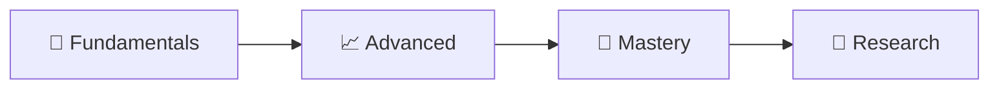
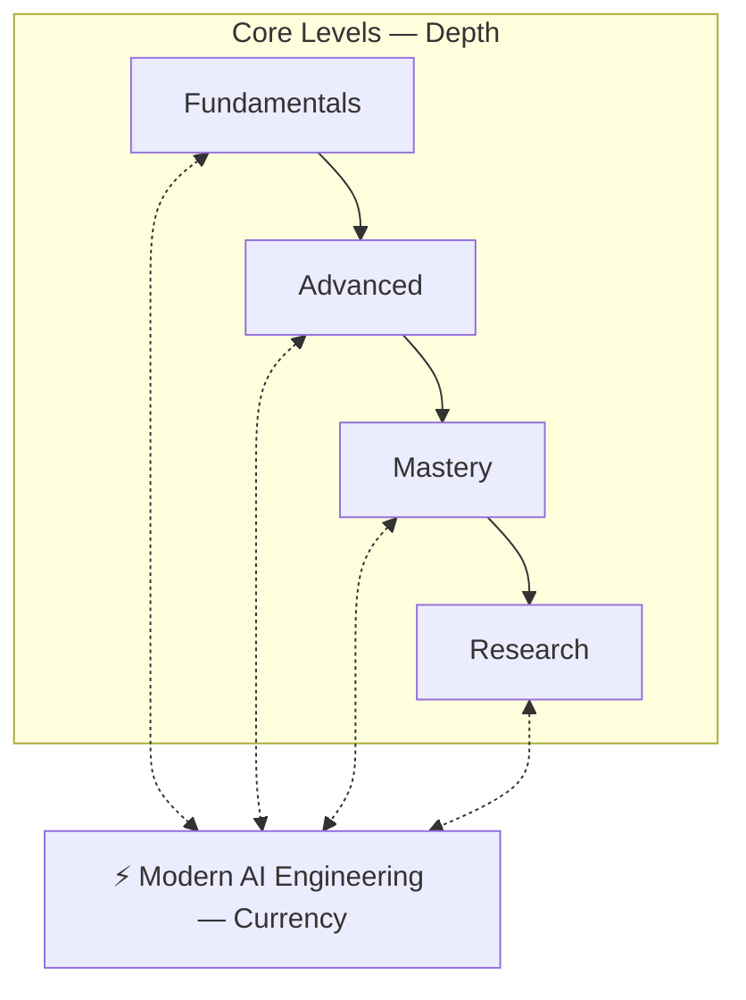
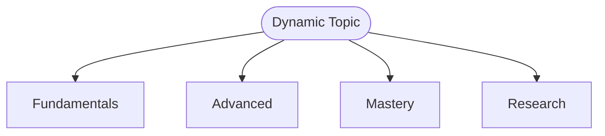
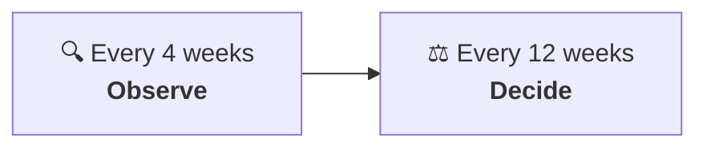
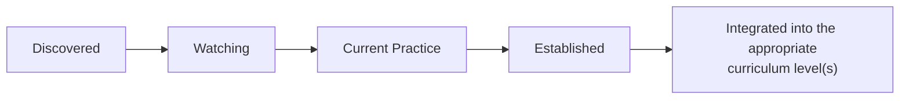
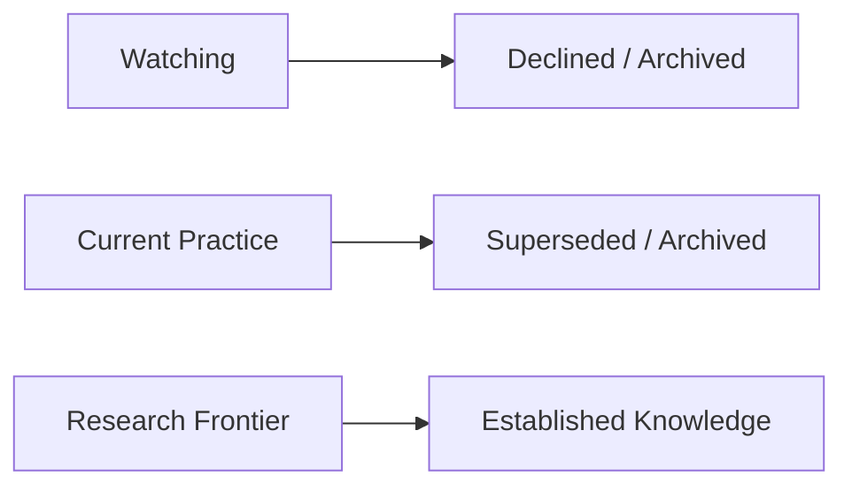

# AI Engineer Roadmap

A continuously maintained learning roadmap for developing deep expertise in the **Data & Intelligence** side of AI engineering.

This repository is designed to answer two different questions:

1. **How deeply should I understand AI?**
2. **What should a capable AI engineer know and be able to build today?**

These questions evolve at different speeds. Established scientific knowledge changes relatively slowly, while modern AI engineering changes rapidly. This roadmap therefore separates **depth of knowledge** from **current engineering practice**.

## Contents

<b>Click to expand / collapse</b>

1. [Learning Structure](#learning-structure)
   - [1. Fundamentals](#1-fundamentals)
   - [2. Advanced](#2-advanced)
   - [3. Mastery](#3-mastery)
   - [4. Research](#4-research)
2. [Modern AI Engineering](#modern-ai-engineering)
3. [Dynamic Topics](#dynamic-topics)
4. [Knowledge Lenses](#knowledge-lenses)
5. [Keeping the Roadmap Current](#keeping-the-roadmap-current)
   - [4-Week Modern AI Scan](#4-week-modern-ai-scan)
   - [12-Week Curriculum Review](#12-week-curriculum-review)
   - [In Short](#in-short)
6. [Topic Lifecycle](#topic-lifecycle)
   - [Typical Path](#typical-path)
   - [Other Outcomes](#other-outcomes)
7. [Evidence Over Hype](#evidence-over-hype)
8. [Scope](#scope)
9. [What This Repository Is Not](#what-this-repository-is-not)
   - [Boundary Areas](#boundary-areas)
10. [Projects](#projects)
11. [Current Status](#current-status)

---

## Learning Structure

**In this section:** [Fundamentals](#1-fundamentals) · [Advanced](#2-advanced) · [Mastery](#3-mastery) · [Research](#4-research)

The core learning path progresses through four levels:

These levels represent increasing depth of understanding rather than simply collections of different topics. A topic may appear across several or all levels.

> **Example:** Retrieval-augmented generation may begin with basic retrieval and generation during Fundamentals, progress into advanced retrieval architectures and evaluation, develop into system design and optimization at Mastery, and eventually lead into open research questions at the Research level.

### 1. Fundamentals

Build the scientific, mathematical, data, machine-learning, and AI foundations required to understand the field.

The objective is not merely familiarity. By the end of Fundamentals, concepts should be understood sufficiently to use them correctly, implement important ideas where appropriate, and build meaningful AI systems.

### 2. Advanced

Develop a deeper understanding of modern methods, trade-offs, limitations, and system interactions.

The emphasis moves from learning individual concepts toward combining them and understanding why different approaches succeed or fail.

### 3. Mastery

Develop the ability to reason independently about AI systems.

At this level, the goal is to be able to:

- analyze unfamiliar approaches;
- derive and implement important methods;
- design experiments;
- diagnose failures;
- compare alternatives;
- make technically justified design decisions; and
- develop deep expertise in selected areas.

Mastery does not require equal specialization in every area of AI. It combines broad advanced understanding with deep expertise in chosen domains.

### 4. Research

Develop the ability to work on problems where the answer is not already known.

This includes:

- literature review;
- identifying research gaps;
- forming hypotheses;
- designing experiments;
- establishing baselines;
- performing ablations;
- ensuring reproducibility;
- statistical analysis;
- interpreting results; and
- technical and scientific communication.

> Research is not simply “more advanced learning.” It is the transition from **learning existing knowledge** to **contributing new knowledge**.

[⬆ Back to Contents](#contents)

---

## Modern AI Engineering

Modern AI Engineering is a **parallel track** rather than a fifth level.

- The four core levels provide **depth**.
- Modern AI Engineering provides **currency**.

Its purpose is to ensure that the roadmap remains connected to how contemporary AI systems are actually being built.

This track may include areas such as modern model capabilities, retrieval systems, reasoning systems, tool use, agentic systems, context engineering, interoperability protocols, multimodal systems, evaluation, AI security, inference techniques, and other important developments.

The exact contents are intentionally not fixed because this layer is expected to change.

Modern AI Engineering should begin gradually once sufficient prerequisites exist. It does not require completing the entire Fundamentals curriculum first.

[⬆ Back to Contents](#contents)

---

## Dynamic Topics

Some topics span the entire learning hierarchy and continue evolving. Examples may include areas such as retrieval, reasoning, agents, evaluation, multimodality, and model adaptation.

A dynamic topic may therefore contain different levels of knowledge:

Modern developments can change what should be understood at any of these levels. A technique that begins as experimental research may eventually become modern engineering practice and later become established knowledge.

The roadmap must therefore allow knowledge to mature without constantly rewriting the curriculum around short-lived trends.

[⬆ Back to Contents](#contents)

---

## Knowledge Lenses

When studying the Data & Intelligence landscape, topics should not automatically be forced into a simple “theory versus practice” distinction.

Three useful lenses are:

| Lens | Focus |
| --- | --- |
| **Model Science** | Understanding models, learning algorithms, representations, optimization, training, reasoning, adaptation, and the scientific principles behind intelligent systems. |
| **Intelligence Systems** | Understanding how models interact with information, computation, memory, retrieval, reasoning, planning, verification, tools, and environments to create more capable intelligent systems. |
| **AI Engineering** | Understanding how contemporary AI capabilities are turned into reliable, evaluable, secure, maintainable, and useful systems. |

These categories may overlap. They are analytical lenses rather than rigid curriculum boundaries.

[⬆ Back to Contents](#contents)

---

## Keeping the Roadmap Current

**In this section:** [4-Week Modern AI Scan](#4-week-modern-ai-scan) · [12-Week Curriculum Review](#12-week-curriculum-review) · [In Short](#in-short)

AI develops too quickly for a static curriculum. This repository therefore uses two review cycles.

### 4-Week Modern AI Scan

Approximately every four weeks, perform a lightweight scan for meaningful developments.

The purpose is to identify:

- new technical directions;
- emerging engineering practices;
- important protocols or system patterns;
- significant changes to existing methods;
- technologies gaining meaningful adoption; and
- developments worth monitoring.

This is primarily a **discovery** process. Finding something new does not automatically mean adding it to the permanent curriculum.

### 12-Week Curriculum Review

Approximately every twelve weeks, perform a deeper evidence-based review.

The purpose is to determine:

- what has materially changed;
- which developments have matured;
- which current practices have become established;
- whether existing curriculum material has become outdated;
- whether topic depth should change;
- whether new knowledge should enter Fundamentals, Advanced, Mastery, or Research; and
- whether previously tracked topics should be deprecated, archived, or considered superseded.

### In Short

[⬆ Back to Contents](#contents)

---

## Topic Lifecycle

**In this section:** [Typical Path](#typical-path) · [Other Outcomes](#other-outcomes)

### Typical Path

Dynamic topics can move through a lifecycle such as:

### Other Outcomes

Not every topic follows this path. Other outcomes include:

The roadmap should preserve these decisions where useful so that future reviews can understand why something was adopted, rejected, changed, or removed.

[⬆ Back to Contents](#contents)

---

## Evidence Over Hype

This roadmap should not become an AI-news feed.

A new:

- model;
- framework;
- benchmark result;
- library;
- product;
- API;
- company announcement; or
- research paper

does not automatically deserve a place in the curriculum.

The important question is whether it represents a meaningful development in knowledge, capability, methodology, architecture, engineering practice, or research direction.

**Durable concepts should take priority over individual implementations.**

> **Example:** Understanding agent state management is more durable than memorizing a particular agent framework.

Frameworks and tools remain valuable for practical learning, but they should normally serve the curriculum rather than define it.

[⬆ Back to Contents](#contents)

---

## Scope

This repository focuses on the **Data & Intelligence** side of becoming an AI Engineer.

Its scope includes areas such as:

- mathematics required for AI and machine learning;
- probability and statistics;
- data analysis;
- machine learning;
- deep learning;
- representation learning;
- natural language processing;
- foundation models;
- large language models;
- model training and adaptation;
- retrieval and knowledge systems;
- reasoning systems;
- multimodal AI;
- evaluation;
- modern AI engineering;
- AI-focused model and inference concepts; and
- AI research.

The precise taxonomy will evolve as the roadmap is researched and developed.

[⬆ Back to Contents](#contents)

---

## What This Repository Is Not

**In this section:** [Boundary Areas](#boundary-areas)

This is not intended to be a complete Computer Science & Engineering curriculum.

Topics whose primary purpose is understanding or building general computing systems will be maintained separately. Examples include deeper study of:

- data structures and algorithms;
- operating systems;
- computer architecture;
- networking;
- database internals;
- distributed systems;
- backend engineering;
- generic software architecture;
- cloud infrastructure; and
- general DevOps.

### Boundary Areas

Some areas naturally overlap.

MLOps, LLMOps, distributed model training, inference systems, GPU computing, data infrastructure, and related subjects sit near the boundary between Data & Intelligence and Computer Science & Engineering.

Their placement should be decided according to the purpose of the material rather than an arbitrary category. A useful question is:

> Is this primarily necessary to understand and build **intelligent/data-driven systems**, or primarily necessary to understand and build **computing systems**?

[⬆ Back to Contents](#contents)

---

## Projects

Projects are part of the learning process rather than something postponed until the roadmap is complete.

Projects should increasingly connect scientific understanding with contemporary AI engineering.

Where appropriate, projects should evolve as knowledge deepens instead of producing many disconnected tutorial applications. A project might begin as a simple implementation during Fundamentals and later gain better retrieval, evaluation, reasoning, tool use, observability, security, optimization, or experimental analysis as the learner progresses.

The objective is to demonstrate both:

- **understanding** of why a system works, and
- **ability** to build it well.

[⬆ Back to Contents](#contents)

---

## Current Status

**Baseline 2** of the curriculum was accepted on 2026-09-19 and is canonical in [ROADMAP.md](ROADMAP.md); earlier baselines are preserved in `history/`.

- Governance is established in [AGENTS.md](AGENTS.md), and the maintenance procedure in [MAINTENANCE.md](MAINTENANCE.md).
- **To learn, start with [LEARNING-GUIDE.md](LEARNING-GUIDE.md)** — a 19-step depth path with a parallel Modern AI Engineering track — or its generated site in `site/`.
- The repository is in maintenance mode.

The roadmap should evolve through deliberate research and review rather than uncontrolled accumulation of topics.

[⬆ Back to Contents](#contents)

