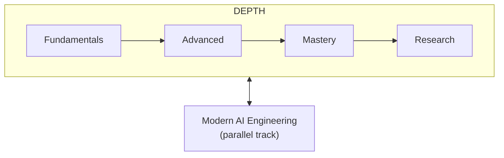
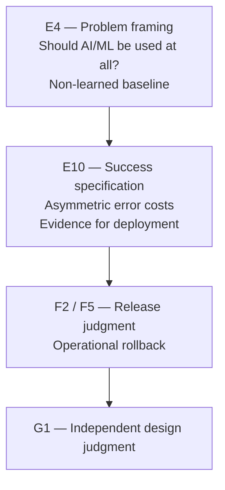
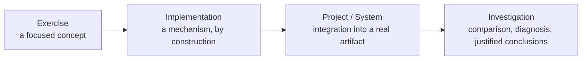
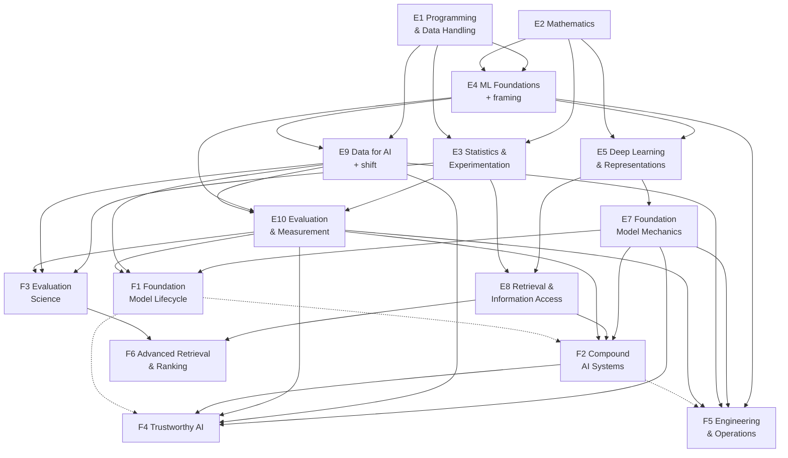

# AI Engineer — Data & Intelligence Roadmap

| | |
| --- | --- |
| **Baseline** | **2** |
| **Accepted** | 2026-09-19 |
| **Scope** | The Data & Intelligence side of AI Engineering: knowledge primarily needed to understand and build intelligent and data-driven systems |
| **Supersedes** | Baseline 1, preserved verbatim at [history/roadmap-baseline-1.md](history/roadmap-baseline-1.md); Baseline v0 at [history/roadmap-baseline-v0.md](history/roadmap-baseline-v0.md) |
| **Learner guide** | [LEARNING-GUIDE.md](LEARNING-GUIDE.md) presents this curriculum as one path; this file is the specification |
| **Design record** | [design/curriculum-proposal.md](design/curriculum-proposal.md) explains why the curriculum is shaped this way; this file states what to learn |

This is the canonical learning roadmap for the Data & Intelligence track of AI Engineering. It tells you what to learn, in what order, to what depth, from which assigned resource portions, and how to show you are ready to move on.

General computing and software-systems knowledge belongs to a **separate, future Computer Science & Engineering roadmap**. Where this roadmap depends on that knowledge, it says so rather than teaching it — see [15](#15-boundary-with-computer-science--engineering).

## Contents

<b>Click to expand / collapse</b>

**Orientation**

1. [How to Use This Roadmap](#1-how-to-use-this-roadmap)
2. [Curriculum at a Glance](#2-curriculum-at-a-glance)

**The Depth Track**

3. [Fundamentals](#3-fundamentals)
   - [E1 Programming and Data Handling](#e1-programming-and-data-handling)
   - [E2 Mathematics for Learning Systems](#e2-mathematics-for-learning-systems)
   - [E3 Statistics, Inference and Experimentation](#e3-statistics-inference-and-experimentation)
   - [E4 Machine Learning Foundations](#e4-machine-learning-foundations)
   - [E5 Deep Learning and Representations](#e5-deep-learning-and-representations)
   - [E7 Foundation Model Mechanics](#e7-foundation-model-mechanics)
   - [E8 Retrieval and Information Access](#e8-retrieval-and-information-access)
   - [E9 Data for AI](#e9-data-for-ai)
   - [E10 Evaluation and Measurement](#e10-evaluation-and-measurement)
4. [Advanced](#4-advanced)
   - [F1 Foundation Model Lifecycle](#f1-foundation-model-lifecycle)
   - [F2 Compound AI Systems](#f2-compound-ai-systems)
   - [F3 Evaluation Science](#f3-evaluation-science)
   - [F4 Trustworthy AI](#f4-trustworthy-ai)
   - [F5 AI Systems Engineering and Operations](#f5-ai-systems-engineering-and-operations)
   - [F6 Advanced Retrieval and Ranking](#f6-advanced-retrieval-and-ranking)
5. [Mastery](#5-mastery)
6. [Research](#6-research)

**Parallel Track and Beyond the Core**

7. [Modern AI Engineering](#7-modern-ai-engineering)
8. [Important Extensions](#8-important-extensions)
9. [Specializations](#9-specializations)
10. [Research Frontiers](#10-research-frontiers)

**Practice, Progression and Reference**

11. [Practice Path](#11-practice-path)
12. [Readiness Gates](#12-readiness-gates)
13. [Dependency Map](#13-dependency-map)
14. [Resource Map](#14-resource-map)
15. [Boundary With Computer Science & Engineering](#15-boundary-with-computer-science--engineering)
16. [Maintenance Status](#16-maintenance-status)

---

## 1. How to Use This Roadmap

**Two structures run side by side.**

- The **Depth Track** — Fundamentals → Advanced → Mastery → Research — builds increasing depth of understanding and judgment.
- **Modern AI Engineering** is a **parallel track**, not a fifth stage. It keeps your practice current and opens in phases as prerequisites are met.

**Required, extension and specialization.**

| Label | Meaning |
| --- | --- |
| **Universal Core** | Required of every learner. Twelve areas, taught through the Fundamentals and Advanced blocks |
| **Important Extension** | Broadly valuable; not required before normal progression |
| **Specialization** | Important for particular roles or problem classes |
| **Research Frontier** | Unresolved questions; studied as open problems, not settled knowledge |

**Depth verbs.** Each block states how deeply it must be learned.

| Level | You can… |
| --- | --- |
| **Awareness** | say what it is and why it exists |
| **Use** | use it correctly with existing implementations |
| **Understand** | explain how and why it works, including trade-offs |
| **Implement** | build or reproduce the important mechanism |
| **Design** | independently design systems or approaches with it |
| **Research** | investigate unresolved questions |

**Coverage and reading are different.** Each block names the chapters, sections, papers or exercises that give it its capabilities — its **coverage**. Each portion has one home block, for traceability; other blocks cross-reference it without adding reading. **How** a resource is read is set by the reading plan in [14](#14-resource-map). A coherent core book is read whole, in its own order, from the point where it enters the path — so some of its chapters give early exposure to capabilities that are mastered later. **Earlier exposure is not later mastery.** Large reference textbooks, papers, standards and specialization material are read in the portions named.

**Resource roles.**

| Role | Meaning |
| --- | --- |
| **Primary** | The main teaching source for a block |
| **Selected Sections** | The block draws on the named portions; the reading plan says whether the whole resource is read |
| **Supplement** | Fills a specific gap in a primary source |
| **Practice** | Exercises, labs or practice sites |
| **Required Paper** | A paper read in full |
| **Reference** | Consult when useful; not part of the normal path |
| **Optional Depth** | Deeper material for learners who want it |
| **Modern Practice** | Fast-moving current material for the parallel track |
| **Specialization** | Used only on a specialization path |

**Readiness is competency-based.** You move on when you can *do* what a block's readiness criteria describe — never because you finished a book.

> ⚠️ This roadmap contains no calendar.
>
> Schedules can be derived from it according to the time you have; the curriculum does not change with the pace.

[⬆ Back to Contents](#contents)

---

## 2. Curriculum at a Glance

**In this section:** [The two tracks](#the-two-tracks) · [The framing strand](#the-framing-strand) · [Monitoring progression](#monitoring-progression) · [The twelve Universal Core areas](#the-twelve-universal-core-areas)

### The two tracks

- **Fundamentals** — nine blocks: E1–E5 and E7–E10.
- **Advanced** — six blocks: F1–F6.
- **Mastery** — three universal capabilities plus selective depth.
- **Research** — universal research literacy plus an optional contribution path.

> ⚠️ Block IDs are stable. **E6 was retired** before Baseline 1; its necessary language concepts are taught inside E4, E5 and E7. The gap in numbering is deliberate, not missing content.

### The framing strand

**Problem Framing and Decision Judgment** is a required strand that runs through existing blocks. It is not a separate core area.

You meet framing **before** you build models, and you deepen it through to Mastery.

### Monitoring progression

A model's measured quality holds only while the world that produced its data stays the same. You learn this in Fundamentals, not only in operations.

| Stage | Block | You learn |
| --- | --- | --- |
| Fundamentals | **E9** | Distribution shift; train–serve skew; changing populations; feedback loops |
| Fundamentals | **E10** | Why static offline evaluation is insufficient; monitoring signals; degradation |
| Advanced | **F5** | Monitoring design; operational response; rollout; rollback; continuity between evaluation and monitoring |

### The twelve Universal Core areas

| Area | Taught in |
| --- | --- |
| UC1 Programming and Data Handling | E1 |
| UC2 Mathematics for Learning Systems | E2 |
| UC3 Statistics, Inference and Experimentation | E3 |
| UC4 Machine Learning Foundations | E4 |
| UC5 Deep Learning and Representations | E5 |
| UC6 Language and Foundation Models | E7, F1 |
| UC7 Retrieval and Information Access | E8, F6 |
| UC8 Data for AI | E9 |
| UC9 Evaluation and Measurement | E10, F3 |
| UC10 Compound AI Systems | F2 |
| UC11 Trustworthy AI | F4 |
| UC12 AI Systems Engineering and Operations | E9, E10 (introduction), F5 |

[⬆ Back to Contents](#contents)

---

## 3. Fundamentals

**In this section:** [E1](#e1-programming-and-data-handling) · [E2](#e2-mathematics-for-learning-systems) · [E3](#e3-statistics-inference-and-experimentation) · [E4](#e4-machine-learning-foundations) · [E5](#e5-deep-learning-and-representations) · [E7](#e7-foundation-model-mechanics) · [E8](#e8-retrieval-and-information-access) · [E9](#e9-data-for-ai) · [E10](#e10-evaluation-and-measurement)

**Objective.** Use concepts correctly, understand core principles, implement mechanisms where building them is the cheapest route to understanding, decide what to build and how to judge it, and build meaningful AI systems.

> **Fundamentals does not mean easy.**

### E1. Programming and Data Handling

| | |
| --- | --- |
| **Purpose** | Obtain, shape, inspect and manipulate data, and write the code everything later depends on |
| **Learn** | Python language and idiom; relational querying through joins, aggregation, window functions and CTEs; array and dataframe computing; cleaning, missing data, duplicates, outliers; exploratory analysis and plotting for diagnosis; environment isolation |
| **Required depth** | **Implement** for querying and data manipulation; **Use** for visualization |
| **Prerequisites** | None |
| **Assigned resources** | *The Python Tutorial* — Primary: the language tour · *Practical SQL* — Selected Sections: querying and in-database cleaning chapters · PostgreSQL Exercises — Practice · *Python for Data Analysis* — Primary: array, dataframe, cleaning and plotting chapters |
| **Practice** | Exercises; then an investigation — report what an unfamiliar dataset contains, what is wrong with it, and what it can and cannot support |
| **Readiness** | *Implement* a non-trivial aggregation and window query; *diagnose* a data-quality problem from evidence; *justify* a cleaning decision and its effect on conclusions |

*Practical SQL* is read whole ([14](#14-resource-map)), so its schema-design, transaction and database-maintenance chapters are read here as exposure. Mastering them is not required here; they belong to the CS&E roadmap.

### E2. Mathematics for Learning Systems

| | |
| --- | --- |
| **Purpose** | Read the definitions learning methods are written in, and reason about why optimization behaves as it does |
| **Learn** | Linear algebra for representation; multivariate calculus and the chain rule; reverse-mode differentiation; probability — distributions, expectation, variance, conditioning, likelihood; optimization behaviour, learning-rate divergence, conditioning; entropy and cross-entropy |
| **Required depth** | **Understand**; **Implement** gradient descent and reverse-mode differentiation on a toy graph |
| **Prerequisites** | None formally |
| **Assigned resources** | *Dive into Deep Learning* — Selected Sections: §2.3–2.6, §12.1–12.4, §12.11, §22.1, §22.4, §22.7, §22.11 · Piech, *Probability for Computer Scientists* — Supplement: Parts 1–3 (to joint and marginal distributions), Part 5 and the information-theory chapter; stop before sampling, bootstrap and the CLT, which E3 teaches · *Hands-On ML with Scikit-Learn and PyTorch* — Selected Sections: Appendix A (toy computation graph, reverse-mode autodiff) |
| **Practice** | Implement the two mechanisms; exercises otherwise. Not a proof course |
| **Readiness** | *Explain* what a gradient says about a loss surface; *implement* gradient descent and *diagnose* divergence; *explain* why maximizing likelihood is a training objective |

### E3. Statistics, Inference and Experimentation

| | |
| --- | --- |
| **Purpose** | Decide whether an observed difference is real, and design comparisons that can answer the question asked |
| **Learn** | Estimation and sampling variability; confidence intervals and the bootstrap; hypothesis testing; paired comparison of two models on a shared test set; power and sample size; non-independence — clustered items and clustered standard errors; variance across repeated trials of a stochastic system, and pass@k versus pass^k; agreement statistics (Cohen's and Fleiss' κ, Krippendorff's α) and why raw agreement misleads; calibration, what a predicted probability means, and deferring when uncertain; the principle of online controlled experiments — randomization, randomization units, the overall evaluation criterion, why offline and online results can disagree; confounding |
| **Required depth** | **Understand**; **Use** for standard procedures; **Implement** the bootstrap and a repeated-trial simulation |
| **Prerequisites** | E1, E2 |
| **Assigned resources** | *Computational and Inferential Thinking* (Data 8) — Primary: chs 2, 10–13, 14.4–14.6 · Kohavi, Tang and Xu, *Trustworthy Online Controlled Experiments* — Selected Sections: chapter 1 only (free) · Miller, "Adding Error Bars to Evals" — Required Paper · scikit-learn User Guide §1.16 Probability calibration — Selected Sections · *AI Measurement Science* — Selected Sections: the agreement-coefficient sections of ch 5 · Planned learner materials: repeated-trial simulation; calibration exercise |
| **Practice** | Investigations: decide whether a model difference is real; simulate repeated trials; compute agreement between two labellers; build and read a reliability diagram |
| **Readiness** | *Explain* what an interval does and does not assert; *compute* a paired interval for a model comparison; *explain* why ignoring clustered items overstates certainty; *evaluate* whether an average success rate predicts reliability; *compute* and *interpret* an agreement coefficient; *diagnose* a confounded comparison |

Running and analysing online experiments independently is **Optional Depth** (the rest of Kohavi et al.).

### E4. Machine Learning Foundations

| | |
| --- | --- |
| **Purpose** | Frame a problem correctly, establish an honest baseline, and build models whose behaviour you can explain |
| **Learn** | **Framing (strand entry):** when to use machine learning at all; turning a goal into a prediction, ranking, generation or decision problem; the unit of prediction and what the output will drive; business versus ML objectives; how common text tasks are formulated — classification, extraction, ranking, generation; non-learned baselines. **Modelling:** linear and logistic models; regularization; trees and ensembles, and why gradient boosting remains a robust tabular default; dimensionality reduction and clustering; bias–variance and learning curves; cross-validation and leakage-safe splits; metrics, confusion matrices, ROC and PR; error analysis |
| **Required depth** | **Implement** |
| **Prerequisites** | E1, E2; E3 may run concurrently |
| **Assigned resources** | *Hands-On ML with Scikit-Learn and PyTorch* — Selected Sections: chs 1–8 · *Designing Machine Learning Systems* — Selected Sections: ch 1 (including "When to Use Machine Learning") and ch 2 (objectives, requirements, framing ML problems, objective functions) · Huyen, *AI Engineering* — Selected Sections: ch 1 "Planning AI Applications" (pp. 28–35) · Planned learner materials: framing cases |
| **Practice** | Framing exercise on cases, including one where learning is the wrong tool; then an end-to-end project that begins with a written framing and a non-learned baseline — the start of your evolving system |
| **Readiness** | *Decide* whether learning is appropriate for a stated goal and *justify* it; *frame* the problem and the unit of prediction; *select* and *justify* a baseline; *implement* a supervised pipeline with leakage-safe validation; *diagnose* overfitting and imbalance from evidence |

### E5. Deep Learning and Representations

| | |
| --- | --- |
| **Purpose** | Explain what deep networks compute, why representations transfer, and why training succeeds or fails |
| **Learn** | Training mechanics — initialization, normalization, regularization, optimizers, stability; convolutional and recurrent lineage; attention and the transformer block; embeddings and representation transfer; text as structured, sequential data and how text is represented; self-supervised pretraining as an idea; one non-language modality — vision — through transfer learning; awareness of diffusion as a second generative family |
| **Required depth** | **Implement** a small network and training loop; **Understand** attention and the transformer block (you build it once, in E7); **Use** vision through transfer learning; **Awareness** of diffusion |
| **Prerequisites** | E2, E4 |
| **Assigned resources** | *Hands-On ML with Scikit-Learn and PyTorch* — Selected Sections: chs 9–16, read at Understand depth for the transformer chapters · *Speech and Language Processing* — Selected Sections: ch 5 (embeddings) |
| **Practice** | Implement and train a small network; apply transfer learning to an image task |
| **Readiness** | *Implement* a training loop and *diagnose* non-convergence; *explain* what attention computes and why it scales as it does; *explain* why an embedding supports similarity search and what it discards; *use* transfer learning on a non-language task and *justify* it |

### E7. Foundation Model Mechanics

| | |
| --- | --- |
| **Purpose** | Understand a language model well enough that using, conditioning and adapting it rest on mechanism rather than analogy |
| **Learn** | Tokenization and its consequences for cost, quality and multilingual behaviour; the linguistic units models actually operate on; language-modelling formulation; positional information; the attention stack end to end; the pretraining objective and loop; decoding and sampling; context limits; what fine-tuning changes; **when to prompt, retrieve or tune** |
| **Required depth** | **Understand**; **Implement** one small decoder-only transformer language model — **the curriculum's single from-scratch model build** |
| **Prerequisites** | E5 |
| **Assigned resources** | *Build a Large Language Model (From Scratch)* — Primary: chs 2–5 (the build; a library tokenizer is fine) and ch 7 (fine-tuning to follow instructions) · *Speech and Language Processing* — Selected Sections: ch 2 (words and tokens) · Huyen, *AI Engineering* — Selected Sections: ch 7 "Finetuning Overview" and "When to Finetune" (pp. 307–319) |
| **Practice** | The single build; a tokenization exercise comparing several tokenizations of the same text; decoding experiments |
| **Readiness** | *Implement* and train a small transformer language model; *explain* how tokenization affects cost and quality across languages; *diagnose* a generation pathology from decoding settings; *justify* a prompt-versus-retrieve-versus-tune decision |

**Optional Depth.** A hand-written BPE tokenizer, loading real pretrained weights, and modern architectural variants — from the book's companion repository, cited by commit because its bonus folders are unversioned.

### E8. Retrieval and Information Access

| | |
| --- | --- |
| **Purpose** | Retrieve the right information, and know when retrieval is the reason a system is wrong |
| **Learn** | The retrieval problem; lexical retrieval and why it stays competitive; dense retrieval; late-interaction retrieval (conceptual); hybrid retrieval and two-stage reranking; IR evaluation including ranking metrics — MAP, nDCG, MRR; approximate nearest-neighbour indexing and the recall–latency trade-off; chunking and document preparation |
| **Required depth** | **Understand**; **Implement** a hybrid retriever and its evaluation |
| **Prerequisites** | E5 (embeddings); E3 (statistical and evaluation foundation). Relevant E10 concepts may be studied concurrently — E10 is not a prerequisite |
| **Assigned resources** | *Speech and Language Processing* — Primary: ch 11 · Planned learner material: ranking-metrics note · **Conditional:** *Natural Language Processing in Action* §10.3.2–10.3.6 for ANN index choice and vector quantization — see [14](#14-resource-map) |
| **Practice** | Build a retriever, measure it with ranking metrics, and show that changing retrieval changes end-to-end quality |
| **Readiness** | *Explain* why retrieval quality bounds answer quality; *compare* lexical and dense retrieval on one corpus; *evaluate* a ranker with appropriate metrics; *explain* the recall–latency trade-off of an ANN index; *diagnose* whether a wrong answer came from retrieval or generation |

### E9. Data for AI

| | |
| --- | --- |
| **Purpose** | Build data whose quality you can defend, trace behaviour back to it, and recognize when the world that produced it has changed |
| **Learn** | Sampling and its biases; labelling and annotation quality; label error and its effect on rankings; class imbalance; feature engineering and temporal splitting; **data leakage** as a family of failures; lineage and dataset documentation; provenance and licensing; synthetic data and its risks; **distribution shift — covariate, label and concept; train–serve skew; changing populations; feedback loops in which a model shapes its future data** |
| **Required depth** | **Understand**; **Implement** leakage-safe construction, data-validation checks and a basic shift check |
| **Prerequisites** | E1, E4 |
| **Assigned resources** | *Designing Machine Learning Systems* — Selected Sections: ch 4 (training data), ch 5 (feature engineering, including data leakage), ch 8 "Causes of ML System Failures" and "Data Distribution Shifts" (pp. 224–247) |
| **Practice** | Build an evaluation set, attack it, and report what is wrong; run a shift check between a training sample and a later sample |
| **Readiness** | *Implement* a leakage-safe temporal split; *evaluate* a dataset's fitness for a stated claim; *diagnose* train–serve skew; *explain* how a feedback loop can corrupt future training data; *detect* a distribution shift between two samples |

### E10. Evaluation and Measurement

| | |
| --- | --- |
| **Purpose** | Make claims about system quality that survive scrutiny, specify what success means, and keep those claims true after release |
| **Learn** | **Success specification (strand):** acceptance criteria; asymmetric error costs; the population on which success must hold; the difference between an offline metric and the decision it informs; what evidence justifies deployment or rollback. **Measurement:** metric choice and what each metric rewards and distorts; validation protocols; baselines; error analysis and failure taxonomies; slice-based and disaggregated evaluation; test-set hygiene and contamination; reporting variability. **ML-specific testing:** data-validation tests; leakage tests; behavioural checks — perturbation, invariance and directional expectations — where justified; evaluation regression tests; testing stochastic systems with repeated trials and tolerances; reproducibility — seeds, environment and version recording, experiment tracking. **After release:** why static offline evaluation is insufficient; monitoring signals; silent degradation; upstream model and API changes as a form of shift |
| **Required depth** | **Implement**; success specification at **Implement** for your own system |
| **Prerequisites** | E3, E4, E9 |
| **Assigned resources** | *Designing Machine Learning Systems* — Selected Sections: ch 6 "Experiment Tracking and Versioning" (pp. 160–165) and "Model Offline Evaluation" (baselines and evaluation methods, pp. 176–186); ch 8 "ML-Specific Metrics" (pp. 248–253) · Breck et al., "The ML Test Score" — Required Paper · *Speech and Language Processing* — Selected Sections: §1.9 · Cross-reference, no extra reading: metrics and error analysis from *Hands-On ML* ch 3 (assigned in E4) · Planned learner materials: ML-testing and reproducibility checklist; success-specification and release/rollback cases |
| **Practice** | Write a success specification with costed errors for your evolving system; build its evaluation suite with slice analysis and ML-specific tests; define the monitoring signals that would reveal degradation |
| **Readiness** | *Specify* success with asymmetric costs for a stated decision; *design* and *implement* an evaluation for it; *implement* data-validation, leakage and regression tests; *explain* why the offline result may not hold after release; *state* what evidence would justify deployment and what would trigger rollback |

[⬆ Back to Contents](#contents)

---

## 4. Advanced

**In this section:** [F1](#f1-foundation-model-lifecycle) · [F2](#f2-compound-ai-systems) · [F3](#f3-evaluation-science) · [F4](#f4-trustworthy-ai) · [F5](#f5-ai-systems-engineering-and-operations) · [F6](#f6-advanced-retrieval-and-ranking)

**Objective.** Modern methods, alternatives, trade-offs, limitations and failure modes — with concepts combined into complete systems and decisions justified on evidence.

> ⚠️ Advanced blocks do not all depend on one another.
>
> F1 is **not** a hard prerequisite of any other Advanced block. Check each block's prerequisites and the [Dependency Map](#13-dependency-map).

### F1. Foundation Model Lifecycle

| | |
| --- | --- |
| **Purpose** | Reason about how a foundation model came to behave as it does, and what an adaptation will change |
| **Learn** | Pretraining data as a quality lever; scaling relationships and their contested interpretation; **a short RL arc** — Markov decision framing, policy, reward, credit assignment, policy gradients, why a KL-regularized objective keeps a tuned model near its base, and awareness of bandits and exploration; post-training — supervised fine-tuning, preference optimization, RL from verifiable rewards (contested, fast-moving practice); distillation; test-time compute and why chain-of-thought is not a reliable explanation; parameter-efficient adaptation and model merging; fine-tuning side effects, including forgetting and emergent misalignment |
| **Required depth** | **Understand**; **Implement** one adaptation — low-rank adaptation of the model you built in E7 |
| **Prerequisites** | E7, E9, E10 |
| **Assigned resources** | Huyen, *AI Engineering* — Selected Sections: ch 2 "Training Data" (pp. 50–58), "Model Size" (pp. 67–78), "Post-Training" (pp. 78–88), "Test Time Compute" (pp. 96–99); ch 7 "Model Merging and Multi-Task Finetuning" and "Finetuning Tactics" (pp. 347–361) · *Build a Large Language Model (From Scratch)* — Practice: Appendix E (LoRA) · *Hands-On ML with Scikit-Learn and PyTorch* — Selected Sections: ch 19, Markov decision processes and policy gradients · Planned learner materials: RL arc note; brief on RL from verifiable rewards, distillation and contested lifecycle claims |
| **Practice** | Adapt your model and investigate what *else* changed |
| **Readiness** | *Explain* why post-training algorithms are RL-derived and what they assume; *implement* one adaptation and *diagnose* a regression it introduced; *evaluate* a scaling or capability claim against its evidence, treating contested claims as contested |

### F2. Compound AI Systems

| | |
| --- | --- |
| **Purpose** | Build systems that combine models with retrieval, tools and verification, choosing the least autonomy that solves the problem |
| **Learn** | See the depth table below |
| **Required depth** | Stratified — see below |
| **Prerequisites** | E7, E8, E10. F1 is **recommended**, not required |
| **Assigned resources** | Huyen, *AI Engineering* — Selected Sections: ch 2 "Structured Outputs" (pp. 99–105); ch 5 "Context Length and Context Efficiency" (pp. 218–220); ch 6 "RAG Architecture" (pp. 256–257), "Retrieval Optimization" (pp. 268–273), "Agents" (pp. 275–300) and "Memory" (pp. 300–305); ch 10 steps 1, 2 and 5 and "AI Pipeline Orchestration" (pp. 449–456, 463–465, 472–474) · Liu et al., "Lost in the Middle" — Required Paper · Kambhampati et al., "LLMs Can't Plan, But Can Help Planning in LLM-Modulo Frameworks" — Required Paper · Kapoor et al., "AI Agents That Matter" — Required Paper · Cross-references, no extra reading: the prompt-injection design-patterns paper (F4) for least privilege; the Agentic Benchmark Checklist (F3) for trajectory validity; repeated-trial reliability (E3) · Planned learner materials: from-scratch agent-loop exercise; fault-injection lab; least-autonomy decision rubric and interfaces-as-concept note |
| **Practice** | Extend your evolving system into a compound system; the from-scratch agent-loop exercise; the fault-injection lab; an investigation comparing two architectures on evidence |
| **Readiness** | *Design* a compound system and *justify* each autonomy decision; *implement* a tool interface a model uses correctly; *implement* a context-management strategy and *measure* its effect; *diagnose* whether a failure originated in retrieval, context, tool use or generation; *evaluate* a trajectory across repeated trials; *justify* rejecting a multi-agent design; *decide* whether the system is ready to release |

**Stratified depth.**

| Topic | Required depth | Deeper study |
| --- | --- | --- |
| Workflow composition and least autonomy | **Design** | — |
| Retrieval-augmented composition on E8 fundamentals | **Design** | F6 |
| Output contracts — structured generation and constrained decoding | **Design** for the contract; Understand for the mechanism | — |
| Tool-interface design and least privilege | **Design** | F4 |
| Verification and generate-and-verify | **Design** | — |
| Failure decomposition across components | **Design** | Mastery G2 |
| Release judgment for compound systems (framing strand) | **Design** | F5 |
| Context budget and management — finite and non-uniform context, measuring its effects, choosing what enters it, retrieval, selection and compaction, diagnosing context failures | **Understand → Implement** | Modern AI Engineering; G4; SP6 |
| Human checkpoints and approval gates | Understand | EX9 |
| Trajectory evaluation | Understand + Use | F3; RF7 |
| Multi-agent orchestration, and the evidence that it is not a default | Understand | SP6 |
| Agent memory architectures | Understand | SP6; Modern AI Engineering |
| Tool and agent interoperability standards | Understand (concept) | Modern AI Engineering |

### F3. Evaluation Science

| | |
| --- | --- |
| **Purpose** | Treat evaluation as an object of study |
| **Learn** | Construct validity; benchmark validity; contamination and its effect on model selection; model-based judges validated against human labels; reliability versus validity; variance-component reasoning — which facet (items, raters, seeds, prompts) drives score variance and where more samples help; human evaluation and annotation operations; regression suites and failure taxonomies; capability evaluation; trajectory evaluation and why its validity is unresolved; saturation |
| **Required depth** | **Design**; variance-component reasoning at **Understand** through simulation |
| **Prerequisites** | E3, E9, E10 |
| **Assigned resources** | *AI Measurement Science* — Primary: ch 1; the reliability-concept sections of ch 5; ch 11 §11.1, §11.6, §11.8; ch 13 · Hardt, *The Emerging Science of Machine Learning Benchmarks* — Selected Sections: chs 11 and 14 · Husain and Shankar, "AI Evals: Everything You Need to Know" — Primary for application evaluation: error-analysis, evaluation-design and annotation sections · Zhu et al., Agentic Benchmark Checklist — Required Paper · Cross-references, no extra reading: Miller (E3), Kapoor et al. (F2) · Planned learner material: variance-component simulation |
| **Practice** | Build a durable evaluation suite for your evolving system; validate a judge against human labels; run the variance-component simulation |
| **Readiness** | *Design* an evaluation suite and *justify* its construct validity; *evaluate* a judge against human labels before relying on it; *diagnose* contamination; *explain* why a saturated benchmark stops being informative; *decide* where extra evaluation samples buy the most reliability |

Fitting generalizability-theory or random-effects models is **Optional Depth** (Mastery G4 or an evaluation specialization).

### F4. Trustworthy AI

| | |
| --- | --- |
| **Purpose** | Recognize and reduce the ways an AI system harms, fails adversarially, or misleads |
| **Learn** | **AI-specific security:** instruction/data confusion; direct and indirect prompt injection; untrusted content; unsafe tool use; poisoning; extraction; adversarial examples; containment and capability limitation; architectural separation; AI-specific threat modeling; adaptive-attack evaluation. **Beyond security:** robustness and shift; privacy and memorization; fairness definitions and their incompatibility; interpretability and what it does not establish; documentation and provenance; regulatory obligations that produce engineering artifacts. **Alignment strand:** reward hacking and fine-tuning side effects |
| **Required depth** | **Design** for security architecture; **Understand** otherwise; **Awareness** for regulation |
| **Prerequisites** | E7, E9, E10; F2's composition core for the security-architecture strand. F1 is **recommended only for the alignment strand** |
| **Assigned resources** | Beurer-Kellner et al., "Design Patterns for Securing LLM Agents against Prompt Injections" — Primary: the whole paper, with three or four case studies as design exercises · NIST AI 100-2 E2025 — Selected Sections: §2.1–2.4, §3.1–3.5, §4.1 · Nasr, Carlini et al., "The Attacker Moves Second" — Required Paper · Greshake et al., indirect prompt injection — Required Paper · AgentDojo — Practice: one lab (baseline, one defense, one adaptive attack) · *Speech and Language Processing* — Selected Sections: §1.10, the bias sections, ch 10 (interpretability) |
| **Practice** | Threat-model your evolving system; run the attack-and-defense lab; redesign for containment |
| **Readiness** | *Explain* why a model reading untrusted content is an attack surface; *design* containment rather than a detection filter; *evaluate* a defense against adaptive attack; *evaluate* a fairness claim and *justify* the metric |

### F5. AI Systems Engineering and Operations

| | |
| --- | --- |
| **Purpose** | Operate learned systems at acceptable cost, latency and reliability; detect degradation; decide release and rollback |
| **Learn** | Serving concepts and cost — KV cache, batching, prefill versus decode, speculative decoding, quantization trade-offs; latency and throughput; token economics and caching; routing and cascades; deployment patterns; monitoring design and operational response, building on E9 and E10; ML technical debt; lineage and versioning of data, models, prompts and configuration; continuity between evaluation and monitoring; testing in production — shadow, canary, staged rollout; **release and rollback judgment**; continual learning and data flywheels |
| **Required depth** | **Understand**; **Design** for monitoring response, cost reasoning and release/rollback decisions |
| **Prerequisites** | E4, E7, E9, E10. F2 is **recommended** for operating compound systems. F1 is not a prerequisite |
| **Assigned resources** | Huyen, *AI Engineering* — Selected Sections: ch 9 (pp. 405–447); ch 10 steps 3 and 4, router and gateway and caches (pp. 456–463), and "Monitoring and Observability" (pp. 465–472) · *Designing Machine Learning Systems* — Selected Sections: ch 7 (deployment and prediction service), ch 8 "Monitoring Toolbox" and "Observability" (pp. 253–258), ch 9 (continual learning and test in production), ch 10 (infrastructure and tooling for MLOps; D&I-relevant parts) · *How To Scale Your Model*, "All About Transformer Inference" — Selected Sections: §§1, 2, 4 and problems 1–3 · Moslem and Kelleher, routing and cascading survey — Selected Sections: §§1–3 and the cascades section · Planned learner material: release and rollback cases |
| **Practice** | Deploy your evolving system; size its cost and latency; define rollback triggers and exercise one rollback |
| **Readiness** | *Explain* what determines serving memory and latency; *evaluate* a cost-versus-quality trade-off quantitatively; *design* monitoring that would detect a realistic silent failure; *decide* go/no-go and rollback from imperfect evidence and *explain* the decision to a non-specialist |

### F6. Advanced Retrieval and Ranking

| | |
| --- | --- |
| **Purpose** | Move from "retrieval works" to controlling retrieval quality |
| **Learn** | Reranking architectures; learned sparse retrieval; late interaction beyond the concept; query understanding and rewriting; iterative and agentic search loops; system-level retrieval evaluation; when graph-structured retrieval helps; document parsing as an upstream bottleneck |
| **Required depth** | **Understand**; **Implement** reranking |
| **Prerequisites** | E8, F3 |
| **Assigned resources** | No dedicated resource has been assigned yet. Cross-references, no extra reading: *Speech and Language Processing* ch 11 (E8), *AI Engineering* "Retrieval Optimization" (F2), and *Hands-On Large Language Models* ch 8 — reranking, advanced RAG, RAG evaluation ([7](#7-modern-ai-engineering), Phase 2) |
| **Practice** | Investigation: measure where a retrieval pipeline loses quality and fix the largest loss |
| **Readiness** | *Compare* retrieval architectures on evidence; *diagnose* the stage responsible for a retrieval failure; *justify* rejecting a fashionable upgrade on measurement |

[⬆ Back to Contents](#contents)

---

## 5. Mastery

**Mastery is capability, not more content.** Your judgment, not a resource, decides what to do.

| Capability | You can |
| --- | --- |
| **G1. Design Judgment** | Determine what system an ambiguous problem needs, the least sufficient architecture, the trade-offs, and what evidence would change the decision. This deepens the framing strand |
| **G2. Diagnostic Capability** | Isolate the responsible layer — data, model, retrieval, context, tooling, evaluation or operations — in an unfamiliar failure |
| **G3. Experimental Capability** | Design experiments that could falsify your own hypothesis; choose baselines and ablations; report uncertainty; interpret without overclaiming |
| **G4. Selective Depth** | Reach **Design** or **Research** depth in two or three areas you choose from the Extensions, Specializations or deeper core work |

G1–G3 are universal at Mastery. G4 is selective by design.

> ⚠️ Mastery does not require equal expertise across every AI subfield.

[⬆ Back to Contents](#contents)

---

## 6. Research

| Path | Status | You can |
| --- | --- | --- |
| **H1. Research Literacy** | **Universal**, taught at Advanced | Locate the primary source behind a claim; distinguish established knowledge, current practice, active research and speculation; check for baselines, ablations and variance; recognize contamination, leakage and selective reporting; hold contested questions as contested |
| **H2. Research Contribution** | **Optional** | Review literature systematically; identify gaps; form hypotheses; design experiments with baselines and ablations; ensure reproducibility; reason statistically; interpret; write scientifically; take part in peer review |

**Prerequisites.** H1: E3, E10, F3. H2: H1, G3 and specialization depth.

> ⚠️ Research depth is not required of every learner.

[⬆ Back to Contents](#contents)

---

## 7. Modern AI Engineering

The parallel track answers: *what should a capable AI engineer understand and be able to build today?* It opens in phases as prerequisites are met — not by calendar.

| Phase | Opens after | What becomes possible |
| --- | --- | --- |
| **Phase 0 — Orientation** | Nothing | Awareness of what contemporary systems do |
| **Phase 1 — First Contact** | E1, E4, part of E5 | Model interfaces; prompting as an empirical activity; structured generation; embeddings; simple semantic search; tool calling |
| **Phase 2 — Grounded Systems** | E5, E7, E8, E10 | Retrieval-augmented systems built on retrieval fundamentals; an evaluation harness; error-analysis workflow; basic observability |
| **Phase 3 — Compound Systems** | F2's composition core | Current agent and workflow patterns; context-management practice; memory and multi-agent patterns; interoperability specifications; security practice; cost and latency practice; production operation. **Adaptation practice opens after F1** |

**Early access is not early mastery.** Phase 1 may start before E3 is complete. You may prototype early; you may not claim that one prompt beats another, tune a pipeline on measurements, or ship an evaluation harness until E3 and E10 are in place.

**Where you practise.** The track's hands-on resources, and the portions each phase draws on. They teach current tools, which change faster than the Depth Track; the 4-week scan reviews them. *Hands-On Large Language Models* is read whole from Phase 1 and *LLM Engineer's Handbook* whole from Phase 3 ([14](#14-resource-map)); later phases return to the portions named.

| Phase | Resource | Assigned portions |
| --- | --- | --- |
| **Phase 1 — First Contact** | *Hands-On Large Language Models* | Ch 2 (tokens and embeddings), ch 6 (prompt engineering), ch 7 (advanced text generation techniques and tools) |
| **Phase 2 — Grounded Systems** | *Hands-On Large Language Models* | Ch 8 (semantic search and retrieval-augmented generation) |
| **Phase 3 — Compound Systems** | Current engineering guides — Modern Practice, not counted in [14](#14-resource-map) | Anthropic "Building effective agents", "Effective context engineering for AI agents", "Writing effective tools for agents" and "Demystifying evals for AI agents" |
| **Phase 3 — production operation** | *LLM Engineer's Handbook* | Ch 1 (system architecture), chs 9–11 (RAG inference pipeline, deployment, MLOps and LLMOps) and the appendix — read for the architecture; reproducing it on its commercial cloud stack is optional |
| **Phase 3 — adaptation practice, after F1** | *Hands-On Large Language Models* | Ch 12 (fine-tuning generation models) |

**What is durable and what is current practice.**

| Capability | Durable concept (in the Depth Track) | Current practice (in this track only) |
| --- | --- | --- |
| System architecture | Least autonomy; workflow versus agent | Named workflow patterns — prompt chaining, routing, parallelization, orchestrator–workers, evaluator–optimizer; bounded autonomy with human intervention; quantified multi-agent studies |
| Context | Finite, non-uniform attention budget; just-in-time retrieval; compaction | "Context engineering" conventions — just-in-time retrieval, compaction, structured notes, sub-agents with their own context; memory kept outside the context window; memory-file formats |
| Structured generation | Grammar- and schema-constrained decoding | Provider strict modes; schema support that varies by engine |
| Tools and interoperability | Interface design; least privilege; standard interfaces as a concept | Specific protocols, primitives and deprecations — currently the Model Context Protocol (2026-07-28 specification); agent-facing tool design; agent-to-agent protocols watched |
| Evaluation | Error analysis; validated judges; regression suites; repeated-trial reliability | Error analysis by open and axial coding; judges validated against labelled samples; agent evaluation over repeated trials with pass^k; evaluation platforms and vendor vocabulary |
| Inference and cost | KV cache, batching, speculative decoding, quantization; token economics; routing | Prompt-prefix caching layout; routing and cascades; pinned model versions; engine settings; format-specific guidance; provider pricing |
| Security | Least privilege; data-flow separation; adaptive-attack evaluation | Risk lists — the OWASP LLM and agentic lists, MITRE ATLAS; limiting untrusted input, sensitive access and external action in one agent; specific attacks; guardrail products |

> ⚠️ This track is organized by capability — never by vendor, product, framework or model name.
>
> A current-practice item enters the Depth Track only through the promotion process in [AGENTS.md](AGENTS.md#promotion-into-the-permanent-curriculum).

[⬆ Back to Contents](#contents)

---

## 8. Important Extensions

Broadly valuable; not required before normal progression.

| ID | Extension | Scope | Depth |
| --- | --- | --- | --- |
| **EX1** | Sequential Decision-Making and Reinforcement Learning | Value methods, actor-critic, bandits, exploration, off-policy evaluation | Understand → Implement |
| **EX2** | Generative Modeling Beyond Language | Autoencoders, VAEs, GANs, diffusion and flow | Understand → Implement |
| **EX3** | Classical NLP Structure | Parsing, deeper information extraction, semantic role labelling, coreference, lexicons, classical probabilistic NLP | Understand |
| **EX4** | Speech and Audio | ASR, TTS, phonetics, audio metrics | Use → Understand |
| **EX5** | Computer Vision Beyond Core Exposure | Detection, segmentation, from-scratch vision models | Use → Implement |
| **EX6** | Time Series and Forecasting | Forecasting methods beyond the temporal splits in E9 and E10 | Use → Understand |
| **EX7** | Knowledge, Reasoning and Symbolic Methods | Knowledge graphs, planning and constraint solving as tools inside model-driven systems | Awareness → Use |
| **EX8** | Ranking and Recommendation | Recommender systems, learned sparse retrieval, feedback loops | Understand |
| **EX9** | Human-AI Interaction and Oversight | Designing intervention budgets, uncertainty communication and feedback capture | Understand → Design |

[⬆ Back to Contents](#contents)

---

## 9. Specializations

| ID | Specialization | Note |
| --- | --- | --- |
| **SP1** | Embodied AI and Robot Learning | |
| **SP2** | AI for Science and Domain Applications | |
| **SP3** | Graph Machine Learning | |
| **SP4** | Document Understanding | An upstream bottleneck for retrieval (F6) |
| **SP5** | 3D and Video Vision | |
| **SP6** | Multi-Agent Systems and Game Theory | Home of Design depth for multi-agent orchestration, coordination strategies, agent memory architectures and sophisticated context architectures |
| **SP7** | Efficient Architectures and ML Systems Depth | Partly CS&E |
| **SP8** | Privacy-Preserving Machine Learning | |
| **SP9** | Causal Inference Depth | |
| **SP10** | Edge and Constrained Deployment | |

[⬆ Back to Contents](#contents)

---

## 10. Research Frontiers

Studied as open problems, not as settled knowledge.

| ID | Frontier | Status |
| --- | --- | --- |
| **RF1** | Mechanistic interpretability as assurance | Contested |
| **RF2** | Alignment, scalable oversight, evaluation awareness | Contested |
| **RF3** | Generalization and scaling theory | Active research |
| **RF4** | Continual learning, model editing, verifiable unlearning | Active research / contested |
| **RF5** | World models, latent and recursive reasoning | Speculative / active research |
| **RF6** | Discrete diffusion language models | Speculative |
| **RF7** | Validity of long-horizon agent evaluation | Active research |
| **RF8** | Neural theorem proving and automated discovery | Active research |

> ⚠️ Do not promote a frontier area into the required path because it is exciting.

[⬆ Back to Contents](#contents)

---

## 11. Practice Path

**In this section:** [Practice forms](#practice-forms) · [One evolving system](#one-evolving-system) · [Planned learner materials](#planned-learner-materials)

### Practice forms

**Construction is deliberately limited.** Each build proves something a cheaper form cannot:

| Block | What you build |
| --- | --- |
| E2 | Gradient descent and reverse-mode differentiation on a toy graph |
| E5 | A small neural network and its training loop |
| **E7** | **One small transformer language model, from scratch — the only full model build in the curriculum** |
| F1 | An adaptation of the model you built in E7 |

### One evolving system

You build **one system** that grows through the curriculum, rather than many disconnected projects. It does not need to contain every AI technique.

| The system must demonstrate | Introduced in |
| --- | --- |
| Framing, and the decision to use learning at all | E4 |
| A non-learned and a classical baseline | E4 |
| Model and data decisions | E4, E9 |
| Success specification and evaluation | E10 |
| ML-specific tests | E10 |
| Retrieval, where relevant | E8 |
| Composition with tools and verification | F2 |
| Security and containment | F4 |
| Monitoring and operation | E10, F5 |
| Release and rollback reasoning | E10, F2, F5 |

By the end you should be able to explain what you built, why, what alternatives you rejected, how you measured quality, what failed, and what you would change next.

### Planned learner materials

Where no adequate teaching resource was found, the curriculum provides its own short materials. These are **baseline implementation work** — produced progressively before a learner reaches the relevant block. They are not open research questions, and their absence does not invalidate the baseline.

| # | Capability | Block | Material | Why curriculum-authored |
| --- | --- | --- | --- | --- |
| 1 | Frame problems; decide release and rollback | E4, E10, F5 | Case set, including one where learning is the wrong tool | No resource teaches framing as a practised decision |
| 2 | Judge reliability of a stochastic system | E3 | Repeated-trial simulation (pass@k versus pass^k) | The concept exists only in papers |
| 3 | Measure calibration correctly | E3 | Calibration exercise including ECE binning pitfalls | No exercise-bearing source found |
| 4 | Evaluate a ranker | E8 | Ranking-metrics note (nDCG, MRR) | The IR anchor omits them |
| 5 | Test and reproduce a learned system | E10 | ML-testing and reproducibility checklist | Turns the test taxonomy into practice |
| 6 | Explain why post-training works | F1 | RL arc note: KL-regularized objective, bandits and exploration | Bridges the deep-RL chapter to post-training |
| 7 | Reason about current lifecycle practice | F1 | Brief on RL from verifiable rewards, distillation and contested claims | Fast-moving; no durable source found |
| 8 | Build an agent loop without a framework | F2 | From-scratch agent-loop exercise | Replaces an unverified book |
| 9 | Decompose failures across components | F2 | Fault-injection lab | No resource teaches it systematically |
| 10 | Choose the least autonomy; reason about interfaces | F2 | Least-autonomy decision rubric; interfaces-as-concept note | Argued in essays, not taught as method |
| 11 | Decide where evaluation samples help most | F3 | Variance-component simulation | Replaces generalizability-theory model fitting |

[⬆ Back to Contents](#contents)

---

## 12. Readiness Gates

Competency-based. The per-block criteria in [3](#3-fundamentals) and [4](#4-advanced) add up to these gates.

**Entering Advanced.** You can:

- *decide* whether learning is appropriate for a goal, *frame* the problem, and *specify* success with asymmetric error costs;
- *select* and *justify* a non-learned and a classical baseline;
- *evaluate* whether a difference between two systems is real, including with clustered items and repeated trials, and *interpret* an agreement coefficient;
- *implement* a leakage-safe evaluation with slice analysis;
- *implement* and train a small transformer language model, and *explain* what attention and tokenization do;
- *implement* and *evaluate* a retriever with ranking metrics;
- *diagnose* a data-quality or leakage problem;
- *explain* why an offline result may not hold after release, and *detect* a shift between two samples;
- *implement* data-validation, leakage and regression tests.

**Entering Mastery.** You can:

- *design* a compound system and *justify* its autonomy decisions;
- *implement* and *measure* a context-management strategy;
- *diagnose* which component caused a failure;
- *design* an evaluation suite whose construct validity you can defend;
- *threat-model* a system that consumes untrusted input and *design* its containment;
- *evaluate* a serving cost-versus-quality trade-off quantitatively;
- *decide* release and rollback from imperfect evidence and *explain* the decision to a non-specialist.

**Entering Research contribution.** You can *evaluate* a published claim against its own evidence; *design* an experiment that could falsify your own hypothesis; *identify* a genuine gap; *communicate* a result so that others can check it.

> ⚠️ No gate is passed by finishing a book.

[⬆ Back to Contents](#contents)

---

## 13. Dependency Map

Solid arrows are hard prerequisites. Dotted arrows are recommended orderings only.

**Reading the map.**

- E3 may run alongside E4; E10 concepts may run alongside E8.
- F1 gates nothing hard. It is recommended before adaptation-heavy F2 practice and before F4's alignment strand.
- The framing strand runs E4 → E10 → F2/F5 → G1 ([2](#the-framing-strand)).

[⬆ Back to Contents](#contents)

---

## 14. Resource Map

**32 source resources are mandatory.** The table below maps each to the portions that give each block its capabilities (coverage). The **reading plan** that follows says how each is read: coherent core books whole and in order, the rest in the portions named. Cross-references elsewhere in this roadmap add no reading.

| Kind | Count | How you use them |
| --- | --- | --- |
| Books and textbooks | 15 | Coherent core books are read whole; large reference textbooks in the portions named. See the reading plan |
| Papers | 10 | Read in full; most are short |
| Guides, tutorials, documentation and practice sites | 7 | Assigned sections, exercises or labs |

**Mandatory assigned portions by resource.**

| Resource | Role | Coverage: assigned portions (home block) | Access |
| --- | --- | --- | --- |
| [*The Python Tutorial*](https://docs.python.org/3/tutorial/) | Primary | The language tour (E1) | Free |
| *Practical SQL* (DeBarros) | Selected Sections | Querying and in-database cleaning chapters (E1) | Paid |
| [PostgreSQL Exercises](https://pgexercises.com/) | Practice | Query exercises (E1) | Free |
| *Python for Data Analysis* (McKinney) | Primary | Array, dataframe, cleaning and plotting chapters (E1) | Free online edition |
| [*Dive into Deep Learning*](https://d2l.ai/) | Selected Sections | §2.3–2.6, §12.1–12.4, §12.11, §22.1, §22.4, §22.7, §22.11 (E2) | Free |
| [Piech, *Probability for Computer Scientists*](https://chrispiech.github.io/probabilityForComputerScientists/en/index.html) | Supplement | Parts 1–3 to joint and marginal distributions, Part 5, information-theory chapter (E2) | Free |
| [*Hands-On ML with Scikit-Learn and PyTorch*](https://github.com/ageron/handson-mlp) (Géron) | Selected Sections | Appendix A (E2) · chs 1–8 (E4) · chs 9–16 (E5) · ch 19, MDPs and policy gradients (F1) | Paid; notebooks free |
| [*Computational and Inferential Thinking*](https://inferentialthinking.com/) | Primary | Chs 2, 10–13, 14.4–14.6 (E3) | Free |
| [Kohavi, Tang, Xu, *Trustworthy Online Controlled Experiments*](https://experimentguide.com/) | Selected Sections | Chapter 1 only (E3) | Ch 1 free |
| [Miller, "Adding Error Bars to Evals"](https://arxiv.org/abs/2411.00640) | Required Paper | Whole (E3) | Free |
| [scikit-learn User Guide §1.16](https://scikit-learn.org/stable/modules/calibration.html) | Selected Sections | Probability calibration (E3) | Free |
| [*AI Measurement Science*](https://aimslab.stanford.edu/textbook) (Truong, Koyejo) | Primary | Ch 5 agreement coefficients (E3) · ch 1, ch 5 reliability concepts, ch 11 §11.1, §11.6, §11.8, ch 13 (F3) | Free |
| [*Designing Machine Learning Systems*](https://github.com/chiphuyen/dmls-book) (Huyen) | Selected Sections | Chs 1–2 (E4) · chs 4–5 and ch 8 failure causes and shift, pp. 224–247 (E9) · ch 6 experiment tracking, pp. 160–165, and offline evaluation, pp. 176–186; ch 8 ML-specific metrics, pp. 248–253 (E10) · ch 7; ch 8 monitoring toolbox and observability, pp. 253–258; chs 9–10 (F5) | Paid |
| Breck et al., "The ML Test Score" | Required Paper | Whole (E10) | Free |
| [*Speech and Language Processing*](https://web.stanford.edu/~jurafsky/slp3/) (Jurafsky, Martin) | Selected Sections | Ch 5 (E5) · ch 2 (E7) · ch 11 (E8) · §1.9 (E10) · §1.10, bias sections, ch 10 (F4) | Free draft |
| [*Build a Large Language Model (From Scratch)*](https://github.com/rasbt/LLMs-from-scratch) (Raschka) | Primary | Chs 2–5 and 7 (E7) · Appendix E (F1) | Paid; code free |
| [Huyen, *AI Engineering*](https://github.com/chiphuyen/aie-book) | Selected Sections | Ch 1 pp. 28–35 (E4) · ch 7 pp. 307–319 (E7) · ch 2 pp. 50–58, 67–88, 96–99 and ch 7 pp. 347–361 (F1) · ch 2 pp. 99–105, ch 5 pp. 218–220, ch 6 pp. 256–257, 268–273, 275–305, ch 10 pp. 449–456, 463–465, 472–474 (F2) · ch 9 and ch 10 pp. 456–463, 465–472 (F5) | Paid |
| [Liu et al., "Lost in the Middle"](https://aclanthology.org/2024.tacl-1.9/) | Required Paper | Whole (F2) | Free |
| [Kambhampati et al., LLM-Modulo](https://arxiv.org/abs/2402.01817) | Required Paper | Whole (F2) | Free |
| [Kapoor et al., "AI Agents That Matter"](https://arxiv.org/abs/2407.01502) | Required Paper | Whole (F2) | Free |
| [Hardt, *The Emerging Science of Machine Learning Benchmarks*](https://mlbenchmarks.org/) | Selected Sections | Chs 11, 14 (F3) | Free online |
| [Husain and Shankar, evals FAQ](https://hamel.dev/blog/posts/evals-faq/) | Primary | Error-analysis, evaluation-design and annotation sections (F3) | Free |
| [Zhu et al., Agentic Benchmark Checklist](https://arxiv.org/abs/2507.02825) | Required Paper | Whole (F3) | Free |
| [Beurer-Kellner et al., design patterns for prompt-injection security](https://arxiv.org/abs/2506.08837) | Primary | Whole, with case studies (F4) | Free |
| [NIST AI 100-2 E2025](https://csrc.nist.gov/pubs/ai/100/2/e2025/final) | Selected Sections | §2.1–2.4, §3.1–3.5, §4.1 (F4) | Free |
| [Nasr, Carlini et al., "The Attacker Moves Second"](https://arxiv.org/abs/2510.09023) | Required Paper | Whole (F4) | Free |
| [Greshake et al., indirect prompt injection](https://arxiv.org/abs/2302.12173) | Required Paper | Whole (F4) | Free |
| [AgentDojo](https://arxiv.org/abs/2406.13352) | Practice | One lab (F4) | Free |
| [*How To Scale Your Model*, inference chapter](https://jax-ml.github.io/scaling-book/inference/) | Selected Sections | §§1, 2, 4 and problems 1–3 (F5) | Free |
| [Moslem and Kelleher, routing and cascading survey](https://arxiv.org/abs/2603.04445) | Selected Sections | §§1–3 and cascades (F5) | Free |
| [*Hands-On Large Language Models*](https://github.com/HandsOnLLM/Hands-On-Large-Language-Models) (Alammar, Grootendorst) | Selected Sections | Chs 2, 6, 7 (Modern AI Engineering, Phase 1) · ch 8 (Phase 2) · ch 12 (Phase 3 adaptation practice) | Paid; notebooks free |
| [*LLM Engineer's Handbook*](https://github.com/PacktPublishing/LLM-Engineers-Handbook) (Iusztin, Labonne) | Selected Sections | Ch 1, chs 9–11 and the appendix (Modern AI Engineering, Phase 3 production operation) | Paid; code free |

**Reading plan.** How each mandatory resource is read. "Begins" is where a complete book enters the path; its later portions are met as the learner reads on, and later blocks return to them.

| Resource | Read | Begins | Why read this way |
| --- | --- | --- | --- |
| *The Python Tutorial* | Complete | E1 | A short, coherent tour of the language |
| *Practical SQL* | Complete book | E1 | A coherent beginner-to-practice SQL book with exercises; its design, transaction and maintenance chapters are read as exposure |
| PostgreSQL Exercises | All exercises | E1 | A practice set |
| *Python for Data Analysis* | Complete book | E1 | The working toolkit, read in order, with five worked analyses; chapters 2–3 recap Python and may be read quickly |
| *Hands-On ML with Scikit-Learn and PyTorch* | Complete book | E4 | A coherent text from classical machine learning to deep learning, with notebooks. Appendix A is read first in E2: reverse-mode differentiation must be implemented before E4, and no other assigned resource teaches it; the appendix is self-contained |
| *Designing Machine Learning Systems* | Complete book | E4 | The whole lifecycle of a learned system — framing, data, evaluation, deployment, monitoring, continual learning, MLOps — met early and deepened in E9, E10 and F5 |
| *AI Engineering* | Complete book | Phase 1 | Engineering on foundation models, read whole once the learner starts using pretrained models; its planning section (mapped to E4) extends the framing begun with *Designing Machine Learning Systems* |
| *Build a Large Language Model (From Scratch)* | Complete book | E7 | The build is the book; its classification fine-tuning chapter and LoRA appendix (used again in F1) are part of it |
| *Hands-On Large Language Models* | Complete book | Phase 1 | The practical counterpart to the from-scratch build; Phase 2, F1 and F6 return to its chapters |
| *LLM Engineer's Handbook* | Complete read-through; running it is optional | Phase 3 | One implemented end-to-end production system. Reproducing it needs paid cloud accounts, several external services and API keys, so execution is optional |
| *Dive into Deep Learning* | Named sections | E2 | A reference-scale textbook whose deep-learning chapters repeat the complete *Hands-On ML* |
| Piech, *Probability for Computer Scientists* | Named parts | E2 | Stops before Part 4, whose sampling, bootstrap and central limit theorem E3 teaches with *Computational and Inferential Thinking* |
| *Computational and Inferential Thinking* | Named chapters | E3 | Its other chapters teach Python and tables with a course-specific library (E1 covers this) or prediction (the complete *Hands-On ML* covers this) |
| Kohavi, Tang and Xu | Chapter 1 | E3 | The remaining chapters are paid and teach running online experiments, which is Optional Depth |
| *AI Measurement Science* | Named chapters | E3 | A living measurement textbook; its other chapters (item response theory, fitting measurement models) go beyond the required depth |
| *Speech and Language Processing* | Named chapters; return as needed | E5 | A large, living textbook that spans far beyond the universal path |
| *Natural Language Processing in Action* | Named sections | E8 | Its distinctive audited value is search-index engineering (§10.3.2–10.3.6) and knowledge-graph construction (ch 11, specialization). Its other chapters build classical and neural NLP and transformers that the complete *Hands-On ML* and the from-scratch book already build, on dated framework dependencies |
| *The Emerging Science of Machine Learning Benchmarks* | Named chapters | F3 | A research monograph on benchmark science; ch 3 repeats E3's paired comparisons, and its other chapters are evaluation-specialization depth |
| *How To Scale Your Model* | Inference chapter, named sections | F5 | The rest of the online book teaches training at scale on accelerators — ML-systems depth (SP7) and CS&E |
| NIST AI 100-2 E2025 | Named sections | F4 | A standard, used as a reference |
| Husain and Shankar, evals FAQ | Named sections | F3 | A FAQ; the named sections are its teaching content |
| Moslem and Kelleher | Named sections | F5 | A survey; the named sections cover routing and cascades |
| Papers | Whole | — | Short, single-argument sources |
| scikit-learn §1.16; AgentDojo | Whole section; one lab | E3; F4 | Documentation; a benchmark environment |

**Conditional.** *Natural Language Processing in Action* §10.3.2–10.3.6 (E8), for ANN index choice and vector quantization. Drop it if *AI Engineering*'s "Retrieval Algorithms" section is shown to teach index choice. Treat the concepts as durable and the code as dated.

**Not counted as mandatory.**

| Role | Resources |
| --- | --- |
| **Optional Depth** | *Mathematics for Machine Learning*; micrograd; Distill "Why Momentum Really Works"; the rest of Kohavi et al.; Guo et al. 2017; OpenIntro *Introduction to Modern Statistics*, paired means; Card et al. 2020; Facure chs 1–3; the LLM-from-scratch repository's bonus material, cited by commit; *Build a Reasoning Model (From Scratch)*; CaMeL; Kolter–Madry adversarial robustness tutorial; Carlini et al., "Stealing Part of a Production Language Model"; Carlini et al. 2019; Bean et al.; van der Lee et al.; Wallach et al.; EvalGen; Hardt chs 3, 5, 12; Stanford CS336 lecture 10; Databricks inference guide; RouteLLM; *AI Engineering* ch 8 |
| **Reference** | *Speech and Language Processing* ch 8 and §4.11; τ-bench; Artstein and Poesio; *Introduction to Information Retrieval* ch 8; OWASP LLM and Agentic lists; MITRE ATLAS; Roitman's *Hitchhiker's Guide to Agentic AI*; Stanford CS329Z assignments |
| **Modern Practice** | Engineering guides on building agents, context engineering, tool writing and agent evaluation; quantified multi-agent studies; levels-of-autonomy framings; context-degradation reports; agent-memory surveys; interoperability specifications; quantization-format studies; recent poisoning results; vendor agent-security guidance; provider prompt-caching documentation; inference-engine handbooks |
| **Specialization** | Hugging Face Audio Course (EX4); *NLP in Action* ch 11 (EX7); *Hands-On ML* ch 18 (EX2) and full ch 19 (EX1), read with the complete book and deepened on these paths; *Speech and Language Processing* Volume III (EX3) and speech chapters (EX4) |

Full evidence for every assignment, including verification tiers and URLs, is in [research/2026-09-18-targeted-resource-research.md](research/2026-09-18-targeted-resource-research.md) and [research/2026-09-18-project-wide-independence-audit.md](research/2026-09-18-project-wide-independence-audit.md).

[⬆ Back to Contents](#contents)

---

## 15. Boundary With Computer Science & Engineering

The test: *is this primarily needed to understand and build intelligent and data-driven systems, or computing systems in general?*

| Topic | This roadmap | Future CS&E roadmap |
| --- | --- | --- |
| Testing | ML-specific: data validation, leakage, behavioural and slice checks, evaluation regression, stochastic-system testing, lineage of data, models, prompts and configuration | Unit-testing theory, integration testing, test frameworks, CI/CD, general QA, version-control practice |
| Data | Querying; validation, leakage-safe splits, lineage, shift detection | Database design, transactions, storage and pipeline infrastructure |
| Serving | Concepts and cost: KV cache, batching, speculative decoding, quantization, routing | Engine internals, kernels, cluster orchestration |
| Distributed training | Parallelism trade-offs as they shape model and cost decisions | Distributed-systems implementation |
| Vector search | ANN families and the recall–latency trade-off | Building distributed vector databases |
| Security | AI-specific: prompt injection, poisoning, extraction, adversarial examples, unsafe tool use, containment | Identity, authentication and authorization, general least privilege, network and infrastructure security, general supply-chain security, general threat modeling |
| Observability | Tracing model, tool and retrieval calls for diagnosis | Tracing infrastructure |
| Interoperability | Tool and context semantics | Transport, authorization, gateways |
| Infrastructure | — | Cloud platforms, containers, orchestration |

Where this roadmap depends on CS&E knowledge, it **declares it as a prerequisite rather than teaching it**. Product management, stakeholder management and business strategy are outside both roadmaps.

[⬆ Back to Contents](#contents)

---

## 16. Maintenance Status

| | |
| --- | --- |
| **Current baseline** | **Baseline 2**, accepted 2026-09-19 |
| **Previous baselines** | Baseline 1 (accepted 2026-09-18), preserved at [history/roadmap-baseline-1.md](history/roadmap-baseline-1.md); Baseline v0 at [history/roadmap-baseline-v0.md](history/roadmap-baseline-v0.md) |
| **Design record** | [design/curriculum-proposal.md](design/curriculum-proposal.md) (revision 4); [design/learner-guide.md](design/learner-guide.md) (learner guide and resource reconciliation) |
| **Evidence** | [Landscape](research/2026-09-17-data-intelligence-landscape.md) · [Comparison](research/2026-09-17-roadmap-comparison.md) · [Resource coverage audit](research/2026-09-18-resource-coverage-audit.md) · [Targeted resource research](research/2026-09-18-targeted-resource-research.md) · [Independent capability reconstruction](research/2026-09-18-independent-capability-reconstruction.md) · [Independence audit](research/2026-09-18-project-wide-independence-audit.md) |
| **Review cadence** | A 4-week Modern AI Scan to observe and a 12-week Curriculum Review to decide, as defined in [AGENTS.md](AGENTS.md) and carried out through [MAINTENANCE.md](MAINTENANCE.md) |

**Changes from Baseline 1.** Recorded in full in [design/learner-guide.md](design/learner-guide.md).

- **Parallel-track resources.** *Hands-On Large Language Models* (previously Optional Depth) and *LLM Engineer's Handbook* (previously Reference) carry the hands-on portions of Modern AI Engineering ([7](#7-modern-ai-engineering)), which had no assigned teaching resource; the [independence audit](research/2026-09-18-project-wide-independence-audit.md) had recommended keeping *Hands-On Large Language Models* ch 8 as the code-level retrieval-augmented source. These assignments were proposed during learner-guide reconciliation on 2026-09-19. They were written into this file before approval and described there as owner-directed, which was not accurate. The owner explicitly approved them in the final acceptance correction on 2026-09-19.
- **Reading plan.** Coherent core books are read whole and in order from where they enter the path; per-block portions remain as coverage. Approved by the owner on 2026-09-19.
- **Status wording.** The review-cadence row now points to [MAINTENANCE.md](MAINTENANCE.md).

No capability, required depth, prerequisite or block order changed. The mandatory reading burden changed substantially, which [MAINTENANCE.md](MAINTENANCE.md#6-human-approval-boundary) classifies as significant, so this is a new baseline. Baseline 1 is preserved exactly as accepted on 2026-09-18; the intermediate, unapproved edit was never an accepted baseline.

**Known items carried into maintenance.** None blocks use of Baseline 2.

- The eleven planned learner materials ([11](#planned-learner-materials)) are produced progressively.
- F6 has no dedicated assigned resource yet.
- The conditional ANN source in E8 awaits a check of one section of *AI Engineering*.
- Page ranges for *AI Engineering* and *Designing Machine Learning Systems* come from official tables of contents; the subsection depth of *AI Engineering* was not verified from its body text.
- Two questions are for the first 12-week review: whether one small model build is the most efficient route to understanding model mechanics, and how quickly action-taking systems become universal practice.

> ⚠️ Change this roadmap only through the review process in [AGENTS.md](AGENTS.md).
>
> Every significant curriculum change needs evidence and an explicit reason.

[⬆ Back to Contents](#contents)

