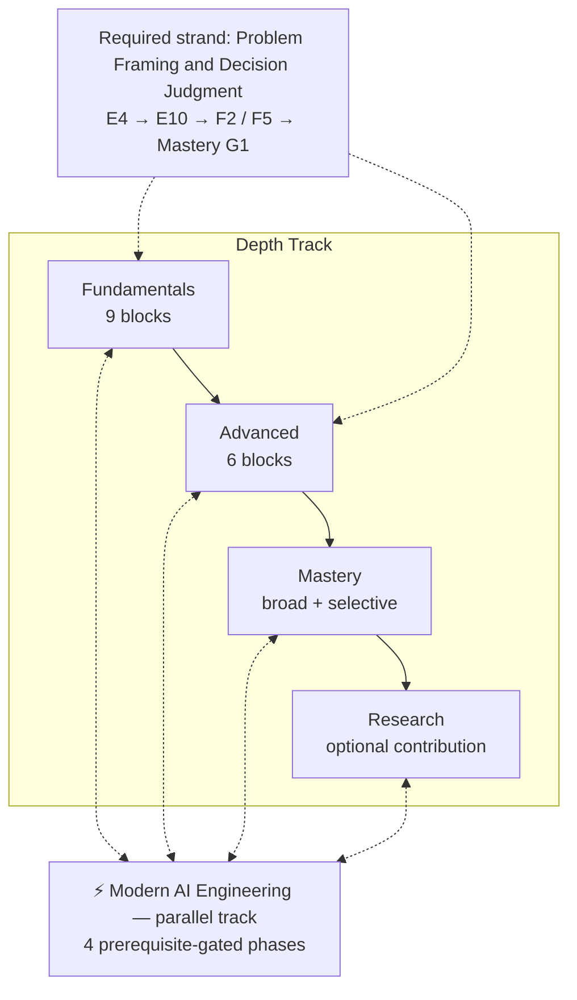
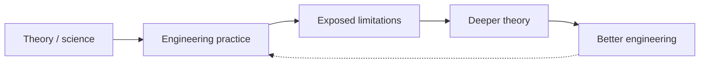
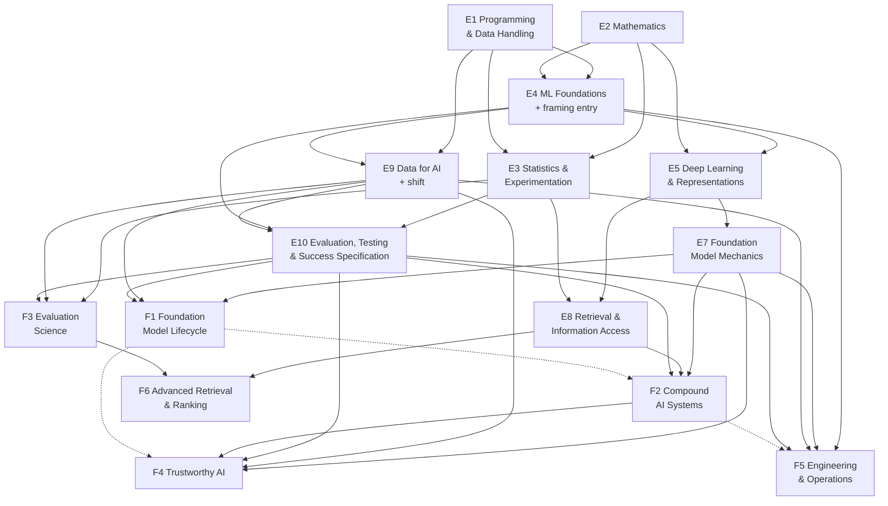

# Curriculum Proposal — Data & Intelligence

| | |
| --- | --- |
| **Status** | **ACCEPTED DESIGN — revision 4 (final).** Used to create Baseline 1. [ROADMAP.md](../ROADMAP.md) is canonical for the curriculum itself |
| **Date** | 2026-09-18 · revision 4 |
| **This revision** | Applies the four Final Curriculum Review corrections (A–D), recorded in [Final Review Corrections](#final-review-corrections). Revision 3 incorporated the eight Important corrections (C1–C8) from the [project-wide independence audit](../research/2026-09-18-project-wide-independence-audit.md), its verified evidence corrections K1–K4, its six Optional findings, a compressed resource portfolio, and the answers to the three remaining narrow resource questions (N1–N3). Traceability is in [Independence Audit Corrections](#independence-audit-corrections) |
| **Supersedes** | Baseline v0, now preserved verbatim at [history/roadmap-baseline-v0.md](../history/roadmap-baseline-v0.md). Baseline 1 is in [ROADMAP.md](../ROADMAP.md) |
| **Evidence** | [landscape](../research/2026-09-17-data-intelligence-landscape.md) · [comparison](../research/2026-09-17-roadmap-comparison.md) · [resource coverage audit](../research/2026-09-18-resource-coverage-audit.md) · [targeted resource research](../research/2026-09-18-targeted-resource-research.md) · [independent capability reconstruction](../research/2026-09-18-independent-capability-reconstruction.md) · [independence audit](../research/2026-09-18-project-wide-independence-audit.md) |

This document proposes the curriculum **architecture** — areas, roles, depths, prerequisites, stage placement, practice, readiness and the resource portfolio. It is not a syllabus: there is no schedule, lesson list or per-chapter assignment plan.

> ⚠️ This document records **why** the curriculum is designed this way.
>
> [ROADMAP.md](../ROADMAP.md) states **what** is learned. Where the two differ, `ROADMAP.md` governs.

## Contents

<b>Click to expand / collapse</b>

- [A. Executive Summary](#a-executive-summary)
- [B. Design Principles Applied](#b-design-principles-applied)
- [C. Proposed Curriculum Architecture](#c-proposed-curriculum-architecture)
- [D. Curriculum Role Map](#d-curriculum-role-map)
- [E. Fundamentals Proposal](#e-fundamentals-proposal)
- [F. Advanced Proposal](#f-advanced-proposal)
- [G. Mastery Proposal](#g-mastery-proposal)
- [H. Research Proposal](#h-research-proposal)
- [I. Modern AI Engineering Parallel Track](#i-modern-ai-engineering-parallel-track)
- [J. Dependency Map](#j-dependency-map)
- [K. Resource Disposition](#k-resource-disposition)
- [L. Practice Architecture](#l-practice-architecture)
- [M. Readiness Architecture](#m-readiness-architecture)
- [N. Baseline v0 Change Map](#n-baseline-v0-change-map)
- [O. Anti-Bloat Audit](#o-anti-bloat-audit)
- [P. Boundary Decisions](#p-boundary-decisions)
- [Completeness Challenge](#completeness-challenge)
- [Independence Audit Corrections](#independence-audit-corrections)
- [Final Review Corrections](#final-review-corrections)
- [Q. Resolved Decisions and Targeted Research Needs](#q-resolved-decisions-and-targeted-research-needs)
- [R. Proposed Next Step](#r-proposed-next-step)

---

## A. Executive Summary

**The proposal.** Twelve **Universal Core** knowledge areas delivered through **nine Fundamentals blocks** and **six Advanced blocks**, crossed by one required strand — **Problem Framing and Decision Judgment** — that runs from the first modelling block to operations. Mastery is selective depth on top of broad competence; Research splits into universal literacy and an optional contribution path; Modern AI Engineering is a parallel track entered in four prerequisite-gated phases.

**What revision 3 changed, and why.** An independent, blind capability reconstruction and an adversarial audit confirmed the **content** of all twelve Universal Core areas, and found problems in **what the curriculum is organized around** and in **depth and gating**. Eight corrections follow.

| # | Correction | Effect |
| --- | --- | --- |
| **C1** | Problem framing and decision judgment become a required strand | The learner decides what to build, whether to use learning at all, what success means and when to ship or roll back — before model building, not first at Mastery |
| **C2** | Distribution shift and monitoring move into Fundamentals | Every learner knows a model's measured quality is conditional on its environment, before reaching operations |
| **C3** | The Foundation Model Lifecycle stops gating other Advanced blocks | Trustworthy AI and Operations no longer require LLM post-training science first |
| **C4** | Compound AI Systems depth is stratified | Design depth for composition decisions; Understand → Implement for context management (Final Review B); Understand for multi-agent, memory and interoperability, with deeper work moved to specialization |
| **C5** | One from-scratch model build instead of two | The transformer is built once, in E7; tokenizer-writing and loading real weights become optional |
| **C6** | The standalone Language Foundations block is retired | Its universal concepts are integrated into E4, E5 and E7; deeper classical NLP stays an Important Extension |
| **C7** | ML-specific testing is specified | Data validation, leakage tests, behavioural and slice checks, evaluation regression and stochastic-system testing |
| **C8** | Evaluation-reliability statistics move into E3 | Non-independence, repeated-trial variance and agreement statistics are taught before they are needed |

**What did not change.** Twelve Universal Core areas; evaluation as a Fundamentals → Advanced spine; statistics before evaluation; retrieval as a discipline before retrieval-augmented systems; classical ML before deep learning with boosted trees as a required baseline; security built on containment rather than detection; the D&I/CS&E boundary; Modern AI Engineering as a parallel track; D1, D3, D6 and D7 as decided. The audit found each of these independently supported.

**Resource portfolio.** The targeted-research portfolio for the six previously unresourced blocks falls from **34 mandatory items (plus 1 conditional) to 21 (plus the same conditional)**; the paid items among them fall from **3 to 1**. Across the whole curriculum, **30 source resources contribute mandatory assigned portions — this is not 30 cover-to-cover resources**. The learner follows assigned chapters, sections, papers and exercises — see [K](#k-resource-disposition).

**Honest weak points.** No adequate teaching resource was found in the completed research for four Compound AI capabilities, for trajectory-evaluation validity, for calibration pedagogy or for problem framing as a practised skill. These are met by **planned learner materials** — baseline implementation work, not open research — listed in [L](#l-practice-architecture). One paid book, Huyen's *AI Engineering*, now underpins sections of five blocks.

[⬆ Back to Contents](#contents)

---

## B. Design Principles Applied

**Capability before subject.** Revision 3 adopts the audit's central method correction. Earlier revisions compressed a **field map** into a core, so activities that are not research fields — problem framing, success specification, release decisions, ML testing — had no way to become required. Each area is now justified by what the learner must be able to **do**, and each depth by what goes wrong without it.

**Removal tests now test depth, not only existence.** The earlier anti-bloat test asked only whether an area was needed. Every test of that form passes. Revision 3 also asks whether the same capability survives at a **lower depth** — which is how E7, F2 and F1 were reduced.

**Knowledge first, resources second.** The decision order is: required capability → independent evidence → knowledge dependency → depth → structure → resource support. No topic entered because a resource teaches it well; several topics are kept although no adequate resource was found.

**Corrected findings are used, not superseded ones.** RL **is** covered by the current ML/DL resource. IR **is** taught as a discipline. The ML/DL book is a **new PyTorch first edition** whose own changelog lists SFT, RLHF, DPO, RAG, vector databases and tool use via MCP in ch 15, and KV caching and speculative decoding in ch 17 (K2 — broader than earlier recorded). The NLP textbook **does** teach late-interaction retrieval (K1). The independent landscape **under-represented** programming, querying and exploratory analysis.

**Uncertainty is preserved.** Where depth could not be verified — chiefly the body text of paid books — the proposal says so rather than resolving it by assumption.

**Convergence over completeness.** Optional findings were adopted only where cheap and capability-backed. No new research problem was opened; minor imperfections are recorded as uncertainties or deferred to maintenance.

[⬆ Back to Contents](#contents)

---

## C. Proposed Curriculum Architecture

> ⚠️ Modern AI Engineering is not a fifth stage, not a synonym for language-model engineering, and not a container for everything recent.
>
> The framing strand is not a thirteenth area. It is required content placed inside existing blocks.

**The twelve Universal Core areas.** An area may occupy more than one stage.

| ID | Universal Core area | Fundamentals block(s) | Advanced block(s) |
| --- | --- | --- | --- |
| **UC1** | Programming and Data Handling | E1 | — |
| **UC2** | Mathematics for Learning Systems | E2 | — |
| **UC3** | Statistics, Inference and Experimentation | E3 | (F3 uses it) |
| **UC4** | Machine Learning Foundations | E4 | — |
| **UC5** | Deep Learning and Representations | E5 | — |
| **UC6** | Language and Foundation Models | E7 | F1 |
| **UC7** | Retrieval and Information Access | E8 | F6 |
| **UC8** | Data for AI | E9 | — |
| **UC9** | Evaluation and Measurement | E10 | F3 |
| **UC10** | Compound AI Systems | — | F2 |
| **UC11** | Trustworthy AI | — | F4 |
| **UC12** | AI Systems Engineering and Operations | (E9, E10 introduce shift and monitoring) | F5 |

> ⚠️ Block IDs are kept stable across revisions so that the audit and research reports remain traceable. **E6 was retired in revision 3**; the Fundamentals blocks are E1–E5 and E7–E10.

**How the landscape map relates to the core.** The nineteen landscape areas were re-cut into twelve learning areas; the mapping is recorded in the [landscape comparison](../research/2026-09-17-roadmap-comparison.md) and earlier revisions. Revision 3 records one lesson from the audit: a core derived from a field map cannot contain capabilities that are not fields. The framing strand, the ML-testing content and the early monitoring content exist to correct exactly that.

[⬆ Back to Contents](#contents)

---

## D. Curriculum Role Map

Roles carry no ranking. Absence from Universal Core is a statement about the *universal path*, not about the field's importance.

**Universal Core — 12 areas**, listed in [C](#c-proposed-curriculum-architecture) and removal-tested in [O](#o-anti-bloat-audit).

**Important Extension — 9 areas.**

| ID | Extension | Why it is an extension | Target depth |
| --- | --- | --- | --- |
| **EX1** | Sequential Decision-Making and Reinforcement Learning | The short RL arc in F1 is core. Value methods, actor-critic, **bandits, exploration and off-policy evaluation** (the product-side slice used in ranking and rollout decisions) are role-dependent | Understand → Implement |
| **EX2** | Generative Modeling Beyond Language | Awareness of diffusion is core (E5); depth is role-dependent | Understand → Implement |
| **EX3** | Classical NLP Structure | Parsing, deeper information extraction, semantic role labelling, coreference, lexicons, classical probabilistic NLP, deeper linguistic analysis. Builds on the universal language concepts now integrated into E4, E5 and E7 | Understand |
| **EX4** | Speech and Audio | Role-dependent; the baseline course is the largest currency risk | Use → Understand |
| **EX5** | Computer Vision Beyond Core Exposure | Detection, segmentation, from-scratch vision models | Use → Implement |
| **EX6** | Time Series and Forecasting | Temporal splits and leakage are core (E9, E10); forecasting methods are role-dependent | Use → Understand |
| **EX7** | Knowledge, Reasoning and Symbolic Methods | Knowledge graphs, planning, constraint solving as tools inside model-driven systems | Awareness → Use |
| **EX8** | Ranking and Recommendation | Ranking metrics are now core (E8). Recommender systems, learned sparse retrieval and feedback loops are role-dependent | Understand |
| **EX9** | Human-AI Interaction and Oversight | Placing a human checkpoint is core (F2); **designing** intervention budgets, uncertainty communication and feedback capture is role-dependent | Understand → Design |

**Specialization — 10 areas.**

| ID | Specialization | Note |
| --- | --- | --- |
| **SP1** | Embodied AI and Robot Learning | |
| **SP2** | AI for Science and Domain Applications | |
| **SP3** | Graph Machine Learning | |
| **SP4** | Document Understanding | Flagged as an upstream retrieval bottleneck in F6 |
| **SP5** | 3D and Video Vision | |
| **SP6** | Multi-Agent Systems and Game Theory | **Receives Design depth for multi-agent orchestration, coordination strategies and agent memory architectures** moved out of F2 by C4 |
| **SP7** | Efficient Architectures and ML Systems Depth | Partly CS&E |
| **SP8** | Privacy-Preserving Machine Learning | |
| **SP9** | Causal Inference Depth | |
| **SP10** | Edge and Constrained Deployment | |

**Research Frontier — 8 areas.**

| ID | Frontier area | Status |
| --- | --- | --- |
| **RF1** | Mechanistic interpretability as assurance | Contested |
| **RF2** | Alignment, scalable oversight, evaluation awareness | Contested |
| **RF3** | Generalization and scaling theory | Active research |
| **RF4** | Continual learning, model editing, verifiable unlearning | Active / contested |
| **RF5** | World models, latent and recursive reasoning | Speculative / active |
| **RF6** | Discrete diffusion language models | Speculative |
| **RF7** | Validity of long-horizon agent evaluation | Active research |
| **RF8** | Neural theorem proving and automated discovery | Active research |

> ⚠️ Do not promote a frontier area into the universal path because it is scientifically exciting.
>
> Do not read "Specialization" as "optional trivia". Several specializations are larger fields than some core areas.

[⬆ Back to Contents](#contents)

---

## E. Fundamentals Proposal

**In this section:** [E1](#e1-programming-and-data-handling) · [E2](#e2-mathematics-for-learning-systems) · [E3](#e3-statistics-inference-and-experimentation) · [E4](#e4-machine-learning-foundations) · [E5](#e5-deep-learning-and-representations) · [E7](#e7-foundation-model-mechanics) · [E8](#e8-retrieval-and-information-access) · [E9](#e9-data-for-ai) · [E10](#e10-evaluation-and-measurement)

**Objective of the stage.** Use concepts correctly, understand core principles, implement the mechanisms where construction is the cheapest route to understanding, **decide what to build and how to judge it**, and build meaningful AI systems. Fundamental does not mean easy.

Resources for each block are listed once, in [K](#k-resource-disposition).

### E1. Programming and Data Handling

| | |
| --- | --- |
| **Purpose** | Obtain, shape, inspect and manipulate data, and write the code everything later depends on |
| **Knowledge** | Python language and idiom; relational querying through joins, aggregation, window functions and CTEs; array and dataframe computing; cleaning, missing data, duplicates, outliers; exploratory analysis and plotting for diagnosis; environment isolation |
| **Prerequisites** | None |
| **Depth** | **Implement** for querying and data manipulation; **Use** for visualization |
| **Practice** | Exercises; then one investigation — report what an unfamiliar dataset contains, what is wrong with it, and what it can and cannot support |
| **Readiness** | *Implement* a non-trivial aggregation and window query; *diagnose* a data-quality problem from evidence; *justify* a cleaning decision and its effect on conclusions |
| **Boundary note** | Schema design, transactions and database maintenance move to CS&E (optional depth here) |

### E2. Mathematics for Learning Systems

| | |
| --- | --- |
| **Purpose** | Read the definitions learning methods are written in, and reason about why optimization behaves as it does |
| **Knowledge** | Linear algebra for representation; multivariate calculus and the chain rule; reverse-mode differentiation semantics; probability through distributions, expectation, variance, conditioning and likelihood; optimization behaviour, learning-rate divergence and conditioning; entropy and cross-entropy |
| **Prerequisites** | None formally |
| **Depth** | **Understand**; **Implement** gradient descent and reverse mode on a toy graph |
| **Practice** | Implementation of the two mechanisms; exercises otherwise. Not a proof course |
| **Readiness** | *Explain* what a gradient says about a loss surface; *implement* gradient descent and *diagnose* divergence; *explain* why maximizing likelihood is a training objective |

### E3. Statistics, Inference and Experimentation

| | |
| --- | --- |
| **Purpose** | Decide whether an observed difference is real, and design comparisons capable of answering the question asked |
| **Knowledge** | Estimation and sampling variability; confidence intervals and the bootstrap; hypothesis testing; **paired model comparison on a shared test set**; power and sample size; **non-independence — clustered items and clustered standard errors**; **variance across repeated trials of a stochastic system, and pass@k versus pass^k reliability**; **agreement statistics (Cohen's and Fleiss' κ, Krippendorff's α) and why raw agreement misleads**; calibration, what a predicted probability means, and selective prediction (deferring when uncertain); the **principle** of online controlled experiments — randomization, randomization units, the overall evaluation criterion, why offline and online results can disagree; confounding |
| **Prerequisites** | E2 (probability); E1 |
| **Depth** | **Understand**; **Use** for standard procedures; **Implement** the bootstrap and a repeated-trial simulation |
| **Practice** | Investigation: decide whether a model difference is real; simulate repeated trials of a stochastic system; compute agreement between two labellers; build and read a reliability diagram |
| **Readiness** | *Explain* what an interval does and does not assert; *compute* a paired interval for a model comparison; *explain* why clustered items overstate certainty if ignored; *evaluate* whether an average success rate predicts reliability; *compute* and *interpret* an agreement coefficient; *diagnose* a confounded comparison |
| **Not required here** | Running and analysing online experiments independently (optional depth); random-effects model fitting (optional depth in F3) |

### E4. Machine Learning Foundations

| | |
| --- | --- |
| **Purpose** | Frame a problem correctly, establish an honest baseline, and build models whose behaviour the learner can explain |
| **Knowledge** | **Framing (strand entry):** when to use machine learning at all; translating a goal into a prediction, ranking, generation or decision problem; the unit of prediction and what the output will drive; business versus ML objectives; how common text tasks are formulated as classification, extraction, ranking or generation; non-learned baselines. **Modelling:** supervised framing; linear and logistic models; regularization; trees and ensembles, including why gradient boosting remains a robust tabular default; dimensionality reduction and clustering; bias–variance and learning curves; cross-validation and leakage-safe splitting; metrics, confusion matrices, ROC and PR; error analysis |
| **Prerequisites** | E1, E2; E3 concurrently |
| **Depth** | **Implement** for modelling; **Implement** for framing (written framing and baseline for the learner's own system) |
| **Practice** | Framing exercise on authored cases, including one where learning is the wrong tool; then an end-to-end project that begins with a written framing and a non-learned baseline |
| **Readiness** | *Decide* whether learning is appropriate for a stated goal and *justify* it; *frame* the problem and the unit of prediction; *select* and *justify* a baseline; *implement* a supervised pipeline with leakage-safe validation; *diagnose* overfitting and imbalance from evidence |

### E5. Deep Learning and Representations

| | |
| --- | --- |
| **Purpose** | Explain what deep networks compute, why representations transfer, and why training succeeds or fails |
| **Knowledge** | Training mechanics — initialization, normalization, regularization, optimizers, stability; convolutional and recurrent lineage and what each assumes; attention and the transformer block **(Understand here; built once in E7)**; embeddings and representation transfer; **text as structured, sequential data and how text is represented** (moved from the retired E6); self-supervised pretraining as an idea; **one non-language modality — vision — through transfer learning**; awareness of diffusion as a second generative family |
| **Prerequisites** | E2, E4 |
| **Depth** | **Implement** a small network and a training loop; **Understand** attention and the transformer block; **Use** vision via transfer learning; **Awareness** for diffusion |
| **Practice** | Implement and train a small network; apply transfer learning to an image task |
| **Readiness** | *Implement* a training loop and *diagnose* non-convergence; *explain* what attention computes and why it scales as it does; *explain* why an embedding supports similarity search and what it discards; *use* transfer learning on a non-language task and *justify* it |

### E7. Foundation Model Mechanics

| | |
| --- | --- |
| **Purpose** | Understand a language model well enough that decisions about using, conditioning and adapting it rest on mechanism rather than analogy |
| **Knowledge** | **Tokenization and its consequences** for cost, quality and multilingual behaviour, and the linguistic units models actually operate on (moved from E6); sequence and language-modelling formulation; positional information; the attention stack end to end; the pretraining objective and loop; decoding and sampling; context limits; what fine-tuning changes; **the adaptation decision — when to prompt, retrieve or tune** |
| **Prerequisites** | E5 |
| **Depth** | **Understand** overall; **Implement** one small decoder-only transformer language model end to end — the curriculum's single from-scratch model build |
| **Practice** | The single build (library tokenizer permitted); a tokenization exercise comparing several tokenizations of the same text; decoding experiments |
| **Readiness** | *Implement* and train a small transformer language model; *explain* how tokenization affects cost and quality across languages; *diagnose* a generation pathology from decoding settings; *justify* a prompt-versus-retrieve-versus-tune decision for a stated problem |
| **Optional depth** | Hand-written BPE tokenizer; loading real pretrained weights; modern architectural variants |

### E8. Retrieval and Information Access

| | |
| --- | --- |
| **Purpose** | Retrieve the right information, and know when retrieval is the reason a system is wrong |
| **Knowledge** | The retrieval problem; lexical retrieval and why it stays competitive; dense retrieval; late-interaction retrieval (conceptual); hybrid retrieval and two-stage reranking; **IR evaluation including ranking metrics (MAP, nDCG, MRR)**; approximate nearest-neighbour indexing and the recall–latency trade-off; chunking and document preparation |
| **Prerequisites** | E5 (embeddings); E3 (statistical and evaluation foundation). Relevant E10 concepts may be studied concurrently or cross-referenced; E10 is **not** a prerequisite (Final Review A) |
| **Depth** | **Understand**; **Implement** a hybrid retriever and its evaluation |
| **Practice** | Build a retriever, measure it with ranking metrics, and show that changing retrieval changes end-to-end quality |
| **Readiness** | *Explain* why retrieval quality bounds answer quality; *compare* lexical and dense retrieval on one corpus; *evaluate* a ranker with appropriate metrics; *explain* the recall–latency trade-off of an ANN index; *diagnose* whether a wrong answer originated in retrieval or generation |

### E9. Data for AI

| | |
| --- | --- |
| **Purpose** | Construct data whose quality can be defended, trace behaviour back to it, and recognize when the data-generating environment has changed |
| **Knowledge** | Sampling and its biases; labelling and annotation quality; label error and its effect on rankings; class imbalance; feature engineering and temporal splitting; **data leakage** as a family of failures; lineage and dataset documentation; provenance and licensing; synthetic data and its risks; **distribution shift as a data phenomenon — covariate, label and concept shift; train–serve skew; changing populations; feedback loops in which a model shapes its future data** |
| **Prerequisites** | E1, E4 |
| **Depth** | **Understand**; **Implement** leakage-safe construction, data validation checks and a basic shift check |
| **Practice** | Build an evaluation set, attack it, and report what is wrong; run a shift check between a training sample and a later sample |
| **Readiness** | *Implement* a leakage-safe temporal split; *evaluate* a dataset's fitness for a stated claim; *diagnose* train–serve skew; *explain* how a feedback loop can corrupt future training data; *detect* a distribution shift between two samples |

### E10. Evaluation and Measurement

| | |
| --- | --- |
| **Purpose** | Make claims about system quality that survive scrutiny, specify what success means, and keep those claims true after release |
| **Knowledge** | **Success specification (strand):** acceptance criteria; asymmetric error costs; the population on which success must hold; the difference between an offline metric and the decision it informs; what evidence would justify deployment or rollback. **Measurement:** metric selection and what each rewards and distorts; validation protocols; baselines; error analysis and failure taxonomies; **slice-based and disaggregated evaluation**; test-set hygiene and contamination; reporting variability. **ML-specific testing (C7):** data validation tests; leakage tests; behavioural checks — perturbation, invariance and directional expectations — where justified; evaluation regression tests; testing stochastic systems with repeated trials and tolerances; reproducibility — seeds, environment and version recording, experiment tracking. **Why static offline evaluation is insufficient (C2):** monitoring signals, silent degradation, outcome monitoring, upstream model and API changes as shift |
| **Prerequisites** | E3, E4, E9 |
| **Depth** | **Implement**; success specification at **Implement** for the learner's own system |
| **Practice** | Write a success specification with costed errors for the evolving system; build its evaluation suite with slice analysis and ML-specific tests; define the monitoring signals that would reveal degradation |
| **Readiness** | *Specify* success with asymmetric costs for a stated decision; *design* and *implement* an evaluation for it; *implement* data-validation, leakage and regression tests; *explain* why the offline result may not hold after release; *state* what evidence would justify deployment and what would trigger rollback |

[⬆ Back to Contents](#contents)

---

## F. Advanced Proposal

**In this section:** [F1](#f1-foundation-model-lifecycle) · [F2](#f2-compound-ai-systems) · [F3](#f3-evaluation-science) · [F4](#f4-trustworthy-ai) · [F5](#f5-ai-systems-engineering-and-operations) · [F6](#f6-advanced-retrieval-and-ranking)

**Objective of the stage.** Modern methods, alternatives, trade-offs, limitations and failure modes, with concepts increasingly combined into complete systems — and decisions about those systems justified on evidence.

### F1. Foundation Model Lifecycle

| | |
| --- | --- |
| **Purpose** | Reason about how a foundation model came to behave as it does, and what an adaptation will change |
| **Knowledge** | Pretraining data as a quality lever; scaling relationships and their contested interpretation; **a short RL arc (D4)** — Markov decision framing, policy, reward, credit assignment, policy gradients, why a KL-regularized objective keeps a tuned model near its base, and **awareness of bandits and exploration**; post-training — supervised fine-tuning, preference optimization, RL from verifiable rewards (as contested, fast-moving practice); distillation; test-time compute and why chain-of-thought is not a reliable explanation; parameter-efficient adaptation and model merging; fine-tuning side effects including forgetting and emergent misalignment |
| **Prerequisites** | E7, E9, E10 |
| **Depth** | **Understand**; **Implement** one adaptation (low-rank adaptation of the model built in E7) |
| **Gating** | **F1 is not a hard prerequisite of any other Advanced block (C3).** It is recommended before adaptation-heavy F2 practice and before F4's alignment strand |
| **Practice** | Adapt a model and investigate what *else* changed |
| **Readiness** | *Explain* why post-training algorithms are RL-derived and what they assume; *implement* one adaptation and *diagnose* a regression it introduced; *evaluate* a scaling or capability claim against its evidence, treating contested claims as contested |

### F2. Compound AI Systems

| | |
| --- | --- |
| **Purpose** | Build systems that compose models with retrieval, tools and verification, choosing the least autonomy that solves the problem |
| **Prerequisites** | E7, E8, E10. F1 is **recommended, not required** |
| **Practice** | Integrated build on the evolving system; an authored from-scratch agent-loop exercise; a fault-injection lab for failure decomposition; an investigation comparing two architectures on evidence |
| **Readiness** | *Design* a compound system and *justify* each autonomy decision; *implement* a tool interface a model uses correctly; *implement* a context-management strategy and *measure* its effect; *diagnose* whether a failure originated in retrieval, context, tool use or generation; *evaluate* a trajectory across repeated trials; *justify* rejecting a multi-agent design; *decide* whether the system is ready to release |

**Stratified depth (C4).** Each topic kept at Design had to answer: *what important engineering decision could the learner not make without Design-level knowledge of this topic?*

| Topic | Universal depth | Decision that needs this depth | Deeper home |
| --- | --- | --- | --- |
| Workflow composition and least autonomy | **Design** | Choosing between a fixed workflow, a model-driven loop, or no model at all | — |
| Retrieval-augmented composition on E8 fundamentals | **Design** | Deciding how retrieval, context assembly and generation combine, and where to spend effort when answers are wrong | F6 |
| Context budget and management | **Understand → Implement** (Final Review B) | Universal need: understand finite, non-uniform context; measure its effects; choose what enters it; use retrieval, selection and compaction; implement a competent strategy; diagnose context failures. Sophisticated context architecture is not a universal Design decision | Modern track; G4 selective depth; SP6 |
| Structured generation and constrained decoding | **Design** for the output contract; Understand for the mechanism | Defining the contract between model output and downstream code | — |
| Tool-interface design and least privilege | **Design** | Deciding what a tool exposes and what authority it carries | F4 security architecture |
| Verification and generate-and-verify | **Design** | Deciding which outputs must be checked by an external verifier before they act | — |
| Failure decomposition across components | **Design** | Deciding which component to change when the system is wrong | Mastery G2 |
| Release judgment for compound systems (strand) | **Design** | Deciding whether evidence supports shipping a non-deterministic system | F5 |
| Human checkpoints and approval gates | Understand | Placing a checkpoint needs understanding; designing intervention budgets does not arise universally | EX9 |
| Trajectory evaluation | Understand + Use | Using repeated-trial reliability is universal; its validity is an open problem | F3, RF7 |
| Multi-agent orchestration, and the evidence that it is not a default | Understand | The universal decision is to reject it without evidence, which Understand supports | SP6 |
| Agent memory architectures | Understand | No universal decision requires designing one | SP6, Modern track |
| Tool and agent interoperability standards | Understand (concept) | Specifications change; the concept suffices | Modern track |

### F3. Evaluation Science

| | |
| --- | --- |
| **Purpose** | Treat evaluation as an object of study |
| **Knowledge** | Construct validity; benchmark validity; contamination and its effect on model selection; model-based judges validated against human labels; reliability versus validity; **variance-component reasoning** — which facet (items, raters, seeds, prompts) dominates score variance and where more samples should go; human evaluation and annotation operations; regression suites and failure taxonomies; capability evaluation; trajectory evaluation and why its validity is unresolved; saturation |
| **Prerequisites** | E3, E9, E10 |
| **Depth** | **Design**; variance-component reasoning at **Understand** through simulation built on the E3 bootstrap |
| **Not required** | Fitting generalizability-theory or random-effects models (optional depth, G4 or an evaluation specialization) |
| **Practice** | Build a durable evaluation suite for the evolving system; validate a judge against human labels; run a variance-component simulation |
| **Readiness** | *Design* an evaluation suite and *justify* its construct validity; *evaluate* a judge against human labels before relying on it; *diagnose* contamination; *explain* why a saturated benchmark stops being informative; *decide* where additional evaluation samples buy the most reliability |

### F4. Trustworthy AI

| | |
| --- | --- |
| **Purpose** | Recognize and reduce the ways an AI system harms, fails adversarially, or misleads |
| **Knowledge** | **Security (D7, AI-specific):** instruction/data confusion, direct and indirect prompt injection, untrusted content, unsafe tool use, poisoning, extraction, adversarial examples, containment and capability limitation, architectural separation, AI-specific threat modeling, adaptive-attack evaluation. **Beyond security:** robustness and shift; privacy and memorization; fairness definitions and their incompatibility; interpretability and what it does not establish; documentation and provenance; regulatory obligations that produce engineering artifacts. **Alignment strand:** reward hacking and fine-tuning side effects (builds on F1) |
| **Prerequisites** | E7, E9, E10; F2's composition core for the security-architecture strand. F1 is **recommended only for the alignment strand** (C3) |
| **Depth** | **Design** for security architecture; **Understand** otherwise; **Awareness** for regulation |
| **Practice** | Threat-model the evolving system; run one attack-and-defense lab; redesign for containment |
| **Readiness** | *Explain* why a model reading untrusted content is an attack surface; *design* containment rather than a detection filter; *evaluate* a defense against adaptive attack; *evaluate* a fairness claim and *justify* the metric |

### F5. AI Systems Engineering and Operations

| | |
| --- | --- |
| **Purpose** | Operate learned systems at acceptable cost, latency and reliability; detect degradation; decide release and rollback |
| **Knowledge** | Serving concepts and cost — KV cache, batching, prefill versus decode, speculative decoding, quantization trade-offs; latency and throughput; token economics and caching; routing and cascades; deployment patterns; **monitoring design and response** building on E9/E10; ML technical debt; **lineage and versioning of data, models, prompts and configuration**; monitoring–evaluation continuity; testing in production — shadow, canary, staged rollout; **release and rollback judgment (strand, Design)**; continual learning and data flywheels |
| **Prerequisites** | E4, E7, E9, E10. F2 is **recommended** for operating compound systems. **F1 is not a prerequisite** (C3) |
| **Depth** | **Understand**; **Design** for monitoring response, cost reasoning and release/rollback decisions |
| **Practice** | Deploy the evolving system; size its cost and latency; define rollback triggers and exercise one rollback |
| **Readiness** | *Explain* what determines serving memory and latency; *evaluate* a cost-versus-quality trade-off quantitatively; *design* monitoring that would detect a realistic silent failure; *decide* go/no-go and rollback from imperfect evidence and *explain* the decision to a non-specialist |

### F6. Advanced Retrieval and Ranking

| | |
| --- | --- |
| **Purpose** | Move from "retrieval works" to controlling retrieval quality |
| **Knowledge** | Reranking architectures; learned sparse retrieval; late interaction beyond the concept; query understanding and rewriting; iterative and agentic search loops; system-level retrieval evaluation; when graph-structured retrieval helps; document parsing as an upstream bottleneck |
| **Prerequisites** | E8, F3 |
| **Depth** | **Understand**; **Implement** reranking |
| **Readiness** | *Compare* retrieval architectures on evidence; *diagnose* the stage responsible for a retrieval failure; *justify* rejecting a fashionable upgrade on measurement |

[⬆ Back to Contents](#contents)

---

## G. Mastery Proposal

**Mastery is not more content.** It is where the learner's judgment, rather than a resource, decides what to do: three universal capabilities plus selective depth.

**G1. Design judgment.** Given an ambiguous problem, determine what system it needs, the least sufficient architecture, the trade-offs, and what evidence would change the decision. This **deepens** the framing strand; it is no longer the learner's first encounter with framing.

**G2. Diagnostic capability.** Isolate the responsible layer — data, model, retrieval, context, tooling, evaluation or operations — in an unfamiliar failure.

**G3. Experimental capability.** Design experiments that could falsify one's own hypothesis; choose baselines and ablations; report uncertainty; interpret without overclaiming.

**G4. Selective depth.** Two or three areas, learner-chosen from the Extensions, Specializations or deeper core work, at **Design** or **Research** depth. Generalizability-theory estimation, multi-agent design and hand-built tokenizers are examples of optional depth that belongs here.

> ⚠️ Mastery does not require equal expertise across every AI subfield.

**Readiness for Mastery.** *Diagnose* an unfamiliar failure in a system you did not build; *design* for an ambiguous requirement and *justify* the rejected alternatives; *design* an experiment that could disprove your own position; *compare* two credible approaches where the literature disagrees and state what evidence would settle it.

[⬆ Back to Contents](#contents)

---

## H. Research Proposal

**H1. Research literacy — universal, at Advanced.** Locate the primary source behind a claim; distinguish established knowledge, current practice, active research and speculation; check for baselines, ablations and variance; recognize contamination, leakage and selective reporting; hold contested questions as contested.

**H2. Research contribution — optional.** Literature review, gap identification, hypotheses, experimental design, baselines, ablations, reproducibility, statistical reasoning, interpretation, scientific writing and peer review.

**Prerequisites.** H1: E3, E10, F3. H2: H1, G3 and specialization depth.

**Readiness.** H1: *evaluate* a paper's claim against its own evidence. H2: *design* and *justify* a study answering an open question, and *communicate* it so others can check it.

> ⚠️ Research depth is not required of every learner.

[⬆ Back to Contents](#contents)

---

## I. Modern AI Engineering Parallel Track

**In this section:** [Entry Phases](#entry-phases) · [Durable Concepts Versus Current Practice](#durable-concepts-versus-current-practice)

The parallel track answers: *what should a capable AI engineer understand and be able to build today?* Something may be worth practising now without deserving promotion into durable knowledge.

### Entry Phases

Gated by prerequisites, not calendar.

| Phase | Opens after | Content | Burden |
| --- | --- | --- | --- |
| **Phase 0 — Orientation** | Nothing | Awareness of what contemporary systems do | Minimal |
| **Phase 1 — First contact** | E1, E4, partial E5 | Model interfaces; prompting as an empirical activity; structured generation; embeddings; simple semantic search; tool calling | Light |
| **Phase 2 — Grounded systems** | E5, E7, E8, E10 | Retrieval-augmented systems on retrieval fundamentals; an evaluation harness; error-analysis workflow; basic observability | Substantial |
| **Phase 3 — Compound systems** | **F2 composition core** (no longer F1) | Current agent and workflow patterns; context-management practice; memory and multi-agent patterns; interoperability specifications; security practice; cost and latency practice; production operation. **Adaptation practice opens after F1** | Full parallel track |

**Early entry is deliberate (D6).** Phase 1 may begin before E3 completes. The relationship is iterative:

**Early access is not early mastery.** A learner may prototype in Phase 1 without statistics; they may not claim one prompt beats another, tune a pipeline on measurements, or ship an evaluation harness until E3 and E10 exist.

> ⚠️ Do not weaken statistical or evaluation prerequisites to move the track earlier.
>
> The concession is *when practice starts*, never *what counts as evidence*.

### Durable Concepts Versus Current Practice

| Capability | Durable concept (→ permanent curriculum) | Current practice (→ track only) |
| --- | --- | --- |
| System architecture | Least autonomy; workflow versus agent | Named agent patterns; quantified multi-agent trade-off studies |
| Context management | Finite, non-uniform attention budget; just-in-time retrieval; compaction | The "context engineering" label; memory-file conventions |
| Structured generation | Grammar- and schema-constrained decoding | Provider strict modes; engine support |
| Tool use | Interface design for model callers; least privilege | Tool definitions as context cost |
| Interoperability | Standard agent–tool interfaces as a concept | Specific protocol primitives and deprecations |
| Retrieval | Lexical plus dense retrieval, reranking, ranking metrics | Agentic search loops; vector-index products |
| Evaluation | Error analysis, human-validated judges, regression suites, repeated-trial reliability | Vendor agent-evaluation vocabulary and platforms |
| Inference efficiency | KV cache, batching, speculative decoding, quantization principle | Format-specific quantization guidance; engine settings |
| Cost | Token economics, caching layout, routing and cascades | Provider pricing and cache terms |
| Adaptation | Prompt vs retrieve vs tune; evaluation-gated flywheel | Tuning recipes and services |
| Security | Least privilege, data-flow separation, adaptive-attack evaluation | Risk lists, specific attack numbers, guardrail products |

**Promotion rule.** A track item enters the permanent curriculum only through [AGENTS.md — Promotion Into the Permanent Curriculum](../AGENTS.md#promotion-into-the-permanent-curriculum).

> ⚠️ The track is organized by capability, never by vendor, product, framework or model name.

[⬆ Back to Contents](#contents)

---

## J. Dependency Map

Solid arrows are hard prerequisites; dotted arrows are recommended orderings only.

**Framing strand path.** E4 (decide whether to learn; frame; baseline) → E10 (specify success; evidence for deployment and rollback) → F2 (release judgment for compound systems) → F5 (release and rollback decisions in operation) → G1 (design judgment at Mastery).

**Ordering changes from Baseline v0.** Eleven, each tied to evidence.

| # | Change | Dependency resolved |
| --- | --- | --- |
| 1 | Statistics before machine learning | The ML/DL book names probability and statistics as prerequisites and supplies neither |
| 2 | Evaluation in Fundamentals, not the parallel track | Production and evaluation material assumes evaluation literacy |
| 3 | Retrieval before retrieval-augmented systems | Applied systems build on IR fundamentals |
| 4 | Data for AI before the systems that consume data | The strongest data chapters sat after everything that needs them |
| 5 | Speech and audio after transformers (EX4) | The audio course assumes transformer familiarity |
| 6 | The RL arc taught inside F1 | Post-training algorithms are RL-derived |
| 7 | Operations after machine learning | The operations book assumes working ML knowledge |
| 8 | No deployment knowledge assumed from the ML/DL book | Its deployment-at-scale chapter was only partially merged |
| 9 | **Framing before model building** (E4 opens with it) | A learner must decide what to build before building (C1) |
| 10 | **Shift and monitoring concepts in Fundamentals** (E9, E10) | Silent degradation is not an operations-only concern (C2) |
| 11 | **F1 no longer precedes F4 and F5; F1 → F2 is soft** | Monitoring, cost and most security do not depend on post-training science (C3) |

[⬆ Back to Contents](#contents)

---

## K. Resource Disposition

**Policy (D1).** The curriculum sets the requirement; a resource is used only so far as it serves it. **Resource boundaries do not determine curriculum boundaries.** Each mandatory resource has **one home per portion**; other blocks cross-reference it and do not re-read it. Chapter-level assignment beyond the portions named here is deferred to Baseline 1.

**The three narrow questions (N1–N3), settled in this revision.**

| # | Question | Outcome | Evidence |
| --- | --- | --- | --- |
| **N1** | Smallest adequate support for F1 | **Existing resources suffice; no new mandatory resource.** *AI Engineering* ch 2 (training data, model size, post-training, test-time compute) and ch 7 (model merging, finetuning tactics); the E7 book's low-rank-adaptation appendix as the one implemented adaptation; the ML/DL book's RL chapter in selected sections for the RL arc. Authored notes cover KL-regularized objectives, bandit awareness, RL from verifiable rewards and contested claims. The ML/DL book's ch 15 (SFT, RLHF, DPO — K2) becomes optional depth | Official *AI Engineering* table of contents (Direct, headings); K2 confirmed by the audit |
| **N2** | Does *AI Engineering* teach ANN index choice? | **Still unverifiable at subsection depth.** The author's official chapter summary confirms ch 6 discusses vector search and "many vector search algorithms"; the author's own resource list sends readers to an external vector-index series for depth. The existing conditional source is **retained** | `chiphuyen/aie-book` chapter summaries and resources list (Direct) |
| **N3** | Is the free portion of Kohavi et al. enough for the universal experimentation capability? | **Yes, together with Data 8 chs 2 and 12.** The free ch 1 covers terminology, randomization, the overall evaluation criterion, the hierarchy of evidence, the necessary ingredients and worked examples; it has no statistics, A/A tests or sample-ratio mismatch. Those are experimentation *practice* — now optional depth | Free ch 1 PDF from experimentguide.com, retrieved and read (Direct) |

**Evidence corrections applied (K1–K4).**

| # | Correction | Status per audit | Effect on this proposal |
| --- | --- | --- | --- |
| **K1** | NLP textbook ch 11 teaches late-interaction retrieval; reranking is one conceptual paragraph; nDCG/MRR absent; ANN mentioned only | Confirmed | E8 lists late interaction (conceptual); ranking metrics resourced separately; ANN kept conditional |
| **K2** | ML/DL book ch 15 covers SFT, RLHF, DPO, RAG, vector databases and tool use via MCP; ch 17 covers KV caching and speculative decoding | Confirmed, broader than recorded | "Every LLM-era resource predates the agent wave" is withdrawn; ch 15 is optional depth for F1 and F2; ch 17 is an optional bridge to F5 |
| **K3** | ML/DL book has some launch-and-monitor content in ch 2 but no dedicated deployment chapter | Partial | No reliance on it for deployment |
| **K4** | *Hands-On LLMs* ch 12 has a conceptual generative-evaluation section | Confirmed (Medium) | Recorded; the book is optional |

**Final mandatory portfolio.**

| Resource | Curriculum home | Role | Required portion | Why retained |
| --- | --- | --- | --- | --- |
| *The Python Tutorial* | E1 | Primary | Language tour | The only Python language source |
| *Practical SQL* | E1 | Selected Sections | Querying and in-database cleaning chapters | Implement-depth querying; design chapters are optional (CS&E boundary) |
| PostgreSQL Exercises | E1 | Practice | Query exercises | Drilled querying practice |
| *Python for Data Analysis* | E1 | Primary | Array, dataframe, cleaning and plotting chapters | Implement-depth data manipulation |
| *Dive into Deep Learning* | E2 | Selected Sections | Preliminaries, gradient descent, optimization, maximum likelihood, information theory | Optimization behaviour and likelihood → cross-entropy with runnable code |
| Piech, *Probability for Computer Scientists* | E2 | Supplement | Probability through MLE; stop before sampling and bootstrap | Distributions and MLE — the audit's probability gap |
| *Hands-On ML with Scikit-Learn and PyTorch* | E2, E4, E5, F1 | Selected Sections | App A (reverse-mode autodiff) → E2; chs 1–8 → E4; chs 9–16 → E5 at Understand; ch 19 selected (MDP, policy gradients) → F1 | Classical ML, deep learning and the E2 reverse-mode implementation |
| *Computational and Inferential Thinking* (Data 8) | E3 | Primary | Chs 2, 10–13, 14.4–14.6 | Computational inference and the bootstrap, implemented |
| Kohavi, Tang, Xu — **free ch 1 only** | E3 | Selected Sections | Ch 1 | Online-experiment principle, OEC, randomization units |
| Miller, "Adding Error Bars to Evals" | E3 (→ F3) | Selected Sections | Whole paper | Paired comparison, power, clustered errors, repeated sampling |
| scikit-learn User Guide §1.16 | E3 | Selected Sections | Calibration section | Calibration in practice; an authored exercise adds ECE pitfalls |
| *AI Measurement Science* (Truong, Koyejo) | E3, F3 | Primary (F3) | Agreement-coefficient sections of ch 5 → E3; ch 1, ch 5 reliability concepts, ch 11 selected, ch 13 → F3 | Construct validity, reliability vs validity, agreement statistics |
| *Designing Machine Learning Systems* | E4, E9, E10, F5 | Selected Sections | Chs 1–2 (when to use ML; objectives; framing) → E4; chs 4–5 → E9; ch 6 (baselines, evaluation methods, experiment tracking) → E10; ch 8 shift sections → E9/E10, monitoring sections → F5; chs 7, 9, 10 selected → F5 | Framing, data, shift, ML-specific evaluation methods, monitoring, deployment — one tool-agnostic source |
| Breck et al., "The ML Test Score" | E10 | Selected Sections | Whole paper | The only compact taxonomy of data, model, infrastructure and monitoring tests (C7) |
| *Speech and Language Processing* | E5, E7, E8, E10, F4 | Selected Sections | Ch 2 (tokens) → E7; ch 5 (embeddings) → E5; ch 11 → E8; §1.9 → E10; §1.10, bias sections, ch 10 → F4 | IR anchor; evaluation validity; tokenization consequences; harms |
| *Build a Large Language Model (From Scratch)* | E7, F1 | Primary | Chs 2–5 → E7 (the single build); ch 7 fine-tuning concept → E7; App E (LoRA) → F1 | The one from-scratch build, and the one implemented adaptation on the learner's own model |
| Huyen, *AI Engineering* | E4, E7, F1, F2, F5 | Primary (Selected Sections) | Ch 1 Planning AI Applications (pp. 28–35) → E4; ch 7 overview and When to Finetune (pp. 307–319) → E7; ch 2 training data, model size, post-training, test-time compute and ch 7 merging and tactics → F1; ch 2 Structured Outputs, ch 5 Context Length, ch 6 RAG architecture, retrieval optimization, Agents and Memory, ch 10 steps 1, 2, 5 and orchestration → F2; ch 9 and ch 10 router, caches, monitoring → F5 | The one framework-free source spanning FM-era framing, adaptation decisions, composition and serving |
| Liu et al., "Lost in the Middle" | F2 | Required paper | Whole paper | Context is non-uniform; more context can reduce quality |
| Kambhampati et al., LLM-Modulo | F2 | Required paper | Whole paper | Generate-and-verify with external verifiers |
| Kapoor et al., "AI Agents That Matter" | F2 (→ F3) | Required paper | Whole paper | Cost-controlled evaluation; simple baselines are competitive — the evidence for least autonomy |
| Hardt, *The Emerging Science of ML Benchmarks* | F3 | Selected Sections | Chs 11, 14 | Contamination, judge bias, rankings as the reliable product |
| Husain and Shankar, evals FAQ | F3 | Primary (application) | Error-analysis, evaluation-design, annotation sections | Error analysis into failure taxonomies; judge-validation procedure |
| Zhu et al., Agentic Benchmark Checklist | F3 (→ F2) | Required paper | Whole paper | Task versus outcome validity for agent evaluation |
| Beurer-Kellner et al., design patterns for prompt-injection security | F4 (→ F2) | Primary | Whole paper; three or four case studies | Containment architecture and AI threat modeling |
| NIST AI 100-2 E2025 | F4 | Selected Sections | Attack-family and generative-AI sections | Poisoning, extraction and evasion at mechanism level |
| Nasr, Carlini et al., "The Attacker Moves Second" | F4 | Required paper | Whole paper | Why detection-based defenses fail under adaptive attack |
| Greshake et al., indirect prompt injection | F4 | Required paper | Whole paper | Why untrusted content is an attack surface |
| AgentDojo | F4 | Practice | One lab: baseline, defense, adaptive attack | Measuring attack success and utility together |
| *How To Scale Your Model*, inference chapter | F5 | Selected Sections | §§1, 2, 4 and problems 1–3 | Serving arithmetic with worked problems |
| Moslem and Kelleher, routing and cascading survey | F5 | Selected Sections | §§1–3 and cascades | Routing and cascades — no other source found |

**Conditional (N2).** *Natural Language Processing in Action* §10.3.2–10.3.6 → E8, for ANN index choice and vector quantization. Drop it if *AI Engineering*'s Retrieval Algorithms section is later verified to teach index choice.

**Optional Depth.** *Mathematics for Machine Learning*; micrograd; Distill "Why Momentum Really Works"; Kohavi et al. paid chapters (experimentation practice); Guo et al. 2017; OpenIntro IMS paired-means; Card et al.; Facure chs 1–3; *Practical SQL* design chapters; ML/DL book ch 15 (SFT, RLHF, DPO, RAG, MCP) and ch 17; the E7 book's repository bonus material, pinned to a commit; *Build a Reasoning Model (From Scratch)* (unevaluated); *Hands-On Large Language Models* (code-level RAG, DPO, embedding training); CaMeL; Kolter–Madry tutorial; Carlini et al. "Stealing"; Carlini et al. 2019; Bean et al.; van der Lee et al.; Wallach et al.; EvalGen; Hardt chs 3, 5, 12; CS336 lecture 10; Databricks inference guide; RouteLLM; *AI Engineering* ch 8 data synthesis.

**Reference.** NLP textbook ch 8 (post-training), §4.11 (paired bootstrap); τ-bench; Artstein and Poesio; *Introduction to Information Retrieval* ch 8 (ranking metrics; Indirect); OWASP LLM and Agentic lists; MITRE ATLAS; *LLM Engineer's Handbook* (judge-based evaluation and an end-to-end pipeline; no statistics); Roitman; Stanford CS329Z (assignment templates).

**Modern Practice.** Anthropic "Building effective agents", "Effective context engineering", "Writing effective tools", "Demystifying evals for AI agents"; Kim et al. on scaling agent systems; Feng et al. levels of autonomy; Chroma "Context Rot"; Tam et al.; MAST; CoALA and agent-memory surveys; interoperability specifications; Kurtic et al. quantization study; Souly et al. poisoning; vendor agent-security guidance; provider prompt-caching documentation; Modular LLM Inference Handbook; the vector-index series cited by *AI Engineering*'s author.

**Specialization.** Hugging Face Audio Course (EX4); *Natural Language Processing in Action* ch 11 (EX7); ML/DL book ch 18 (EX2) and full ch 19 (EX1); NLP textbook Volume III (EX3) and speech chapters (EX4).

**Rejected or removed from the path.** *Natural Language Processing in Action* as a whole; Dibia, *Designing Multi-Agent Systems* (unverified; replaced by an authored exercise); the micrograd lecture as mandatory (duplicated by the ML/DL book's Appendix A).

**Learner burden.**

| Measure | Value |
| --- | --- |
| Source resources contributing mandatory assigned portions | **30** — **not** 30 cover-to-cover resources |
| — books and textbooks (assigned chapters or sections only) | 13 |
| — papers (each read whole; most are short) | 10 |
| — guides, tutorials, documentation, courses and practice sites | 7 |
| Assigned portions (resource × curriculum home) | About 46; see [ROADMAP.md](../ROADMAP.md) Resource Map |
| Paid mandatory resources | 5 (four baseline books plus *AI Engineering*) |
| Targeted-research blocks (E2, E3, F2, F3, F4 security, F5 serving) | **34 mandatory + 1 conditional → 21 mandatory + 1 conditional** |
| Paid items among them | 3 → 1 |
| New mandatory item not in the targeted set | 1 (the ML Test Score, from C7) |
| *AI Engineering* assigned | About 175 of roughly 500 pages, across five blocks |
| Estimates carried from the research | E2 about 25–40 h; E3 Data 8 about 15–20 h plus about 3–5 h for the AC1 additions; F4 about 110 pages plus one lab (audit estimate). Other blocks are not defensibly estimable yet |

[⬆ Back to Contents](#contents)

---

## L. Practice Architecture

| Form | Proves | Where |
| --- | --- | --- |
| **Exercise** | A focused concept | E1, E2, E3, E7 (tokenization), framing cases |
| **Implementation** | Mechanics by construction | E2 (gradient descent, reverse mode), E4, E5 (small network), **E7 (the single model build)**, E8 (retriever), F1 (one adaptation) |
| **Project / system** | Integration into a realistic artifact | The evolving system (below) |
| **Investigation** | Comparison, diagnosis, experiment design, justified conclusions | E3, E9, E10, F2, F3, F4, F6 and all of Mastery |

**One construction, not two (C5).** The transformer is built once, in E7, as part of a small language model. E5 builds a small network and a training loop only. F1's adaptation is applied to the model the learner built in E7.

**One evolving system.** A single system, begun in E4, must by the end of Advanced demonstrate:

| Capability | Where it enters |
| --- | --- |
| Framing, and the decision to use learning | E4 |
| Baseline choice | E4 |
| Model and data decisions | E4, E9 |
| Success specification and evaluation | E10 |
| ML-specific tests | E10 |
| Retrieval, where relevant | E8 |
| Composition | F2 |
| Security | F4 |
| Monitoring and operation | E10, F5 |
| Release and rollback reasoning | E10, F2, F5 |

Not every AI technique must appear in it.

**Planned learner materials.** Baseline implementation material — exercises, notes, rubrics, simulations, checklists and labs — written progressively from the accepted evidence before a learner reaches the relevant block. They are **not** unresolved research questions, and their absence does not invalidate Baseline 1. The capability each serves is stated in [ROADMAP.md](../ROADMAP.md).

| Material | Block | Why authored |
| --- | --- | --- |
| Framing and release/rollback cases, including one where learning is the wrong tool | E4, E10, F5 | No resource teaches framing as a practised decision |
| Repeated-trial simulation (pass@k versus pass^k) | E3 | Concept exists only in papers |
| Calibration exercise including ECE binning pitfalls | E3 | No exercise-bearing calibration source found |
| Ranking-metrics note (nDCG, MRR) | E8 | The IR anchor omits them |
| Reproducibility and ML-testing checklist for the evolving system | E10 | Turns the test taxonomy into practice |
| RL arc note: KL-regularized objective, bandits and exploration | F1 | Bridges deep-RL chapter to post-training |
| Brief on RL from verifiable rewards, distillation and contested lifecycle claims | F1 | Fast-moving; no durable source found |
| From-scratch agent-loop exercise (modelled on CS329Z HW1) | F2 | Replaces an unverified self-published book |
| Fault-injection lab for failure decomposition | F2 | No resource teaches it systematically |
| Least-autonomy decision rubric; interfaces-as-concept note | F2 | Argued in essays, not taught as method |
| Variance-component simulation | F3 | Replaces generalizability-theory model fitting |

[⬆ Back to Contents](#contents)

---

## M. Readiness Architecture

Competency-based. Per-block criteria are in [E](#e-fundamentals-proposal) and [F](#f-advanced-proposal).

**Entering Advanced.** The learner can:

- **Framing:** decide whether learning is appropriate for a stated goal, frame the problem, and *specify* success with asymmetric error costs;
- **Baselines:** *select* and *justify* a non-learned and a classical baseline;
- **Statistics:** *evaluate* whether a difference between two systems is real, including with clustered items and repeated trials, and *interpret* an agreement coefficient;
- **Evaluation:** *implement* a leakage-safe evaluation with slice analysis;
- **Model understanding:** *implement* and train a small transformer language model and *explain* what attention and tokenization do;
- **Retrieval:** *implement* and *evaluate* a retriever with ranking metrics;
- **Data:** *diagnose* a data-quality or leakage problem;
- **Shift and monitoring:** *explain* why an offline result may not hold after release, and *detect* a shift between two samples;
- **ML-specific testing:** *implement* data-validation, leakage and regression tests.

**Entering Mastery.** The learner can:

- *design* a compound system and *justify* its autonomy decisions;
- *diagnose* which component caused a failure;
- *design* an evaluation suite whose construct validity they can defend;
- *threat-model* a system that consumes untrusted input and *design* its containment;
- *evaluate* a cost-versus-quality serving trade-off quantitatively;
- *decide* release and rollback from imperfect evidence and *explain* the decision to a non-specialist.

**Entering Research contribution.** *Evaluate* a published claim against its own evidence; *design* an experiment that could falsify one's own hypothesis; *identify* a genuine gap; *communicate* a result so others can check it.

> ⚠️ Completion of a resource is never a readiness criterion.

[⬆ Back to Contents](#contents)

---

## N. Baseline v0 Change Map

**Baseline → Evidence → Change → Reason → Learner benefit.**

| # | Baseline v0 | Evidence | Proposed change | Reason | Benefit | Class |
| --- | --- | --- | --- | --- | --- | --- |
| 1 | Mathematics: no resource | Coverage audit G1; targeted research R1 | Define E2; resource it | A named prerequisite with no content | Can read the definitions later work uses | Expand |
| 2 | No statistics | Coverage audit G2; R2; audit AC1 | Add E3, including evaluation-reliability statistics | Every quality claim is a statistical claim | Can tell a real improvement from noise | Add |
| 3 | Evaluation only as a Modern-track topic | Landscape C15; audit S | E10 → F3 spine, with testing and success specification | Evaluation underpins every claim | Every later claim is defensible | Move + Expand |
| 4 | Retrieval only in the Modern track | Coverage audit J4; K1 | E8 before retrieval-augmented work | Retrieval quality bounds system quality | Can diagnose grounded-system failures | Reorder |
| 5 | Data work equals SQL plus analysis | Coverage audit J5 | Add E9, including shift as a data phenomenon | Data problems are the most reported deployment failure | Can build defensible datasets | Add |
| 6 | ML & DL as one bundle | Coverage audit D5 | Split into E4 and E5 | Distinct prerequisites and practice | Clearer progression | Split |
| 7 | §6 NLP: two books and an audio course | Comparison §7 (low confidence); D2; audit I7 | Language concepts integrated into E4, E5, E7; deeper NLP to EX3; audio to EX4 | No universal capability needs language as a separate subject beyond tokenization and representation | Keeps necessary language concepts at lower cost | Reduce + Move to extension |
| 8 | §7 LLMs as a subject beside NLP | Landscape C7; audit R-I8 | E7 (one build, Understand overall) plus a non-gating F1 | Mechanism understanding needs one build, not two | Same understanding, less implementation time | Split + Reduce |
| 9 | Agents and context engineering as candidates | Coverage audit I5; audit R-I4 | F2 with stratified depth | Design where a universal decision needs it; Understand elsewhere | Less fast-moving content in the permanent core | Add |
| 10 | "AI security" stands for trustworthiness | Comparison §8 | F4 with a security-architecture core | Security is one of several trustworthy-AI areas | Recognizes otherwise invisible failures | Expand |
| 11 | Existing Engineering Section | Landscape H; audit R-I5 | Split: data → E9; framing → E4; testing → E10; operations → F5; infrastructure → CS&E | The section mixes several kinds of knowledge | AI-specific operations without a cloud detour | Split + Move |
| 12 | No RL named | Corrected finding (RL covered) | Short RL arc in F1 with bandit awareness; field in EX1 | Post-training is RL-derived; product RL is role-dependent | Understands post-training without a full RL course | Split |
| 13 | Mastery undesigned | AGENTS.md | Three universal capabilities plus selective depth | Mastery is judgment | Deep where chosen | Add |
| 14 | Research undesigned | AGENTS.md | Universal literacy plus optional contribution | Reading literature is an engineering skill | Calibrated about what is settled | Split |
| 15 | Audio before LLMs | Coverage audit G5 | Audio after transformers (EX4) | Stated prerequisite supplied later | Removes an impossible ordering | Reorder |
| 16 | §5 implicitly supplies deployment | Corrected finding; K3 | F5 owns deployment | Deployment chapter only partially merged | Avoids a production-only gap | Reassign |
| 17 | Framing never named | Independent reconstruction A1–A3; audit R-I1 | Required framing and decision strand | Deciding what to build precedes building | Builds the right system; ships and rolls back responsibly | Add (strand) |
| 18 | Monitoring only in operations | Audit R-I3 | Shift and monitoring concepts in E9 and E10 | Classical systems degrade silently too | Every learner expects degradation | Reorder |
| 19 | No ML testing | Audit R-I5 | ML-specific testing in E10; lineage in F5 | Regressions and data problems otherwise go untraced | Traceable, testable systems | Add |
| 20 | Resource set grown per requirement row | Audit I8, N, O | Portfolio compressed (34 → 21 in the targeted blocks) | Granularity bias, not capability, produced the size | Lower burden, same universal capability | Reduce |

[⬆ Back to Contents](#contents)

---

## O. Anti-Bloat Audit

**Removal test, re-run after corrections, now including depth.** *Without this area, the learner would be unable to…*

| Area | …be unable to | Depth challenge | Step 2 flag |
| --- | --- | --- | --- |
| **UC1** Programming and Data Handling | produce evidence by manipulating data, or implement anything later | Database design removed to CS&E | — |
| **UC2** Mathematics | read the definitions later methods are written in | Proof depth never required | — |
| **UC3** Statistics, Inference and Experimentation | tell whether a difference is real — including for stochastic systems and judged outputs | Experimentation practice reduced to principle | — |
| **UC4** ML Foundations | decide whether to use learning, frame the problem, and establish an honest baseline | — | — |
| **UC5** Deep Learning and Representations | explain what networks compute or why training fails | Transformer build moved to E7 | — |
| **UC6** Language and Foundation Models | predict model behaviour from tokenization, sampling, context and post-training, or decide whether to prompt, retrieve or tune | E7 held at Understand with one build; F1 at Understand | **Flag:** F1 is the area most influenced by current LLM practice; watch its contested content |
| **UC7** Retrieval and Information Access | tell whether a grounded system fails in retrieval, or evaluate a ranker | — | — |
| **UC8** Data for AI | defend a dataset, or recognize that the world the data came from has changed | — | — |
| **UC9** Evaluation and Measurement | make a defensible claim, specify success, or test a learned system | — | — |
| **UC10** Compound AI Systems | compose models with retrieval, tools and verification, or choose the least autonomy that works | Stratified; agentic depth moved to SP6 and the Modern track; context management at Understand → Implement | **Flag:** its Design core depends on planned learner materials for four capabilities |
| **UC11** Trustworthy AI | recognize an untrusted-content attack surface or design containment | Bundle compressed to four items plus a lab | — |
| **UC12** AI Systems Engineering and Operations | detect silent degradation, reason about cost, or decide release and rollback | Un-gated from F1 | — |

All twelve produce a concrete incapacity. No area survives only because it contains useful knowledge.

**Deliberately excluded from Universal Core.**

| Excluded | Placed as | Why |
| --- | --- | --- |
| Deep RL, bandits and off-policy evaluation at depth | EX1 | Short arc and bandit awareness suffice universally |
| Generative modelling beyond language, at depth | EX2 | Awareness suffices |
| Classical NLP structure beyond the integrated concepts | EX3 | Role-dependent |
| A standalone language block | Retired (C6) | Its universal concepts live in E4, E5, E7 |
| Speech and audio | EX4 | Role-dependent |
| Vision beyond transfer-learning exposure | EX5 | Exposure suffices |
| Online-experiment practice | Optional depth | The principle is universal; running experiments is role-dependent |
| Multi-agent design, memory architectures | SP6 | No universal decision needs Design depth |
| Recommender systems | EX8 | Ranking metrics are now core; recommenders are role-dependent |
| Generalizability-theory estimation | G4 / optional | Variance-component reasoning suffices universally |
| Hand-written tokenizers, real-weight loading | Optional depth | Understanding survives without them |
| Graphs, privacy depth, causal depth, embodied, science, documents, 3D | SP3, SP8, SP9, SP1, SP2, SP4, SP5 | Role-dependent |
| Version control, general testing, containers, cloud | CS&E | See [P](#p-boundary-decisions) |

[⬆ Back to Contents](#contents)

---

## P. Boundary Decisions

*Is this primarily necessary to understand and build intelligent and data-driven systems, or primarily to build computing systems?*

| Topic | Decision | Reasoning |
| --- | --- | --- |
| **ML-specific testing and reproducibility (D5, expanded by C7)** | **D&I**: data validation, leakage tests, behavioural and slice checks, evaluation regression, stochastic-system testing, seeds and environment recording, experiment tracking, lineage and versioning of data, models, prompts and configuration | These arise from learned behaviour and data; without them regressions cannot be traced |
| **General software testing, version control, packaging, CI/CD infrastructure, test frameworks, general QA** | **CS&E** | Needed by all software; declared as a prerequisite, not taught |
| **Database design, transactions, maintenance** | **CS&E** (optional depth in E1) | Querying stays D&I; storage design is general |
| **Cloud, orchestration, infrastructure administration** | **CS&E** | Infrastructure competence, not AI knowledge |
| **Inference serving** | **Split**: concepts and cost in D&I (F5); engine internals in CS&E | Quality–cost trade-offs are D&I |
| **Distributed training** | **Split**: parallelism trade-offs in D&I; systems implementation in CS&E | |
| **Vector search** | **Split**: ANN families and recall–latency in D&I (E8); distributed vector databases in CS&E | |
| **Security (D7)** | **Split**: AI-specific security in D&I (F4); general security foundations are an explicit future CS&E responsibility, declared as prerequisites | Recorded so the subject does not fall between roadmaps |
| **Data pipelines** | **Split**: validation, lineage, leakage-safe splits, shift detection in D&I; pipeline infrastructure in CS&E | |
| **Observability** | **Mostly CS&E**, with model-, tool- and retrieval-call tracing for diagnosis in D&I | |
| **Tool and agent interoperability** | **Split**: tool semantics in D&I (F2); transport and authorization in CS&E | |
| **Regulation** | **Awareness in D&I** | Obligations that produce engineering artifacts only |
| **Human-computer interaction** | **EX9** for oversight and feedback design; general design outside | |
| **Product management** | **Outside both roadmaps** | The framing strand stops at the AI/ML decision; stakeholder management, roadmapping and business strategy are not taught |

> ⚠️ Generic software engineering must not accumulate here merely because AI engineers use it.
>
> Equally, a declared general-security or general-testing prerequisite must not quietly become a syllabus.

[⬆ Back to Contents](#contents)

---

## Completeness Challenge

Re-run after the independence audit. Only perspectives that produced a finding are listed.

| Perspective | Finding | Action |
| --- | --- | --- |
| **Learner** | Two from-scratch transformer builds duplicated effort | One build, in E7 (C5) |
| **AI engineer** | Graduates could build and evaluate but were not taught to decide what to build or when to ship | Framing strand (C1) |
| **Dependency** | Non-LLM learners were routed through LLM post-training to reach monitoring and security | F1 un-gated (C3) |
| **Scientific** | Evaluating stochastic systems needed statistics E3 did not teach | E3 expanded minimally (C8) |
| **Anti-hype** | Multi-agent, memory and interoperability were at Design depth in the permanent core | Stratified; moved to SP6 and the Modern track (C4) |
| **Anti-bloat** | 34 items grew from one-source-per-row decomposition | Portfolio compressed (20 in N) |
| **Historical** | The standalone language block was carried over from Baseline v0's NLP section | Retired; concepts integrated (C6) |
| **Non-LLM** | Classical systems' silent degradation was not reachable in Fundamentals | Shift and monitoring in E9 and E10 (C2) |
| **Boundary** | Database design followed a book, not the boundary rule | Moved to CS&E |

**Residual risks.**

1. **Planned learner materials.** Several universal capabilities depend on planned learner materials that are implementation work still to be written ([L](#l-practice-architecture)). Their quality will determine whether those capabilities are actually taught.
2. **Single anchor.** One paid book serves sections of five blocks. A second edition could move sections; its subsection depth is verified only by headings.
3. **Shared authorities.** The independent reconstruction and the project share a small set of practitioner sources, so some confirmations are shared-source convergence rather than replication.
4. **Speed of agentic practice.** If action-taking systems become universally required within three years, parts of C4 should be reversed at a 12-week review.

[⬆ Back to Contents](#contents)

---

## Independence Audit Corrections

What existed → what evidence found → what changed → why.

| # | Correction | Previous state (revision 2) | Final proposal state | Why | Evidence source |
| --- | --- | --- | --- | --- | --- |
| **C1** | Problem framing and decision judgment | First taught at Mastery G1; fragments in E4 and E10 | Required strand: E4 (use learning at all, framing, baseline) → E10 (success specification, deployment and rollback evidence) → F2/F5 (release and rollback at Design) → G1 | Deciding what to build and when to ship are universal capabilities | Reconstruction A1–A3; audit R-I1, K Q-1 |
| **C2** | Shift and monitoring earlier | First taught in F5, behind F1 and F2 | Shift types, skew and feedback loops in E9; offline-evaluation limits and monitoring signals in E10; response design stays in F5 | Silent degradation affects every deployed system | Reconstruction K14; audit R-I3 |
| **C3** | F1 gating | F1 a hard prerequisite of F2, F4, F5 | F1 gates nothing hard; F1 → F2 and F1 → F4 (alignment strand) are recommended only | Monitoring, cost and most security do not depend on post-training science | Reconstruction §5.1; audit R-I2, I5 |
| **C4** | F2 depth | Uniform Design | Design for composition, RAG, output contracts, tools, verification, failure decomposition, release judgment; context management at Understand → Implement (after Final Review B); Understand for checkpoints, trajectory evaluation, multi-agent, memory, interoperability | Only decisions that need Design depth keep it | Reconstruction A13–A15, U3; audit R-I4, I6 |
| **C5** | Duplicate implementation | Transformer block in E5 and full model in E7, with hand tokenizer and real-weight loading | One build in E7 at Understand overall; E5 builds a small network; tokenizer-writing and weight loading optional | One construction develops the mechanism; the rest was resource-induced | Reconstruction §6.2, §11.5; audit R-I8, I3; targeted research J |
| **C6** | Standalone E6 | Language Foundations block retained by D2 | E6 retired: text representation → E5; tokenization, linguistic units, language-modelling formulation → E7; text-task formulation → E4 framing; deeper NLP → EX3 | Necessary concepts kept, block unnecessary | Audit R-O1, I7, J (D2); D2's own preference for integration |
| **C7** | ML-specific testing | Narrow reproducibility layer in E10 | Data validation, leakage, behavioural and slice checks, evaluation regression, stochastic testing in E10; lineage and versioning in F5; general testing stays CS&E | Regressions and data problems must be traceable | Reconstruction K17; audit R-I5; Breck et al. |
| **C8** | AC1 | F3 presupposed variance-component statistics E3 lacked | E3 adds clustered errors, repeated-trial variance and agreement statistics; F3 teaches variance-component reasoning locally at Understand; generalizability-theory fitting optional | The real gap was before E10, not only before F3 | Audit L, R-I6 |

**Optional findings, all adopted at minimal cost.** Retire E6 (R-O1, as C6); ranking metrics into E8 (R-O2); database design to CS&E (R-O3); vision at Use/Understand via transfer learning (R-O4); bandit and exploration awareness in the F1 arc and off-policy emphasis in EX1 (R-O5); selective prediction with calibration in E3 (R-O6).

**Evidence updates.** K1–K4 applied in [K](#k-resource-disposition). The landscape's anti-anchoring note (R-E4) and PROJECT-STATE's stale phase statement (R-E5) concern files this pass may not modify; they are carried to Step 3 and Step 4. This proposal's own internal count inconsistencies (R-E5) are corrected.

[⬆ Back to Contents](#contents)

---

## Final Review Corrections

Step 2 Final Curriculum Review (2026-09-18) approved revision 3 **after four small corrections**. No additional research was required. All four were applied in revision 4 before promotion to Baseline 1.

| # | Correction | Revision 3 | Revision 4 | Why |
| --- | --- | --- | --- | --- |
| **A** | E8 prerequisite | E10 a hard prerequisite of E8 | E5 and E3 are the prerequisites; relevant E10 concepts concurrent or cross-referenced | Retrieval evaluation needs statistical and evaluation foundations, not success specification, ML testing, monitoring or release reasoning. Retrieval evaluation itself is unchanged |
| **B** | F2 context-management depth | Universal Design | Universal Understand → Implement; sophisticated context architecture via the Modern track, G4 or SP6 | The universal need is competent, measured context management, not context-architecture design. Other Design-level F2 decisions are unchanged |
| **C** | Resource-burden language | "30 mandatory resources" | "30 source resources contribute mandatory assigned portions" — not 30 cover-to-cover resources | A resource count misstates learner burden when most resources are used in selected sections |
| **D** | Curriculum-authored material | Presented alongside unresolved items | Planned learner materials: baseline implementation work, produced progressively | They are teaching artifacts, not research questions |

[⬆ Back to Contents](#contents)

---

## Q. Resolved Decisions and Targeted Research Needs

**Human decisions (2026-09-18).** Each row keeps the question that existed and the decision taken.

| # | Question | Resolution | Revision 3 note |
| --- | --- | --- | --- |
| **D1** | Chapter-level or whole-resource citation | Curriculum-driven chapter- and section-level assignment; resource boundaries do not determine curriculum boundaries | Unchanged; independently supported |
| **D2** | How much classical NLP is universal | A small universal language layer; deeper NLP in EX3 | **Implementation changed by C6**: the layer is integrated into E4, E5, E7 instead of a standalone block — the form D2 itself preferred. D2's substance stands |
| **D3** | A required non-language modality | Yes, vision in E5 | Depth clarified: Use/Understand via transfer learning |
| **D4** | How much RL is universal | A short, coherent arc in F1; the field in EX1 | Supported with modification: bandit and exploration awareness added; F1 no longer gates |
| **D5** | Reproducible-experiment hygiene in D&I | Narrow D&I layer; general software practice to CS&E | **Expanded by C7** to ML-specific testing and versioning |
| **D6** | Parallel track before E3 completes | Yes; early access is not early mastery | Unchanged; independently supported |
| **D7** | Security ownership | AI-specific security in D&I; general security to future CS&E | Unchanged; independently supported |

**Targeted resource research status.** R1–R9 were researched on 2026-09-18 ([targeted resource research](../research/2026-09-18-targeted-resource-research.md)); the portfolio was then compressed after the [independence audit](../research/2026-09-18-project-wide-independence-audit.md). N1–N3 are settled in [K](#k-resource-disposition). **No research need remains that blocks curriculum review.**

**Residual uncertainties — not research needs.** To be handled by review or maintenance.

| Uncertainty | Handling |
| --- | --- |
| Subsection depth of *AI Engineering* (publisher body text unavailable) | Accept headings-level evidence; verify when the book is used |
| Whether *AI Engineering* covers ANN index choice (N2) | Conditional source retained |
| Depth of the ML/DL book's chapter 2 launch-and-monitor content (K3) | Not relied on |
| Whether one small language-model build is the cheapest route to mechanism understanding | Review at the first 12-week curriculum review |
| How fast action-taking systems become universal | Watch in 4-week scans; decide at 12-week reviews |
| Quality of planned learner materials | Review each as it is written, before a learner reaches its block |

**Intentionally deferred.** Curated specialization paths; guidance on choosing Mastery depth areas.

[⬆ Back to Contents](#contents)

---

## R. Proposed Next Step

**Status: promoted.** Revision 4 was promoted to **Baseline 1** in [ROADMAP.md](../ROADMAP.md) on 2026-09-18. The next project step is Step 4 — Governance + Maintenance.

The review order below is retained as the record of what Step 2 examined:

1. **The framing strand** ([E4](#e4-machine-learning-foundations), [E10](#e10-evaluation-and-measurement), [F5](#f5-ai-systems-engineering-and-operations)): does it stay inside AI/ML decisions and out of product management?
2. **F2 stratification** ([F2](#f2-compound-ai-systems)): are the Design-level topics the right ones?
3. **The mandatory portfolio and learner burden** ([K](#k-resource-disposition)), including reliance on one paid anchor.
4. **The two Step 2 flags** in [O](#o-anti-bloat-audit).
5. **The curriculum-authored material list** ([L](#l-practice-architecture)).

> ⚠️ Future curriculum changes are made to `ROADMAP.md` through the review process in [AGENTS.md](../AGENTS.md), not by editing this design record.

[⬆ Back to Contents](#contents)

