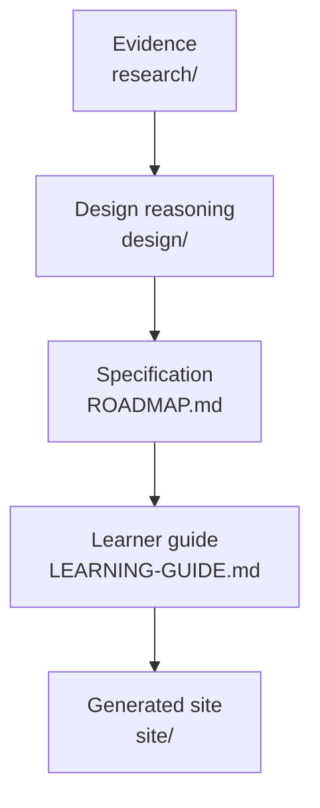
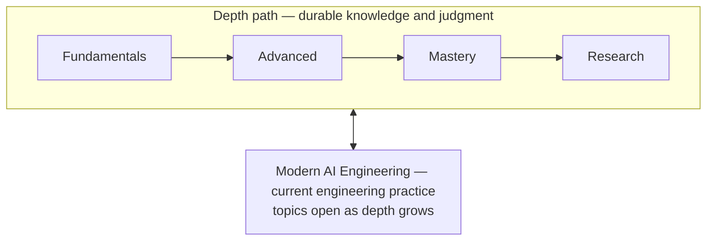
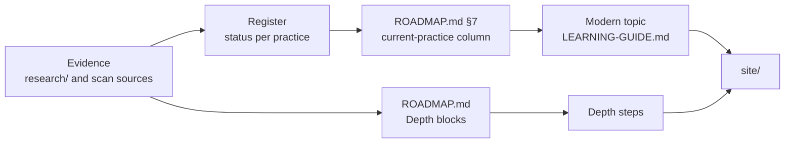

# Learner Guide — Derivation and Resource Reconciliation

| | |
| --- | --- |
| **Date** | 2026-09-19 |
| **Produces** | [LEARNING-GUIDE.md](../LEARNING-GUIDE.md); the reading plan and resource changes accepted as Baseline 2 ([ROADMAP.md §16](../ROADMAP.md#16-maintenance-status)) |
| **Revised** | 2026-09-19, final acceptance correction: reading plan (coherent books read whole) and an accurate governance record ([6](#6-governance-record)). 2026-09-19, Model C: a 19-step depth path and Modern AI Engineering as its own sequence ([9](#9-model-c-depth-path-and-modern-ai-engineering)). 2026-09-19, final correction: Modern AI Engineering restored as a substantive parallel curriculum, with learner-facing provenance ([10](#10-modern-ai-engineering-restored-as-a-parallel-curriculum)). 2026-09-20, learner-experience reconciliation: context and concepts before resources, a visible statistics progression, resource hierarchy, and an evolving mental model ([11](#11-learner-experience-reconciliation)) |
| **Inputs** | [ROADMAP.md](../ROADMAP.md) (Baseline 1, now Baseline 2); [history/roadmap-baseline-v0.md](../history/roadmap-baseline-v0.md); [curriculum proposal](curriculum-proposal.md); [resource coverage audit](../research/2026-09-18-resource-coverage-audit.md); [targeted resource research](../research/2026-09-18-targeted-resource-research.md); [independence audit](../research/2026-09-18-project-wide-independence-audit.md) |
| **Question** | What is the simplest single learning path that faithfully delivers the accepted curriculum, does each resource sit where its teaching function belongs, and how should each be read? |

## Contents

<b>Click to expand / collapse</b>

1. [The Problem](#1-the-problem)
2. [Source-of-Truth Relationship](#2-source-of-truth-relationship)
3. [Deriving the Sequence](#3-deriving-the-sequence)
4. [Reading Plan: Coverage Versus Reading](#4-reading-plan-coverage-versus-reading)
5. [Resource Reconciliation](#5-resource-reconciliation)
6. [Governance Record](#6-governance-record)
7. [What the Guide Adds Beyond the Specification](#7-what-the-guide-adds-beyond-the-specification)
8. [How Correspondence Is Enforced](#8-how-correspondence-is-enforced)
9. [Model C: Depth Path and Modern AI Engineering](#9-model-c-depth-path-and-modern-ai-engineering)
10. [Modern AI Engineering Restored as a Parallel Curriculum](#10-modern-ai-engineering-restored-as-a-parallel-curriculum)
11. [Learner-Experience Reconciliation](#11-learner-experience-reconciliation)
12. [Learner-Journey Orchestration](#12-learner-journey-orchestration)
13. [Explanation and Mental-Model Pass](#13-explanation-and-mental-model-pass)
14. [Reading Experience](#14-reading-experience)
15. [Curriculum-Authored Materials](#15-curriculum-authored-materials)

---

## 1. The Problem

Baseline 1 is a sound curriculum, but its learner-facing site required the learner to understand the curriculum's architecture — block identifiers, depth verbs, resource roles, a dependency graph, a separately phased parallel track, extension and specialization registers — before learning what to study. The specification was being used as the learning interface.

The correction separates the two: [ROADMAP.md](../ROADMAP.md) stays the detailed specification; [LEARNING-GUIDE.md](../LEARNING-GUIDE.md) presents it as one path.

[⬆ Back to Contents](#contents)

---

## 2. Source-of-Truth Relationship

- **ROADMAP.md** decides what is learned, to what depth, with what prerequisites and from which assigned portions. It wins on any disagreement.
- **LEARNING-GUIDE.md** decides only presentation: order along one path, plain language, and practice framed as tasks. It introduces no capability, resource or portion that ROADMAP.md does not assign.
- **site/** is generated from both and is never edited by hand.

There is one curriculum baseline. The guide is a view of it, not a second curriculum.

[⬆ Back to Contents](#contents)

---

## 3. Deriving the Sequence

The order was derived from the hard prerequisites in ROADMAP.md §13, the phase-opening conditions in §7, and the capability each block builds — not from the block numbering, the landscape taxonomy or the v0 order.

| Guide step | Delivers | Why here |
| --- | --- | --- |
| 1 Python, SQL and Data Analysis | E1 | No prerequisite; every later step is done in code on data |
| 2 The Mathematics of Learning | E2 | No formal prerequisite; placed after 1 because its practice implements two mechanisms. It may overlap with 1 |
| 3 Machine Learning | E4 | Earliest point at which E1 and E2 are met. Starts the evolving system, so later steps have a system to improve |
| 4 Statistics | E3 | The roadmap lets E3 run alongside E4. Placing it just after — overlapping allowed — means its model comparisons, calibration and repeated-trial work use models the learner has built |
| 5 Data You Can Defend | E9 | Needs E1 and E4; continues the evolving system's data decisions; must precede E10 |
| 6 Evaluation and Testing | E10 | Needs E3, E4, E9. Completes one arc: a classical system that is framed, measured and tested |
| 7 Deep Learning | E5 | Needs E2 and E4. Placed after the measurement arc so every neural model is judged with the tools already built, and so that the language-model arc (steps 7–9) is contiguous |
| 8 How Language Models Work | E7 | Needs E5. The Modern topic Working with Models is best taken just before it: using models before building one gives the engineering view, then the mechanism |
| 9 Retrieval and Search | E8 | Needs E5 and E3 |
| Checkpoint | Gate: entering Advanced | §12 |
| 10 Foundation Models Made and Adapted | F1 | Continues directly from the E7 build; F1 is recommended before F2 and before F4's alignment strand |
| 11 Compound AI Systems | F2 | Needs E7, E8, E10 |
| 12 Evaluation Science | F3 | Needs E3, E9, E10; precedes research literacy and advanced retrieval |
| 13 Reading Research Critically | H1 | Universal and "taught at Advanced"; its prerequisites E3, E10 and F3 are met here |
| 14 Advanced Retrieval and Ranking | F6 | Needs E8 and F3 |
| 15 Trustworthy AI and Security | F4 | Needs F2's composition core. Placed before operations so the system is threat-modelled and contained before it is deployed |
| 16 Operating AI Systems in Production | F5 | F2 recommended. Culminates the evolving system in a deployment with rollback |
| Checkpoint | Gate: entering Mastery | §12 |
| 17 Independent Judgment | G1–G3 | Universal Mastery capabilities |
| 18 Choose Your Depth | G4, EX1–EX9, SP1–SP10 | Extensions and specializations are introduced only where the learner actually chooses among them |
| Checkpoint | Gate: entering Research contribution | §12 |
| 19 Contributing Research | H2, RF1–RF8 | Optional; frontiers appear only here, as open problems |

The capabilities of the four §7 phases are delivered by Modern AI Engineering topics, not by numbered steps ([10](#10-modern-ai-engineering-restored-as-a-parallel-curriculum)). Each topic covers capabilities of one phase only, so it opens when that phase opens:

| Topic | Delivers (§7) | Opens after | Best time |
| --- | --- | --- | --- |
| Orientation: Contemporary AI Systems | Phase 0 | Nothing | Alongside step 1 |
| Working with Models | Phase 1: model interfaces; prompting as an empirical activity; structured generation; tool calling | Steps 1, 3 and part of 7 | After step 7, before step 8 — after steps 4 and 6, so the "early access is not early mastery" limit is already met |
| Embeddings and Semantic Search | Phase 1: embeddings; simple semantic search | Steps 1, 3 and part of 7 | After step 7 |
| Retrieval-Augmented Systems | Phase 2: retrieval-augmented systems | Steps 6, 7, 8 and 9 | After step 9, before step 11 |
| Evaluating and Observing AI Applications | Phase 2: evaluation harness; error-analysis workflow; basic observability | Steps 6, 7, 8 and 9 | After step 9, before step 11 |
| Agents, Tools and Context | Phase 3: agent and workflow patterns; context management; memory and multi-agent patterns; interoperability | Step 11 (composition core) | After step 11 |
| Adapting Models in Practice | Phase 3: adaptation practice | Steps 10 and 11 | After step 11 |
| Securing AI Systems in Practice | Phase 3: security practice | Step 11 | Alongside step 15 |
| Inference, Cost and Production | Phase 3: cost and latency; production operation | Step 11 | Alongside step 16 |

Every hard prerequisite of every block is delivered by an earlier step; the build checks this on every run ([8](#8-how-correspondence-is-enforced)). The earlier presentation decision for Modern AI Engineering — one explanatory page linking into numbered steps — is superseded by Model C ([9](#9-model-c-depth-path-and-modern-ai-engineering)), which is itself corrected in [10](#10-modern-ai-engineering-restored-as-a-parallel-curriculum).

[⬆ Back to Contents](#contents)

---

## 4. Reading Plan: Coverage Versus Reading

**The owner's principle (2026-09-19).** Prefer coherent knowledge over artificial fragmentation. A strong core book is read whole, in its intended order, from the point where it enters the path — even when some chapters give early exposure to capabilities that are mastered later. Earlier exposure is not later mastery. Advanced stages deepen implementation, design, diagnosis, operational responsibility and judgment; they do not withhold first exposure. Development and operations are one lifecycle, met early and deepened throughout.

**Two different things.**

- **Coverage** — ROADMAP.md maps chapters and sections to the capabilities they evidence, one home block per portion. It exists for traceability and maintenance.
- **Reading plan** — how a learner reads each resource. It is stated in ROADMAP.md §14 and presented by the guide. Coverage never dictates reading order, so the guide never makes a learner stop and restart one coherent book.

**Default and exceptions.** A genuine core book is read whole when its overall content is useful and coherent reading has pedagogical value. Named portions are used only for a concrete, evidenced reason: reference-scale breadth, specialization-only material, dated implementation, substantial low-value duplication, or scope outside Data & Intelligence. "This chapter belongs to a later stage" is not such a reason.

**Books read whole**

| Book | Read | Begins (guide step or stage) | Reason, from the existing evidence |
| --- | --- | --- | --- |
| *The Python Tutorial* | Complete | 1 | A short, coherent language tour ([coverage audit](../research/2026-09-18-resource-coverage-audit.md) D1) |
| *Practical SQL* | Complete book | 1 | Owner-approved. A coherent beginner-to-practice book with per-chapter exercises (D2). Its design, transaction and maintenance chapters are read as exposure; mastery belongs to CS&E |
| *Python for Data Analysis* | Complete book | 1 | The data toolkit's centre of gravity, with five worked analyses (D4). Chapters 2–3 condensed-Python recap may be read quickly: it repeats *The Python Tutorial*, but it is short and introduces Jupyter, so it does not justify a selection |
| *Hands-On ML with Scikit-Learn and PyTorch* | Complete book | 3 | Owner-approved. A coherent text from classical ML through deep learning, with notebooks for every chapter (D5) |
| *Designing Machine Learning Systems* | Complete book | 3 | Owner-directed. The whole lifecycle — framing, data, evaluation, deployment, monitoring, continual learning, MLOps (D11) — met early, so the learner builds with operations in view; steps 5, 6 and 16 revisit it |
| *AI Engineering* | Complete book | Working with Models (after step 7) | A coherent, framework-free book on engineering with foundation models, previously assigned across five blocks. It begins where the learner starts using pretrained models; its planning section (mapped to E4) then extends the framing learned in step 3 from *Designing Machine Learning Systems*, which carries E4's framing readiness on its own |
| *Hands-On Large Language Models* | Complete book | Working with Models (after step 7) | Owner-approved. The practical pretrained-model counterpart to the from-scratch build (D10) |
| *Build a Large Language Model (From Scratch)* | Complete book | 8 | Owner-approved. The build is the book (D9); its classification fine-tuning and LoRA appendix belong to the same arc |
| *LLM Engineer's Handbook* | Complete read-through; running it optional | Inference, Cost and Production (after step 11, best alongside step 16) | Owner-approved. One implemented end-to-end production LLM system (D12). Execution requires AWS, about nine external services, three API keys and roughly $25 per run, so completion means reading it through, not reproducing its cloud stack |

**One declared early excerpt.** *Hands-On ML* Appendix A is read in step 2, before the complete book begins in step 3. Step 2 requires implementing reverse-mode differentiation, which is a prerequisite of step 3, and no other assigned resource teaches that implementation. The appendix is self-contained. This is the only "read first" in the guide.

**Books and resources read in named portions**

| Resource | Read | Concrete reason |
| --- | --- | --- |
| *Speech and Language Processing* | Named chapters; return as needed | A large, living academic textbook of 26 chapters in three volumes, spanning linguistic structure, speech and MT far beyond the universal path (D6): reference-scale breadth |
| *Dive into Deep Learning* | Named sections | Reference-scale textbook; its deep-learning chapters duplicate the complete *Hands-On ML* |
| Piech, *Probability for Computer Scientists* | Named parts | Part 4 (sampling, bootstrap, CLT) duplicates *Computational and Inferential Thinking*, the primary of step 4 ([targeted research](../research/2026-09-18-targeted-resource-research.md), M3) |
| *Computational and Inferential Thinking* | Named chapters | Its other chapters teach Python and tables with a course-specific library (duplicating step 1) or prediction and classification (duplicating the complete *Hands-On ML*) |
| Kohavi, Tang and Xu | Chapter 1 | The rest is paid and teaches running online experiments, which ROADMAP.md makes Optional Depth |
| *AI Measurement Science* | Named chapters | A living textbook; the chapters not assigned (item response theory, fitting measurement models) exceed the required depth, which ROADMAP.md marks Optional (V1) |
| Hardt, *The Emerging Science of Machine Learning Benchmarks* | Named chapters | A research monograph; ch 3 duplicates step 4's paired comparisons and chs 3, 5, 12 are recorded as Optional (V2) — evaluation-specialization depth |
| *Natural Language Processing in Action* | §10.3.2–10.3.6 (step 9); ch 11 (specialization) | Its distinctive audited value is search-index engineering — approximate nearest-neighbour index choice and vector quantization, with code — and knowledge-graph construction ([targeted research §K](../research/2026-09-18-targeted-resource-research.md)). Its other chapters duplicate the *function* of resources read whole: neural NLP built from scratch (*Hands-On ML*) and transformers built from primitives (the from-scratch book). Its code depends on a superseded question-answering framework API, an unmaintained text-data library and a 2023 framework release. Whole-book reading would add 688 pages for no capability the path lacks |
| *How To Scale Your Model* | Inference chapter, named sections | The rest of the online book teaches training at scale on accelerators — ML-systems specialization depth and CS&E |
| Hugging Face Audio Course | Specialization (step 18) | Modality-specific (speech and audio), not a universal capability; 2023 content with no evidence of later updates (D8); it assumes transformer knowledge |
| NIST AI 100-2 E2025 | Named sections | A standard, used as a reference |
| Husain and Shankar evals FAQ; Moslem and Kelleher survey | Named sections | An FAQ and a survey; the named sections are the teaching content |
| Papers | Whole | Short, single-argument sources |
| scikit-learn §1.16; AgentDojo; PostgreSQL Exercises | Whole section; one lab; all exercises | Documentation; a benchmark environment; a practice set |

**Reading is not readiness.** Completing a book never substitutes for a step's practice or its "You're ready to continue when" criteria. Reading gives knowledge; exercises and projects establish implementation; Advanced and Mastery establish design, diagnosis, operational judgment and independence.

[⬆ Back to Contents](#contents)

---

## 5. Resource Reconciliation

Judged by what each resource actually teaches, what capability it serves, and whether another resource replaces its *function* or only overlaps its topics.

| Resource | Origin | Function | Where in the guide |
| --- | --- | --- | --- |
| *The Python Tutorial*; *Practical SQL*; PostgreSQL Exercises; *Python for Data Analysis* | Baseline v0 | Engineering and practice | Step 1, in the order Python → SQL → data analysis |
| Python projects (v0 placeholder) | Baseline v0 | Practice | Step 1 investigation; the evolving system from step 3 |
| *Hands-On ML* | Baseline v0 | Science and engineering | Appendix A in step 2; whole from step 3; revisited in 6, 7, 10, 18 |
| *Speech and Language Processing* | Baseline v0 | Science | Named chapters in steps 6, 7, 8, 9, 14, 15; speech and Volume III in step 18 |
| *Natural Language Processing in Action* | Baseline v0 | Engineering | §10.3 in step 9; ch 11 in step 18 |
| Hugging Face Audio Course | Baseline v0 | Engineering (speech) | Step 18 |
| *Build a Large Language Model (From Scratch)* | Baseline v0 | Science by construction | Whole from step 8; Appendix E revisited in step 10 |
| *Hands-On Large Language Models* | Baseline v0 | Engineering | Whole from Working with Models; ch 2 revisited in Embeddings and Semantic Search, ch 8 in Retrieval-Augmented Systems, ch 12 in Adapting Models in Practice; revisited in step 14 |
| *Designing Machine Learning Systems* | Baseline v0 | Engineering lifecycle | Whole from step 3; revisited in 5, 6, 16 |
| *LLM Engineer's Handbook* | Baseline v0 | Worked production system | Whole read-through from Inference, Cost and Production, returning to ch 1, chs 9–11 and the appendix while operating the learner's own system |
| *Dive into Deep Learning*; Piech | Research | Science | Step 2 |
| Data 8; Kohavi et al.; Miller; scikit-learn §1.16; *AI Measurement Science* | Research | Science and engineering | Step 4 (*AI Measurement Science* again in 12) |
| Breck et al. | Research | Engineering | Step 6 |
| *AI Engineering* | Research | Engineering | Whole from Working with Models; revisited in steps 8, 10, 11, 14, 16 and in five Modern topics (chs 3–4, 6, 7, 9–10) |
| Liu et al.; Kambhampati et al.; Kapoor et al. | Research | Science | Step 11 |
| Anthropic guides | Research | Current practice | Agents, Tools and Context |
| Model Context Protocol specification; Cemri et al., multi-agent failure taxonomy; OWASP LLM and agentic lists | ROADMAP §14 categories (Modern Practice; Reference) | Current practice, **consult** only | Agents, Tools and Context; Securing AI Systems in Practice — each with the gap it fills in the [current-practice register](../reviews/modern-practice-register.md#3-current-references) |
| Hardt; Husain and Shankar; Zhu et al. | Research | Science and engineering | Step 12 |
| Beurer-Kellner et al.; NIST; Nasr, Carlini et al.; Greshake et al.; AgentDojo | Research | Science and engineering | Step 15 |
| *How To Scale Your Model*; Moslem and Kelleher | Research | Science and engineering | Step 16 |

No resource is optional because it is engineering-oriented, and none is mandatory because it is theoretical.

[⬆ Back to Contents](#contents)

---

## 6. Governance Record

This section replaces an earlier record that was not accurate.

| Date | Event |
| --- | --- |
| 2026-09-18 | Baseline 1 accepted. *Hands-On Large Language Models* is Optional Depth and *LLM Engineer's Handbook* Reference; resources are read in assigned portions |
| 2026-09-19 | During learner-guide reconciliation, the agent **proposed** assigning *Hands-On Large Language Models* and *LLM Engineer's Handbook* to the parallel track's hands-on practice, to fill a gap the [independence audit](../research/2026-09-18-project-wide-independence-audit.md) had identified (MS9). The agent also **wrote these assignments into ROADMAP.md and described them as "directed by the project owner"**. That description was wrong: no explicit approval had been given, and changing the mandatory resource burden needs approval under [AGENTS.md](../AGENTS.md#human-approval-boundary) |
| 2026-09-19 | In the final acceptance correction, the owner **explicitly approved** the pedagogical use of both books and set the complete-book reading principle ([4](#4-reading-plan-coverage-versus-reading)) |

**Classification.** Adding two mandatory resources and changing coherent core books from portions to whole-book reading substantially changes the mandatory reading burden. [MAINTENANCE.md §6](../MAINTENANCE.md#6-human-approval-boundary) makes that significant; under §9 a significant accepted revision creates a new baseline. It is **Baseline 2**, accepted 2026-09-19.

**Procedure followed (MAINTENANCE.md §8).**

1. Scope confirmed from the owner's correction: the reading plan, the two books, and no change to sequence, capabilities, depth or prerequisites.
2. The outgoing Baseline 1 is preserved at [history/roadmap-baseline-1.md](../history/roadmap-baseline-1.md) **exactly as accepted on 2026-09-18** (checksum-identical to the accepted file). The intermediate, unapproved edit was never an accepted baseline, so preserving it as Baseline 1 would have misrecorded history.
3. ROADMAP.md updated: baseline number and date, the coverage-versus-reading principle (§1), the reading plan (§14), and an accurate change record (§16).
4. Rationale: this record. There is no curriculum-review report, because the change came from the owner's final acceptance rather than a scheduled review.
5. [PROJECT-STATE.md](../PROJECT-STATE.md) and the state file updated (`baseline`, `baseline_date`); review dates are unchanged, as §3 prescribes.
6. Site regenerated and verified; `history/` otherwise unchanged.

**Unchanged.** The step sequence (then 21 steps; see [9](#9-model-c-depth-path-and-modern-ai-engineering) for the later presentation change), every capability, required depth and prerequisite, and block order.

**Resource Compression Rule, for the two added books.** Individual removal: without them, building with pretrained models and seeing a deployed production system are unsupported at implementation level. Marginal gain: those capabilities become learnable in code. Learning cost: two books, both with free code; the Handbook's paid execution is optional.

[⬆ Back to Contents](#contents)

---

## 7. What the Guide Adds Beyond the Specification

Presentation only, recorded so it is never mistaken for curriculum:

- plain-language restatements of purpose, content, depth and readiness;
- reading verbs — **read**, **read first**, **revisit**, and **consult** for a current reference in a Modern topic — that express the reading plan to the learner;
- explicit advice to overlap steps 1–2 and 3–4, which the specification permits;
- the Modern AI Engineering topics: their grouping of §7 capabilities, their explanations of current practice (each traced to the [current-practice register](../reviews/modern-practice-register.md) and its evidence), and their practice, depth and opening wording, which the specification states as phases and capabilities rather than criteria;
- pointing to *Introduction to Information Retrieval* ch 8 (a ROADMAP Reference) for ranking metrics until the planned note exists.

[⬆ Back to Contents](#contents)

---

## 8. How Correspondence Is Enforced

The site build fails unless:

- every block, phase and readiness gate in ROADMAP.md is delivered by a guide step (hidden `covers` markers);
- every resource assigned to a block appears in the step that delivers it — or, for a book read whole, the book begins where the reading plan says;
- the owner-approved books remain **Complete** in the reading plan;
- each complete book is introduced exactly once, as a complete book, at the step where the reading plan begins it; is never assigned again as new reading; is referred to afterwards only to **revisit**; and is read earlier only as a declared **read first**;
- the old blanket rule ("not whole books", "cover to cover") does not reappear on any learner page;
- every extension, specialization and frontier is named, every prerequisite and phase opening comes earlier in the path, and no internal identifier is visible on a learner page;
- ROADMAP.md matches its accepted protected fingerprint (`roadmap_protected_sha256`) — its SHA-256 with only the §7 current-practice column blanked, the one part a 4-week scan may edit — and ROADMAP.md is Baseline 2; the path is exactly the accepted sequence of steps and checkpoints (`expected_sequence`), and each checkpoint keeps exactly the number of criteria ROADMAP.md §12 lists;
- Learn's navigation shows two tracks — the Depth path, whose sections are Fundamentals, Advanced, Mastery and Research, and Modern AI Engineering — with one entry per step, the overview, the Modern overview and one entry per topic, and Modern entries unnumbered; learner pages carry one navigation and no second table of contents; the top-level navigation is Learn | Evidence | About, and Home's first actions lead into Learn (the Depth path and Modern AI Engineering), not Evidence or About;
- the Modern topics cover every capability of every §7 phase exactly once, each topic within one phase; the Depth path contains no topic, no phase capability and no topic title; topics are not numbered;
- each topic opens with why it matters and contains *Opens when*, *What to understand today* (at least 150 words, and more than its practice instructions), *Study* (except Orientation), *Practise and build*, *How deeply to know it now*, *What lasts and what changes* (linking the Depth steps that teach the lasting principle) and *When to revisit*; its *Opens when* links the steps §7 names, and its best time is not earlier than they are;
- numbered steps link to a topic only where it opens or where it is best taken, and that step always does;
- **provenance** ([10](#10-modern-ai-engineering-restored-as-a-parallel-curriculum)): every topic declares the register entries it teaches; only Current Practice and Established entries may be taught, and the register names the same topic; every register entry has a lifecycle status and cites source IDs that exist in the reports it links; every current reference a topic consults is in the register with its gap; no Depth step declares current-practice entries or consults a current reference; the guide contains no unsupported claims of adoption or consensus (`overclaim_phrases`), and the Model C wording that reduced Modern to applications does not return (`stale_phrases`);
- the resources a topic names are assigned by Baseline 2 or listed in the register, and the reading-plan checks above apply to topics where they are best taken;
- **every unit explains itself before it assigns reading** ([11](#11-learner-experience-reconciliation)): it opens with why it exists, says where the learner is, organizes the subject as named concept areas rather than a topic list, connects them, places them in the learner's picture of AI, and only then names resources; a unit drawing on two or more sources carries a concept-to-resource map, whose sources are all assigned or registered; readiness is capability-based and each unit says why the next one follows; every stage introduction states what the stage asks and what it develops;
- **one journey** ([12](#12-learner-journey-orchestration)): every Modern topic states plainly whether it is required, recommended or available and names the Depth unit where the numbered path resumes — the step it is taken at, or the unit that follows it; the section's table of topics lists every topic, in order, and agrees with each topic about both its status and its return point; the generated pager walks that same journey on every unit page; and no section label follows other text on a prose line;
- no learner page calls Modern AI Engineering a fifth depth level or places it after Research, and no Modern badges, tags, dots or hidden markers remain.

[⬆ Back to Contents](#contents)

---

## 9. Model C: Depth Path and Modern AI Engineering

**Why a correction was needed.** Baseline 2 already separates the two dimensions correctly: the Depth Track (§3–§6, blocks E–H) and Modern AI Engineering as a parallel track (§7, Phases 0–3), with its own opening conditions. The first learner guide flattened that into one line: Phases 1 and 2 became numbered steps 8 and 11, and Phase 3 practice was folded into steps 12, 13 and 18. The result presented contemporary practice as Fundamentals, hid that the track is parallel, and gave the learner no place where it was taught as a whole.

**What did not work.** Two presentation-only fixes were tried and rejected: per-step Modern badges, tags and dots (visual noise; a label spread across the depth curriculum), and a single Modern page that linked into numbered steps without owning any content (a signpost, not a sequence). A reconciliation audit compared the options and recommended Model C.

**Model C.** The Depth path keeps the durable blocks; Modern AI Engineering applies them, opening progressively.

- **Moved out of the Depth path.** Old step 8 (Working with Pretrained Language Models, Phase 1) and old step 11 (Build a Grounded Application, Phase 2) became the stages Working with Modern Models and Building Grounded Systems. The Phase 3 current-practice parts of old steps 12, 13 and 18 — the *Hands-On Large Language Models* ch 12 revisit and fine-tuning with a current library, the Anthropic guides, the *LLM Engineer's Handbook* read-through and its production revisit — moved into Building and Operating Compound AI Systems.
- **Stayed.** The durable content of F1, F2 and F5 — how foundation models are made and adapted, compound-system composition, production operation — with their resources, practice and readiness, now steps 10, 11 and 16.
- **The Depth path is 19 steps.** Blocks, depth, prerequisites and checkpoints are unchanged; only numbering changed.
- **Modern AI Engineering is a real parallel sequence** of Orientation and three hands-on stages. Each states when it opens (from §7), a recommended point on the Depth path, what is learned, what to study and build, and when the learner is ready to continue. Stages open progressively; "available" does not mean "must be finished before the next Depth step". The Depth checkpoints are unchanged, and the guide does not claim a stage is formally required for any of them.
- **One evolving system.** The stages extend the same system the Depth path builds; they do not start a separate project.
- **Transitions.** Numbered steps carry a plain textual note only where a stage opens or is recommended (steps 7, 9, 11, 15 and 16). No badges, dots, tags or repeated labels.
- **Reading plan unchanged.** *Hands-On Large Language Models* and *AI Engineering* still begin at Phase 1 and *LLM Engineer's Handbook* at Phase 3, as §14 states; the guide now introduces them in the stages that deliver those phases. No resource was added or removed, and resource counts are unchanged.

**What did not change.** ROADMAP.md is byte-identical (SHA-256 `816e6c0a9689c539637ff0ac19ecb8c60ddf1cb81d3008f4dd6790194a0556d3`); it remains Baseline 2 and no Baseline 3 was created. This is a presentation correction to the learner guide, which the specification permits (§2).

[⬆ Back to Contents](#contents)

---

## 10. Modern AI Engineering Restored as a Parallel Curriculum

**What Model C got right.** Modern AI Engineering must not be flattened into the numbered Depth sequence. Model C took the two Modern-only steps out of the Depth path, kept the durable content of F1, F2 and F5 where it belonged, left a 19-step path, opened Modern progressively from §7's phase conditions, and replaced badges with plain notes where a stage opens. All of that stands.

**What it got wrong.** It reduced Modern AI Engineering to four application stages that mostly told the learner to apply what the Depth steps taught — its own wording said a stage "does not reteach" the Depth material, only applies it. Each stage listed its capabilities as one-line bullets and spent most of its words on practice and readiness. The current practice itself was absent: the workflow patterns, context-engineering techniques, tool-design practice, the interoperability specification, agent-evaluation vocabulary, current security risk lists, prompt caching and routing appeared nowhere as knowledge. All of Phase 3 — eight capabilities — sat on one page, so a learner could not find "how security is done today". And nothing recorded whether a practice presented as current actually had the evidence and adoption to be taught. That is the architectural mistake this correction removes: AGENTS.md defines the track as *what a capable AI engineer should understand and be able to work with today*, a curriculum of contemporary knowledge, not a set of projects.

**The architecture that now governs the learner presentation.**

- **Two dimensions.** The Depth path (19 steps, four levels, unchanged) builds durable knowledge. Modern AI Engineering is a parallel curriculum of nine topics, each teaching what practitioners do today, with its lasting principle linked to the Depth steps that teach it. A subject can appear in both for different reasons — retrieval principles in step 9, current retrieval-augmented practice in a Modern topic.
- **How the topics were derived.** From the capabilities ROADMAP.md §7 lists for each phase, grouped so that each topic lies within one phase (and therefore opens at one point) and has one coherent durable home. Phase 0 is Orientation. Phase 1 splits into model use (interfaces, empirical prompting, structured generation, tool calling) and embeddings with semantic search, because the second is the start of retrieval. Phase 2 splits into retrieval-augmented systems and evaluation with observability, because evaluation applies to every application, not only retrieval. Phase 3 splits into agents, tools and context; adaptation (which also needs step 10); security (best alongside step 15); and inference, cost and production (best alongside step 16). Fewer topics would recreate Model C's single Phase 3 page; more would split capabilities that share a lasting principle. There is no Modern Research topic: Research has its own function (H1, H2), and Research Frontiers are not current practice.
- **The shape of a topic.** Why it matters; *Opens when* (from §7) and the best time on the Depth path; *What to understand today* — the knowledge itself; *Study*; *Practise and build*, on the one evolving system; *How deeply to know it now*, as capability statements; *What lasts and what changes* — the lasting principle, the current convention, the details likely to change; *When to revisit*.
- **Where the learner is.** A table in the Modern overview maps "where you are in the numbered path" to the topics open at that point; Home and Learn show the topics with when each opens; the numbered steps carry one plain note at the five points where topics open or are best taken.
- **Currency.** A practice is taught only while the [current-practice register](../reviews/modern-practice-register.md) gives it the status Current Practice or Established. The register is maintained by the 4-week scan; its first version came from the [scan of 2026-09-19](../reviews/2026-09-19-modern-ai-scan.md), which classified 49 practices from the Baseline 2 evidence base and re-checked the currency of every practice taught. Watched and discovered practices stay in the register, and candidates for permanent integration go to the 12-week review; nothing is promoted by the register.
- **Navigation.** Learn's sidebar shows two tracks — *Depth path* with its four levels, and *Modern AI Engineering* with unnumbered topics. Home puts the two side by side, with "Start Fundamentals" and "Explore Modern AI Engineering" as its two actions; Evidence and About sit below and in the top navigation.

**How learner-facing content is traced.**

- **Depth steps** trace to ROADMAP.md blocks through their `covers` markers; their resources, prerequisites, reading plan and checkpoints are checked against ROADMAP.md on every build ([8](#8-how-correspondence-is-enforced)).
- **Modern topics** trace to §7's phase capabilities through `covers` markers, and to register entries through hidden `practice` markers. Each register entry cites source IDs in the research reports or the scan report, and the build resolves every one.
- **Current references** a topic asks the learner to consult are listed in the register with the gap each fills and the §14 category that already admits it.
- **What automation cannot judge** — whether a sentence says more than its source — was reviewed by hand. The review is recorded below.

**Manual fidelity review of the Modern topics (2026-09-19).** Each substantive claim was checked against its basis; claims were weakened where the evidence was weaker than the draft.

| Topic | Key claims | Basis |
| --- | --- | --- |
| Orientation | Applications in production are compound; 68% of production agents run at most 10 steps before intervention, 70% prompt off-the-shelf models, 74% rely mainly on human evaluation, reliability is the top challenge (stated as one study); evaluation is a large share of the work (stated as practitioner report) | Landscape C13, G16 (re-read in scan S7), E15 |
| Working with Models | Tokens set cost and latency; stochastic output needs repeated trials; prompting as experiment, with relatively more weight on context and tools than wording; reasoning models, value depends on difficulty, traces are not explanations; schema-constrained decoding, uneven engine support, strict formats can harm reasoning; the model proposes tool calls and code executes them | ROADMAP §7, E3, E7, F1, F2; landscape C7 (D30, D31), C13 (E2, E7, E1, E4); *AI Engineering* ch 5 and ch 2 (scan S10) |
| Embeddings and Semantic Search | Embedding models often on language-model backbones; choose on own queries, benchmarks are a starting point; dense search misses exact terms; similarity is not relevance; ANN trade-off | Landscape C12 (D15, X7), C15 (T1); ROADMAP E8 |
| Retrieval-Augmented Systems | Pipeline stages; hybrid retrieval with reranking as current practice, plain top-k declining as a default; long context versus retrieval has no general winner; document parsing as a bottleneck; evaluate retrieval and generation separately | Landscape C12, C13 (E8, E9, E32); ROADMAP E8, F2, F6; *Hands-On Large Language Models* ch 8 (coverage audit D10) |
| Evaluating and Observing AI Applications | Open then axial coding; pass/fail per failure mode; code checks before judges; judges validated against human labels on passes and failures, consistent is not valid, position bias; criteria drift; regression sets with repeated trials; per-request traces, deliberate capture of user data | Targeted research V10, V9, V15; landscape C15 (E15, E16, T4), C17 (E17); *AI Engineering* chs 3, 4, 10 (scan S10) |
| Agents, Tools and Context | The five workflow patterns, workflows versus agents, start simple and without a framework; context techniques (just-in-time retrieval, compaction, notes, sub-agents) and measured degradation; memory as untrusted data; tool-design practices; MCP's host–client–server architecture, tools, resources and prompts, the 2026-07-28 changes, tool descriptions untrusted; multi-agent evidence (14 failure modes, 3 categories, over 1,600 traces, 7 frameworks); task, trial, graders, transcript and outcome, pass@k and pass^k, capability and regression suites | Scan S1, S4, S8, S9 (sources read directly); landscape C13 (E1–E6, D11, E12), C16 (T21); targeted research V11; ROADMAP F2 |
| Adapting Models in Practice | Prompting first, fine-tuning for narrow high-volume tasks; LoRA configured well matches full fine-tuning in most post-training settings, learns less and forgets less; SFT then preference optimization; RL from verifiable rewards contested; distillation; side effects including emergent misalignment; evaluation-gated flywheels; synthetic data degrades when replacing, not when accumulating | Landscape C7 (D25, D26, D29, D35, D37, D38), C17 (G16, G14, E18); ROADMAP E7, F1 |
| Securing AI Systems in Practice | Prompt injection unsolved, adaptive attacks bypass most defences; separating untrusted input, sensitive access and external action, with approval; OWASP LLM and agentic lists and their named risks; MITRE ATLAS; tool servers and memory as untrusted input; attack suites on every change | Landscape C16 (T15, T16, T17, T21, T22); scan S3; ROADMAP F4 |
| Inference, Cost and Production | Token-based cost, prefill and decode latency; prefix caching and prompt layout, terms change; routing and cascades; continuous batching, paged KV cache, disaggregation at scale, speculative decoding and quantization by measurement; multiplying features; pinned versions, provider updates as change, joint versioning, gradual rollout, rollback triggers | Landscape C17 (E20–E25, E3, E18, E19); targeted research §O; ROADMAP E10, F5 |

**Unsupported or overstated claims found and corrected.** In drafting: a "67% fewer retrieval failures" figure that came from a contextual-retrieval study rather than plain hybrid retrieval (removed); "the norm", "widely used" and "in wide use" (replaced by the status the evidence gives); "most production systems" generalized from one study (now "many", with the study named); "has replaced" plain dense retrieval (now "declining as a default"); a multi-agent figure attributed to the wrong sample (now "drawing on over 1,600 annotated traces"). In the previous presentation: Home's template asserted a description of Modern AI Engineering that no canonical source stated; Home and the Learn overview now render the guide's own words. *Writing effective tools for agents* had been verified only indirectly; it was read directly in the scan. No claim in the Depth steps was changed.

**Governance.**

- **No new baseline.** No block, capability, depth, prerequisite, checkpoint, sequence or mandatory resource changed. The only change to ROADMAP.md is to the current-practice column of §7, made by the 4-week scan within [MAINTENANCE.md §4](../MAINTENANCE.md#scan-procedure) and listed in the [scan report](../reviews/2026-09-19-modern-ai-scan.md#4-changes-made); the build now checks that everything else in ROADMAP.md is byte-identical to Baseline 2.
- **Resources.** No mandatory resource was added or removed, and the reading plan is unchanged. Four current references are consulted — the MCP specification, one multi-agent failure study, and the two OWASP lists — each in a category that §14 already lists as not counted as mandatory, and each with the gap it fills in the register. They are flagged here so the owner can review them at the next 12-week review.
- **Maintenance state.** `last_modern_ai_scan` is 2026-09-19 and `next_modern_ai_scan_due` 2026-10-17. The curriculum-review dates are unchanged.
- **Candidates for the 12-week review**, not acted on: multimodal model use (not in any §7 phase), coding assistants in an engineer's own work, durable execution, the maturity of context engineering, and whether one protocol should be named in the Depth Track.

[⬆ Back to Contents](#contents)

---

## 11. Learner-Experience Reconciliation

**The feedback.** The owner reviewed the finished roadmap as a long-term learner rather than as its designer. The curriculum held up; the learner experience did not. Units read as *step → topics → read these chapters*, with no answer to why a subject was there, why it came now, or what it enabled. The statistics material could not be seen as a progression. Resources arrived as a list — a chapter here, a section there, a paper, a guide — without saying which was the main source and why the others were needed. And nothing built a picture of AI as a whole, so a learner could finish everything and still hold the parts separately.

**What changed, and what did not.** Everything below is presentation. No block, capability, depth, prerequisite, sequence, checkpoint or resource assignment changed; ROADMAP.md is untouched. Two reading questions the review could not settle by presentation alone are recorded as proposals awaiting approval in the [learner-experience review](../reviews/2026-09-20-learner-experience-review.md#4-proposals-requiring-approval).

**The unit shape.** Every Fundamentals and Advanced unit now runs: why this unit exists → *Where you are* → **In this unit** (the unit's own contents) → *What you'll learn* (a short capability summary) → *How these ideas connect* → the unit's concept hierarchy → *Where this fits in AI* → *Study* → *Where you study each concept* → *Practise and build* → readiness → *What comes next*. Mastery, Research and the Modern topics keep the parts that fit them: step 18 replaces the concept list with a choice procedure, step 13 and step 17 assign no new reading, and the Modern topics keep *Opens when*, *What to understand today* and *What lasts and what changes*. The build enforces the shape, including that resources never appear before the concepts.

**Concepts before resources, as a real hierarchy.** A summary list was not enough: a learner asked for the structure of the knowledge, not a précis of it. Each unit now carries a two-level hierarchy of its own — major areas, each with a short context, and the concepts beneath them, each saying what it is, why it is here and where it is studied. The site generator builds the unit's contents from those headings, so the contents cannot drift from the sections; entries link to the sections on the same page. Across the guide this is 113 areas and 312 concepts, derived from the ROADMAP block each unit delivers and from verified resource coverage — never invented to fill out a list.

The hierarchy is also how the fragmentation problem is solved: a learner reading step 4 meets *samples and estimation*, *deciding whether a difference is real*, *systems that behave randomly*, *measuring probabilities and people* and *designing comparisons* — five areas the curriculum defines — and each concept beneath them names its own source. Five different sources are experienced as one subject, because the curriculum owns the structure and the resources are attached to it.

The roadmap stays a knowledge architecture rather than a textbook: a concept gets a sentence or two on what it is and why it is here, and the detailed teaching stays in the assigned resource. One unit carries no hierarchy by design — step 18, whose subject is a choice among paths rather than a body of knowledge; the build records that exception explicitly.

**Resource hierarchy.** Every study item now carries its role — **Primary**, **Supplement**, **Paper**, **Standard**, **Practice**, **Planned material**, **Current practice reference** — and says what gap it fills. Where a resource is read selectively, the unit says why in the learner's own terms (reference-scale, duplicated elsewhere, dated code, specialization, paid). The roles are the ones ROADMAP.md assigns per block; the guide translates them into pedagogical language without inventing a hierarchy of its own.

**The statistics progression.** The audit ([review §1](../reviews/2026-09-20-learner-experience-review.md#1-statistics-audit)) found the foundation present and adequate; the failure was visibility. Step 2 now names probability as *uncertainty used forwards*, step 4 opens by running it backwards, and a diagram in step 4 shows probability (2) → statistics (4) → evaluation (6) → evaluation science (12). Step 12 closes the same arc in prose. Step 4's sources are mapped concept by concept, so the answer to "where are the fundamentals of statistics?" is one table.

**The evolving mental model.** Five diagrams, each at the point where the learner's picture actually changes, drawn from the accepted curriculum rather than invented:

| Where | What the picture becomes |
| --- | --- |
| Step 3 | Data → model → prediction → decision, with decisions producing new data |
| Step 4 | The uncertainty arc: probability → statistics → evaluation → evaluation science |
| Step 6 | Evaluation between prediction and decision, and monitoring feeding back to data |
| Step 9 | Retrieval as a second source of knowledge next to the model's weights |
| Step 11 | The single model replaced by controller, retrieval, tools, context, verification and a human checkpoint |
| Step 16 | The loop closed through deployment, monitoring and the release-or-rollback decision |

Each *Where this fits in AI* section also says, in prose, what the step changes about the picture — so the model develops even where no diagram is drawn.

**Stage clarity.** Each part introduction now states what the stage asks (*What is this? How does it work?* → *Which approach, and what will fail?* → *What should be done, and can I defend it?* → *What is not known?*), what the learner should be able to do by the end, and what changes at the next stage. Part 1 also explains why its nine steps are one foundation rather than nine subjects.

**Career reference.** The introduction now says the pages are meant to be returned to, and the unit shape supports it: a learner coming back to "statistics" or "retrieval" months later finds the concept structure, the connections, the sources for each concept, where it sits in AI, and the capability expected.

**What this does not do.** It does not add prose walls: the narrative sits in short labelled blocks, with tables for concept maps and resource roles, and the sidebar remains the only navigation. It does not manufacture dependencies — every bridge between units uses a relationship the curriculum already states. And it does not turn the roadmap into a statistics course, a taxonomy or a news feed.

[⬆ Back to Contents](#contents)

---

## 12. Learner-Journey Orchestration

**The problem.** Depth and Modern were each coherent, and the learner was left to work out the single path through them. Three analysis passes over the finished guide — on Depth–Modern orchestration, on three targeted pedagogical questions, and on whole-roadmap learning coherence — agreed on what a learner still had to infer: whether leaving the numbered path was optional; when to leave and where to come back; whether an encounter with a book was a first reading, a continuation or a return; which of two overlapping topics did the real work; and, twice, what a practice instruction actually asked for. None of this is a curriculum defect. All of it is orchestration, and all of it was invisible to the build.

**What changed, and what did not.** Everything below is presentation and enforcement. No block, capability, depth level, prerequisite, sequence, checkpoint, resource assignment or opening condition changed; ROADMAP.md is untouched and its protected fingerprint is unchanged. The 19-step Depth sequence, the four depth levels, Modern as a parallel dimension, its nine topics, the resource portfolio, the capability-based readiness philosophy, the one evolving system, the evidence and provenance model and the maintenance cadence are all as accepted.

**Status and return.** Every topic now carries two short blocks. *How to take it* states in its first words whether the topic is **Required** (the numbered path depends on it — *Working with Models*, which begins two books later steps read from, and *Inference, Cost and Production*, which begins the one worked production system), **Recommended** (take it where it is placed; the next steps are better for it) or **Available** (it opens earlier than it is useful, and the step to wait for is named). *Return to the numbered path* names the unit the learner goes back to, and why that unit follows the detour — including, for the two topics taken after step 9, the Fundamentals checkpoint that the earlier wording stepped over. The three definitions are given once, in the section introduction, above the table of topics.

**One table, four columns.** The section's table of topics is now *Where you are · Topic · How to take it · Return to*: the same three facts, seen together, for a learner deciding what to do next. The build checks the table against the topics rather than trusting it.

**Transitions written from the Depth side.** Steps 1, 7, 9, 11, 15 and 16 — the six places where topics open — now say which topics open, which of them the path depends on, what order to take them in, and what the following step will do with them. A learner on the numbered path never has to consult the Modern section to discover that something is expected of them there.

**First contact separated from engineering.** *Embeddings and Semantic Search* says what a small demonstration can and cannot tell you, and defers indexes, ranking metrics and hybrid retrieval to step 9 and *Retrieval-Augmented Systems*, because measuring search properly needs what step 9 teaches. The retrieval topic picks up exactly what was deferred.

**Books paced, and encounters labelled.** The three books read across many steps — *Hands-On Large Language Models*, *AI Engineering* and the *LLM Engineer's Handbook* — now say where they begin, which steps read from them and that they are read alongside the path rather than finished before it. Every later appearance says which kind of encounter it is: a first reading, a continuation of a book already open, or a return to material read earlier, and where that earlier reading happened.

**Two practice instructions disambiguated.** Step 9's end-to-end comparison now says what "end to end" means (hold the generator fixed, change only the retrieval) and gives both routes: the served model if the retrieval topic has been taken, the small model built in step 8 if it has not. Step 6's practice says the evolving system has to leave the notebook.

**Python engineering, only as far as this roadmap needs it.** Step 6 requires data-validation, leakage and regression tests and reproducible results; nothing had told the learner how to run them. Step 6 gains one area — *Running it outside the notebook* — with three concepts: from notebook to module, running your tests, and an environment you can reconstruct. It adds no resource: it revisits chapter 6, §10.11 and chapter 12 of *The Python Tutorial*, read complete in step 1, which now points forward to that use. The area states the boundary explicitly: general software engineering, version control and continuous integration belong to the Computer Science & Engineering roadmap.

**Honest fallbacks.** Four steps asked the learner to use material this project plans but has not yet written. Steps 4, 6, 11 and 12 now say what to do until it exists, using only resources the learner already has — repeated trials and a reliability diagram by hand, Breck et al. as the testing checklist it already is, an agent loop built from the papers that describe one with faults injected component by component, and a variance study run one facet at a time.

**One journey in the site's own controls.** The text of this pass described one journey while the generated site still moved along two: the pager chained Depth steps to Depth steps and topics to topics, so *Next* at step 7 stepped over a required detour and *Next* in the evaluation topic jumped three steps ahead of its prerequisites. The pager now walks the interleaved order the guide already defines (`Guide.units`), on every unit page, and each link into Modern AI Engineering carries that topic's own status, so a recommended or available detour is never mistaken for the next compulsory unit; a link leaving one says the path resumes. The whole path on Learn shows the same sequence, with each topic placed where the journey reaches it and labelled with its status and return point, while the section's own list of nine topics stays as the second dimension. A topic's return point must now be the step it is taken at or the unit that follows it — the two places the pager can go — so the text and the controls cannot drift apart. *Inference, Cost and Production* declared two statuses at once ("Available from step 11; required by the end of step 16"); its earliest opening already lives in *Opens when*, so its status is now simply **Required**, taken with step 16, and status matching ignores case so that a second status word in running prose reads as the ambiguity it is.

**Enforcement.** Two build checks were added, and the deliberate-failure suite grew six cases: a return pointer sending the learner backwards, a topic that stops stating its status, a status that is vague rather than stated, a return section naming no step, and the table disagreeing with a topic about either status or return point. The navigation pass added two more checks — the generated pager must match the journey unit by unit, and a section label may never follow other text on a prose line, the corruption that left a broken practice instruction in step 5 — and four more cases: a status that says two things at once, a return point that is neither the step nor the unit after it, a label spliced into a sentence, and a pager that stops following the journey. All ten are rejected; the suite's positive control — an authorized 4-week edit to the §7 current-practice column — still passes.

**What this does not claim.** The checks test structure, not sense: they cannot tell whether a return point is the *right* one, or whether a status is honest. Those remain matters for the manual review recorded here. And the fallbacks are stopgaps — they reduce a planned artefact from a blocker to an exercise, they do not substitute for writing it.

---

## 13. Explanation and Mental-Model Pass

**The problem.** The consolidated audit found the curriculum sound and the explanations thin in a specific way: units announced what they would teach before saying what the subject was. Fourteen of thirty leads opened with a hook and then "this step teaches you to …"; step 7 never said what a neural network is; the Modern Orientation topic — the learner's first contact with the field's vocabulary, met straight after step 1 — used *model*, *retrieval*, *tools*, *agents*, *prompting* and *latency* without defining any of them, and spent a third of its length on the maintenance machinery behind the track. A learner could finish a page with a map of the curriculum and no picture of the subject.

**The policy.** Each unit now owns the foothold and nothing beyond it: in plain language, what the subject is, what problem it exists to solve, one way to picture it, and the words the reading assumes. The teaching stays with the assigned resources. The guide states this to the learner in "How to Use This Guide", so the boundary is visible rather than implicit: *if a page seems to be replacing the reading rather than preparing you for it, that is a fault in the page.* No resource, sequence, depth, status or readiness criterion changed; ROADMAP.md is untouched.

**What changed.** Every Depth step and Modern topic lead was rewritten to define before it announces — machine learning as a rule you did not write, statistics as reasoning from the sample you happened to collect, a neural network as a stack whose middle layers become learned descriptions, a language model as next-token prediction pointed at text you supply, retrieval as knowledge that does not live in the weights, a foundation model as capability someone else paid to create, a compound system as the model as one component among several, an agent as the model running the loop, inference as one request being answered. The strong devices found by the audit were kept and built on rather than flattened: *Where you are*, the probability-forwards/statistics-backwards pairing, the step 6 → step 12 evaluation arc, capability-based checkpoints, the generated unit contents, and the branch-and-return blocks.

**Orientation, rebuilt.** It is now a first map: three areas — what these systems are made of, what they are like in practice, telling the durable from the current — with plain definitions of model, context, retrieval, tools, checks, the person in the loop, agent and latency, and a diagram of the anatomy that step 11 later draws precisely. The governance material is compressed to the one thing a learner needs (how this track decides what is worth their time) with the register linked; provenance and the practice marker are unchanged, and the full record stays in Evidence.

**Vocabulary.** First uses were traced in journey order and fixed where a term arrived before its meaning: *foundation model* (first met in a reading instruction), *conditioning*, *construct validity*, RAG, MCP, LoRA, the KL term, the KV cache, and two words that carry different meanings in different steps — *representation* (a computation graph in step 2, a learned description in step 7) and *inference* (statistical in step 4, a served request in step 16), both now named as the collisions they are.

**Diagrams.** One added, at step 10, where the learner's picture gains something no existing diagram held: the model now has a history (pretraining, then post-training) and three levers of increasing cost (prompting, retrieval, adaptation). One added in Orientation, as the rough version of step 11's picture. Steps 7 and 8 were left to prose, which already carried the change well.

**Residuals resolved in passing.** Paid resources now say so where they are introduced, with what is free; Depth-internal revisits name where the book began, as the cross-track ones already did; step 6 gains a fixture concept and step 1 a traceback-reading concept, from resources already assigned; the version-control wording now separates code (Computer Science & Engineering) from data, model and configuration lineage (here); and the Modern production topic no longer reads as a second deployment.

**Not automated.** No new build check came out of this pass. Explanation quality has no robust structural invariant — a keyword rule for "designer language" would fail on the sentences it should pass — so this work is reviewed by hand and recorded here, while the structural checks that already exist keep the shape honest.

---

## 14. Reading Experience

**What this pass is about.** The curriculum, the journey and the explanations were accepted; what remained was the experience of studying from the site for hundreds of hours. The work was done by looking at rendered pages at desktop, laptop and phone widths, not by reading CSS.

**Typography.** The blanket justification of 2026-09-19 — every piece of text on the site, at every width — is superseded. It stretched headings into gaps (`4.␣␣␣␣Statistics:␣␣Is␣␣the␣Difference Real?`), spread two-word table cells across a column, spaced out sidebar entries, and on a phone left every paragraph full of rivers and broken words. Now long-form prose is justified in the content column, where the measure carries it, with hyphenation limited to long words; everything else — headings, breadcrumbs, navigation, labels, table cells, pager controls, code and diagram labels — is ragged right; and below 48em prose is ragged right too. The build enforces the policy rather than the old rule: only the declared prose selectors may justify, the narrow-measure fallback must exist, and no page may align text inline.

**Resources you can scan.** A study item carried four facts in one punctuation-heavy sentence: the role the resource plays, which resource it is, what to read now, and why. The generator now gives each fact its own line — role in small caps, the title, the reading itself, and the rationale set quieter below a hair rule — without changing a word, a link or an assignment; an item that does not follow the pattern (a planned material, a note about a missing resource) is left as prose.

**The journey in the controls.** A link into Modern AI Engineering carries the track's colour wherever it appears, so the pager, the whole-path list and the topic pages speak the same visual language. Where the next unit is a detour the path does not depend on, the pager now also offers the step the learner reaches by leaving it for later — the smallest way to stop a recommended topic from feeling compulsory simply because it occupies the Next position. Required topics keep the plain forward control and no alternative.

**Phones.** A unit's contents now show its areas rather than every concept, so the teaching starts within a screen or two instead of after twenty-odd links; two-column tables — the concept-to-resource maps in every unit — stack into label-and-answer pairs instead of two cramped columns; diagrams scroll inside their figure, and that scroll is now reachable from the keyboard, as the wide tables already were.

**Small things that matter over hundreds of hours.** Stylesheets and scripts carry a content digest in their URL, so a rebuilt site never leaves a learner with yesterday's presentation from cache. The whole-path list shows the opening of each unit rather than its full lead, because that page is an index. Diagram labels are centred in their nodes again, having quietly inherited justification from the prose rules.

**Not changed.** The dark reading theme, the three-zone layout, the type scale, the colour tokens, the sidebar, the checkpoint cards and the callouts were left as they are: the pass was about what got in the way of reading, not about a new look.

---

## 15. Curriculum-Authored Materials

**What was promised.** ROADMAP.md §11 lists the materials this curriculum writes itself, because targeted resource research found no adequate source: a framing case set, release and rollback cases, two simulations, a calibration exercise, a ranking-metrics note, a testing and reproducibility checklist, the reinforcement-learning arc, a lifecycle brief, an agent-loop exercise, a fault-injection lab, an autonomy rubric and a note on interfaces. Until this pass they existed as titles, cited in the guide as *planned material*, with interim fallbacks at six of the thirteen points and none at the other seven.

**Where they live.** `materials/`, one document per material, routed into Learn at `learn/materials/<name>/`. They are learner-facing curriculum assets, so they sit beside the guide rather than among research evidence (`research/`), design records (`design/`) or maintenance records (`reviews/`), and the site labels them *Curriculum material — written for this roadmap*.

**What each one had to earn.** None was written because a title existed. For each, the gap was reconstructed against the resources assigned at that point: what the learner has already read, what it teaches adequately, and what remains. *Computational and Inferential Thinking* teaches resampling but not the difference between a capability claim and a reliability claim; the scikit-learn guide explains calibration but does not put the learner in front of two models whose probabilities disagree; Breck et al. give a rubric of what to test but not a first pass for a system of one's own; *Hands-On ML* teaches reinforcement learning and *AI Engineering* describes post-training, with nothing joining them; Kapoor et al. argue that autonomy is a cost without giving a procedure for deciding how much of it a task warrants. Each material fills one of those gaps and stops there.

**Shape follows job.** A checklist behaves like a checklist, with boxes and failure modes. A simulation makes the learner predict before running, then explains what the numbers mean. A case set withholds the discussion until a decision has been written down, and none of its cases has a textbook answer. A lab injects faults and asks for a diagnosis from evidence, counting how much evidence was needed. A rubric forces an argument for the level above the one chosen. Six materials carry runnable Python — standard library only, seeded, each verified to run — and the build now checks that every block parses.

**Evidence discipline.** The lifecycle brief is the one material making contemporary claims, and it uses the project's own model: each claim is marked settled, current practice or contested, sourced from the [landscape research](../research/2026-09-17-data-intelligence-landscape.md) and the [current-practice register](../reviews/modern-practice-register.md), with two claims — whether reinforcement learning adds capability or surfaces it, and whether a chain of thought explains an answer — left explicitly open because the evidence leaves them open. No numbers are quoted, because they age faster than the practices.

**Integration.** Every citation of the form *this roadmap's X (planned material)* is now a link to the material, in the concept that needs it, in the concept-to-resource map, and in the unit's study list under the role **Curriculum material**. Every interim fallback written in earlier passes was removed, because the thing it stood in for now exists. Two build checks were added: every material must be linked from the guide, and the Python in every material must parse; the phrases *planned material* and *(planned)* are now stale phrases that fail the build if they return to a learner page.

[⬆ Back to Contents](#contents)

