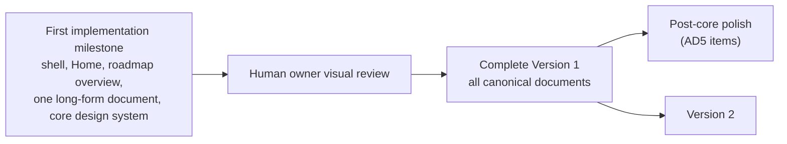
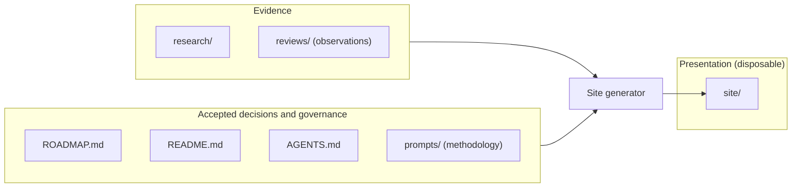
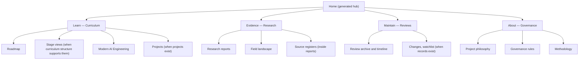
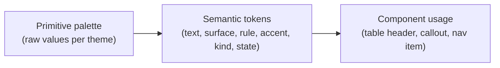
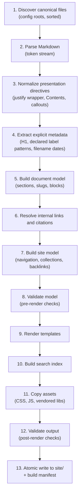
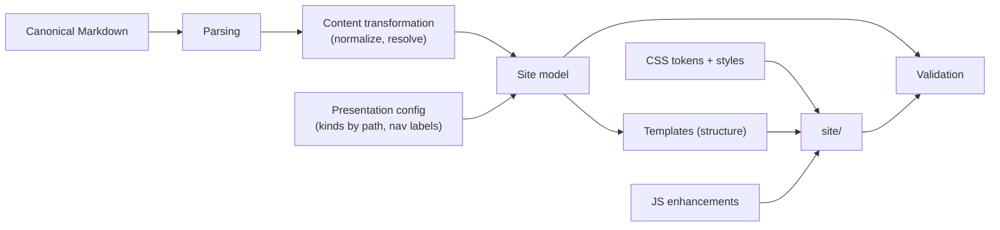
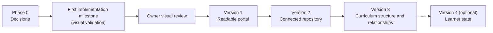
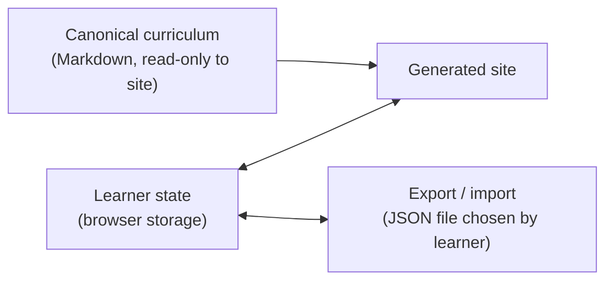

<div align="justify">

# Generated Site: Architecture and UX Specification

| | |
| --- | --- |
| **Status** | Architecture approved by the human owner, with recorded implementation decisions — not implemented |
| **Date** | 2026-09-17 (proposed); approval recorded 2026-09-17 |
| **Approved decisions** | [Approved Implementation Decisions](#approved-implementation-decisions) — these override conflicting recommendations elsewhere in this document |
| **Scope** | Architecture, information architecture and UX of the generated HTML interface in `site/` |
| **Amended** | 2026-09-19: the learner interface is now the learning guide — areas Learn · Evidence · About, one page per step, one navigation mechanism. See [learner-guide.md](learner-guide.md). Sections below that describe the Roadmap experience record the earlier design |
| **Amended** | 2026-09-21, owner instruction: the blanket justification of 2026-09-19 is superseded. Long-form prose is justified at a wide enough measure and ragged right below it; headings, navigation, labels, tables, controls, code and diagram labels are never justified ([AGENTS.md — Generated HTML Output](../AGENTS.md#generated-html-output)). The original left-aligned treatment described below applies again, with the reading experience recorded in [learner-guide.md §14](learner-guide.md#14-reading-experience) |
| **Does not change** | Curriculum, research findings, review records, governance rules, or any canonical Markdown |

This document decides **what to build before building it**. It contains no implementation, and it creates no CSS, JavaScript, generator or generated output.

> ⚠️ Nothing in this specification is a curriculum decision.
>
> Where examples mention stages, topics or maturity labels, they illustrate how the interface would *display* canonical information. They do not assert that any topic belongs anywhere.

## Contents

<details open>
<summary><b>Click to expand / collapse</b></summary>

**Approved Decisions**

- [Approved Implementation Decisions](#approved-implementation-decisions)
  - [AD1. Roadmap Overview Is Part of Version 1](#ad1-roadmap-overview-is-part-of-version-1)
  - [AD2. Local-First Does Not Permanently Mean file://](#ad2-local-first-does-not-permanently-mean-file)
  - [AD3. Simplified Version 1 Validation](#ad3-simplified-version-1-validation)
  - [AD4. Deterministic Content, Not Byte Identity](#ad4-deterministic-content-not-byte-identity)
  - [AD5. Advanced Reading Interactions Are Post-Core Polish](#ad5-advanced-reading-interactions-are-post-core-polish)
  - [First Implementation Milestone](#first-implementation-milestone)
  - [Principles That Remain Unchanged](#principles-that-remain-unchanged)

**Foundations**

1. [Product Vision](#1-product-vision)
2. [Design Principles](#2-design-principles)
   - [The Three-Layer Rule](#the-three-layer-rule)
   - [Principles](#principles)
   - [What the Repository Contains Today](#what-the-repository-contains-today)

**Structure and Navigation**

3. [Information Architecture](#3-information-architecture)
   - [Content Kinds](#content-kinds)
   - [Placement Decisions](#placement-decisions)
4. [Navigation Model](#4-navigation-model)
   - [Page Anatomy](#page-anatomy)
   - [Navigation Elements](#navigation-elements)
   - [Quiet Reading](#quiet-reading)
   - [Keyboard Model](#keyboard-model)

**Experiences**

5. [Roadmap Experience](#5-roadmap-experience)
6. [Long-Form Reading Experience](#6-long-form-reading-experience)
7. [Research Experience](#7-research-experience)
8. [Review and Maintenance Experience](#8-review-and-maintenance-experience)
9. [Topic and Relationship Model](#9-topic-and-relationship-model)
   - [Topic Page Model](#topic-page-model)
   - [Relationship Model](#relationship-model)
   - [Relationship Representations](#relationship-representations)
10. [Search Design](#10-search-design)

**Visual System**

11. [Theme and Visual System](#11-theme-and-visual-system)
12. [Typography](#12-typography)
13. [Math, Code, Diagram and Table Handling](#13-math-code-diagram-and-table-handling)
    - [Mathematics](#mathematics)
    - [Code](#code)
    - [Mermaid and Diagrams](#mermaid-and-diagrams)
    - [Tables](#tables)
    - [Callouts, Details and Other Constructs](#callouts-details-and-other-constructs)
14. [Citation and Source Experience](#14-citation-and-source-experience)

**Quality**

15. [Accessibility](#15-accessibility)
16. [Responsive Behavior](#16-responsive-behavior)
17. [Print Behavior](#17-print-behavior)

**Build**

18. [Static-Site and Generator Architecture](#18-static-site-and-generator-architecture)
    - [Technology Recommendation](#technology-recommendation)
    - [Pipeline](#pipeline)
    - [Document Model](#document-model)
    - [Separation of Concerns](#separation-of-concerns)
    - [Runtime Enhancements](#runtime-enhancements)
19. [Proposed Generated File and URL Structure](#19-proposed-generated-file-and-url-structure)
20. [Validation Strategy](#20-validation-strategy)

**Delivery**

21. [Progressive Implementation Phases](#21-progressive-implementation-phases)
22. [Explicit Non-Goals](#22-explicit-non-goals)
23. [Open Design Decisions](#23-open-design-decisions)
24. [Recommended Version 1 Scope](#24-recommended-version-1-scope)

</details>

---

## Approved Implementation Decisions

**In this section:** [AD1](#ad1-roadmap-overview-is-part-of-version-1) · [AD2](#ad2-local-first-does-not-permanently-mean-file) · [AD3](#ad3-simplified-version-1-validation) · [AD4](#ad4-deterministic-content-not-byte-identity) · [AD5](#ad5-advanced-reading-interactions-are-post-core-polish) · [First Implementation Milestone](#first-implementation-milestone) · [Principles That Remain Unchanged](#principles-that-remain-unchanged)

**Status:** Approved by the human owner on 2026-09-17.

The overall architecture in this document is approved, together with the implementation decisions below.

> ⚠️ These decisions override any conflicting recommendation elsewhere in this document.
>
> The affected sections have been updated to match. If any remaining text still conflicts, this section takes precedence.

This approval does not resolve the open decisions in [23](#23-open-design-decisions) unless a decision below explicitly does so.

### AD1. Roadmap Overview Is Part of Version 1

- The high-level roadmap overview visualization ([5](#5-roadmap-experience)) moves from Version 2 into **Version 1**.
- The **Home** page must visually communicate the core learning architecture: Fundamentals → Advanced → Mastery → Research as a sequence, with Modern AI Engineering shown as a **parallel track**, never as a fifth sequential stage.
- The visualization is derived **only from approved canonical structure**. It must not invent topic classifications, relationships, maturity, prerequisites or curriculum decisions.
- The first implementation needs no sophisticated interaction. A clear, polished, responsive visual representation is sufficient.

### AD2. Local-First Does Not Permanently Mean file://

Direct `file://` operation is **desirable for Version 1** and should be supported where reasonably practical. It is **not** a permanent architectural constraint, and it must not block better technology choices later.

The durable requirements are:

- local-first;
- static;
- no backend required;
- no account required;
- no analytics or telemetry;
- no external runtime dependency for ordinary reading;
- servable locally with something as simple as `python -m http.server`.

Future versions may use browser capabilities that work reliably through localhost or static hosting, even if they are awkward or unavailable under `file://`. Examples include `fetch` of index files, ES modules, and chunked search indexes. This resolves open decision D14.

### AD3. Simplified Version 1 Validation

The full validation strategy ([20](#20-validation-strategy)) remains the long-term target. Version 1 must not spend disproportionate effort building a sophisticated validation framework.

Version 1 must primarily verify that:

1. every intended canonical Markdown source generates successfully;
2. internal document links resolve;
3. heading anchors resolve;
4. generated navigation resolves;
5. canonical learner-facing wording is not silently changed by presentation generation;
6. generated HTML has valid basic structure;
7. basic accessibility requirements are met;
8. required assets work locally and offline;
9. generated output has not become an independent source of curriculum content.

Other checks are **progressive capabilities**, introduced when justified. Section [20](#20-validation-strategy) maps each check to its phase.

### AD4. Deterministic Content, Not Byte Identity

- Generated output should be deterministic **in content and structure**.
- Avoid unnecessary nondeterminism, such as random identifiers or meaningless generated timestamps.
- Proving that two consecutive builds are byte-for-byte identical is **not** a major Version 1 objective. Version 1 must not add significant complexity solely for byte-identical reproducibility.
- Stronger reproducibility checks may be introduced later if they become useful.

### AD5. Advanced Reading Interactions Are Post-Core Polish

These ideas remain part of the architecture, but they are **not required** before the core visual experience is evaluated:

- focus mode;
- automatic top-bar hiding;
- persistent sidebar state;
- advanced keyboard shortcuts;
- sophisticated navigation animation;
- other optional reading-mode enhancements.

The core interface comes first:

- top navigation;
- left area navigation;
- central reading column;
- right-side on-this-page navigation;
- responsive navigation;
- heading anchors;
- Light / Dark / System themes;
- excellent typography;
- tables;
- code;
- Mermaid;
- callouts;
- print behavior;
- roadmap overview on Home.

Advanced interaction polish comes only after the core interface has been visually reviewed.

### First Implementation Milestone

**Not implemented yet.** The first implementation pass is deliberately limited to:

1. the global site shell;
2. the Home page;
3. the roadmap overview;
4. one representative long-form canonical document page;
5. the core design system required to render those correctly.

The first pass must **not** generate and polish the entire repository.

**Purpose:** visual validation. Before the generator is expanded, the human owner inspects:

- typography;
- spacing;
- information hierarchy;
- navigation;
- reading width;
- sidebar behavior;
- light theme;
- dark theme;
- roadmap visualization;
- tables;
- code blocks;
- diagrams;
- responsive behavior;
- overall visual character.

**Gate:** only after that visual review is the generator expanded across the complete repository to finish Version 1.



### Principles That Remain Unchanged

The approval preserves these principles:

- Markdown and approved canonical sources remain the source of truth.
- Generated HTML is presentation only.
- Evidence, curriculum decisions and presentation remain separate.
- The site must not infer curriculum decisions.
- Research and evidence must remain visually and semantically distinguishable from curriculum.
- Presentation configuration must not become a hidden curriculum database.
- Concepts and content must not be added merely because the UI would benefit from them.
- Learner state must remain separate from canonical curriculum.
- Generated HTML must not be manually maintained as an independent content source.

[⬆ Back to Contents](#contents)

---

## 1. Product Vision

The generated site is a **local-first personal portal for AI learning, the roadmap, research and curriculum maintenance**, generated entirely from canonical Markdown sources.

It serves one learner who needs to do two different things:

| Mode | What the learner is doing | What the interface should feel like |
| --- | --- | --- |
| **Navigating** | Orienting, finding, comparing, following relationships, checking what changed | An application: fast, structured, predictable, searchable |
| **Reading** | Studying a section, working through a research report, reading a derivation | A technical book: quiet, typographically careful, uninterrupted |

> **Application when navigating. Book when learning.**

Over time the portal should help the learner:

1. understand what to learn and why it matters;
2. see the depth progression — Fundamentals → Advanced → Mastery → Research — and follow Modern AI Engineering alongside it as a parallel track;
3. read learning material comfortably;
4. inspect the independently reconstructed landscape without confusing it with accepted curriculum;
5. see how the roadmap is maintained (scans, reviews, changes);
6. understand topic maturity and relationships where canonical sources record them;
7. search a growing repository;
8. optionally track personal progress, if that capability is later approved.

The portal is **not** a rendering of Markdown with nicer CSS. Its added value comes from structure it can *expose*: navigation, cross-links, indexes, search, relationships and review history. It must never add value by *inventing* content.

[⬆ Back to Contents](#contents)

---

## 2. Design Principles

**In this section:** [The Three-Layer Rule](#the-three-layer-rule) · [Principles](#principles) · [What the Repository Contains Today](#what-the-repository-contains-today)

### The Three-Layer Rule

The repository holds three different kinds of information. The generator reads the first two and produces the third. Information never flows back.



> **Presentation may expose structure. Presentation may not invent curriculum.**

In practice:

- If `ROADMAP.md` places a topic in Fundamentals, the site may *display* it as Fundamentals.
- If a research report labels something *Emerging*, the site may *display* that label **inside the research context**.
- The generator must never move, promote, rank, classify, or relate curriculum items on its own. It must not infer a maturity, a stage, a prerequisite or a citation link that the sources do not state.

### Principles

| # | Principle | Consequence for design |
| --- | --- | --- |
| P1 | **Canonical sources win.** | Generated HTML is disposable. No text is ever maintained in `site/`. A drift check detects stale or hand-edited output. |
| P2 | **Expose, never infer.** | Metadata, relationships and classifications are displayed only when explicitly present in canonical sources. Missing data produces an absent field, not a guess. |
| P3 | **Evidence is visibly not curriculum.** | Research and review content always carries a persistent, unmistakable context marker (see [7](#7-research-experience)). |
| P4 | **Reading comes first.** | Measure, typography and quiet chrome take priority over density of UI. |
| P5 | **Smallest architecture that grows cleanly.** | Static files, a small build script, no server, no database, no framework. Each dependency must justify itself in [18](#18-static-site-and-generator-architecture). |
| P6 | **Local-first and static** (revised by [AD2](#ad2-local-first-does-not-permanently-mean-file)). | No backend, account, analytics or external runtime dependency for ordinary reading. It must be servable locally with `python -m http.server`. Direct `file://` opening is supported in Version 1 where reasonably practical, but it is not a permanent constraint. |
| P7 | **Progressive enhancement.** | All content is readable with JavaScript disabled. JavaScript adds search, copy buttons, diagram rendering, theme persistence and section highlighting. |
| P8 | **Deterministic content** (revised by [AD4](#ad4-deterministic-content-not-byte-identity)). | Same sources + same generator version → same content and structure; no random identifiers or meaningless timestamps. Byte-identical output is not a Version 1 objective. |
| P9 | **Structure scales; visuals stay legible.** | Prefer lists, tables and local views over global graphs that become unreadable as the repository grows. |
| P10 | **Accessibility is a requirement.** | WCAG 2.2 AA is the baseline for every feature, including diagrams and tables. |
| P11 | **Honor existing governance.** | [AGENTS.md — Generated HTML](../AGENTS.md#generated-html) and [Generated HTML Output](../AGENTS.md#generated-html-output) already set requirements. This specification refines them and does not override them. |

### What the Repository Contains Today

The design is derived from the actual repository as of the date above.

| Path | Kind | State | Notable structure |
| --- | --- | --- | --- |
| `README.md` | Governance — project philosophy | Complete | Mermaid diagrams (some with emoji labels), tables, blockquotes |
| `AGENTS.md` | Governance — operating rules | Complete | ~950 lines, 30 sections, grouped Contents, callouts, Mermaid, many tables |
| `ROADMAP.md` | Curriculum (canonical) | Baseline v0 | Fundamentals sections 1–7 with explicit **Primary resource:** / **Purpose:** / **Status:** labels; Advanced, Mastery and Research marked "Not yet designed"; Modern AI Engineering candidate lists; status table |
| `prompts/landscape-research.md` | Methodology | Complete | Research process definition |
| `research/2026-09-17-data-intelligence-landscape.md` | Evidence — landscape report | Complete | ~24,000 words; 7-column evidence tables; ID-based citations (`` `[D26]` ``) resolving to a source register with ~200 entries; maturity vocabulary defined in a Legend |
| `research/2026-09-17-roadmap-comparison.md` | Evidence — comparison report | Complete | Coverage matrix; cites the landscape report's register by ID |
| `reviews/` | Maintenance records | Empty | — |
| `scripts/` | Tooling | Empty | Natural home for the generator |
| `site/` | Generated output | Empty | Output target |

Existing Markdown conventions the generator must understand (from [AGENTS.md — Markdown Source Files](../AGENTS.md#markdown-source-files)):

- a document-wide `<div align="justify">` wrapper;
- a `## Contents` list inside `<details open>`;
- `**In this section:**` sub-TOC lines;
- `[⬆ Back to Contents](#contents)` links;
- `---` section separators;
- `mermaid` fenced blocks;
- `> ⚠️` warning callouts;
- bold field labels;
- GitHub-style heading slugs.

The repository is **not currently under version control**, which affects change history and drift detection (see [23](#23-open-design-decisions)).

[⬆ Back to Contents](#contents)

---

## 3. Information Architecture

**In this section:** [Content Kinds](#content-kinds) · [Placement Decisions](#placement-decisions)

### Content Kinds

Every page belongs to exactly one **content kind**. The kind is determined **only by the source path**, through a small declared mapping. The generator never reads a document's content to decide its kind.

| Content kind | Source (today) | Future sources (if created) | Meaning |
| --- | --- | --- | --- |
| **Curriculum** | `ROADMAP.md` | Additional approved curriculum files, topic files, project files | Accepted learning decisions |
| **Evidence** | `research/*.md` | Topic research, scan reports | Research findings — not decisions |
| **Maintenance** | `reviews/*.md` (none yet) | 4-week scans, 12-week reviews, change records, watchlist | Records of observation and decision processes |
| **Governance** | `README.md`, `AGENTS.md`, `prompts/*.md` | `design/*.md` (if included) | Philosophy, rules and methodology |
| **Generated views** | — (no source file) | — | Home, section indexes, search, timelines. Built only from other pages' explicit structure, and never containing original curriculum or research prose. |

The user-proposed areas map onto these kinds as follows:



**A naming collision must be resolved.** "Research" is both a depth stage (Fundamentals → Advanced → Mastery → **Research**) and the name of the evidence folder (`research/`). A learner who clicks "Research" in the primary navigation could reasonably expect either one. The specification therefore recommends:

- the depth stage is always labeled **"Research stage"** in navigation and headings generated by the site (canonical headings are rendered unchanged);
- the evidence area is labeled **"Evidence"** in primary navigation, with the page subtitle "Research reports and findings".

The final label is an open decision ([23](#23-open-design-decisions), D5). The URL stays `research/` so it mirrors the source folder.

### Placement Decisions

The goal is a quiet navigation surface. An item earns permanent navigation space only if the learner needs it frequently.

| Item | Placement | Reasoning |
| --- | --- | --- |
| Home | Site title link | Standard; no separate nav item needed |
| Roadmap (Learn) | **Primary navigation** | Most frequent destination |
| Evidence (research reports) | **Primary navigation** | Distinct content kind that must be reachable without being confused with curriculum |
| Reviews (Maintain) | **Primary navigation** — shown once at least one review exists; before that, reachable from Home and the footer with an honest empty state | Avoids a permanent link to an empty page |
| About (Governance) | **Primary navigation** (rightmost, visually lighter) | Needed occasionally; must remain findable |
| Search | **Utility control** in the top bar (icon + shortcut) | Global and frequent |
| Theme | **Utility control** | Global, infrequent |
| Fundamentals / Advanced / Mastery / Research stage | **Secondary navigation** inside Learn, plus the roadmap overview visual | Only Fundamentals has content today |
| Modern AI Engineering | **Secondary navigation** inside Learn, visually set apart from the stage sequence | Parallel track, not a fifth stage |
| Dynamic Topics, Review Cycle, Curriculum Boundary, Pending Engineering Section, Curriculum Status, Next Roadmap Work | **Document navigation** (sections of the roadmap page) | They are sections of one canonical document |
| Field Landscape | **Secondary navigation** inside Evidence (pinned as the baseline report) | Important, but still one report |
| Individual research reports | **Secondary navigation** list inside Evidence, newest first | Grows over time |
| Source register entries | **Document navigation** + **contextual links** from citations | Belongs to its report |
| Curriculum changes, watchlist, research history | **Secondary navigation inside Reviews**, only when explicit records exist | No records today |
| Project philosophy, AGENTS rules, methodology prompts | **Secondary navigation** inside About | Stable, infrequent |
| Maturity labels, report dates, statuses, primary resources | **Metadata** (document header / table cells) | Descriptive, not navigational |
| Prerequisites, related topics, alternatives, lineage | **Contextual relationship panel** on topic pages (future) | Only meaningful in context |
| Individual source URLs, heading-level content, legend terms | **Search only** (plus in-page presence) | Too granular for navigation |
| Site design document (`design/`) | **About → Site design** or excluded | Open decision (D17) |

[⬆ Back to Contents](#contents)

---

## 4. Navigation Model

**In this section:** [Page Anatomy](#page-anatomy) · [Navigation Elements](#navigation-elements) · [Quiet Reading](#quiet-reading) · [Keyboard Model](#keyboard-model)

### Page Anatomy

Wide desktop layout (≥ 1280 px). The central reading column is the fixed point, and everything else is arranged around it.

```text
┌──────────────────────────────────────────────────────────────────────────────┐
│ AI Engineer Roadmap   Roadmap  Evidence  Reviews  About        [⌕ /]  [◐]   │  top bar (slim)
├───────────────┬──────────────────────────────────────────┬───────────────────┤
│ LEARN         │ Roadmap › 1. Fundamentals                │ ON THIS PAGE      │
│  Roadmap      │                                          │  Objective        │
│  Fundamentals │ ┃ CURRICULUM · Baseline v0               │  1. Mathematics…  │
│  Advanced     │                                          │ ▸2. Python        │
│  Mastery      │ 1. Fundamentals                          │  3. SQL           │
│  Research stg │ ─────────────────────────────            │  …                │
│ ───────────── │ Build the mathematical, programming…     │                   │
│  Modern AI    │ (reading column, ~68–75ch)               │                   │
│  Engineering  │                                          │                   │
│               │                                          │ ↑ Top             │
│               │          ‹ Previous   Next ›             │                   │
└───────────────┴──────────────────────────────────────────┴───────────────────┘
      area nav                  reading column                on-this-page TOC
```

This is a wireframe of layout relationships, not a visual design. Labels are illustrative placeholders taken from existing canonical headings.

### Navigation Elements

| Element | Behavior | Notes |
| --- | --- | --- |
| **Top bar** | Site title (→ Home), 3–4 primary items, search, theme. Height ≈ 48–52 px. The current area is shown with an underline or weight change, not a filled pill. | Sans-serif UI face |
| **Area sidebar** (left) | Lists documents and generated views in the current area. Collapsible groups. Persisting the collapsed state per viewer (local storage) is post-core polish ([AD5](#ad5-advanced-reading-interactions-are-post-core-polish)). | Hidden on Home. On the roadmap page it shows the canonical H2 structure of `ROADMAP.md`. |
| **On this page** (right) | H2 and H3 outline of the current document. The section currently in view is highlighted (IntersectionObserver). Nested levels collapse to the active H2 for very long documents. | Uses the same slugs as the source Markdown |
| **Breadcrumbs** | `Area › Document › (Section)`. Section appears only when a deep link is opened. | Rendered as `nav aria-label="Breadcrumb"` |
| **Previous / Next** | Only within explicitly ordered collections: roadmap stage/section order as it appears in `ROADMAP.md`; research reports by date in filename; reviews by date. No global previous/next. | Order is taken from sources, never computed by relevance |
| **Heading anchors** | A `#` link appears on hover and focus beside each heading. Activating it copies the section URL and announces "Link copied" through a polite live region. | IDs are identical to GitHub slugs (AGENTS requirement) |
| **In-document Contents** | The canonical `## Contents` block is rendered in place as a navigation landmark that keeps its `<details open>` state, styled like the reference's quiet numbered list. | Not removed — see open decision D6 |
| **"In this section" lines** | Rendered in place as a compact inline link row | Canonical navigation text |
| **"Back to Contents" links** | Rendered as a small right-aligned text link at section ends (the reference's `.back` treatment, lighter) | Canonical; AGENTS requires presence |
| **Back to top** | Floating button that appears after scrolling beyond one viewport; bottom-right; hidden in print | Required by AGENTS |
| **Mobile menu** | Top bar collapses to title + menu + search. The menu is a full-height drawer containing primary navigation and the area sidebar. "On this page" becomes a separate button that opens a sheet. | See [16](#16-responsive-behavior) |
| **Footer** | Source file path of the page ("Generated from `ROADMAP.md`"), build date of the source (not the build time; see determinism), link to About, link to Reviews when that area is hidden from primary navigation | Makes the source of truth visible |

### Quiet Reading

Navigation should recede when the learner is reading deeply, without disappearing unexpectedly.

> ⚠️ Items 1 and 3 (top-bar auto-hide, focus mode) are post-core polish under [AD5](#ad5-advanced-reading-interactions-are-post-core-polish).
>
> They are not part of the first implementation milestone and are implemented only after the core interface has been visually reviewed. Items 2, 4 and 5 are ordinary styling rules and apply from the start.

1. **Top bar auto-hide.** It hides after sustained downward scrolling in the reading column and returns on any upward scroll, focus entering it, or pointer at the top edge. With reduced motion, it stays visible and static rather than animating.
2. **Sidebar de-emphasis.** Side navigation uses muted text and no background fill. Only the active item uses the accent.
3. **Focus mode (optional control).** Hides both sidebars and centers the reading column. The toggle is available from the top bar and a keyboard shortcut. The state persists per viewer.
4. **No sticky banners** other than the thin evidence marker in research pages ([7](#7-research-experience)).
5. **Nothing moves by itself.** No carousels, no auto-expanding panels, no decorative animation.

### Keyboard Model

| Key | Action | Condition |
| --- | --- | --- |
| `Tab` / `Shift+Tab` | Standard focus order: skip link → top bar → area nav → main → on-this-page | Always |
| `/` | Open search | Not while typing in a field |
| `Esc` | Close search, drawer or sheet; return focus to the invoking control | When an overlay is open |
| `↑` / `↓`, `Enter` | Move through and open search results | In search |
| `f` | Toggle focus mode (if implemented) | Not while typing; documented in About |

Single-key shortcuts are kept to a minimum, can be disabled (WCAG 2.1.4), and are listed on a small "Keyboard" help page in About.

Standard keyboard operability (`Tab`, `Shift+Tab`, `Esc` for open drawers and sheets) is core and required from the first milestone. The single-key shortcuts (`/`, `f`) and the Keyboard help page are post-core polish ([AD5](#ad5-advanced-reading-interactions-are-post-core-polish)). The `/` shortcut arrives with search in Version 2 at the earliest.

[⬆ Back to Contents](#contents)

---

## 5. Roadmap Experience

**Problem.** `ROADMAP.md` is one long document. Its most important idea is architectural, and a scrolling page does not communicate it well: four sequential depth stages, plus a parallel currency track that is **not** stage five.

**Recommendation.** A generated **Roadmap overview** shows the architecture, and the full canonical document is rendered as the detailed reading view.

**Approved placement ([AD1](#ad1-roadmap-overview-is-part-of-version-1)):** the overview is part of **Version 1** and is shown on the **Home** page. It is also part of the first implementation milestone. The same generated component may later also serve as the `roadmap/` index page ([19](#19-proposed-generated-file-and-url-structure)). Rich interaction is not required initially; a clear, polished, responsive representation is sufficient.

The overview contains only:

- stage names and their order, exactly as they appear in canonical headings;
- the explicit **Status:** / **Objective** text of each stage, quoted verbatim with a link to the source section;
- explicit section lists (e.g., Fundamentals sections 1–7 with their **Primary resource:** labels);
- the Modern AI Engineering track's explicit status and phase names (Before the Parallel Track → Early Modern AI Engineering → Full Parallel Track);
- the explicit "Curriculum Status" table, rendered as-is.

Representation chosen: **a horizontal stage sequence with a separate parallel band beneath it.** It is rendered as semantic HTML (an ordered list for the stages and a complementary region for the track), not as a diagram image.

```text
 DEPTH (sequential)
 ┌───────────────┐   ┌───────────────┐   ┌───────────────┐   ┌───────────────┐
 │ Fundamentals  │ → │ Advanced      │ → │ Mastery       │ → │ Research      │
 │ 7 sections    │   │ Not yet       │   │ Not yet       │   │ Not yet       │
 │ Baseline      │   │ designed      │   │ designed      │   │ designed      │
 └───────────────┘   └───────────────┘   └───────────────┘   └───────────────┘
 ═══════════════════════════════════════════════════════════════════════════════
 CURRENCY (parallel track, runs alongside every stage)
 Modern AI Engineering — Before the Parallel Track → Early → Full Parallel Track
 Status: Parallel track — detailed curriculum not yet designed.
```

The text inside the wireframe is quoted from `ROADMAP.md` and `README.md` ("depth", "currency"). The generator would take it from those sources, not from templates.

Why this representation:

| Alternative considered | Why not chosen as the primary view |
| --- | --- |
| Five columns / five cards in a row | Visually implies Modern AI Engineering is stage five. The sources explicitly say it is not. |
| Mermaid diagram of stages | Duplicates the diagrams already in the source. Weak for interaction and linking. Harder to make accessible and responsive than HTML. |
| Force-directed topic graph | No topic relationship data exists yet. It would become unreadable as the repository grows. |
| Progress dashboard with percentages | No progress data exists, and progress is not an approved feature. Percentages of "designed" stages would be invented metrics. |

Design details:

- **Sequence is conveyed structurally.** An ordered list with arrow separators works as visual decoration. Screen readers announce "list, 4 items" in order.
- **The parallel track spans the full width** below the sequence and is visually connected to all four stages by a thin continuous rule. It uses a distinct label ("parallel track") and is not given a number. On narrow screens the band becomes a vertical rail beside the stacked stages, so it still reads as "alongside".
- **Undesigned stages are shown honestly** with their canonical status text in muted type. There are no placeholder topics.
- **Stage detail views.** In Version 1, each stage card links to the corresponding section of the full roadmap page (`roadmap/document/#1-fundamentals`). Separate per-stage pages are deferred. They should follow a *canonical* split of curriculum files rather than a presentation-only split (open decision D20).
- **Dynamic topics** are shown on the overview only as the explicit list from `ROADMAP.md`, labeled as that document labels them ("Possible examples… provisional").
- **Research is linked but separated.** A secondary strip at the bottom — "Evidence informing future roadmap work" — lists research reports by title and date. It carries the evidence marker, and it never places research areas inside stage cards.

[⬆ Back to Contents](#contents)

---

## 6. Long-Form Reading Experience

The reading view is the heart of the site. The supplied reference establishes a minimum quality bar. Its qualities are preserved here in a system that also handles much larger documents and richer content.

**What is kept from the reference:**

- restrained, editorial appearance;
- serif reading text with generous leading;
- a narrow measure;
- warm, low-saturation accent used sparingly (rules, active states, numbering);
- hairline rules instead of boxes;
- uppercase small labels for table headers and H4;
- a quiet contents list;
- a left-rule note callout;
- intentionally designed dark and light themes;
- a thoughtful print stylesheet.

**What is deliberately changed or extended:**

| Reference behavior | Change | Reason |
| --- | --- | --- |
| `Times New Roman` everywhere, including UI | Serif for reading, system sans for UI and dense tables | Times is optimized for narrow print columns and has a small x-height on screen; UI controls read better in sans |
| 15pt body, line-height 1.88 | ≈ 18–19 px body, line-height ≈ 1.65–1.7 | Similar comfort with less vertical sprawl in 20,000-word documents |
| Point (`pt`) units | `rem` units | Respects user font-size settings and zoom |
| Justified text and hyphenation everywhere, including tables | Justified prose only (AGENTS requirement), with `lang="en"` for hyphenation; left-aligned tables, headings, code, captions; left-aligned below ~600 px | AGENTS rule; avoids rivers in narrow cells |
| Section numbers hung in the left margin | Numbers remain part of canonical heading text; no margin hanging | Canonical headings already contain their numbers (e.g., "5. Machine Learning & Deep Learning") |
| Single column, no navigation | Three-zone layout with quiet sidebars | Repository-scale navigation |
| `data-theme` defaults to dark | Default follows system preference; explicit choice persists | Theme requirement |
| Hover-shift animation on TOC links | No positional animation; color and underline only | Avoid decorative motion |

**Reading column rules:**

| Aspect | Specification |
| --- | --- |
| Measure | 68–75ch for prose (AGENTS: roughly 70–80ch) |
| Paragraph spacing | ≈ 0.9–1.0 em |
| Heading rhythm | Generous space above H2 (≈ 2.5–3 em) with a hairline rule beneath (reference treatment); tighter above H3; H4 as small uppercase sans label |
| Lists | Hanging indentation; ≈ 0.35 em between items; nested lists visually indented, not boxed |
| Links | Text color with a subtle accent underline (offset, thin); stronger underline on hover and focus; external links marked with a small arrow glyph plus visually hidden "(external)" |
| Emphasis | Bold in heading color; italics for resource titles (AGENTS convention) |
| Breakout content | Wide tables and large diagrams may extend beyond the measure up to the content maximum (≈ 1100 px) on wide screens, without widening prose |
| Document header | Title (H1), content-kind marker, and explicit metadata only (see [7](#7-research-experience), [9](#9-topic-and-relationship-model)) |
| End of document | Previous/next (if in a collection), "Generated from `<source path>`", backlinks (Version 2) |

[⬆ Back to Contents](#contents)

---

## 7. Research Experience

**Primary requirement:** a learner must never mistake "research discovered this area" for "I have decided to learn this area."

**Distinction mechanisms** (redundant on purpose — no single cue is relied on):

1. **Area.** Research lives under the **Evidence** area and the `research/` URL path, never under Learn.
2. **Persistent context marker.** A thin full-width rule at the top of the content area in the *evidence* tone, plus a text label in the document header: **"Evidence — research report. Not curriculum."** The label is text, not color alone.
3. **Breadcrumb prefix.** `Evidence › Research reports › …`.
4. **Distinct accent tone.** Curriculum uses the warm accent. Evidence uses a restrained slate tone ([11](#11-theme-and-visual-system)). Both are used sparingly.
5. **No curriculum affordances.** Research pages never show stage badges, progress controls, "learn this" actions, or previous/next into curriculum pages.
6. **Cross-context links are labeled.** A link from a research page to the roadmap is decorated "→ Curriculum". A link from curriculum to research is decorated "→ Evidence".

**Report header** (explicit metadata only — shown only when present in the source):

```text
EVIDENCE — RESEARCH REPORT · NOT CURRICULUM
Data & Intelligence Landscape: Independent Baseline Reconstruction
Research execution date   2026-09-17
Report type               Independent landscape reconstruction (first baseline)
Status                    Research evidence only…
Related report            Roadmap Comparison (2026-09-17)      ← only if linked in source
```

In the current sources these values appear as bold-label paragraphs (`**Research execution date:** …`). Version 2 would extract them only from a declared pattern: a bold label at the start of a paragraph before the first `##`. It would display them in a definition list, and the original paragraphs would still render unchanged in the body. If a future front-matter convention is approved (D8), it replaces this heuristic.

**Research index page** (`research/`):

- chronological list, newest first: title, date (from filename), report type (if explicit), one-line status (if explicit);
- the baseline landscape report pinned with the label "Baseline" only if the report calls itself a baseline (the current one does);
- comparison reports grouped with the report they compare, if the source links to it.

**Maturity classifications:**

- Displayed **exactly as written** in the report. The landscape report's legend defines them as: Established, Current practice, Emerging, Active research, Experimental, Historically important, Narrowed role, Declining, Superseded.
- **Version 1–2:** no badges and no parsing. Table cells render as text.
- **Version 3 (optional, requires D11):** if a report declares its vocabulary in a machine-readable form, the generator may render recognized terms with a consistent typographic treatment: small caps, plus a subtle glyph that differs per group (● established family, ◐ current/emerging, ○ research/experimental, ◌ historical/declining/superseded). The word remains visible. Color is never the only signal. Unrecognized terms render as plain text and produce a validation warning.
- Composite labels such as "Established (HPO); NAS narrowed" render as plain text. They are never split or normalized.
- **Never inferred.** A report that states no maturity shows none.

**Uncertainty and contested content.** Only explicit content is surfaced. A report section titled "Uncertainties and Disagreements", or rows marked "Contested", can be offered as jump links in the report header ("Uncertainties", "Frontier", "Sources") **if those headings exist**. The generator does not scan prose for hedging language.

**Comparison reports.** Rendered like other reports, with one extra element: when a comparison report's header links to both compared documents, the header shows "Compares: [A] ↔ [B]" with each link labeled by content kind.

[⬆ Back to Contents](#contents)

---

## 8. Review and Maintenance Experience

`reviews/` is empty today. This section designs for the maintenance model in [AGENTS.md — 4-Week Modern AI Scan](../AGENTS.md#4-week-modern-ai-scan) and [12-Week Curriculum Review](../AGENTS.md#12-week-curriculum-review) without assuming a file format that does not exist yet.

**Two cycles with different meanings:**

| Cycle | Nature (from governance) | Interface treatment |
| --- | --- | --- |
| 4-week Modern AI Scan | Observation / discovery; should not normally restructure curriculum | Evidence tone; marker "Scan — observations" |
| 12-week Curriculum Review | Decisions about curriculum | Curriculum tone; marker "Review — decisions" |

**Reviews index** (`reviews/`):

```text
REVIEWS
  2026                                   (illustrative structure — no reviews exist yet)
  ── Dec ●  12-week Curriculum Review    3 decisions recorded
  ── Nov ○  4-week Modern AI Scan        5 observations
  ── Oct ○  4-week Modern AI Scan        2 observations
```

- A **single vertical timeline** with two marker shapes (● decision review, ○ scan) and text labels. Two separate lanes would waste space and scale poorly.
- Each entry shows only explicit counts or summaries, if the review file declares them. Otherwise it shows title and date.
- **Empty state (today):** "No scans or reviews have been recorded yet. The review process is described in Governance." with links to the relevant AGENTS sections. No fabricated sample entries.

**Review page:**

- header with cycle type, period covered, date (explicit only);
- previous/next **within the same cycle type**;
- links to the previous review of the other type.

**Avoiding a changelog dump.** Maintenance views are *derived lenses over explicit decision records*, not diffs of files:

| View | Content | Source requirement |
| --- | --- | --- |
| **Changes since previous review** | The explicit decision entries of the selected 12-week review | Review file must record decisions in a declared structure (D15) |
| **Promoted topics** | Decisions with an outcome of "Promote to …" | Same |
| **Watchlist** | Topics explicitly recorded as `Watching` / `Discovered` with their last-reviewed date | An explicit watchlist source (file or section) |
| **Superseded / archived material** | Explicit supersession or archive decisions, with preserved reasons | Same |
| **Evidence changes** | Research reports added between two reviews, listed by date | Dates in filenames (available today) |
| **Research history** | Chronological list of research reports | Available today |

The site never computes "what changed in the curriculum" by diffing `ROADMAP.md`. Textual diffs are not decisions and would misrepresent the governance process. If version control is adopted (D13), a **source history** link per document may be offered as secondary, clearly labeled "file history, not decisions".

[⬆ Back to Contents](#contents)

---

## 9. Topic and Relationship Model

**In this section:** [Topic Page Model](#topic-page-model) · [Relationship Model](#relationship-model) · [Relationship Representations](#relationship-representations)

**Current state.** No topic-level canonical files, topic identifiers or relationship data exist.

- `ROADMAP.md` contains sections, not topics with metadata.
- The landscape report contains research areas (C1–C19) with rich tables, but these are evidence, not curriculum topics.

This section therefore defines a **display model** that could work once an approved topic source exists (D9). Until then, Version 1–2 renders documents only.

### Topic Page Model

A topic page renders **only fields that exist**. Absent fields produce no heading, no placeholder, no "unknown".

| Field | Source of truth | Display position | If absent |
| --- | --- | --- | --- |
| Name | Canonical topic source | H1 | Topic cannot exist without it (validation error) |
| Purpose / why it matters | Canonical topic source | Lead paragraph | Omitted |
| Learning stage(s) | **Curriculum only** | Header metadata ("Stage: Fundamentals") | Omitted — never inferred from research |
| Required depth | **Curriculum only** (AGENTS knowledge-depth ladder: Awareness → Research) | Header metadata, shown as the named level on a six-step text scale | Omitted |
| Prerequisites | Explicit relationship records | Relationship panel | Panel section omitted |
| Related concepts, alternatives | Explicit relationship records | Relationship panel | Omitted |
| Resources | Curriculum (explicit resource labels) | "Resources" section | Omitted |
| Projects | Curriculum (explicit project links) | "Projects" section | Omitted |
| Modern AI relevance | Curriculum (explicit) | Header metadata | Omitted |
| Maturity | **Evidence** (with source link) or curriculum lifecycle status (Discovered, Watching…) — the two are labeled differently | Evidence panel ("Research classification, as of <date>") vs header ("Curriculum status") | Omitted |
| Evidence / research connections | Explicit links in either source | Evidence panel with evidence marker | Omitted |
| Historical lineage | Explicit lineage records | Lineage section (ordered list) | Omitted |
| Current status | Curriculum | Header metadata | Omitted |
| Learner progress | **Learner state** (Version 4 only) | Separate personal control, visually distinct from curriculum status | Not rendered unless feature approved |

Layout principle: the **curriculum facts** (stage, depth, resources) appear in the document header. The **evidence** appears in a visually separate panel carrying the evidence marker. **Personal state**, if ever approved, appears in a third, clearly personal control. These three never share a single badge row.

### Relationship Model

Relationships are **typed, directed, and provenance-tagged edges**. Each edge is stored in a canonical source and never computed.

| Relationship type | Direction | Example (illustrative only) | Allowed provenance |
| --- | --- | --- | --- |
| `prerequisite-of` | A → B | Probability → Machine Learning | Curriculum only |
| `builds-on` / `enables` | A → B | Information Retrieval → Retrieval-augmented systems | Curriculum, or evidence (labeled as research dependency) |
| `related-to` | undirected | Calibration ↔ Evaluation | Curriculum or evidence |
| `alternative-to` | undirected | Long context ↔ Retrieval | Curriculum or evidence |
| `lineage` (preceded-by) | A → B in time | RNN → Transformer | Curriculum or evidence |
| `cross-cutting` | concept → areas | Evaluation → many | Evidence |

Provenance matters because the landscape report's dependency map (section I) contains **research** dependencies. The site may show them on evidence pages as "Research dependency (landscape report, 2026-09-17)". It must never convert them into curriculum prerequisites.

Generated backlinks are the exception to "never computed". They are derived mechanically from actual Markdown links ("Pages linking here"), and they are labeled as links, not as conceptual relationships.

### Relationship Representations

| Representation | Use | Scaling behavior | Phase |
| --- | --- | --- | --- |
| **Relationship panel (lists grouped by type)** | Default on every topic page | Scales indefinitely; screen-reader friendly | Version 3 |
| **Breadcrumbs** | Location, not concept relationships | Constant | Version 1 |
| **Generated backlinks** | "Pages linking here" | Grows linearly, collapsible after ~10 | Version 2 |
| **Local neighborhood diagram** | Optional visual on topic pages: the topic, its direct prerequisites and direct dependents (1 hop, ≤ ~15 nodes), generated as Mermaid from explicit edges; text list always present | Capped by design; above the cap, the diagram is replaced by the list | Version 3 |
| **Lineage strip** | Ordered horizontal (desktop) / vertical (mobile) sequence for lineage chains | Linear | Version 3 |
| **Area-level dependency view** | A layered list or matrix of *areas* (not all topics) grouped by provenance | Bounded by number of areas | Version 3 |
| **Global force-directed graph** | — | Becomes unreadable; poor accessibility | Not planned (non-goal) |

[⬆ Back to Contents](#contents)

---

## 10. Search Design

**Goal.** Fast local search that tells the learner *what kind of content* matched and *why*, with no backend.

**Index granularity.** One record per **section** (heading-bounded chunk), not per page. A 24,000-word report must return the relevant section, not the document.

| Record field | Source |
| --- | --- |
| `url` (page + anchor) | Resolved heading slug |
| `kind` | Content kind from path mapping (Curriculum / Evidence / Maintenance / Governance) |
| `doc_title`, `section_path` (H1 › H2 › H3) | Headings |
| `text` | Plain text of the section (tables flattened to cell text; code included with lower weight; Mermaid source excluded; citation IDs kept) |
| `date` | Only if explicit (filename date or declared metadata) |
| `metadata` | Explicit fields only (e.g., report type, status) |

**Result presentation.**

```text
⌕  hybrid retrieval                         [All] [Curriculum] [Evidence] [Reviews] [Governance]

EVIDENCE · Data & Intelligence Landscape (2026-09-17)
  C12. Information Retrieval, Ranking and Recommendation
  …Hybrid retrieval and reranking | Combining lexical and dense retrieval; cross-encoder…

CURRICULUM · AI Engineer — Data & Intelligence Roadmap
  5. Modern AI Engineering › Early Modern AI Engineering
  …model APIs; prompting; structured generation; embeddings; semantic search…
```

- The kind label appears first and is always text. Filters are toggle buttons with `aria-pressed`.
- Matched terms are highlighted in snippets with `<mark>`.
- The section path shows *where* in the document the match sits.
- Ranking: exact phrase in heading > term in heading > term in body. A small, fixed boost for Curriculum is optional (D21). No personalization.
- The empty-results state suggests removing filters and lists content kinds.

**Technology options:**

| Option | Fit | Concern |
| --- | --- | --- |
| **Generated index + small vendored client library (e.g., MiniSearch-class, ~tens of KB)** | Simple, Python-generated index, works from `file://` if the index is emitted as a JavaScript file rather than fetched JSON | Entire index loaded at once; fine for tens to low hundreds of documents |
| **Pagefind** | Excellent static search with chunked index and filters; scales to large sites | Separate binary build step; loads index chunks via `fetch`, which fails under `file://` in some browsers |
| **Lunr.js** | Mature | Larger index size; less active |
| **Server-side search** | — | Violates local-first / no-backend principle |

**Recommendation:** a generated section-level index plus a small vendored client library, loaded **only when search is opened**. Emitting the index as a classic script (`search-index.js`) keeps search working under `file://`, where `fetch()` of local JSON and ES-module imports are blocked in Chromium-based browsers.

Under [AD2](#ad2-local-first-does-not-permanently-mean-file), `file://` compatibility is not a permanent constraint. When search is implemented (Version 2 or later), an option that needs a local server — for example, fetched or chunked indexes such as Pagefind — is acceptable if it is better, provided the site stays static and servable with `python -m http.server`. Revisit Pagefind if the index exceeds ~2–3 MB or build/open times degrade (D21).

**No-JavaScript fallback:** the search page shows a notice plus a generated A–Z index of document and section titles.

[⬆ Back to Contents](#contents)

---

## 11. Theme and Visual System

**Theme behavior:**

1. The default is the system preference (`prefers-color-scheme`).
2. An explicit choice (Light / Dark / System) persists in local storage.
3. A tiny inline script in `<head>` applies the stored choice before first paint, which prevents a flash of the wrong theme. It is the only render-blocking script.
4. The toggle is a three-state menu button labeled with text ("Theme: System"), not an icon alone.
5. Theme changes re-render Mermaid diagrams and swap code-highlighting token variables. Images are unaffected.

**Token architecture.** Three layers, all CSS custom properties:



Components use only semantic tokens. Themes redefine only primitive/semantic values. No component-level overrides per theme.

**Proposed semantic tokens with starting values.** The values below are proposals. Text contrast against the page background was computed for the proposal; the ratios appear in parentheses.

| Token | Role | Light | Dark |
| --- | --- | --- | --- |
| `--bg` | Page background | `#FBFAF7` warm paper | `#15171B` warm charcoal (not black) |
| `--surface` | Raised surfaces (search panel, drawers) | `#FFFFFF` | `#1A1D22` |
| `--panel` | Callouts, code, table header band | `#F4F1EB` | `#1F2228` |
| `--text` | Body text | `#24272C` (14.4:1) | `#E3E5E9` (14.2:1) |
| `--text-soft` | Secondary prose, lead paragraphs | `#3F444C` (9.4:1) | `#C3C8D0` (10.7:1) |
| `--muted` | Metadata, nav, captions | `#5C636D` (5.8:1) | `#9AA2AD` (7.0:1) |
| `--faint` | Decorative only / large text (≥ 3:1) | `#737A84` (4.2:1) | `#838B96` (5.2:1) |
| `--head` | Headings, strong emphasis | `#15181D` (17.1:1) | `#F4F5F7` (16.5:1) |
| `--rule` / `--rule-mid` / `--rule-strong` | Hairlines, table borders, emphasized rules | `#E6E1D8` / `#D6D0C5` / `#8C857A` (3.5:1) | `#2A2E35` / `#363C45` / `#6B7380` (3.8:1) |
| `--accent` | Curriculum accent: active nav, links underline, numbering | `#8A5A24` (5.6:1) | `#DDBE88` (10.1:1) |
| `--accent-soft` | Selection, subtle highlight | accent at ~10% | accent at ~13% |
| `--kind-evidence` | Evidence marker and labels | `#3B6480` slate (6.1:1) | `#9CBAD4` (8.9:1) |
| `--kind-governance` | Governance marker | `--muted` (neutral) | `--muted` |
| `--warning` / `--warning-bg` | `⚠️` callouts | `#7A4F00` (6.8:1) / tinted panel | `#E6BF73` (10.3:1) / tinted panel |
| `--focus` | Focus ring (2 px + offset) | `#1F5FBF` (5.8:1) | `#8AB4F8` (8.5:1) |
| `--code-*` | Syntax token colors (≈ 8 roles) | Low-saturation, ≥ 4.5:1 each | Low-saturation, ≥ 4.5:1 each |
| `--mark` | Search hit highlight | Pale warm | Muted amber at low opacity |

Design rules:

- **Dark mode is designed, not inverted.** It uses warm charcoal rather than pure black, and off-white rather than pure-white text. The accent is lightened and desaturated rather than kept at its light-mode value. Rules are raised slightly in lightness to stay visible. Shadows are replaced by borders.
- **Accent is scarce.** It is used for the active state, link underlines, heading rules and numbering. It is never used for large fills.
- **Content-kind tones** are used only as thin rules and small text labels, never as backgrounds of whole pages.
- **No gradients, glass effects, glows or large drop shadows.** Corner radius is small (≈ 4–6 px) for callouts, code and inputs. Most elements have none.
- **Motion** is limited to ≤ 150 ms opacity or color transitions. It is disabled entirely with `prefers-reduced-motion`.
- **Iconography** is minimal: search, theme, menu, external link, copy, anchor. Every icon has an accessible name. No decorative icons in headings.

[⬆ Back to Contents](#contents)

---

## 12. Typography

**Constraints:** offline and local-first, no remote font services, minimal dependencies, excellent long-form reading, good support for mathematics, tables and code.

**Recommendation for Version 1: system font stacks only (zero font files).**

| Role | Stack (proposal) | Rationale |
| --- | --- | --- |
| Reading (prose, headings) | `Charter, "Bitstream Charter", "Sitka Text", Cambria, "Iowan Old Style", Georgia, serif` | Charter (bundled with macOS/iOS) and Sitka/Cambria (Windows) were designed for screen reading, with larger x-heights than Times. Georgia is a universal fallback. |
| UI (navigation, metadata, buttons, table headers, dense tables, search) | `system-ui, -apple-system, "Segoe UI", Roboto, "Helvetica Neue", Arial, sans-serif` | Native feel; excellent at small sizes |
| Code | `ui-monospace, "SF Mono", SFMono-Regular, Menlo, Consolas, "Liberation Mono", monospace` | Native; distinguishable 0/O and 1/l on major platforms |
| Mathematics | Provided by the math renderer's own bundled fonts (see [13](#13-math-code-diagram-and-table-handling)), with fallback `"STIX Two Math", "Cambria Math", "Latin Modern Math", math` | Math needs a math font with glyph coverage and a MATH table |

Cross-platform rendering differs with system stacks. If consistent appearance becomes important — for example, when publishing the site — the alternative is to **vendor one open-licensed variable serif** (such as Source Serif 4 or Newsreader, SIL OFL), self-hosted as WOFF2, subset to Latin, in roughly the 150–400 KB range. This is open decision D12.

**Type scale** (rem-based; 1 rem = user default, normally 16 px):

| Element | Size (desktop) | Size (phone) | Face | Weight / treatment | Line height |
| --- | --- | --- | --- | --- | --- |
| Body prose | 1.1875 rem (≈19 px) | 1.0625 rem (≈17 px) | Serif | 400 | 1.65–1.7 |
| Lead / purpose paragraph | 1.25 rem | 1.125 rem | Serif | 400, `--text-soft` | 1.6 |
| H1 (document title) | 2.25–2.5 rem | 1.75 rem | Serif | 700, tight tracking, no hyphenation | 1.15 |
| H2 | 1.6 rem | 1.35 rem | Serif | 700, hairline rule below | 1.25 |
| H3 | 1.25 rem | 1.125 rem | Serif | 700 | 1.3 |
| H4 | 0.8125 rem | 0.8125 rem | Sans | 600, uppercase, +0.08 em tracking, `--muted` | 1.4 |
| Table headers | 0.75–0.8125 rem | same | Sans | 600, uppercase small labels | 1.35 |
| Dense evidence tables (≥ 5 columns) | 0.875–0.9375 rem | 0.875 rem | Sans | 400, `font-variant-numeric: tabular-nums` | 1.45 |
| Prose tables (≤ 4 columns, sentence content) | 1 rem | 0.9375 rem | Serif | 400 | 1.55 |
| Navigation / metadata | 0.875–0.9375 rem | 1 rem (larger touch targets) | Sans | 400/600 active | 1.4 |
| Code blocks | 0.875 rem | 0.8125 rem | Mono | 400 | 1.55 |
| Inline code | 0.875 em (relative to context) | same | Mono | panel background, small padding | inherit |

Typographic details:

- `hyphens: auto` only on justified prose, with `lang="en"` on `<html>`. Headings, table headers, code and navigation are never hyphenated.
- `text-wrap: pretty` for paragraphs and `text-wrap: balance` for headings where supported (harmless where not).
- Old-style numerals are avoided in technical prose (lining figures for versions, dates, equations). Tabular figures in tables.
- Optical margin, ligatures: default. Ligatures are disabled in code.

[⬆ Back to Contents](#contents)

---

## 13. Math, Code, Diagram and Table Handling

**In this section:** [Mathematics](#mathematics) · [Code](#code) · [Mermaid and Diagrams](#mermaid-and-diagrams) · [Tables](#tables) · [Callouts, Details and Other Constructs](#callouts-details-and-other-constructs)

### Mathematics

No mathematics exists in the sources yet. The architecture must still reserve a syntax now, so that future Markdown written for GitHub also renders on the site.

**Syntax (reserve now):** GitHub-compatible delimiters — `$…$` inline, `$$…$$` display, and fenced ` ```math ` blocks. The Markdown parser must be configured so that `$` inside code and in currency-like text is not misread; validation flags ambiguous cases.

**Rendering options:**

| Option | Output | Pros | Cons |
| --- | --- | --- | --- |
| **KaTeX, build-time** | Static HTML + MathML + CSS + bundled fonts | No runtime JS; fast; prints perfectly; MathML for screen readers | Requires Node at build time (or a KaTeX port); limited automatic equation numbering (`\tag` supported; `\label`/`\eqref` limited) |
| **KaTeX, client-side (vendored)** | Same, rendered on load | No Node needed at build | Runtime JS; flash of raw TeX without JS |
| **MathJax 3, build-time (SVG or CHTML)** | Static | Strongest LaTeX coverage, automatic numbering, `\label`/`\eqref`, rich accessibility extension | Heavier; requires Node at build |
| **Native MathML (convert TeX → MathML at build, e.g., Python converter)** | MathML Core | No runtime JS; no Node; browser-native accessibility | Rendering quality and coverage vary across browsers; converters incomplete for advanced LaTeX |

**Recommendation:** defer the engine choice until the first mathematical content is written (open decision D4), but decide the delimiters now. Selection criteria:

1. correctness on the curriculum's actual derivations;
2. equation numbering and cross-references if derivations need them — this favors MathJax;
3. no runtime dependency — this favors build-time rendering;
4. accessible output (MathML);
5. build toolchain size.

Presentation requirements for any engine:

- inline math matches body size and baseline;
- display math is centered, with horizontal scroll inside its own container for wide matrices, never shrunk;
- numbered equations have right-aligned numbers and stable anchors (`#eq-…`) derived only from explicit labels;
- math color inherits text tokens in both themes;
- print renders math at full quality;
- a render failure shows the raw TeX source in a monospace block with a visible error note.

### Code

| Capability | Design |
| --- | --- |
| Syntax highlighting | **Build-time** (no runtime JS). Output uses token classes mapped to `--code-*` variables, so both themes work from one render. |
| Language label | From the fence info string (` ```python `), shown as a small uppercase sans label at the block's top-left. Blocks with no language are labeled "Text". |
| File name | Optional explicit convention in the info string, e.g. ` ```python title="train.py" ` (convention requires approval, D10). Rendered as a caption bar; the label moves beside it. |
| Copy button | Progressive enhancement: top-right, visible on hover/focus and always visible on touch devices. Accessible name "Copy code". Announces "Copied" via a live region. |
| Shell commands | ` ```bash ` / ` ```sh ` = commands only (copy copies all). ` ```console ` = prompts + output: prompt markers and output lines are styled differently, and **copy excludes prompts and output lines**. |
| Output blocks | ` ```text ` or ` ```output ` labeled "Output"; no copy button by default; muted background variant. |
| Long lines | Horizontal scroll by default, never silent soft-wrap (wrapping can change the meaning of shell commands). A per-block wrap toggle is optional later. The scroll container is focusable with a label for keyboard scrolling. |
| Line highlighting | Optional later convention, e.g. `{2,4-6}` in the info string (D10); highlighted lines get a panel tint and a left accent bar, with non-color marking for accessibility. |
| Line numbers | Off by default; optional per block via the same convention. Rendered so that copying text does not include numbers. |
| Inline code | Monospace, panel background, no wrapping inside short identifiers; long inline code may break at punctuation. |
| Print | Wrap long lines (`pre-wrap`) and use the light code palette. |

### Mermaid and Diagrams

All three existing canonical documents (`README.md`, `AGENTS.md`, `ROADMAP.md`) and both research reports contain Mermaid, so diagram support is required in Version 1.

**Rendering approach options:**

| Option | Pros | Cons |
| --- | --- | --- |
| **Client-side, vendored Mermaid library (classic script build), loaded only on pages containing diagrams** | No heavy build tooling; theme-aware re-render; works offline and from `file://` | Large script (multiple MB); runtime rendering; no diagram without JS |
| **Build-time SVG (Mermaid CLI)** | No runtime JS; print-perfect; fast page load | Requires Node + headless Chromium at build (a heavyweight dependency); needs two SVGs per diagram (light/dark) or CSS-variable post-processing |

**Recommendation for Version 1:** client-side vendored Mermaid, pinned version, loaded lazily. Revisit build-time SVG in a later phase if JavaScript-free rendering or print fidelity becomes important (D3).

**Markup contract (both options):**

```text
<figure class="diagram" aria-labelledby="…">
  [rendered SVG — replaces the source when rendering succeeds]
  <figcaption> accTitle, or nearest heading + "diagram" </figcaption>
  <details> <summary>Diagram as text</summary> <pre>mermaid source</pre> </details>
</figure>
```

| Concern | Design |
| --- | --- |
| Light/dark | Mermaid initialized with `themeVariables` mapped from semantic tokens (text, rules, panel, accent). On theme change, diagrams re-render from their stored source. |
| Responsiveness | SVG scales to container width down to a minimum legible size. Below that minimum it keeps its natural size inside a horizontally scrollable, focusable container, with a visible "scroll" affordance and an "Open larger" button (a full-viewport dialog) as a later enhancement. |
| Accessibility | Use `accTitle`/`accDescr` when present in source. Otherwise `figcaption` uses the nearest heading. The **text source is always available** in the disclosure. The SVG gets `role="img"` and an accessible name. Flowcharts are never the only representation of essential information (governance already expresses diagram content in prose or lists). |
| Graceful failure | No JS → the source text is shown in a styled block under the heading "Diagram (text form)". Parse error → the same, plus a visible note "This diagram could not be rendered". The build validator should catch syntax errors earlier where possible ([20](#20-validation-strategy)). |
| Emoji in labels | Rendered as text; emoji are allowed in source (README uses them) and are not stripped. |
| Print | Diagrams are forced to the light palette before printing, kept on one page where possible (`break-inside: avoid`), and scaled to page width. The text-source disclosure is hidden in print when the SVG exists and shown when it does not. |
| Performance | Diagrams render when they approach the viewport, not all at page load, for documents with many diagrams (AGENTS contains several). |

### Tables

Tables in the research reports are wide (up to 7 columns) and long (source registers of ~200 rows). Shrinking text until a table fits is explicitly rejected.

**Table classes, assigned deterministically from structure (never from meaning):**

| Class | Detection rule (structural) | Desktop behavior | Phone behavior |
| --- | --- | --- | --- |
| **Standard** | ≤ 4 columns | Within reading measure; serif prose table style | Horizontal scroll if needed |
| **Wide** | ≥ 5 columns, or estimated natural width > measure | **Breaks out** of the prose measure up to the content maximum (≈ 1100 px); sans dense style; horizontal scroll inside container if still too wide | Horizontal scroll; first column sticky |
| **Long** | > ~40 rows | Sticky header row *within* a bounded-height scroll region is **not** used (nested vertical scrolling harms reading). Instead the table flows with the page, and the header row is repeated visually after long runs only in print. | Same as wide |
| **Two-column key/value** | Exactly 2 columns with bold first cells, or an empty header row (as used for `ROADMAP.md`'s status block) | Rendered as a definition-style table: no uppercase header band when headers are empty | Stacks as label above value |

Common behavior:

- Wrapper: `<div class="table-scroll" role="region" aria-labelledby="<nearest heading id>" tabindex="0">`. It is focusable only when it actually overflows, which the generator estimates and the enhancement script corrects.
- Overflow affordance: a subtle edge shadow on the scrollable side plus a visually hidden hint "Scroll horizontally to see more columns".
- Minimum column widths for text-heavy columns (≈ 12–18ch) so cells do not collapse into one-word lines; horizontal scrolling takes over instead.
- Vertical alignment top; zebra striping off; hairline row rules; header row with `--rule-strong` bottom rule (reference style).
- `<th scope="col">` for header cells. GFM tables have no captions, so the nearest preceding heading provides the accessible name.
- Cell text is left-aligned (AGENTS: tables are not justified). Numeric-only columns are right-aligned with tabular numerals.
- **Large evidence matrices (later enhancement):** optional "Expand table" opens a full-viewport dialog with the same table. Column filtering is considered only for tables whose header row matches an explicitly declared schema (e.g., a source register), never guessed.
- **Source registers:** each row's first cell (an ID such as `D26`) becomes the row's anchor (`#src-d26`) so that citations can link to it ([14](#14-citation-and-source-experience)).

### Callouts, Details and Other Constructs

| Source construct | Rendering |
| --- | --- |
| `> ⚠️ …` blockquote (AGENTS convention) | **Warning callout**: `--warning` left rule, tinted panel, the ⚠️ kept as source text, `role="note"` with visually hidden prefix "Warning:" |
| Other blockquotes | **Note callout**: accent left rule, panel (reference `.note` style), `role="note"` only if it is a principle/callout by convention; ordinary quotations as `<blockquote>` |
| Blockquote consisting of a single bold statement | Key-principle style: larger serif, no panel, accent rule |
| `<details>` / `<summary>` | Native disclosure, styled; keyboard operable; expanded in print |
| `<div align="justify">` wrapper | Treated as a **presentation directive**: removed from output and replaced by the justified-prose CSS rule (AGENTS requires one stylesheet rule, not inline alignment) |
| `---` between sections | Rendered as spacing plus the H2 rule; not a double rule |
| Raw HTML outside an allowlist | Validation warning; rendered escaped rather than executed |
| GitHub alerts (`> [!NOTE]`) | Supported if adopted later; not used today |
| Footnotes | Not used today; if adopted, rendered as endnotes with backlinks |
| Task lists | Rendered as static, disabled checkboxes (never used for progress) |

[⬆ Back to Contents](#contents)

---

## 14. Citation and Source Experience

**Current convention** (landscape report):

- Inline citations are bracketed IDs inside code spans: `` `[D26]` ``, lists `` `[M19, M20]` ``, and ranges `` `[X14–X17]` ``.
- A **source register** (section L) holds tables with columns ID, Source (with URLs), Date, Type, Access.
- The comparison report cites the landscape report's register by the same IDs and states that convention in its record table.

**Design principle:** citation linking is **mechanical resolution of IDs that the author wrote**, within an explicitly declared scope. The generator never guesses which source supports a claim, never merges registers, and never renders an unresolved ID as if it were resolved.

| Capability | Behavior | Phase | Requirement |
| --- | --- | --- | --- |
| Readable inline citations | Code-span citations matching the declared pattern render as quiet superscript-free bracketed links in the sans UI face, not as code | Version 2 | Pattern declared as a convention (D10) |
| Claim → reference link | Each ID links to its register row anchor (`#src-d26`). Ranges link each endpoint and expand on hover to list all IDs in the range. | Version 2 | ID exists in the declared register |
| Reference preview | On hover/focus, a small non-modal popover shows the register row (title, date, type, access code). Escape closes it. It works as a normal link without JS. | Version 2 | — |
| Backlinks | Each register row shows "Cited in: C5, C7, D (Cross-Cutting Map)…" — links to the sections where the ID appears | Version 2 | Mechanical |
| Unused / unresolved IDs | Validation warnings (unused register entries) and errors (unresolved citations) | Version 1 validation | — |
| Cross-document citations | The comparison report resolves IDs against the landscape report's register **only if** a machine-readable declaration exists (e.g., a declared "citation register: <file>" field). Otherwise its citations render as plain text with a note linking to the landscape register section | Version 2 | D10 |
| Source metadata display | Register tables render as tables; the access and type codes stay as written, with the report's own legend linked from the table header | Version 1 | — |
| External links | Opened in the same tab by default; marked as external; `rel="noopener noreferrer"`; the domain is shown on hover/focus via the title attribute; full URLs are printed in print output | Version 1 | — |
| Link checking of external URLs | Optional, manual command only (network use); never part of the default offline build | Version 2+ | — |
| Report-specific source lists | Each report's register remains inside that report; there is no global merged "all sources" page (merging would lose citation scope) | — | — |

[⬆ Back to Contents](#contents)

---

## 15. Accessibility

**Target:** WCAG 2.2 Level AA across all features, verified by automated and manual checks ([20](#20-validation-strategy)).

| Requirement | Design |
| --- | --- |
| Semantic HTML | `header`, `nav` (labeled: "Primary", "Area", "On this page", "Breadcrumb", "Contents"), `main`, `article`, `aside`, `footer`, `figure`, `figcaption`, `table` with `thead`/`th scope`, `details`/`summary`, `dl` for metadata |
| Skip navigation | "Skip to content" as the first focusable element; also "Skip to page contents" when the on-this-page nav exists |
| Heading hierarchy | Exactly one `h1` per page (document title). Generated pages start at `h1`. Canonical heading levels are preserved; skipped levels are validation warnings, not silently re-leveled (re-leveling would change the source structure). |
| Keyboard | Everything operable by keyboard; drawers and search dialogs trap focus while open and restore focus on close; no hover-only functionality (anchors, copy buttons and previews also appear on focus) |
| Focus visibility | 2 px `--focus` outline with 2 px offset on all interactive elements; never removed; meets WCAG 2.2 focus appearance guidance |
| Contrast | Body and UI text ≥ 4.5:1; large text and non-text UI (rules marking state, icons, focus rings) ≥ 3:1; `--faint` restricted to decorative or large text; token contrast verified at build |
| Color independence | Content kind, maturity, callout type, active nav state and search hit are each conveyed with text or shape in addition to color |
| Reduced motion | All transitions disabled; smooth scrolling disabled; the top bar does not auto-hide |
| Tables | Header scope; accessible names via nearest heading; scrollable regions focusable with labels; no layout tables |
| Diagrams | Accessible name; text source always available; diagrams never the sole carrier of essential information |
| Math | MathML output (or equivalent) exposed to assistive technology |
| Screen-reader labels | Icon buttons named ("Search", "Theme: System", "Copy code", "Copy link to section"); live regions for copy confirmations and search result counts; external-link indication in text |
| Zoom and reflow | Layout reflows at 320 CSS px width (400% zoom) without two-dimensional scrolling except inside tables, code and diagrams (a permitted exception); all sizes in `rem`/`em`; supports text-spacing overrides |
| Language | `lang="en"` on the root |
| Touch targets | ≥ 24×24 CSS px minimum (WCAG 2.2), with a 44 px target for primary mobile controls |
| Forced colors | `forced-colors: active` respected; borders remain visible; custom focus indicators do not disappear |

[⬆ Back to Contents](#contents)

---

## 16. Responsive Behavior

Mobile is designed as its own reading context, not a compressed desktop.

| Width | Layout | Navigation | Secondary information |
| --- | --- | --- | --- |
| **≥ 1440 px** (large monitor) | Area sidebar + reading column + on-this-page rail; wide tables and diagrams break out to ≈ 1100 px | All visible | Metadata in header; backlinks at end |
| **1200–1439 px** (laptop) | Same three zones with narrower rails; sidebar collapsible to an icon rail | Sidebar collapsible; remembering its state is post-core polish ([AD5](#ad5-advanced-reading-interactions-are-post-core-polish)) | Same |
| **900–1199 px** (small laptop / landscape tablet) | Reading column + on-this-page rail; area sidebar becomes a drawer | Top bar menu opens drawer | Wide tables scroll inside the column |
| **600–899 px** (tablet portrait) | Single column | Drawer for navigation; "On this page" button opens a sheet listing sections | Document metadata collapses into a disclosure ("Details") under the title |
| **< 600 px** (phone) | Single column, 16 px side gutters, prose **left-aligned** (AGENTS narrow-screen rule) | Top bar: title, search, menu. Search opens full-screen. "On this page" sheet from a floating button that appears after the first H2. | Previous/next becomes two full-width buttons; relationship panels (future) become collapsible sections below content; stage progression becomes a vertical list with the parallel track as a labeled rail |

Additional rules:

- Breakpoints are based on content measure and are expressed in `em` so they respond to user font-size settings.
- Touch devices: copy buttons and heading-anchor controls are always visible (no hover), sized for touch.
- The roadmap overview never uses horizontal scrolling. Stages stack vertically below ~900 px, keeping the order and arrows (rotated to ↓).
- No content is hidden on small screens. Only its placement changes.
- Very large monitors do not stretch the reading column. Extra space becomes margin.

[⬆ Back to Contents](#contents)

---

## 17. Print Behavior

Individual documents — a roadmap, a research report, a review — should print cleanly.

| Aspect | Design |
| --- | --- |
| Chrome | Top bar, sidebars, on-this-page, breadcrumbs, search, theme control, copy buttons, heading-anchor icons, back-to-top, focus mode, previous/next: hidden |
| Theme | Always light print palette, pure white background, near-black text, regardless of the screen theme |
| Content-kind marker | Kept as a text line under the title ("Evidence — research report. Not curriculum.") so printed evidence cannot be mistaken for curriculum |
| Page setup | `@page` size `auto` (A4 or Letter by printer), margins ≈ 20 mm; page numbers via page margin boxes where supported, omitted gracefully elsewhere |
| Typography | Serif 11–11.5 pt body, line height ≈ 1.45; headings avoid breaking after (`break-after: avoid`); widows/orphans 3 |
| In-document Contents | Kept; target page numbers added where supported (the reference uses `target-counter`) |
| "Back to Contents" links | Hidden in print (navigation aids with no function on paper) |
| Links | Internal links print as text; external links print their URL after the link text, **except** where the URL is already visible text (source registers) |
| Tables | May break across pages; header row repeats (`thead` as table-header-group); rows avoid splitting; wide tables wrap cell text rather than overflow; minimum print font ≈ 8.5 pt for dense tables |
| Code | Wrapped (`pre-wrap`), light palette, language label kept |
| Diagrams | Rendered SVG in light palette, scaled to page width, `break-inside: avoid` |
| Details / disclosures | Expanded for print (a `beforeprint` handler opens them and restores their state afterwards; with no JS, the canonical `details open` state applies) |
| Math | Printed at full vector quality |
| Print scope | "Print" prints the current document. For future split views, printing the full canonical document is the supported path. |

[⬆ Back to Contents](#contents)

---

## 18. Static-Site and Generator Architecture

**In this section:** [Technology Recommendation](#technology-recommendation) · [Pipeline](#pipeline) · [Document Model](#document-model) · [Separation of Concerns](#separation-of-concerns) · [Runtime Enhancements](#runtime-enhancements)

### Technology Recommendation

**Recommendation:** a small **Python** generator in `scripts/` with a handful of pinned dependencies, producing plain static files in `site/`.

| Layer | Choice | Justification | Alternative |
| --- | --- | --- | --- |
| Language/runtime | Python 3.11+ | Available locally; `tomllib` built in for config; straightforward scripting; no framework | Node.js with unified/remark/rehype (richer Mermaid/KaTeX ecosystem at build time, but larger dependency tree) |
| Markdown parsing | `markdown-it-py` + `mdit-py-plugins` | CommonMark-compliant with GFM tables and a **token stream**, which makes validation, heading extraction and word-preservation checks straightforward | Python-Markdown (less strict CommonMark fidelity) |
| Heading slugs | Small internal implementation of the **GitHub slug algorithm**, including duplicate suffixes, tested against the repository's existing anchors | AGENTS requires identical, interchangeable anchors | Third-party slugger (must match GitHub exactly) |
| Templates | `Jinja2` | Keeps HTML structure out of Python code; widely known; auto-escaping | Hand-written string templates (fewer deps, harder to maintain) |
| Code highlighting | `Pygments` at build time | No runtime JS; many lexers; class-based output compatible with theme tokens | Client-side highlighter (runtime cost) |
| Config | One TOML file (e.g., `scripts/site.toml`) | Built-in parser; declarative content-kind mapping and navigation ordering rules | YAML (extra dependency) |
| Mermaid | Vendored client library (pinned) | See [13](#13-math-code-diagram-and-table-handling) | Build-time Mermaid CLI |
| Search | Generated index + small vendored client library | See [10](#10-search-design) | Pagefind |
| Math | Deferred (D4) | — | — |
| Dev server | No custom server. The site must be servable with `python -m http.server`; opening `site/index.html` directly is supported in Version 1 where reasonably practical ([AD2](#ad2-local-first-does-not-permanently-mean-file)) | Local-first, static | — |

Dependency budget principle: each addition must replace meaningful hand-written code or deliver a capability that cannot be delivered simply. Every added dependency is recorded in the generator's documentation, with its reason.

### Pipeline



| Stage | Responsibility | Must not |
| --- | --- | --- |
| Discover | Enumerate files under configured roots (`README.md`, `AGENTS.md`, `ROADMAP.md`, `research/`, `reviews/`, `prompts/`, optionally `design/`); ignore `site/`, `scripts/`; sort paths | Read content to decide inclusion |
| Parse | Produce tokens per file | Modify source files |
| Normalize | Tag conventions: remove the justify wrapper, mark the Contents nav block, callout types, back-to-contents links | Delete or reword content |
| Extract metadata | Title from H1; label/value pairs from declared patterns; date from `YYYY-MM-DD-` filename prefix; content kind from path mapping | Infer stage, maturity, relationships |
| Document model | Section tree with slugs, block list, word inventory | — |
| Resolve | Map `*.md` links to output URLs; verify anchors; resolve citation IDs within declared scope | Guess missing targets |
| Site model | Navigation trees, ordered collections, backlinks, generated views' inputs | Reorder canonical sequences |
| Validate (model) | Structural checks ([20](#20-validation-strategy)) | — |
| Render | Templates per page type: home, area index, document, research report, review (future), topic (future), search, 404 | Contain curriculum text |
| Search index | Section records | Index learner state |
| Assets | Copy versioned CSS/JS; copy vendored libs with checksums | Fetch from network |
| Validate (output) | HTML-level checks | — |
| Write | Build into a temporary directory, then replace `site/`; write `build-manifest.json` (source hashes, generator version, dependency versions, output hashes) | Leave partial output on failure |

Stages 8, 10 and 12 are scaled down in Version 1:

- Validation (stages 8 and 12) covers only the [AD3](#ad3-simplified-version-1-validation) checks.
- The search index (stage 10) is not built until search is implemented.
- The build manifest may start minimal (source list and hashes), since byte-identity proofs are not a Version 1 objective ([AD4](#ad4-deterministic-content-not-byte-identity)).

### Document Model

```text
SiteModel
 ├─ documents: [Document]
 ├─ nav: { primary: [...], areas: { learn, evidence, maintain, about } }
 ├─ collections: { research_reports (by date), reviews (by date), roadmap_sections (source order) }
 ├─ link_graph: edges from actual links (for backlinks)
 └─ search_records: [SectionRecord]

Document
 ├─ source_path            e.g. research/2026-09-17-roadmap-comparison.md
 ├─ source_hash
 ├─ kind                   curriculum | evidence | maintenance | governance
 ├─ url                    research/2026-09-17-roadmap-comparison/
 ├─ title                  from H1
 ├─ date                   from filename (optional)
 ├─ explicit_metadata      [(label, value, source_location)]   (optional)
 ├─ sections               tree of { level, text, slug, children, blocks }
 ├─ contents_block         reference to canonical Contents nav (optional)
 ├─ citations              [{ ids, location }] + register { id → row } (optional)
 ├─ diagrams               [{ source, location }]
 └─ word_inventory         normalized words of canonical text (for preservation check)
```

Future topic support (Version 3) would add `Topic` and `Relationship` entities loaded **only** from approved canonical topic sources. It would not be derived from headings.

### Separation of Concerns



| Concern | Lives in | Contains | Never contains |
| --- | --- | --- | --- |
| Parsing | Generator module | Markdown → tokens | Presentation decisions |
| Content transformation | Generator module | Convention recognition, link/citation resolution | Curriculum decisions, wording changes |
| Navigation generation | Generator module + config | Area assignment by path, label text for UI chrome, ordering *rules* (source order, date order) | Lists of topics or stages typed by hand |
| Presentation templates | `templates/` | HTML structure, landmarks, UI strings ("On this page") | Curriculum or research prose |
| CSS / theme | `assets/css/` | Tokens, layout, components, print | Content |
| JavaScript enhancements | `assets/js/` | Theme persistence, search, copy, section highlight, diagram rendering, drawers | Content, network calls |
| Validation | Generator module | Checks and reports | Auto-fixes to canonical sources |

**Guard against presentation-driven curriculum.** If a presentation feature needs data that the sources do not contain — for example, stage per topic — the feature waits for an approved canonical source. Nobody adds the data to config or templates to fill the gap.

### Runtime Enhancements

All JavaScript is optional enhancement. In Version 1 it is written as classic scripts (no ES modules, no `fetch`) so the site also works from `file://` where reasonably practical. Later versions may use ES modules, `fetch` or other capabilities that require serving over localhost or static hosting ([AD2](#ad2-local-first-does-not-permanently-mean-file)).

| Script | Loaded | Size goal |
| --- | --- | --- |
| Theme bootstrap (inline) | Every page, in `<head>` | < 1 KB |
| Core enhancements (nav drawers, section highlight, heading-link copy, code copy, back-to-top, details-for-print) | Every page, deferred | < 10 KB |
| Search client + index | On first search open | Library tens of KB; index proportional to content |
| Mermaid | Pages with diagrams, when a diagram nears the viewport | Vendored, pinned |
| Math runtime (only if client-side option chosen) | Pages with math | Vendored, pinned |
| Learner state (Version 4, if approved) | Pages with topics | < 10 KB |

No analytics, no telemetry, no third-party requests.

[⬆ Back to Contents](#contents)

---

## 19. Proposed Generated File and URL Structure

**Rules:**

1. **URLs derive from canonical source paths** through one declared mapping, so they stay stable when presentation changes.
2. Every page is a directory containing `index.html`.
3. All internal links are **relative**, so the site works from any local server (including `python -m http.server`), from a hosting sub-path, and — in Version 1, where reasonably practical — from `file://`.
4. **Link style** (D14, resolved by [AD2](#ad2-local-first-does-not-permanently-mean-file)): the durable requirement is a static site servable locally. In Version 1, links may point explicitly to `…/index.html` so that direct `file://` opening keeps working, because browsers do not resolve directory indexes on the file system. Links ending in `/` are acceptable whenever `file://` support is no longer judged practical. `file://` compatibility must not block later technology choices.
5. Dated sources keep their date in the slug, which prevents collisions and keeps chronology visible.
6. Renaming or moving a canonical file requires a declared redirect entry. The generator then emits a small redirect page at the old URL, and validation fails if an old URL disappears without one.
7. Heading anchors are identical to GitHub slugs of the canonical headings.

```text
site/
├── index.html                                  Home (generated hub)
├── roadmap/
│   ├── index.html                              Roadmap overview (generated from explicit structure)
│   └── document/index.html                     ROADMAP.md, full canonical rendering
├── research/
│   ├── index.html                              Evidence index (generated list)
│   ├── 2026-09-17-data-intelligence-landscape/index.html
│   └── 2026-09-17-roadmap-comparison/index.html
├── reviews/
│   └── index.html                              Reviews index (empty state today)
├── about/
│   ├── index.html                              About index (generated)
│   ├── philosophy/index.html                   README.md
│   ├── governance/index.html                   AGENTS.md
│   ├── methodology/
│   │   └── landscape-research/index.html       prompts/landscape-research.md
│   ├── site-design/index.html                  design/site-architecture.md (only if D17 approves)
│   └── keyboard/index.html                     Generated help page (UI only)
├── search/index.html                           Search page (+ no-JS title index)
├── 404.html
├── assets/
│   ├── css/  (tokens, base, layout, components, print)
│   ├── js/   (core, search, diagrams)
│   ├── vendor/ (pinned third-party libraries with licenses)
│   └── search-index.js
└── build-manifest.json
```

**Anticipated future paths** (created only when canonical sources exist):

| Future canonical source | URL |
| --- | --- |
| Stage-level curriculum files (if curriculum is split canonically) | `roadmap/fundamentals/`, `roadmap/advanced/`, `roadmap/mastery/`, `roadmap/research-stage/`, `roadmap/modern-ai-engineering/` |
| Topic files | `roadmap/topics/<topic-slug>/` |
| Project files | `roadmap/projects/<project-slug>/` |
| 4-week scans | `reviews/<YYYY-MM-DD>-modern-ai-scan/` |
| 12-week reviews | `reviews/<YYYY-MM-DD>-curriculum-review/` |
| Watchlist / change records | `reviews/watchlist/`, `reviews/changes/` |
| Topic research | `research/<YYYY-MM-DD>-<slug>/` |

The stage URL is `research-stage/`, not `research/`, which avoids a collision with the evidence area (see [3](#3-information-architecture)).

**Why `about/` rather than `governance/`:**

- It is a shorter label.
- The area contains philosophy and methodology as well as rules.
- The AGENTS document itself keeps the "governance" name in its page URL.

If "Governance" is preferred as the primary label, the only change is renaming the `about/` segment (D5).

[⬆ Back to Contents](#contents)

---

## 20. Validation Strategy

Validation is part of the build, not a separate afterthought. Findings have three severities:

- **Error** — build fails; `site/` is not replaced;
- **Warning** — build succeeds; reported;
- **Info.**

A `check` mode runs every check without writing output.

**Phasing of validation ([AD3](#ad3-simplified-version-1-validation)).** The table below is the **long-term target**, not mandatory Version 1 scope. Version 1 implements only the lightweight checks that cover the nine required verifications. The rest are progressive capabilities, added when justified. A dedicated `check` mode and detailed report formatting are also progressive.

| Required Version 1 verification (AD3) | Covered by (simple form) |
| --- | --- |
| Every intended canonical source generates successfully | V5 (page exists per intended source) |
| Internal document links resolve | V1 |
| Heading anchors resolve | V2 |
| Generated navigation resolves | V5 / V6 (navigation entries point to generated pages) |
| Canonical learner-facing wording not silently changed | V10 (word preservation; a straightforward word comparison is sufficient) |
| Valid basic HTML structure | V13 subset (one `h1`, one `main`, `lang`, well-formed landmarks) |
| Basic accessibility requirements | V13 subset (labeled navigation, table header scopes, button names, image `alt`) |
| Required assets work locally/offline | V17 (revised): no remote asset URLs; all referenced assets present in `site/` |
| Output not an independent content source | Generated from canonical sources on every build; a simple source-hash record in the manifest (V11, minimal form) |

Checks that are **progressive** (not required for Version 1):

- V3 (duplicate slugs);
- V4 skipped-level warnings;
- V7 (Mermaid syntax at build time);
- V8 (metadata, relevant from Version 2);
- V9 (citations, Version 2);
- V11 full drift/hand-edit detection;
- V12 (unsupported constructs);
- V14 (automated token contrast; contrast is still checked manually in Version 1);
- V15 (dynamic accessibility audit);
- V16 (byte-identity — optional later, see [AD4](#ad4-deterministic-content-not-byte-identity));
- V18 (redirect coverage, relevant once URLs change);
- V19 (convention lint).

| # | Check | Stage | Severity | Notes |
| --- | --- | --- | --- | --- |
| V1 | Broken internal links (file targets) | Model | Error | Relative `*.md` links must map to generated pages |
| V2 | Broken anchors (in-page and cross-page) | Model | Error | Including canonical Contents, "In this section" and "Back to Contents" links |
| V3 | Duplicate heading slugs within a document | Model | Warning | GitHub adds suffixes, so links may silently target the wrong section; AGENTS asks authors to avoid duplicates |
| V4 | Heading structure: exactly one H1; no skipped levels | Model | Error (no/multiple H1) / Warning (skips) | Never auto-re-leveled |
| V5 | Missing generated pages: every discovered canonical file has exactly one output page; every nav entry resolves | Output | Error | |
| V6 | Invalid navigation references in config (path that does not exist) | Model | Error | |
| V7 | Mermaid syntax | Model | Warning (Error optional) | Uses a Mermaid parser if one is available in the toolchain; otherwise the runtime failure fallback applies and the check is reported as "skipped" |
| V8 | Malformed explicit metadata (declared label pattern with empty value, unparsable date in filename, unknown front-matter keys if front matter is adopted) | Model | Error | |
| V9 | Citation integrity: unresolved IDs (error), unused register entries (warning), malformed ranges (error) | Model | As listed | Only for documents with declared citation convention |
| V10 | **Word preservation**: the normalized word multiset of canonical text equals that of the rendered `main` content, excluding generated chrome | Output | Error | Directly enforces AGENTS: HTML "must not add, remove, or reword curriculum content" |
| V11 | **Source/output drift**: `build-manifest.json` source hashes vs current sources; output hashes vs files in `site/` | Check mode | Warning (stale) / Error (hand-edited output) | Detects both stale builds and manual edits to generated HTML |
| V12 | Unsupported Markdown constructs: raw HTML outside allowlist, unknown fence info conventions, math delimiters without math engine | Model | Warning | |
| V13 | Accessibility (static): landmarks present, one `main`, labeled `nav`s, `th` scopes, image `alt`, button names, `lang` attribute | Output | Error | Implemented in the generator without heavy tooling |
| V14 | Token contrast: semantic text/background pairs meet stated ratios in both themes | Build | Error | Computed from the token file |
| V15 | Accessibility (dynamic, optional): automated audit in a headless browser (e.g., axe-core) plus manual keyboard and screen-reader checklist for each release | Manual / optional | Report | Optional dev dependency, not required for normal builds |
| V16 | Determinism: two consecutive builds produce identical output hashes | Optional later check (not a Version 1 objective, AD4) | Warning | Avoiding timestamps and random IDs in output is expected from the start; proving byte identity is not |
| V17 | Local/offline asset portability: relative internal links; no remote (`http(s)`) assets for ordinary reading; all referenced assets present | Output | Error | Protects local and offline use. Checking for `fetch`/module usage applies only while Version 1 targets `file://` (AD2) |
| V18 | Redirect coverage: URLs present in the previous manifest must still exist or be redirected | Output | Error | URL stability |
| V19 | Convention lint (AGENTS formatting): Contents block present, "Back to Contents" at the end of each H2, justify wrapper present | Model | Info / Warning | Reports convention drift without blocking builds |

Validation output is a readable report: file, line, check ID, message, and a suggested *source* fix. The generator never modifies canonical files automatically.

[⬆ Back to Contents](#contents)

---

## 21. Progressive Implementation Phases

Phases are **capability- and trigger-based**, not date-based. Each phase must leave a complete, useful site.



| Phase | Goal | Includes | Trigger / prerequisite |
| --- | --- | --- | --- |
| **Phase 0 — Decisions** | Approve this specification's open decisions needed for the first milestone and Version 1 | Before the first milestone: D1–D3, D5–D7, D12, D22. Before completing Version 1: D16, D17. D14 resolved by AD2. | Architecture approved; [Approved Implementation Decisions](#approved-implementation-decisions) recorded |
| **First implementation milestone** | Visual validation of the core interface ([First Implementation Milestone](#first-implementation-milestone)) | Global site shell; Home with roadmap overview; one representative long-form canonical document page; core design system (typography, themes, tables, code, Mermaid, callouts, print, responsive navigation, heading anchors) | Phase 0 decisions for the milestone |
| **Version 1 — Readable portal** | Every canonical document rendered to reference-level reading quality, with safe structure; roadmap overview on Home (AD1) | See [24](#24-recommended-version-1-scope) | Human owner's visual review of the first milestone |
| **Post-core polish** | Optional reading-mode enhancements ([AD5](#ad5-advanced-reading-interactions-are-post-core-polish)) | Focus mode; top-bar auto-hide; persistent sidebar state; advanced keyboard shortcuts; refined navigation motion | Core interface visually reviewed; scheduled alongside or after Version 1 as judged useful |
| **Version 2 — Connected repository** | Find, orient, and trace evidence | Section-level search with content-kind filters; explicit metadata headers (declared label patterns); research index with dates; citation linking, previews and register backlinks (in-document); generated backlinks; previous/next within collections; reviews index and timeline (as soon as the first review exists); code filename and line-highlight conventions if approved; optional dynamic accessibility audit | D8, D10, D15, D21 as needed; first review file for the reviews views |
| **Version 3 — Curriculum structure and relationships** | Topic-level learning navigation | Topic pages; relationship panels; local neighborhood diagrams; lineage strips; area-level dependency views; stage pages (if curriculum is split canonically); watchlist and change views from explicit records; maturity vocabulary rendering (if declared); math rendering (or earlier, as soon as math appears); table expand dialog | **Approved canonical topic and relationship sources (D9)** — without them this phase does not start |
| **Version 4 — Learner state (optional)** | Personal progress and notes, kept separate from curriculum | See below | **Explicit approval (D19)** |

Math is **trigger-based**: whenever the first mathematical content is committed, math rendering moves into the next build regardless of phase.

**Version 4 — learner state design (for approval only):**



- **Storage:** browser local storage (or IndexedDB), namespaced by site identity. There is no server. It is never written into Markdown and never part of `site/` output.
- **Model:** `{ schema_version, entries: { <stable topic id>: { status, updated, note } } }`, with statuses *Not started, Learning, Completed, Revisiting*. Notes are plain text.
- **Identity:** keyed by stable topic IDs from canonical topic sources, never by headings or URLs (which can change).
- **Orphans:** entries whose topic no longer exists are shown in a "Previous topics" list. They are never silently deleted.
- **Portability:** manual export/import to a JSON file. An optional learner-owned file location (outside `site/`, excluded from canonical content and search) is an open decision.
- **Visual separation:** the personal status control is labeled "My progress". It sits apart from curriculum metadata and never alters curriculum status, stage or search results.
- **Caveat:** on `file://`, some browsers share one storage area across all local files, and clearing browser data erases state. Export/import mitigates this.

[⬆ Back to Contents](#contents)

---

## 22. Explicit Non-Goals

The site will **not**:

1. make, suggest, or infer curriculum decisions (stages, depths, promotions, prerequisites, maturity);
2. contain or maintain any curriculum, research, review or governance text outside canonical sources;
3. require a server, database, authentication, cloud service, or network access at build or read time;
4. use a heavyweight frontend framework or single-page-application router;
5. load remote fonts, CDN scripts, analytics, or telemetry;
6. offer in-browser editing of content or a CMS;
7. auto-generate topic pages, relationships or metadata from headings or prose;
8. merge source registers across reports or infer which sources support which claims;
9. render a global force-directed knowledge graph of all content;
10. compute curriculum changes by diffing files and present them as decisions;
11. display progress percentages, streaks, gamification or learning-time estimates;
12. become a news feed or model-release tracker;
13. provide comments, sharing, accounts or multi-user features;
14. split, merge or reword canonical documents for presentation convenience;
15. modify canonical Markdown to make presentation easier (including adding progress markers);
16. rely on JavaScript for access to any canonical content.

[⬆ Back to Contents](#contents)

---

## 23. Open Design Decisions

Decisions marked **V1** block Version 1. Decisions marked **M1** also block the [First Implementation Milestone](#first-implementation-milestone). Each has a recommendation.

Approval of the overall architecture ([Approved Implementation Decisions](#approved-implementation-decisions)) resolved **D14** only. The other decisions remain open until explicitly decided.

| ID | Decision | Options | Recommendation | Blocks |
| --- | --- | --- | --- | --- |
| **D1** | Location of design documents | `design/` · `docs/design/` · inside `scripts/` | `design/` (this file's location): top-level, mirrors `prompts/`, `research/`, `reviews/`; separate from evidence, curriculum and output | M1, V1 |
| **D2** | Generator language and core stack | Python (markdown-it-py, mdit-py-plugins, Jinja2, Pygments) · Node (unified/remark/rehype) | Python | M1, V1 |
| **D3** | Mermaid rendering | Client-side vendored · build-time SVG | Client-side vendored for Version 1; revisit later | M1, V1 |
| **D4** | Math engine and rendering time | KaTeX build-time · KaTeX client · MathJax build-time · native MathML | Defer until math exists; reserve GitHub-compatible delimiters now | Math trigger |
| **D5** | Primary navigation labels | "Roadmap · Evidence · Reviews · About" · "Learn · Knowledge · Maintain · Governance" · "Roadmap · Research · Reviews · Governance" | "Roadmap · Evidence · Reviews · About", avoiding the "Research" stage collision | M1, V1 |
| **D6** | Rendering of canonical navigation constructs (Contents block, "In this section", "Back to Contents") alongside generated navigation | Render in place (styled quietly) · convert into generated navigation only | Render in place; generated navigation is additional. This preserves canonical content and word-preservation validation. | M1, V1 |
| **D7** | Justified text on screen | Keep (AGENTS rule) with hyphenation and narrow-screen fallback · left-align on screen, justify in print | Keep as AGENTS specifies; changing it requires a governance change | M1, V1 |
| **D8** | Explicit document metadata format | Declared bold-label patterns (current) · YAML/TOML front matter in canonical files | Use declared bold-label patterns in V2; consider front matter only via governance approval, since it changes canonical files | V2 |
| **D9** | Machine-readable curriculum topics and relationships | Topic Markdown files with front matter · single structured data file · keep prose-only | Curriculum-governance decision outside this spec; Version 3 depends on it | V3 |
| **D10** | Formal conventions: citation pattern and cross-document register declaration; code block `title=` and line-highlight syntax | Adopt · defer | Adopt the existing `` `[ID]` `` citation pattern as a documented convention; add an explicit register declaration for cross-document citation; defer code conventions until code appears | V2 |
| **D11** | Maturity vocabulary rendering | Plain text only · declared vocabulary with typographic treatment | Plain text until a report declares vocabulary machine-readably | V3 |
| **D12** | Fonts | System stacks only · vendor one OFL serif | System stacks for Version 1 | M1, V1 |
| **D13** | Version control | Adopt git · remain unversioned | Adopt git: enables file history, drift detection across builds, and review traceability. The repository currently has none. | Recommended before V2 |
| **D14** | URL style | `file://`-first (explicit `index.html` links) with hosted-mode flag · hosted pretty URLs only | **Resolved by [AD2](#ad2-local-first-does-not-permanently-mean-file):** local-first static site servable with `python -m http.server`. Direct `file://` operation is supported in Version 1 where reasonably practical, but it is not a permanent constraint. | Resolved |
| **D15** | Review file naming and decision-record structure | Define convention now · when the first review is written | Define together with the first review, and before building review views | V2 (reviews views) |
| **D16** | Include `prompts/` in the site | Include under About → Methodology · exclude | Include (methodology transparency) | V1 |
| **D17** | Include `design/` documents in the site | Include under About → Site design · exclude | Include, clearly labeled as site design, not governance of curriculum | V1 |
| **D18** | Publishing target | Local only · static hosting (e.g., GitHub Pages) | Local-first; keep hosted mode possible | Later |
| **D19** | Learner progress tracking | Not approved · approve browser-local design · approve with learner-owned file | Not approved until curriculum topics exist (D9) | V4 |
| **D20** | Stage-level pages | Presentation split of `ROADMAP.md` · canonical split into curriculum files · single document | Single document in V1; prefer a canonical split if/when curriculum grows | V3 |
| **D21** | Search implementation and ranking boost | Generated index + small client library · Pagefind; with or without a curriculum boost | Generated index + small client library; no boost initially. Server-dependent options are acceptable under AD2. | V2 |
| **D22** | Representative long-form document for the first implementation milestone | `ROADMAP.md` · `AGENTS.md` · `research/2026-09-17-data-intelligence-landscape.md` | The landscape report: it exercises the hardest cases (length, wide evidence tables, many Mermaid diagrams, callouts, a source register). It is evidence, so the milestone would show the evidence treatment rather than a curriculum page — the owner may prefer `AGENTS.md` or `ROADMAP.md` for that reason. None of the current documents contains code blocks, so code-block rendering cannot be reviewed on real content without an additional sample. | M1 |

[⬆ Back to Contents](#contents)

---

## 24. Recommended Version 1 Scope

Version 1 should be small, complete, and excellent at the one thing that matters first: **reading the canonical documents correctly and comfortably.**

Version 1 is delivered in two steps ([First Implementation Milestone](#first-implementation-milestone)):

1. **First implementation milestone** — the global site shell, the Home page with the roadmap overview, one representative long-form canonical document page (D22), and the core design system needed to render them. The purpose is visual validation by the human owner, not repository coverage.
2. **Complete Version 1** — only after that visual review: the scope below applied to all intended canonical documents.

**In scope**

| Area | Version 1 capability |
| --- | --- |
| Sources | `README.md`, `AGENTS.md`, `ROADMAP.md`, `research/*.md`, `prompts/*.md`, `design/*.md` (per D16/D17); `reviews/` discovered (empty state) |
| Pages | One page per canonical file; generated Home (title, README lead paragraph verbatim, **roadmap overview visualization** per [5](#5-roadmap-experience) and [AD1](#ad1-roadmap-overview-is-part-of-version-1), entry links to the four areas, latest research report by filename date); area index pages; 404 |
| Roadmap overview | Stage sequence Fundamentals → Advanced → Mastery → Research with Modern AI Engineering as a parallel track, derived only from canonical structure; clear, polished and responsive; no sophisticated interaction required |
| Structure | Top bar with primary navigation; area sidebar; on-this-page TOC with current-section highlight; breadcrumbs; canonical Contents / "In this section" / "Back to Contents" rendered in place; heading anchors with copy link; back-to-top; responsive navigation (drawers/sheets) |
| Content-kind distinction | Path-based kind mapping; evidence marker and text label on research pages; labeled cross-context links |
| Reading | Typography system (system font stacks), measure, justified prose with hyphenation and narrow-screen fallback, callouts (`⚠️` warning, note, key principle), details/summary |
| Themes | Light, dark, system; persistent selection; no flash; token system with verified contrast |
| Tables | Standard / wide / key-value classes; scroll regions with affordances and accessible names; breakout on wide screens; register row anchors |
| Code | Build-time highlighting, language labels, copy buttons, horizontal scroll, `console` prompt handling |
| Diagrams | Client-side vendored Mermaid, theme-aware, lazy, with text fallback and failure handling |
| Responsive | All breakpoints in [16](#16-responsive-behavior), drawers and sheets on small screens |
| Print | Print stylesheet per [17](#17-print-behavior) |
| Accessibility | Requirements in [15](#15-accessibility) |
| Portability | Local-first static output servable with `python -m http.server`; relative links; no network or external runtime dependency for reading; direct `file://` opening supported where reasonably practical (classic scripts) ([AD2](#ad2-local-first-does-not-permanently-mean-file)) |
| Validation | The nine lightweight verifications in [AD3](#ad3-simplified-version-1-validation), implemented as described in [20](#20-validation-strategy); minimal source record; no sophisticated validation framework |
| Determinism | Deterministic content and structure (no random IDs, no meaningless timestamps); byte identity not required ([AD4](#ad4-deterministic-content-not-byte-identity)) |

**Out of scope for Version 1**

- search (Version 2);
- extracted metadata headers;
- post-core reading polish — focus mode, top-bar auto-hide, persistent sidebar state, advanced keyboard shortcuts, sophisticated navigation animation ([AD5](#ad5-advanced-reading-interactions-are-post-core-polish));
- progressive validation checks listed in [20](#20-validation-strategy);
- citation linking and previews;
- backlinks;
- review timeline;
- previous/next collections;
- topics and relationships;
- maturity rendering;
- math (unless math content appears first);
- learner state.

**The first implementation milestone is done when** the shell, Home with roadmap overview, the representative document page and the core design system render correctly in light and dark themes and at phone, tablet and desktop widths, and the human owner has reviewed them visually. Generator expansion to the full repository waits for that review.

**Version 1 is done when:**

1. every intended canonical document builds into a page that passes the Version 1 verifications ([AD3](#ad3-simplified-version-1-validation)), including the wording check;
2. every link and anchor that works on GitHub also works on the site;
3. the site navigates correctly when served with `python -m http.server` with networking disabled, and direct `file://` opening works where reasonably practical;
4. both themes, print output and a phone-width layout have been manually reviewed for the two longest documents (the landscape report and `AGENTS.md`);
5. keyboard-only and screen-reader walkthroughs of one curriculum page and one research page have been completed;
6. generated output contains no random identifiers or meaningless timestamps (byte-identical rebuilds are not required).

[⬆ Back to Contents](#contents)

</div>
