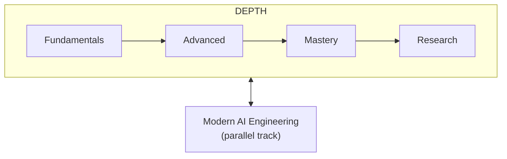
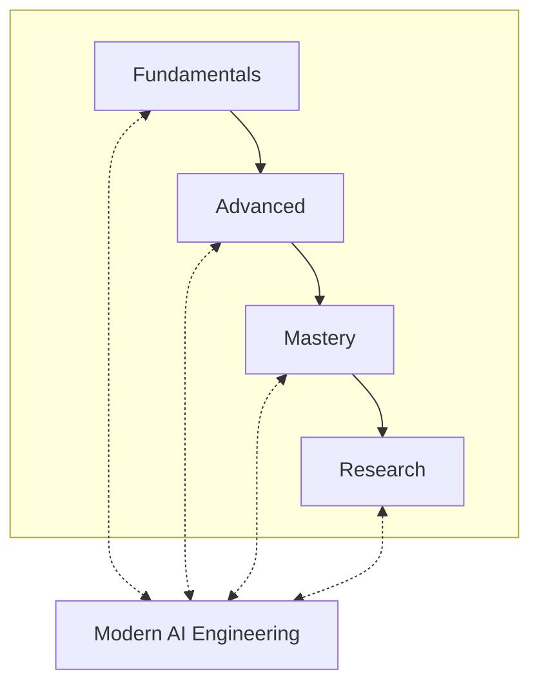
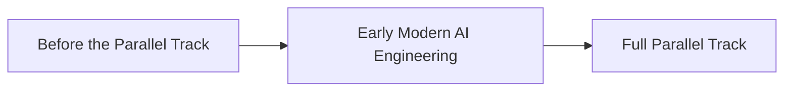
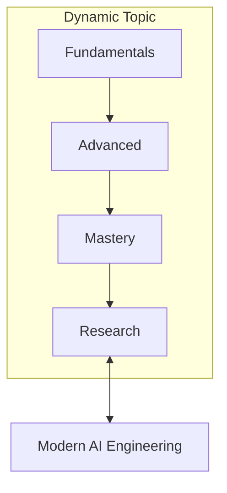
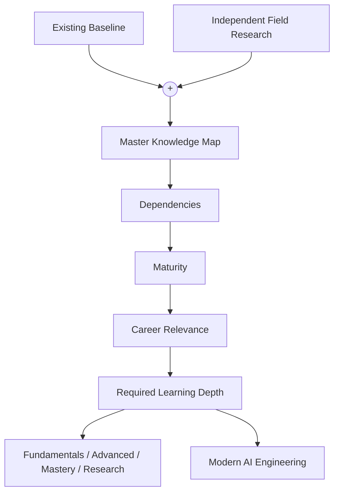

# AI Engineer — Data & Intelligence Roadmap

| | |
| --- | --- |
| **Status** | Baseline v0 |
| **Purpose** | Preserve the current learning plan before the comprehensive curriculum audit. |

This document is the canonical learning roadmap for the Data & Intelligence track of AI Engineering.

The roadmap has two dimensions:

The four primary stages represent increasing depth of knowledge.

Modern AI Engineering represents current professional practice and evolves continuously alongside the depth track.

## Contents

<b>Click to expand / collapse</b>

- [1. Fundamentals](#1-fundamentals)
  - [1. Mathematics Fundamentals](#1-mathematics-fundamentals)
  - [2. Python](#2-python)
    - [2.1 Official Python Tutorial](#21-official-python-tutorial)
    - [2.2 Python Projects](#22-python-projects)
  - [3. SQL](#3-sql)
    - [3.1 Practical SQL](#31-practical-sql)
    - [3.2 PGExercises](#32-pgexercises)
  - [4. Data Analysis](#4-data-analysis)
    - [4.1 Python for Data Analysis](#41-python-for-data-analysis)
  - [5. Machine Learning & Deep Learning](#5-machine-learning--deep-learning)
    - [5.1 Hands-On Machine Learning with Scikit-Learn and PyTorch](#51-hands-on-machine-learning-with-scikit-learn-and-pytorch)
  - [6. Natural Language Processing](#6-natural-language-processing)
    - [6.1 Speech and Language Processing](#61-speech-and-language-processing)
    - [6.2 Natural Language Processing in Action](#62-natural-language-processing-in-action)
    - [6.3 Hugging Face Audio Course](#63-hugging-face-audio-course)
  - [7. Large Language Models](#7-large-language-models)
    - [7.1 Build a Large Language Model (From Scratch)](#71-build-a-large-language-model-from-scratch)
    - [7.2 Hands-On Large Language Models](#72-hands-on-large-language-models)
- [2. Advanced](#2-advanced)
- [3. Mastery](#3-mastery)
- [4. Research](#4-research)
- [5. Modern AI Engineering](#5-modern-ai-engineering)
  - [Starting Point](#starting-point)
    - [Before the Parallel Track](#before-the-parallel-track)
    - [Early Modern AI Engineering](#early-modern-ai-engineering)
    - [Full Parallel Track](#full-parallel-track)
- [Dynamic Topics](#dynamic-topics)
- [Modern AI Review Cycle](#modern-ai-review-cycle)
  - [Every 4 Weeks](#every-4-weeks)
  - [Every 12 Weeks](#every-12-weeks)
- [Current Curriculum Boundary](#current-curriculum-boundary)
- [Existing Engineering Section — Pending Reclassification](#existing-engineering-section--pending-reclassification)
- [Curriculum Status](#curriculum-status)
- [Next Roadmap Work](#next-roadmap-work)

---

## 1. Fundamentals

**In this section:** [Mathematics](#1-mathematics-fundamentals) · [Python](#2-python) · [SQL](#3-sql) · [Data Analysis](#4-data-analysis) · [ML & DL](#5-machine-learning--deep-learning) · [NLP](#6-natural-language-processing) · [LLMs](#7-large-language-models)

**Objective**

Build the mathematical, programming, data, machine-learning, deep-learning, language-model, and AI foundations required for later study.

> **Fundamentals does not mean easy.**

A topic belongs here when sufficient understanding of it is necessary for later learning or competent AI work.

This section currently preserves the learning plan that existed before the comprehensive roadmap audit.

### 1. Mathematics Fundamentals

**Status:** Existing curriculum — detailed structure to be audited.

**Purpose:**

Develop the mathematical foundations required for machine learning, deep learning, probabilistic reasoning, optimization, and later AI study.

Detailed curriculum and resources have not yet been finalized in this repository.

### 2. Python

#### 2.1 Official Python Tutorial

**Primary resource:** *The Python Tutorial — Python Documentation*

**Purpose:**

Develop sufficient command of Python to use it confidently for data analysis, machine learning, experimentation, and AI engineering.

#### 2.2 Python Projects

Use practical projects to reinforce Python knowledge rather than relying only on passive study.

Projects should progressively exercise:

- language fundamentals;
- data structures;
- functions;
- modules;
- file handling;
- APIs;
- error handling;
- object-oriented features where appropriate; and
- practical problem solving.

The exact project sequence will be designed later.

### 3. SQL

#### 3.1 Practical SQL

**Primary resource:** *Practical SQL*

**Purpose:**

Develop practical relational-data querying and manipulation skills relevant to data and AI work.

#### 3.2 PGExercises

**Practice resource:** *PostgreSQL Exercises*

Use exercises to reinforce SQL through active problem solving.

### 4. Data Analysis

#### 4.1 Python for Data Analysis

**Primary resource:** *Python for Data Analysis*

**Purpose:**

Develop practical data manipulation, exploration, cleaning, transformation, and analysis skills using the Python data ecosystem.

### 5. Machine Learning & Deep Learning

#### 5.1 Hands-On Machine Learning with Scikit-Learn and PyTorch

**Primary resource:** *Hands-On Machine Learning with Scikit-Learn and PyTorch*

**Purpose:**

Develop the core machine-learning and deep-learning knowledge required for later AI study.

This section should eventually establish competency in both:

- understanding important ML/DL concepts; and
- implementing and applying them correctly.

The detailed coverage will be audited rather than assumed from the resource title alone.

### 6. Natural Language Processing

#### 6.1 Speech and Language Processing

**Primary resource:** *Speech and Language Processing*

**Purpose:**

Develop the scientific and conceptual foundations of modern natural language processing.

#### 6.2 Natural Language Processing in Action

**Primary resource:** *Natural Language Processing in Action*

**Purpose:**

Complement theoretical NLP study with practical implementation and applied techniques.

#### 6.3 Hugging Face Audio Course

**Primary resource:** *Hugging Face Audio Course*

**Purpose:**

Introduce practical audio and speech-related machine-learning workflows.

The relationship between speech/audio, NLP, and the future multimodal curriculum will be examined during the roadmap audit.

### 7. Large Language Models

#### 7.1 Build a Large Language Model (From Scratch)

**Author:** Sebastian Raschka

**Purpose:**

Develop implementation-level understanding of how a language model is constructed, trained, and adapted.

The emphasis is on understanding important mechanisms rather than treating LLMs exclusively as APIs.

#### 7.2 Hands-On Large Language Models

**Authors:** Jay Alammar and Maarten Grootendorst

**Purpose:**

Develop broader practical understanding of working with modern language models, representations, retrieval, fine-tuning, generation, multimodality, and related applications.

The combined coverage of both books will eventually be evaluated against the current LLM field.

[⬆ Back to Contents](#contents)

---

## 2. Advanced

**Status:** Not yet designed.

The Advanced curriculum will be created only after:

1. Fundamentals has been audited;
2. the broader Data & Intelligence landscape has been independently mapped;
3. dependencies between subjects are understood; and
4. appropriate depth boundaries have been established.

Advanced should emphasize:

- deeper theory;
- modern methods;
- alternatives;
- trade-offs;
- failure modes;
- interactions between concepts; and
- complete intelligent systems.

> ⚠️ Do not populate this section merely by moving difficult material out of Fundamentals.

[⬆ Back to Contents](#contents)

---

## 3. Mastery

**Status:** Not yet designed.

Mastery will focus on developing independent technical judgment.

Expected capabilities will eventually include:

- deriving important methods;
- implementing significant techniques;
- designing architectures;
- diagnosing failures;
- comparing approaches;
- designing experiments;
- interpreting results;
- optimizing systems;
- understanding important trade-offs; and
- defending technical decisions.

Mastery is expected to combine:

> **broad advanced knowledge + deep specialization in selected areas.**

It does not require equal expertise across every AI domain.

[⬆ Back to Contents](#contents)

---

## 4. Research

**Status:** Not yet designed.

Research represents the transition from learning established knowledge to investigating questions whose answers are not already known.

The eventual research track should develop competency in:

- literature review;
- identifying research gaps;
- hypothesis formation;
- experimental design;
- baselines;
- ablations;
- reproducibility;
- statistical reasoning;
- interpretation;
- scientific communication; and
- peer review.

Research specialization should emerge from the learner’s interests and strengths rather than requiring deep specialization in every AI field.

[⬆ Back to Contents](#contents)

---

## 5. Modern AI Engineering

**In this section:** [Starting Point](#starting-point) · [Before the Parallel Track](#before-the-parallel-track) · [Early Modern AI Engineering](#early-modern-ai-engineering) · [Full Parallel Track](#full-parallel-track)

**Status:** Parallel track — detailed curriculum not yet designed.

Modern AI Engineering is not the stage after Research.

It runs alongside:

Its purpose is to maintain practical competence with important contemporary AI capabilities, methods, architectures, and engineering practices.

### Starting Point

Modern AI Engineering should not automatically wait until Fundamentals is complete.

It should begin gradually once sufficient prerequisites exist.

A tentative progression is:

#### Before the Parallel Track

Focus primarily on:

- Python;
- data handling;
- basic mathematical foundations; and
- basic machine-learning understanding.

Modern AI developments may be followed for awareness, but should not yet become a major learning burden.

#### Early Modern AI Engineering

Once sufficient Python, data, and introductory ML competence exists, practical exposure may begin with appropriately accessible modern AI capabilities.

Possible examples include:

- model APIs;
- prompting;
- structured generation;
- embeddings;
- semantic search;
- simple retrieval-augmented systems;
- tool/function calling; and
- simple agentic workflows.

These are candidate topics, not yet an approved curriculum sequence.

#### Full Parallel Track

After sufficient Deep Learning, NLP, and LLM foundations exist, the Modern AI Engineering track can become substantially deeper.

Candidate areas include:

- context engineering;
- modern retrieval systems;
- agentic retrieval;
- tool use;
- agent architecture;
- agent harnesses;
- memory;
- planning;
- interoperability protocols;
- multimodal applications;
- model adaptation;
- reasoning models;
- evaluation;
- observability;
- AI security;
- inference techniques; and
- other important contemporary developments.

These areas will be independently researched before final inclusion.

[⬆ Back to Contents](#contents)

---

## Dynamic Topics

Some subjects may span all four depth levels while also changing rapidly in modern engineering practice.

Conceptually:

Possible examples include:

- retrieval;
- reasoning;
- tool use;
- agents;
- model adaptation;
- multimodality;
- evaluation; and
- other evolving areas.

These examples are provisional.

The comprehensive roadmap audit will determine the actual set of dynamic topics.

[⬆ Back to Contents](#contents)

---

## Modern AI Review Cycle

**In this section:** [Every 4 Weeks](#every-4-weeks) · [Every 12 Weeks](#every-12-weeks)

The Modern AI Engineering track will be maintained using two review cycles.

### Every 4 Weeks

Conduct a lightweight **Modern AI Scan**.

**Purpose:**

Discover meaningful new developments.

**Possible outcomes:**

- ignore;
- record;
- add to watchlist;
- investigate further; or
- add to current Modern AI Engineering practice.

Permanent curriculum changes should normally wait for deeper review.

### Every 12 Weeks

Conduct a comprehensive **Curriculum Review**.

**Purpose:**

Determine whether accumulated evidence requires changes to the roadmap.

**Possible outcomes include:**

- no change;
- continue watching;
- adopt as modern practice;
- integrate into Fundamentals;
- integrate into Advanced;
- integrate into Mastery;
- add to Research;
- change required depth;
- reduce emphasis;
- mark superseded; or
- archive.

Significant changes should be accompanied by evidence and reasoning.

[⬆ Back to Contents](#contents)

---

## Current Curriculum Boundary

This roadmap covers:

> **AI Engineering — Data & Intelligence**

It intentionally does not attempt to contain the complete Computer Science & Engineering curriculum.

A separate roadmap will eventually cover subjects such as:

- data structures and algorithms;
- operating systems;
- computer architecture;
- networking;
- database systems;
- distributed systems;
- backend engineering;
- general software engineering;
- cloud infrastructure;
- DevOps; and
- systems design.

Boundary areas such as MLOps, LLMOps, distributed training, inference systems, GPU computing, and data infrastructure will be assigned according to learning purpose and may appear in both roadmaps at different depths.

[⬆ Back to Contents](#contents)

---

## Existing Engineering Section — Pending Reclassification

The previous roadmap contained:

| Section | Details |
| --- | --- |
| **Software Engineering** | |
| **Development** | “Building” phase. |
| **Operations** | “Operations” phase. |
| **MLOps** | Primary resource: *Designing Machine Learning Systems* |
| **LLMOps** | Primary resource: *LLM Engineer’s Handbook* |

This structure is preserved here for historical continuity but is not yet accepted as the final organization.

Because a separate Computer Science & Engineering roadmap will exist, this material must later be examined and divided into:

- AI/ML-specific engineering that belongs in this roadmap;
- shared boundary knowledge; and
- general software/systems engineering that belongs in the separate CS & Engineering roadmap.

> ⚠️ Do not delete or reorganize this section until that audit occurs.

[⬆ Back to Contents](#contents)

---

## Curriculum Status

| Area | Status |
| --- | --- |
| Mathematics | Baseline exists; audit required |
| Python | Baseline exists |
| SQL | Baseline exists |
| Data Analysis | Baseline exists |
| Machine Learning | Baseline exists; audit required |
| Deep Learning | Baseline exists; audit required |
| NLP | Baseline exists; audit required |
| LLMs | Baseline exists; audit required |
| Advanced | Not designed |
| Mastery | Not designed |
| Research | Not designed |
| Modern AI Engineering | Concept defined; curriculum not designed |
| MLOps / LLMOps | Pending boundary review |
| Computer Science & Engineering | Separate future roadmap |

[⬆ Back to Contents](#contents)

---

## Next Roadmap Work

> ⚠️ Do not begin filling Advanced, Mastery, or Research by intuition.

The next major curriculum task is:

> **Independently reconstruct the complete contemporary Data & Intelligence landscape before deciding what belongs at each depth.**

The process should be:

This baseline should remain available so future changes can be compared against the roadmap that existed before the comprehensive audit.

[⬆ Back to Contents](#contents)

