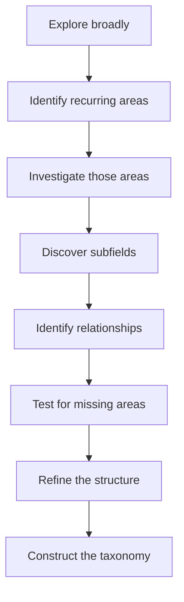
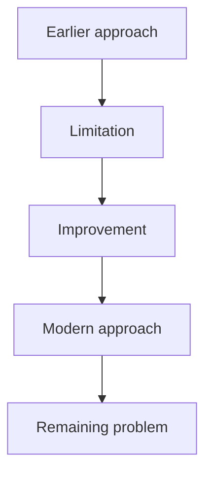
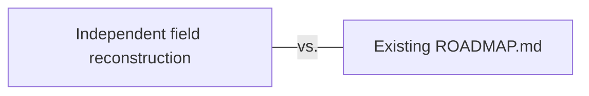

# Independent Data & Intelligence Landscape Research

## Contents

<b>Click to expand / collapse</b>

**Framing the Task**

- [Mission](#mission)
- [1. Start From a Clean Slate](#1-start-from-a-clean-slate)
- [2. Do Not Assume the Answer](#2-do-not-assume-the-answer)
- [3. Research Question](#3-research-question)
- [4. Scope Discovery](#4-scope-discovery)

**Guardrails**

- [5. Data & Intelligence Boundary](#5-data--intelligence-boundary)
- [6. Do Not Equate AI With the Current Hype Cycle](#6-do-not-equate-ai-with-the-current-hype-cycle)
- [7. Do Not Equate AI Engineering With Framework Usage](#7-do-not-equate-ai-engineering-with-framework-usage)
- [8. Do Not Build a Model-Release Timeline](#8-do-not-build-a-model-release-timeline)

**Sources and Evidence**

- [9. Source Discovery](#9-source-discovery)
- [10. Evidence Standards](#10-evidence-standards)
- [11. Time Awareness](#11-time-awareness)

**Discovering the Landscape**

- [12. Discover the Major Areas](#12-discover-the-major-areas)
- [13. Recursively Discover Subfields](#13-recursively-discover-subfields)
- [14. Discover Cross-Cutting Knowledge](#14-discover-cross-cutting-knowledge)
- [15. Discover Contemporary AI Engineering](#15-discover-contemporary-ai-engineering)
- [16. Discover Current Research Frontiers](#16-discover-current-research-frontiers)
- [17. Discover Historically Important Knowledge](#17-discover-historically-important-knowledge)
- [18. Discover Superseded and Declining Knowledge](#18-discover-superseded-and-declining-knowledge)

**Analysing Topics**

- [19. Topic Analysis](#19-topic-analysis)
  - [Name](#name) · [Definition](#definition) · [Purpose](#purpose) · [Why It Matters](#why-it-matters) · [Relationships](#relationships) · [Knowledge Character](#knowledge-character) · [Maturity](#maturity) · [Professional Relevance](#professional-relevance) · [Current Direction](#current-direction) · [Evidence](#evidence)
- [20. Do Not Assign Curriculum Levels Yet](#20-do-not-assign-curriculum-levels-yet)

**Completeness Audits**

- [21. First Completeness Audit — Structural Blind Spots](#21-first-completeness-audit--structural-blind-spots)
- [22. Second Completeness Audit — Researcher Perspective](#22-second-completeness-audit--researcher-perspective)
- [23. Third Completeness Audit — Engineering Perspective](#23-third-completeness-audit--engineering-perspective)
- [24. Fourth Completeness Audit — Outside Current Attention](#24-fourth-completeness-audit--outside-current-attention)
- [25. Fifth Completeness Audit — Dependency Analysis](#25-fifth-completeness-audit--dependency-analysis)
- [26. Sixth Completeness Audit — Neighboring Fields](#26-sixth-completeness-audit--neighboring-fields)
- [27. Seventh Completeness Audit — Emerging Future](#27-seventh-completeness-audit--emerging-future)
- [28. Taxonomy Stress Test](#28-taxonomy-stress-test)

**Deliverables**

- [29. Final Deliverable](#29-final-deliverable)
  - [A. Executive Summary](#a-executive-summary) · [B. Master Landscape](#b-master-landscape) · [C. Detailed Knowledge Map](#c-detailed-knowledge-map) · [D. Cross-Cutting Map](#d-cross-cutting-map) · [E. Contemporary AI Engineering Map](#e-contemporary-ai-engineering-map) · [F. Research Frontier Map](#f-research-frontier-map)
  - [G. Historical and Supersession Map](#g-historical-and-supersession-map) · [H. Boundary Map](#h-boundary-map) · [I. Dependency Map](#i-dependency-map) · [J. Completeness Audit](#j-completeness-audit) · [K. Uncertainties and Disagreements](#k-uncertainties-and-disagreements) · [L. Sources](#l-sources)
- [30. Only Then Compare With the Existing Roadmap](#30-only-then-compare-with-the-existing-roadmap)
- [31. Research Record](#31-research-record)
- [32. Final Principle](#32-final-principle)

---

## Mission

Independently reconstruct the contemporary Data & Intelligence landscape for an AI Engineer.

The central question is:

> **What should the complete map of Data & Intelligence knowledge for a contemporary AI Engineer look like today?**

You are not being asked to validate, expand, or complete an existing list of AI topics.

You are being asked to discover what the list itself should be.

The result of this task will later be used to design a learning roadmap.

> ⚠️ This task itself must not design or modify the curriculum.

[⬆ Back to Contents](#contents)

---

## 1. Start From a Clean Slate

**This is the most important instruction in this task.**

Do not begin with:

- the taxonomy in [ROADMAP.md](../ROADMAP.md);
- previous research reports;
- topic names elsewhere in this repository;
- an assumed “AI Engineer stack”;
- a predefined list of modern AI technologies; or
- a conventional LLM-centric taxonomy.

Existing repository content represents previous thinking.

It may contain:

- omissions;
- outdated assumptions;
- accidental emphasis;
- incomplete boundaries;
- historical artifacts; or
- blind spots.

Your task is to independently reconstruct the field first.

Only after the independent reconstruction is complete may it be compared with the existing roadmap.

[⬆ Back to Contents](#contents)

---

## 2. Do Not Assume the Answer

> ⚠️ Do not begin by creating categories and then searching for evidence to fill them.

Instead:

> **The taxonomy must be an output of the research, not an input.**

> ⚠️ Do not force symmetry.

Different areas may naturally have very different depths and structures.

[⬆ Back to Contents](#contents)

---

## 3. Research Question

Answer:

> **As of the date this research is executed, what scientific knowledge, methods, disciplines, system concepts, engineering capabilities, and research directions constitute the Data & Intelligence side of becoming an AI Engineer?**

The answer should account for both:

- durable knowledge; and
- contemporary professional practice.

> ⚠️ Do not assume that these are identical.

[⬆ Back to Contents](#contents)

---

## 4. Scope Discovery

Determine the scope through research rather than assuming it.

Investigate the contemporary AI/ML ecosystem broadly enough to discover:

- established disciplines;
- important subfields;
- foundational concepts;
- modern methods;
- cross-cutting areas;
- engineering disciplines;
- emerging practices;
- active research directions;
- important historical foundations;
- and relevant neighboring areas.

If an important area does not fit the initial structure, change the structure.

> ⚠️ Do not discard the area merely because the taxonomy cannot accommodate it.

[⬆ Back to Contents](#contents)

---

## 5. Data & Intelligence Boundary

This repository focuses on Data & Intelligence.

A separate roadmap will eventually cover general Computer Science & Engineering.

> ⚠️ However, do not use this boundary so aggressively that important AI knowledge disappears.

When an area sits near the boundary, investigate it first.

Then ask:

> Is this knowledge primarily needed to understand, develop, evaluate, or build **intelligent/data-driven systems**?

or:

> Is it primarily needed to understand and build **general computing systems**?

| If… | Then… |
| --- | --- |
| If primarily the former, | it likely belongs in this landscape. |
| If primarily the latter, | it likely belongs in the separate Computer Science & Engineering roadmap. |
| If both are important, | record the boundary explicitly. |

> ⚠️ Do not resolve ambiguous areas by omission.

[⬆ Back to Contents](#contents)

---

## 6. Do Not Equate AI With the Current Hype Cycle

> ⚠️ Do not assume that the most discussed areas of AI represent the entire field.

Current popularity must not determine the taxonomy.

Search deliberately across:

- established research communities;
- contemporary research;
- applied AI;
- industrial AI;
- scientific AI;
- production AI systems;
- specialized AI domains;
- interdisciplinary areas;
- and emerging research.

The resulting landscape must remain useful even if today’s most popular technologies change.

[⬆ Back to Contents](#contents)

---

## 7. Do Not Equate AI Engineering With Framework Usage

> ⚠️ Do not define AI Engineering as knowledge of particular:

- libraries;
- frameworks;
- APIs;
- vendors;
- model providers;
- cloud services;
- databases;
- orchestration tools;
- or products.

When such technologies appear during research, ask:

> **What transferable concept or capability does this implementation represent?**

Record the durable concept first.

Specific implementations may be retained as:

- examples;
- representative tools;
- implementation choices;
- learning resources;
- or evidence of adoption.

They should not normally define the intellectual structure of the roadmap.

[⬆ Back to Contents](#contents)

---

## 8. Do Not Build a Model-Release Timeline

Model releases may provide valuable evidence.

However, this task is not:

> “What models were released recently?”

A model release matters when it demonstrates or accelerates a meaningful change in:

- scientific understanding;
- methodology;
- capability;
- architecture;
- training;
- inference;
- system design;
- evaluation;
- engineering practice;
- or another technically important direction.

Extract the development represented by the release.

> ⚠️ Do not substitute product chronology for field reconstruction.

[⬆ Back to Contents](#contents)

---

## 9. Source Discovery

Search broadly before narrowing.

> ⚠️ Do not depend on one:

- laboratory;
- company;
- research community;
- conference;
- country;
- open-source ecosystem;
- or school of thought.

Look across multiple independent research and engineering communities.

Allow terminology differences between communities to emerge.

Determine whether differently named concepts are:

- actually different;
- closely related;
- historical variants;
- competing approaches;
- or different names for substantially the same idea.

[⬆ Back to Contents](#contents)

---

## 10. Evidence Standards

**Prefer primary evidence.**

Use approximately the following priority:

1. original research papers;
2. peer-reviewed conference or journal publications;
3. official technical reports;
4. official standards and specifications;
5. official research publications;
6. official engineering publications;
7. authoritative technical documentation;
8. strong independent technical analysis;
9. practitioner evidence when assessing real-world adoption.

Secondary sources may be useful for discovery.

> ⚠️ Do not rely on them when stronger primary evidence is available for important claims.

Open and inspect sources rather than relying only on search-result summaries.

**Cross-check consequential claims.**

[⬆ Back to Contents](#contents)

---

## 11. Time Awareness

The landscape must represent the field as of the execution date.

For each area, distinguish when relevant between:

- historical foundation;
- established modern knowledge;
- current professional practice;
- emerging development;
- active research frontier;
- experimental direction;
- declining approach;
- superseded approach.

> ⚠️ Do not assume:

| | | |
| --- | :---: | --- |
| new | = | important |
| old | = | obsolete |
| popular | = | established |
| published | = | validated |
| widely used | = | scientifically superior |

These are separate questions.

[⬆ Back to Contents](#contents)

---

## 12. Discover the Major Areas

During the first research pass, answer:

> **What are the major intellectual and engineering areas that constitute Data & Intelligence?**

> ⚠️ Do not consult the existing roadmap to answer this.

For every candidate major area:

1. establish why it belongs;
2. identify its purpose;
3. identify its major subfields;
4. identify its relationship with other areas;
5. determine whether it is foundational, specialized, cross-cutting, engineering-oriented, research-oriented, or some combination;
6. identify important dependencies.

If two areas substantially overlap, investigate whether they should:

- remain separate;
- become parent/child;
- become cross-cutting;
- or be merged.

[⬆ Back to Contents](#contents)

---

## 13. Recursively Discover Subfields

For every major area discovered, repeat the process.

Ask:

> **What knowledge constitutes this area?**

Then:

> **What knowledge constitutes each of those subfields?**

Continue until additional decomposition would become:

- implementation trivia;
- excessive specialization;
- individual-paper detail;
- vendor-specific detail;
- or inappropriate for a master landscape.

> **The goal is a knowledge map, not an encyclopedia.**

[⬆ Back to Contents](#contents)

---

## 14. Discover Cross-Cutting Knowledge

Some topics may not belong cleanly to one branch.

Identify knowledge that affects multiple areas.

> ⚠️ Do not duplicate it artificially simply to preserve a tree structure.

Where useful, represent relationships as a graph rather than forcing strict hierarchy.

Look for:

- shared foundations;
- common methodologies;
- shared evaluation concepts;
- common engineering concerns;
- shared mathematical ideas;
- common data problems;
- shared research methods;
- and other cross-cutting dependencies.

Let the evidence determine what these are.

[⬆ Back to Contents](#contents)

---

## 15. Discover Contemporary AI Engineering

Independently investigate what competent AI engineers are actually required to understand and build with today.

> ⚠️ Do not begin from a predetermined engineering stack.

Study:

- contemporary AI engineering literature;
- engineering publications;
- technical documentation;
- open-source ecosystems;
- production practices;
- system architectures;
- evaluation practices;
- failure analyses;
- technical standards;
- and credible practitioner evidence.

Determine which engineering capabilities are:

- durable;
- current but evolving;
- emerging;
- implementation-specific;
- or transient.

Extract the underlying engineering concepts.

[⬆ Back to Contents](#contents)

---

## 16. Discover Current Research Frontiers

Independently identify active research frontiers.

> ⚠️ Do not assume that current engineering topics and research frontiers are the same.

Determine:

- what problems researchers are actively trying to solve;
- why those problems remain unresolved;
- which directions have substantial evidence;
- which directions are contested;
- which directions are speculative;
- and which may materially reshape the field.

> ⚠️ Do not promote frontier research into established knowledge.

[⬆ Back to Contents](#contents)

---

## 17. Discover Historically Important Knowledge

Identify older concepts necessary to understand the modern field.

For important developments, reconstruct lineage where useful:

> ⚠️ Do not retain obsolete material merely because it existed historically.

Retain historical knowledge when it provides:

- conceptual foundations;
- important intuition;
- dependency knowledge;
- explanatory lineage;
- or lessons relevant to modern systems.

[⬆ Back to Contents](#contents)

---

## 18. Discover Superseded and Declining Knowledge

Identify concepts whose importance has materially changed.

Ask:

- What replaced them?
- Why?
- Are they still educationally valuable?
- Are they necessary to understand current approaches?
- Are they still used in particular contexts?
- Were they actually superseded, or did their role merely narrow?

> ⚠️ Avoid simplistic claims that a method is “dead” solely because something newer exists.

[⬆ Back to Contents](#contents)

---

## 19. Topic Analysis

**In this section:** [Name](#name) · [Definition](#definition) · [Purpose](#purpose) · [Why It Matters](#why-it-matters) · [Relationships](#relationships) · [Knowledge Character](#knowledge-character) · [Maturity](#maturity) · [Professional Relevance](#professional-relevance) · [Current Direction](#current-direction) · [Evidence](#evidence)

For each significant topic discovered, record the following where applicable.

### Name

Use the clearest technically accepted name.

### Definition

What is it?

### Purpose

What problem does it solve?

### Why It Matters

Why does it belong in the landscape?

### Relationships

- What does it depend on?
- What depends on it?
- What are its alternatives?
- What neighboring areas interact with it?

### Knowledge Character

Determine whether it primarily concerns:

- scientific understanding;
- intelligent-system construction;
- engineering practice;
- research;
- or some combination.

> ⚠️ Do not force mutually exclusive classification.

### Maturity

Determine whether it is:

- established;
- current practice;
- emerging;
- active research;
- experimental;
- historically important;
- declining;
- or superseded.

Use evidence rather than age alone.

### Professional Relevance

Determine whether it is:

- broadly useful to AI engineers;
- role-dependent;
- specialization-dependent;
- primarily research-oriented;
- or currently low priority for applied work.

### Current Direction

How is the area changing?

### Evidence

Record strong sources supporting these conclusions.

[⬆ Back to Contents](#contents)

---

## 20. Do Not Assign Curriculum Levels Yet

> ⚠️ Do not decide during this task whether topics belong in:

- Fundamentals;
- Advanced;
- Mastery;
- Research.

> ⚠️ Do not design a learning sequence.
>
> Do not recommend books or courses unless required for understanding the evidence.
>
> Do not modify [ROADMAP.md](../ROADMAP.md).

First establish:

> **What exists and how it fits together?**

Curriculum design comes later.

[⬆ Back to Contents](#contents)

---

## 21. First Completeness Audit — Structural Blind Spots

After constructing the initial taxonomy, challenge it.

Ask:

> **If this taxonomy were wrong or incomplete, what kinds of areas would it be most likely to omit?**

> ⚠️ Do not answer only from the taxonomy itself.

Perform new searches designed to discover areas outside it.

Update the landscape where evidence supports doing so.

[⬆ Back to Contents](#contents)

---

## 22. Second Completeness Audit — Researcher Perspective

Ask:

> **What would an experienced researcher from different parts of AI/ML notice is missing, oversimplified, or incorrectly grouped?**

> ⚠️ Do not assume one research community represents all of AI.

Investigate identified gaps.

[⬆ Back to Contents](#contents)

---

## 23. Third Completeness Audit — Engineering Perspective

Ask:

> **What would experienced engineers building real AI systems notice is missing?**

Investigate actual engineering concerns that purely academic reconstruction may overlook.

> ⚠️ Do not assume engineering importance implies foundational scientific importance.

Preserve that distinction.

[⬆ Back to Contents](#contents)

---

## 24. Fourth Completeness Audit — Outside Current Attention

Ask:

> **What important areas could have been overlooked because current attention is concentrated on a small number of fashionable AI directions?**

Perform new searches outside the dominant current discourse.

> ⚠️ Do not predefine what those neglected areas must be.

Let the search reveal them.

[⬆ Back to Contents](#contents)

---

## 25. Fifth Completeness Audit — Dependency Analysis

Construct a dependency view.

Ask:

> **Does any important area depend on knowledge that the landscape never introduced?**

Work backward.

If important prerequisites are missing, investigate and add them where justified.

[⬆ Back to Contents](#contents)

---

## 26. Sixth Completeness Audit — Neighboring Fields

Examine the boundaries of the reconstructed landscape.

Ask:

> **Which neighboring disciplines contribute knowledge that a serious AI Engineer may need?**

Determine whether each belongs:

- inside Data & Intelligence;
- at the boundary;
- in a specialization;
- or outside this roadmap.

> ⚠️ Do not expand the roadmap simply because a neighboring field is interesting.

[⬆ Back to Contents](#contents)

---

## 27. Seventh Completeness Audit — Emerging Future

Ask:

> **Which technically credible developments could materially change this landscape over the next several years?**

Classify carefully between:

- emerging;
- active frontier;
- speculative.

The purpose is awareness, not prediction.

> ⚠️ Do not assume these topics deserve permanent curriculum placement.

[⬆ Back to Contents](#contents)

---

## 28. Taxonomy Stress Test

After all completeness passes, challenge the taxonomy itself.

Ask:

- Are categories based on genuine intellectual structure or merely current terminology?
- Are some branches disproportionately detailed because they are fashionable?
- Are established fields underrepresented because they generate less news?
- Are engineering practices being confused with scientific disciplines?
- Are research frontiers being mistaken for foundations?
- Are frameworks masquerading as concepts?
- Are vendor terms being treated as universal terminology?
- Are historical categories retained after their conceptual usefulness has disappeared?
- Are important relationships hidden by the hierarchy?
- Would a graph or cross-cutting classification better represent some areas?

Revise where justified.

[⬆ Back to Contents](#contents)

---

## 29. Final Deliverable

**In this section:** [A](#a-executive-summary) · [B](#b-master-landscape) · [C](#c-detailed-knowledge-map) · [D](#d-cross-cutting-map) · [E](#e-contemporary-ai-engineering-map) · [F](#f-research-frontier-map) · [G](#g-historical-and-supersession-map) · [H](#h-boundary-map) · [I](#i-dependency-map) · [J](#j-completeness-audit) · [K](#k-uncertainties-and-disagreements) · [L](#l-sources)

Produce an independent research report.

> ⚠️ Do not modify the canonical roadmap.

The report should contain:

### A. Executive Summary

Explain the overall shape of the contemporary Data & Intelligence landscape and the most important findings.

### B. Master Landscape

Present the independently discovered taxonomy.

The taxonomy should emerge from the research rather than mirror the repository.

### C. Detailed Knowledge Map

For each major area and significant subfield, document:

- definition;
- purpose;
- importance;
- relationships;
- dependencies;
- knowledge character;
- maturity;
- professional relevance;
- current direction;
- evidence.

### D. Cross-Cutting Map

Identify concepts that span multiple branches.

### E. Contemporary AI Engineering Map

Present the engineering capabilities and practices discovered independently.

Distinguish durable concepts from temporary implementations.

### F. Research Frontier Map

Present major active research areas and unresolved questions.

### G. Historical and Supersession Map

Show important technical evolution where historical lineage matters.

### H. Boundary Map

Document important boundaries with neighboring disciplines and Computer Science & Engineering.

### I. Dependency Map

Show major prerequisite relationships.

### J. Completeness Audit

Document:

- what each audit looked for;
- what it discovered;
- what was added or changed as a result;
- and where uncertainty remains.

### K. Uncertainties and Disagreements

Identify areas where:

- terminology is unsettled;
- evidence conflicts;
- maturity is uncertain;
- adoption is unclear;
- boundaries are disputed;
- or future significance is difficult to assess.

### L. Sources

Maintain an organized source record emphasizing primary evidence.

[⬆ Back to Contents](#contents)

---

## 30. Only Then Compare With the Existing Roadmap

After the independent report is complete, read [ROADMAP.md](../ROADMAP.md).

> ⚠️ Do not alter the independent taxonomy merely to make comparison easier.

Produce a separate gap-analysis report comparing:

Identify:

- clearly represented knowledge;
- partially represented knowledge;
- missing knowledge;
- possible overemphasis;
- outdated assumptions;
- missing dependencies;
- boundary problems;
- areas needing further research.

> ⚠️ Do not modify [ROADMAP.md](../ROADMAP.md).
>
> Do not automatically recommend that every discovered topic be added.

This comparison provides evidence for the later curriculum-design phase.

[⬆ Back to Contents](#contents)

---

## 31. Research Record

Preserve enough information that future reviews can understand:

- when the research was performed;
- which sources were consulted;
- what evidence supported important conclusions;
- where uncertainty existed;
- and why the taxonomy took its final form.

The research should be reproducible enough that a future review can meaningfully challenge it.

[⬆ Back to Contents](#contents)

---

## 32. Final Principle

The objective is not:

> Produce the largest possible list of AI topics.

The objective is:

> **Discover the most defensible structure of the Data & Intelligence field for the purpose of eventually building a rigorous AI Engineer learning roadmap.**

Prefer:

- evidence over hype;
- concepts over products;
- structure over accumulation;
- dependencies over arbitrary ordering;
- uncertainty over false confidence;
- durable knowledge over temporary terminology;
- and independent discovery over confirmation of the existing roadmap.

[⬆ Back to Contents](#contents)

