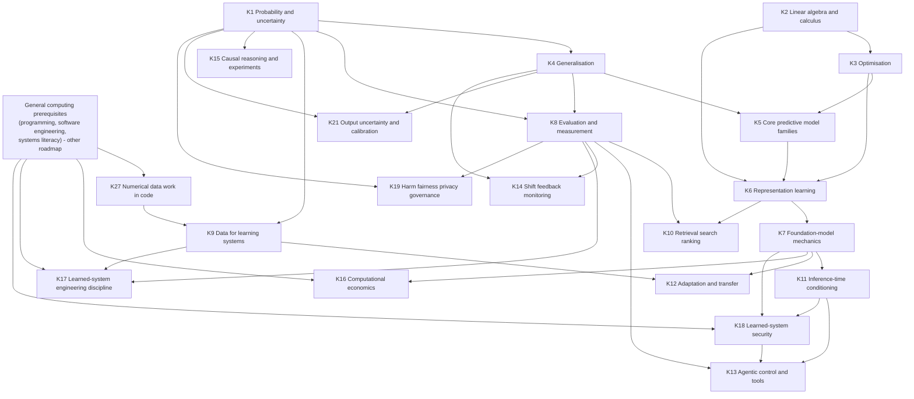
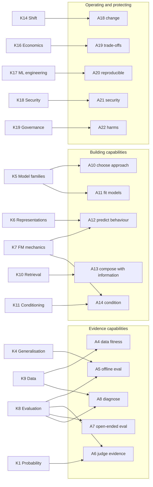

# Independent Capability Reconstruction for the Data and Intelligence AI Engineer

**Audit phase:** Phase I, blind reconstruction (frozen on completion)
**Audit date:** 2026-09-18
**Produced by:** a separate research agent working without access to the project's curriculum artifacts
**Status:** Frozen input for Phase II adversarial comparison. This document makes no comparison with the project's existing curriculum and must not be read as one.

## Contents

<b>Click to expand / collapse</b>

- [Integrity and Independence Record](#integrity-and-independence-record)
- [Reading Guide and Terminology](#reading-guide-and-terminology)
- [1. Research Method](#1-research-method)
- [2. Evidence Base](#2-evidence-base)
- [3. Capability Reconstruction](#3-capability-reconstruction)
- [4. Knowledge Reconstruction](#4-knowledge-reconstruction)
- [5. Independent Dependency Map](#5-independent-dependency-map)
- [6. Depth Requirements](#6-depth-requirements)
- [7. Boundary Findings](#7-boundary-findings)
- [8. Non-LLM Stress Test](#8-non-llm-stress-test)
- [9. Historical Stress Test](#9-historical-stress-test)
- [10. Durability Stress Test](#10-durability-stress-test)
- [11. Severe Budget Curriculum](#11-severe-budget-curriculum)
- [12. Uncertainties](#12-uncertainties)
- [13. Sources](#13-sources)

---

## Integrity and Independence Record

### (a) Owner's integrity statement

This reconstruction was produced before reading the project's existing roadmap, curriculum proposal, resource audits, targeted resource research, or their conclusions.

This statement is true for the agent that produced this document. No file inside the repository was opened, listed, searched or otherwise inspected. The only repository action taken was the single Write call that created this file.

### (b) Orchestration disclosure

Orchestration disclosure: this reconstruction was commissioned by an orchestrating session that had itself read and authored the project's existing curriculum artifacts. To preserve blindness, the reconstruction was delegated to a separate research agent with no access to that session's context. The agent's brief consisted of the owner's Phase I specification, reproduced verbatim apart from stricter file-access rules, plus four neutral scope statements supplied in place of the repository's governance files. The agent was instructed to read no repository file. Residual risk: the brief was assembled by a session that had seen the project; the four scope statements are reproduced below so readers can check them for leakage.

### (c) The four governance facts supplied to the agent

1. The repository concerns the Data & Intelligence side of AI Engineering: knowledge primarily necessary to understand and build intelligent and data-driven systems.
2. General Computer Science & Engineering (general computing and software-systems knowledge) belongs primarily to a separate, future roadmap. Boundary areas may appear in both at different depths.
3. Evidence quality matters: prefer primary sources; distinguish evidence from adoption; do not manufacture certainty.
4. This is a learning curriculum, not an industry news feed.

The agent's own reading of these four statements: they define scope and evidence standards; they contain no topic list, taxonomy, resource name or conclusion. The brief did, however, contain the owner's specification, which names example subject words (mathematics, statistics, machine learning, transformers, retrieval, agents, evaluation, security, serving) as things not to assume, and gives four example capability statements as illustrations of form. Those words were visible to the agent. They are generic field vocabulary rather than project-specific content, but a Phase II auditor should be aware that the reconstruction was not produced in a vocabulary vacuum.

### (d) Local file access log

| Action | Path | Purpose | Rule status |
|---|---|---|---|
| Write (create) | `/Users/lakshmideepak/LearningLab/ai-engineer-roadmap/research/2026-09-18-independent-capability-reconstruction.md` | This output file | Permitted |

No local file was read, listed, grepped, globbed or otherwise inspected. No Bash command was run. The permitted temporary directory `/private/tmp/claude-501/phase1-blind/` was not created because no download was needed.

> ⚠️ **Disclosure of an automatic tool side effect.** One WebFetch call (to a University of Pennsylvania PDF describing the AI knowledge area of the ACM/IEEE-CS/AAAI CS2023 curriculum) returned binary PDF content that the fetch tool could not parse. The tool reported that it had automatically saved the binary to a path under `/Users/lakshmideepak/.claude/projects/.../tool-results/`. The agent did not request this save and did **not** open, read, list or otherwise access that file or directory. The path is known only because the tool's own output message stated it. No rule was intentionally broken; this is recorded for completeness because the save location falls inside a directory the brief placed off-limits for reading.

No built-in browser pane tool, SendMessage, agent-listing or session-management tool was used. No project curriculum content was seen at any point.

### (e) Search availability and evidence discovery

- **Tools used:** WebSearch (a general web search returning titles, URLs and summarized snippets) and WebFetch (retrieval of a single URL with a summarizing model). Both were available throughout.
- **Discovery method:** candidates were discovered by targeted queries for known primary works (named papers, textbooks, standards, university course pages) rather than by open-ended "AI engineer roadmap" style queries. The agent deliberately did not search for other AI-engineer roadmaps, curricula lists, or "top skills" articles, to avoid anchoring on existing taxonomies of the same kind the project might hold.
- **Limitations:** most items were assessed via search-result summaries (tier "Indirect") rather than full-text reading; five pages were fetched and read directly. One PDF (CS2023 AI area) could not be parsed, so CS2023 claims rest on snippets and prior knowledge and are marked accordingly. The agent's own background knowledge of the field (training data up to 2026) informed which primary works to look for; where a conclusion rests on that background rather than a retrieved source, it is labelled Inference or Judgment, not Observed.

[⬆ Back to Contents](#contents)

---

## Reading Guide and Terminology

This document uses its own temporary vocabulary, invented for this reconstruction.

**Capabilities** are labelled **A1 to A27** ("A" for ability). **Knowledge areas** are labelled **K1 to K27**.

**Universality tiers** (who needs a capability):

| Tier | Meaning |
|---|---|
| **Everyone** | Required by nearly every strong AI Engineer working in Data and Intelligence |
| **Many** | Required by many AI Engineers, but a strong engineer could lack it in some roles |
| **Branch** | Required by particular specializations |
| **Frontier** | Required primarily by researchers |

**Durability classes:** durable; established modern; current practice; emerging; experimental (as defined by the owner).

**Maturity endpoints:** Awareness; Use; Understand; Implement; Design; Research (as defined by the owner). An endpoint names the deepest level the learner must reach, not the only level they pass through.

**Map zones** used in the dependency map (Section 5):

| Zone | Meaning |
|---|---|
| **Trunk** | Universal knowledge dependencies; without them the Everyone capabilities cannot form |
| **Canopy** | Important extensions that most strong engineers eventually acquire |
| **Branches** | Specialization-level knowledge |
| **Frontier** | Research-oriented knowledge |
| **Practice layer** | Contemporary engineering practice that sits on top of the trunk and changes fastest |

**Evidence labels** attached to important conclusions: **Observed** (directly supported by retrieved source evidence), **Inference** (reasoned from multiple observations), **Judgment** (curriculum-design conclusion not establishable as fact), **Uncertain**. Each carries a confidence: **High / Medium / Low**. Written compactly as, for example, *[Inference, Medium]*.

[⬆ Back to Contents](#contents)

---

## 1. Research Method

### 1.1 Order of work

1. **Evidence gathering first, topic-agnostic where possible.** Research targeted evidence about what practitioners actually do and where intelligent systems actually fail (interview studies, case-study surveys, failure taxonomies), before looking at textbooks and course structures. The intent was to derive capability demands from practice and failure, not from how subjects are traditionally packaged.
2. **Pass A (capabilities).** Capability statements were drafted from four kinds of evidence: (i) documented failure modes of deployed learned systems; (ii) documented workflows and pain points reported by engineers; (iii) the capabilities implied by risk and governance standards; (iv) the capabilities implied by what strong university programs assess in project work. Each capability was then classified on universality, durability, consequence of absence and required maturity.
3. **Pass B (knowledge).** Only after the capability list was fixed, knowledge areas were derived by asking, for each capability, "what must a person understand to do this reliably, and what breaks without it?" Textbooks and syllabi were consulted at this stage only as evidence about prerequisite structure and conceptual dependencies, not to decide inclusion.
4. **Stress tests.** Four stress tests (non-LLM, historical, durability, severe budget) were run against the reconstruction, and the reconstruction was revised where they exposed problems. The revisions are noted in the relevant sections.
5. **Freeze.** The document was written once and frozen.

### 1.2 Principles applied

- **Capability before subject.** No subject was admitted because it is conventional. Each knowledge area must name the capability that requires it.
- **Importance is separate from teachability.** Resource availability was never used as an inclusion argument. No learning resources are selected in this document; books and courses appear only as evidence.
- **Adoption is not evidence of durability.** Rapid adoption of a technique (for example a tool-integration protocol) was treated as evidence of current practice only.
- **Failure evidence weighs heavily.** A recurring, documented failure mode in real systems is treated as strong evidence that the capability to prevent or diagnose it belongs near the trunk.
- **Harsh reading of "strong".** "Strong contemporary AI Engineer" was interpreted as someone who can independently build, evaluate, ship, diagnose and improve systems whose behaviour depends on learned models and data, and who can judge evidence about such systems. It was not interpreted as "model researcher" nor as "API integrator".

### 1.3 Working definition reached (not assumed)

After Pass A, the evidence supported the following working definition, which is stated here so readers can test the rest of the document against it:

> A strong contemporary AI Engineer in Data and Intelligence is someone who can turn an ill-defined goal into a system whose behaviour is produced by learned models and external information, **and can produce trustworthy evidence about how well that system works, why it fails, and what it costs**, across the system's lifetime.

*[Judgment, Medium]* The second half of the definition (evidence, diagnosis, cost, lifetime) is what the practice evidence most consistently emphasizes and what distinguishes the role from both general software engineering and model research.

[⬆ Back to Contents](#contents)

---

## 2. Evidence Base

### 2.1 Evidence streams

| Stream | Examples used | What it contributed | Weight |
|---|---|---|---|
| Peer-reviewed empirical studies of practice | Amershi et al. 2019 (Microsoft, ICSE-SEIP); Shankar et al. 2022/2024 (MLOps interview study, CSCW/PACM HCI); Parnin et al. 2023/2025 (product copilot interview study); Paleyes, Urma and Lawrence 2022 (ACM Computing Surveys) | What engineers actually do, where the workflow breaks | High |
| Peer-reviewed failure and risk evidence | Sculley et al. 2015 (NeurIPS); Kapoor and Narayanan 2023 (Patterns); Greshake et al. 2023 (AISec); Cemri et al. 2025 (multi-agent failure taxonomy); Rabanser et al. 2019 (NeurIPS); Guo et al. 2017 (ICML) | Documented failure modes that capabilities must prevent or diagnose | High |
| Evaluation science | Liang et al. HELM (TMLR); Zheng et al. 2023 (NeurIPS, LLM-as-judge); Shankar et al. 2024 (UIST, criteria drift); Yao et al. tau-bench (ICLR 2025); Breck et al. 2017 (IEEE Big Data, ML Test Score) | How evidence about learned systems is produced and where it misleads | High |
| University curricula | Stanford CS329S (ML systems design); CMU 17-645 / 11-695 (Machine Learning in Production / AI Engineering); Stanford CS336 (Language Modeling from Scratch); ACM/IEEE-CS/AAAI CS2023 AI knowledge area | What strong programs treat as teachable engineering competence and what they reserve for specialists | Medium to High |
| Authoritative textbooks (structure only) | Hardt and Recht, *Patterns, Predictions, and Actions*; Murphy, *Probabilistic Machine Learning* (2 vols); Prince, *Understanding Deep Learning*; Bishop and Bishop, *Deep Learning: Foundations and Concepts*; Huyen, *AI Engineering*; Kästner, *Machine Learning in Production*; Kohavi, Tang and Xu, *Trustworthy Online Controlled Experiments*; Hyndman and Athanasopoulos, *Forecasting: Principles and Practice*; Sutton and Barto, *Reinforcement Learning* | Conceptual prerequisite structure; where fields draw their own boundaries | Medium (structure evidence, not inclusion evidence) |
| Standards and regulation | NIST AI RMF 1.0 and AI 600-1 Generative AI Profile; ISO/IEC 42001 and 22989; EU AI Act implementation timeline; OWASP Top 10 for LLM Applications 2025; Model Context Protocol specification | Capabilities implied by risk management, security and interoperability obligations | Medium to High |
| Research-lab and foundational technical papers | Lewis et al. 2020 (RAG); Hoffmann et al. 2022 (compute-optimal scaling); Covington et al. 2016 (two-stage recommendation); Radford et al. 2023 (Whisper); Grinsztajn et al. 2022 (tabular benchmark); Mitchell et al. 2019 (model cards); Gebru et al. (datasheets) | Durable mechanisms beneath current patterns; non-LLM counterweights | High |
| Official engineering guidance from labs | Anthropic, "Building effective agents" and "Effective context engineering for AI agents" | Current practice for agentic systems | Medium (single-organization guidance; treated as practice evidence, not as principle) |
| Field-level landscape | Stanford HAI AI Index 2026 | Adoption, transparency and benchmark trends | Medium (adoption evidence only) |

### 2.2 What was deliberately not used

- Job-posting keyword frequency, GitHub stars, influencer roadmaps, vendor product pages, and other AI-engineer roadmaps. The AI Index noted demand growth for skills named after specific agent frameworks; that observation was recorded as adoption evidence and given no curricular weight.
- Framework documentation as a structuring source. The single protocol specification consulted (MCP) was used only to characterise the current state of tool-integration practice.

### 2.3 Key observations that shaped the reconstruction

1. **ML-specific engineering problems are distinct from general software problems.** Amershi et al. report three differentiators: data discovery, management and versioning are much more complex; model customization and reuse require different skills; and AI components are harder to handle as distinct modules. Sculley et al. document ML-specific debt (entanglement, hidden feedback loops, undeclared consumers, data dependencies, configuration debt, changes in the external world). *[Observed, High]*
2. **The operational loop is data, experimentation, staged evaluation, monitoring.** Shankar et al.'s interviews with 18 ML engineers describe a continual loop of data collection and labeling, experimentation, multi-stage evaluation and deployment, and monitoring, with success governed by velocity, validation and versioning. Paleyes et al. find challenges at every stage of the deployment workflow. *[Observed, High]*
3. **For foundation-model applications, evaluation and prompt iteration dominate engineering effort.** Parnin et al.'s 26 interviews report prompt engineering and testing as extremely time-consuming. Shankar et al. 2024 show that evaluation criteria themselves shift as engineers observe outputs ("criteria drift"), and that model-based evaluators inherit the failures of the models they evaluate. Zheng et al. document position, verbosity and self-enhancement bias in model judges. *[Observed, High]*
4. **Evaluation errors are widespread even among experts.** Kapoor and Narayanan found leakage affecting at least 294 papers across 17 fields, classified into eight leakage types. *[Observed, High]*
5. **Reliability, not only average capability, is the deployment problem for action-taking systems.** tau-bench showed an agent with over 60% average task success falling below 25% when success on all of 8 repeated trials was required. Cemri et al.'s taxonomy of multi-agent failures attributes most failures to specification problems, inter-agent misalignment and weak verification. *[Observed, High]*
6. **Security failures of learned systems arise from the mixing of instructions and data.** Indirect prompt injection (Greshake et al.) and OWASP's 2025 list (prompt injection first for the second consecutive edition; excessive agency as a distinct risk) establish model-specific threats that general application security does not cover. *[Observed, High]*
7. **Classical methods remain state of the art in important regimes.** Tree-based ensembles outperformed deep learning on medium-sized tabular data across 45 datasets (Grinsztajn et al. 2022); newer tabular foundation models are an active research counter-trend. *[Observed, High for the 2022 finding; Uncertain for how far 2025 to 2026 tabular foundation models have changed practice]*
8. **Strong programs frame the discipline around systems, not models.** CS329S's lecture sequence runs from understanding ML production through data, features, model development, offline evaluation, deployment, failure diagnosis and distribution shift, monitoring and continual learning, infrastructure, and business integration. CMU's course emphasizes requirements, architecture, quality assurance from model testing to system testing, MLOps and responsible engineering (safety, security, fairness, explainability, transparency). *[Observed, High]*
9. **Foundation-model engineering has its own recognisable body of practice.** Huyen's *AI Engineering* allocates two of ten chapters to evaluation, and others to prompting, retrieval and agents, fine-tuning, dataset engineering, inference optimization, and architecture with user feedback. *[Observed, High for the book's structure; Judgment, Medium that this structure reflects the field rather than one author]*
10. **Transparency is decreasing at the frontier.** The AI Index 2026 reports the Foundation Model Transparency Index falling from 58 to 40. This raises the value of engineers' ability to evaluate models they cannot inspect. *[Observed, Medium; Inference, Medium for the curricular implication]*
11. **Governance obligations have become concrete.** EU AI Act obligations for general-purpose AI model providers applied from 2 August 2025, with high-risk system obligations from 2 August 2026; NIST AI 600-1 lists twelve generative-AI risk areas mapped to govern, map, measure, manage functions; ISO/IEC 42001 specifies an AI management system. *[Observed, High for existence and dates as reported by secondary legal summaries; Uncertain for any later amendment to the EU timetable not found in this research]*

[⬆ Back to Contents](#contents)

---

## 3. Capability Reconstruction

### 3.1 How capabilities were found

Capabilities were drafted by asking, of each observation in Section 2.3, "what must someone be able to do so that this failure does not happen, or so that this workflow step is done well?" Near-duplicates were merged. Capabilities that could not be tied to a consequence of absence were challenged and either merged or demoted.

The capabilities are grouped into six families that emerged from the drafting (they were not chosen in advance):

- **Framing and deciding** (what to build, what "good" means, whether to ship)
- **Evidence** (producing trustworthy evidence about learned behaviour)
- **Building with learned components** (choosing, fitting, conditioning and composing models)
- **Operating over time** (change, cost, reproducibility)
- **Protecting** (security, harm, governance)
- **Specialist and research reach**

### 3.2 Capability statements

**Framing and deciding**

- **A1. Frame a goal as a prediction, generation, ranking or decision problem, or recognise that learning is the wrong tool.** Define the target, the unit of prediction, what the output will drive, and what a simpler non-learned baseline would achieve.
- **A2. Specify success operationally.** Translate stakeholder goals into measurable criteria, including asymmetric error costs, acceptable failure rates, latency and cost ceilings, and the population on which success must hold.
- **A3. Make and communicate release and continuation decisions under uncertainty.** Decide go or no-go, rollback, or abandonment from imperfect evidence, and explain the evidence and its limits to non-specialists.

**Evidence**

- **A4. Assess data for fitness for purpose.** Establish provenance, label quality, coverage and representativeness, temporal structure, and hidden dependencies before and during use.
- **A5. Construct valid offline evaluations.** Design splits and test sets that match deployment conditions, prevent leakage, include meaningful baselines, and choose metrics that reflect the decision the system supports.
- **A6. Determine whether evidence supports one system over another.** Quantify variability, sample-size limits and multiple-comparison effects; distinguish real improvement from noise, overfitting to a test set, benchmark contamination or evaluator bias.
- **A7. Evaluate open-ended and generative outputs.** Build rubrics, collect and reconcile human judgments, and validate automated or model-based graders against human judgment before trusting them.
- **A8. Diagnose why an intelligent system is failing.** Localise failures to data, model, retrieval, conditioning, orchestration, integration, or changed conditions, through systematic error analysis rather than trial and error.
- **A9. Measure real-world impact causally.** Use randomized experiments or credible quasi-experimental reasoning to establish that a system change caused an outcome change; recognise when offline and online results legitimately disagree.

**Building with learned components**

- **A10. Choose a modelling approach under constraints.** Select among rules, classical learners, pretrained models used as-is, hosted foundation models, adapted models and combinations, on grounds of data, quality, cost, latency, privacy and maintainability.
- **A11. Fit a learned model end to end and diagnose training behaviour.** Train, regularise and tune a model at modest scale; recognise underfitting, overfitting, optimisation failure and data problems from learning behaviour.
- **A12. Predict the behaviour of dominant model families from their mechanics.** Anticipate how representation, tokenization, context length, sampling, training data and post-training shape what a model will and will not do, including confident error.
- **A13. Construct a system whose behaviour depends on learned models and external information.** Connect models to retrieved documents, databases, candidate sets or other models, so that outputs are grounded in information the model was not trained on.
- **A14. Condition model behaviour at inference time.** Construct instructions, examples, context and output constraints that reliably elicit required behaviour, within a finite context budget.
- **A15. Build systems in which models take actions.** Give models tools and control over steps while bounding autonomy, verifying progress, and preferring fixed workflows where they suffice.
- **A16. Improve behaviour through data and adaptation.** Curate, label, synthesise and filter data, and adapt pretrained models (fine-tuning and lighter-weight adaptation) when conditioning and retrieval are insufficient.
- **A17. Design human interaction with, and oversight of, learned behaviour.** Decide where humans review, how uncertainty is surfaced, how feedback is captured, and how over-reliance is avoided.

**Operating over time**

- **A18. Detect and respond to change.** Monitor inputs, outputs and outcomes; detect distribution shift and feedback loops; decide when to retrain, re-index, re-prompt or roll back.
- **A19. Reason about quality, cost, latency and reliability trade-offs.** Estimate the computational and monetary cost of a model choice, understand the levers (model size, batching, caching, quantization, cascades, routing) and their quality consequences.
- **A20. Keep learned systems reproducible and maintainable.** Version data, models, prompts and configuration; track experiments; test ML-specific properties; recognise and limit ML-specific technical debt.

**Protecting**

- **A21. Anticipate and mitigate threats specific to learned systems.** Threat-model prompt injection (direct and indirect), data and model poisoning, sensitive-data leakage, excessive agency, and model supply-chain risks.
- **A22. Identify and mitigate harms and meet governance obligations.** Recognise unfair performance disparities, privacy exposure, unsafe outputs and misuse; document models and data; operate within applicable risk frameworks and law.

**Specialist and research reach**

- **A23. Read, reproduce and critically appraise research and benchmark claims.** Judge whether a published method or vendor benchmark claim will transfer to one's own problem.
- **A24. Build systems that learn from their own decisions.** Model sequential decisions, exploration and delayed feedback (bandits, reinforcement learning, off-policy evaluation).
- **A25. Work with the specific structure of non-text modalities.** Exploit and respect the properties of images, audio, time series, graphs and tabular data.
- **A26. Pretrain or substantially post-train large models.** Run large-scale training, including distributed training, data pipelines at scale and preference-based post-training.
- **A27. Advance methods.** Invent and validate new architectures, objectives, algorithms or evaluation methodology.

### 3.3 Capability classification

| ID | Capability (short) | Universality | Durability | Without this capability, an AI Engineer would be unable to ... | Required maturity | Evidence |
|---|---|---|---|---|---|---|
| A1 | Frame the problem, or decline learning | Everyone | Durable | avoid building the wrong system, or a learned system where a rule would do better | Design | Inference, High (CS329S, CMU requirements focus, Huyen ch.1 "whether to build") |
| A2 | Specify success operationally | Everyone | Durable | know whether the system works, or stop iterating on proxies that do not reflect the goal | Design | Inference, High |
| A3 | Release decisions and communication | Everyone | Durable | responsibly ship, roll back or retire a system, or justify those decisions | Design | Judgment, Medium |
| A4 | Assess data fitness | Everyone | Durable | detect that a model's apparent quality is an artefact of biased, leaky or mislabelled data | Implement | Observed, High (Amershi; Paleyes; Gebru datasheets) |
| A5 | Valid offline evaluation | Everyone | Durable | produce any trustworthy estimate of how the system will behave after deployment | Design | Observed, High (Kapoor and Narayanan; CS329S) |
| A6 | Judge evidence between systems | Everyone | Durable | tell a real improvement from noise, benchmark overfitting, contamination or grader bias | Understand, applied at Implement level | Inference, High |
| A7 | Evaluate open-ended outputs | Everyone | Established modern (methods still maturing) | assess any generative component, which now appears in most AI products | Design | Observed, High (Zheng; Shankar 2024; Parnin; HELM) |
| A8 | Diagnose failures | Everyone | Durable | improve a system except by guesswork | Design | Observed, High (Sculley; CS329S failure diagnosis; Cemri) |
| A9 | Causal impact measurement | Many | Durable | establish that a deployed change improved outcomes rather than coincided with them | Understand (Use for experiment platforms) | Observed, Medium (Kohavi et al.) |
| A10 | Choose modelling approach | Everyone | Durable principle, time-sensitive options | make defensible build, buy, adapt or skip decisions | Design | Inference, High |
| A11 | Fit and diagnose training at modest scale | Everyone | Durable | adapt a model, build a classical predictor, or understand why a fine-tune failed | Implement | Judgment, Medium (see Section 12, uncertainty U2) |
| A12 | Predict model behaviour from mechanics | Everyone | Established modern | explain or anticipate hallucination, context failures, tokenization artefacts, sampling variance | Understand | Inference, High (Huyen ch.2; CS336) |
| A13 | Compose models with external information | Everyone | Established modern | ground outputs in private or current information, or build search, ranking and recommendation | Design | Observed, High (Lewis et al.; Covington et al.; Huyen ch.6) |
| A14 | Condition at inference time | Everyone | Current practice over an established modern core | use foundation models effectively at all | Implement | Observed, High (Parnin; Anthropic context engineering) |
| A15 | Action-taking systems | Many | Emerging to current practice | build agents safely, or recognise when an agent is the wrong design | Design | Observed, Medium (tau-bench; Cemri; Anthropic guidance). Judgment, Low on how fast this becomes Everyone |
| A16 | Improve through data and adaptation | Many | Established modern | improve behaviour past what conditioning and retrieval can reach | Implement | Observed, Medium (Huyen ch.7-8) |
| A17 | Human oversight and feedback design | Many | Durable principle | prevent over-reliance or capture the feedback that drives improvement | Understand to Design | Inference, Medium (Huyen ch.10; NIST "human-AI configuration") |
| A18 | Detect and respond to change | Everyone | Durable | keep a deployed system working as the world, users or upstream models change | Implement | Observed, High (Sculley; Rabanser; Shankar 2022) |
| A19 | Quality, cost, latency trade-offs | Everyone | Durable principle, time-sensitive numbers | design an economically viable system or explain its latency | Understand (Design for cost-critical roles) | Observed, High (Huyen ch.9; CS329S) |
| A20 | Reproducibility and maintainability | Everyone | Durable | reproduce a result, audit a regression, or keep debt from compounding | Implement | Observed, High (Sculley; Breck; Shankar) |
| A21 | Learned-system security | Everyone | Emerging threats on a durable principle (instruction and data confusion) | ship any system exposed to untrusted input or granted tool access | Design (at application level) | Observed, High (Greshake; OWASP 2025) |
| A22 | Harms and governance | Everyone | Durable principles, time-sensitive law | recognise foreseeable harm or meet documentation and risk obligations | Use to Understand (Design for regulated domains) | Observed, High (NIST; ISO 42001; EU AI Act; Mitchell; Gebru) |
| A23 | Appraise research and claims | Everyone (at Use) / Frontier (at Research) | Durable | keep current without being misled by benchmark marketing | Use | Inference, Medium (AI Index transparency decline; Kapoor) |
| A24 | Sequential decisions and learning from own actions | Branch (Awareness for Many) | Durable | build bandit, recommender-exploration, control or RL-based post-training systems | Awareness universal; Implement in branch | Inference, Medium (Hardt and Recht; Sutton and Barto) |
| A25 | Non-text modality structure | Branch (Awareness for Everyone) | Durable principles, fast-moving models | build competent vision, speech, forecasting or tabular systems | Awareness universal; Implement in branch | Inference, Medium |
| A26 | Large-scale pretraining and post-training | Branch / Frontier | Established modern | train or substantially post-train foundation models | Understand for Many; Implement in branch | Observed, High (CS336; Hoffmann et al.) |
| A27 | Advance methods | Frontier | Durable (as an activity) | contribute new methods | Research | Judgment, High |

**Count:** 19 capabilities are classified as required by nearly every strong AI Engineer (A1 to A8, A10 to A14, A18 to A23).

> ⚠️ Nineteen "Everyone" capabilities is a large number. The severe-budget test (Section 11) shows that several of these can be held at a shallow endpoint without losing the description "strong", so the count of universal capabilities is not the same as the size of a universal curriculum.

### 3.4 Capabilities challenged and not admitted

| Candidate | Challenge | Outcome |
|---|---|---|
| "Use framework X or orchestration library Y" | No incapacity follows from not knowing a particular framework; the capability is A13 to A15. | Rejected as a capability; treated as ecosystem knowledge (Section 10) |
| "Implement a transformer from scratch" | The incapacity from lacking it is mainly an understanding gap, which A12 captures at Understand level. Implementation depth adds real value but is not required to be strong. | Folded into A12 (Understand) and A26 (branch) |
| "Derive learning-theoretic bounds" | No named engineering incapacity found; generalisation reasoning is captured at intuition level in A5 and A11. | Frontier only |
| "Operate cloud infrastructure, containers, GPU clusters" | Incapacity is real but belongs to general computing. | Boundary; see Section 7 |
| "Explain model internals (interpretability)" | Incapacity for most engineers is limited; the diagnostic need is covered by A8 and A12. Some regulated roles need explanation techniques. | Branch; Awareness for Everyone (inside K19) |
| "Build knowledge graphs or ontologies" | Useful in some retrieval designs; no universal incapacity. | Branch |

[⬆ Back to Contents](#contents)

---

## 4. Knowledge Reconstruction

### 4.1 Derivation rule

For each capability, the question was: *what understanding is required, and what knowledge does that understanding depend on?* Knowledge areas are therefore named after what they let a person reason about, not after course titles, although some names inevitably coincide with conventional subjects.

### 4.2 Knowledge areas

Each entry records: the capabilities requiring it; why it is necessary; prerequisites; depth; universality; durability; and the consequence of removal.

**K1. Probability and uncertainty reasoning**
- *Required by:* A6, A5, A9, A18, A12 (sampling), A7 (agreement statistics).
- *Why:* every judgment about learned systems is a judgment under sampling variation; generation itself is sampling from a distribution.
- *Prerequisites:* school algebra.
- *Depth:* Understand, with Implement-level fluency for estimation, confidence intervals, bootstrap, hypothesis tests and their failure modes (multiple comparisons, peeking).
- *Universality / durability:* Everyone / durable.
- *If removed:* A6 collapses. The engineer cannot tell whether a two-point benchmark gain is real, cannot size an evaluation set, and cannot interpret monitoring alarms. *[Inference, High]*

**K2. Linear algebra and multivariable calculus as used by learning**
- *Required by:* A11, A12, A13 (similarity in vector spaces), A19 (cost of matrix operations).
- *Why:* models are compositions of vector and matrix operations trained by gradients; embeddings and similarity search are geometric.
- *Prerequisites:* school mathematics.
- *Depth:* Understand (vectors, matrices, dot products, norms, projections, gradients, the chain rule). Proofs and abstract theory are not required.
- *Universality / durability:* Everyone / durable.
- *If removed:* embeddings, attention, gradient training and quantization become opaque, so A12 is reduced to folklore. *[Inference, High]*

**K3. Optimisation for learning**
- *Required by:* A11, A16.
- *Why:* training behaviour (divergence, plateaus, overfitting, forgetting in fine-tuning) is optimisation behaviour.
- *Prerequisites:* K2.
- *Depth:* Understand loss functions, gradient descent and its stochastic variants, learning-rate effects and regularisation; Implement a training loop.
- *Universality / durability:* Everyone / durable.
- *If removed:* A11 becomes recipe-following; fine-tuning failures cannot be diagnosed. *[Inference, Medium]*

**K4. Generalisation and the logic of learning from data**
- *Required by:* A5, A10, A11, A6.
- *Why:* the central fact of the discipline is that performance on seen data does not guarantee performance on unseen data; everything in evaluation follows from this.
- *Prerequisites:* K1.
- *Depth:* Understand (training, validation and test roles; overfitting; capacity and inductive bias; the dependence of all guarantees on distributional assumptions; why test sets wear out through reuse).
- *Universality / durability:* Everyone / durable.
- *If removed:* A5 and A6 fail; leakage and benchmark overfitting become invisible. Kapoor and Narayanan's evidence shows this failure is common even among trained scientists. *[Observed, High]*

**K5. Core predictive model families**
- *Required by:* A10, A11, A25 (tabular), A1 (baselines).
- *Why:* strong baselines and many production systems still rely on linear models, tree ensembles and simple neural networks; choosing an approach requires knowing what these do well.
- *Prerequisites:* K2, K3, K4.
- *Depth:* Implement for linear and logistic models and gradient-boosted trees (use of a library, understanding of what the model assumes); Understand for nearest-neighbour and kernel ideas.
- *Universality / durability:* Everyone / durable.
- *If removed:* the engineer reaches for a foundation model for problems where a gradient-boosted tree is cheaper, faster and more accurate (Grinsztajn et al.), and lacks honest baselines. *[Observed, High for the tabular evidence; Judgment, Medium for universality]*

**K6. Representation learning and neural architectures**
- *Required by:* A12, A13, A11, A25.
- *Why:* modern systems in every modality rest on learned representations; embeddings are the interface between models and retrieval.
- *Prerequisites:* K2, K3, K4.
- *Depth:* Understand multilayer networks, the idea of convolution and of sequence modelling, attention and the transformer block, embeddings, pretraining and transfer. Implement a small network.
- *Universality / durability:* Everyone / established modern (transformer specifics); durable (representation learning as an idea).
- *If removed:* A12 and A13 lose their mechanistic basis. *[Inference, High]*

**K7. Foundation-model mechanics and lifecycle**
- *Required by:* A12, A14, A10, A16, A19.
- *Why:* the dominant commercial interface is a pretrained, post-trained generative model; its behaviour follows from tokenization, next-token training, sampling, context limits, post-training and scale.
- *Prerequisites:* K6, K1.
- *Depth:* Understand (tokenization; autoregressive generation and sampling parameters; context windows and degradation over long contexts; pretraining data effects; supervised and preference-based post-training; scaling relationships such as compute-optimal trade-offs; why confabulation happens; multimodal extensions).
- *Universality / durability:* Everyone / established modern, with fast-changing details.
- *If removed:* engineers treat models as oracles, misattribute failures, and cannot reason about why a model change altered behaviour. *[Inference, High]*

**K8. Evaluation and measurement science**
- *Required by:* A5, A6, A7, A8, A2, A15, A23.
- *Why:* the practice evidence places evaluation at the centre of both classical and foundation-model engineering.
- *Prerequisites:* K1, K4.
- *Depth:* Design. Contents derived from the capabilities: metric families (classification, regression, ranking, calibration, generation); split design including temporal and grouped splits; the leakage taxonomy; baselines; measurement validity (does the metric measure the construct?); benchmark contamination and saturation; human evaluation and inter-annotator agreement; model-based graders and their biases (position, verbosity, self-preference); validating graders against human labels; iterative criteria definition (criteria drift); reliability over repeated trials for stochastic and agentic systems; slice-based analysis.
- *Universality / durability:* Everyone / durable core, established modern for generative evaluation, emerging for agent evaluation.
- *If removed:* nearly every "Evidence" capability fails. This is the knowledge area whose removal does the most damage. *[Inference, High]*

**K9. Data for learning systems**
- *Required by:* A4, A16, A5, A20, A22.
- *Why:* data problems are the most frequently reported source of difficulty in deployed ML (Amershi; Paleyes; Shankar).
- *Prerequisites:* K1.
- *Depth:* Implement. Data profiling; label noise and annotation design (guidelines, agreement, adjudication); sampling and selection bias; provenance and documentation (datasheet-style); data validation; training-serving skew; deduplication and filtering; synthetic data and its risks; feature construction for classical models.
- *Universality / durability:* Everyone / durable.
- *If removed:* A4 is lost; model problems caused by data are misdiagnosed as model problems. *[Observed, High]*

**K10. Retrieval, search and ranking**
- *Required by:* A13, A25 (recommendation), A8 (retrieval failures).
- *Why:* grounding generative models, search, and recommendation all rest on the same retrieve-then-rank structure (Lewis et al. for generation; Covington et al. for recommendation).
- *Prerequisites:* K6 (embeddings), K8 (ranking metrics), K2.
- *Depth:* Design. Lexical retrieval and term weighting; dense retrieval with embeddings; approximate nearest-neighbour search and its recall and latency trade-off; hybrid retrieval; chunking and document representation; candidate generation and re-ranking; retrieval metrics (recall at k, precision at k, nDCG, MRR); query understanding; freshness and index maintenance.
- *Universality / durability:* Everyone / durable (information retrieval is decades old), with established modern dense-retrieval practice.
- *If removed:* A13 is reduced to calling a vector store without understanding why retrieval misses; ranking and recommendation become inaccessible. *[Inference, High]*

**K11. Inference-time conditioning and context construction**
- *Required by:* A14, A15, A13.
- *Why:* for foundation models, most behaviour shaping happens at inference time.
- *Prerequisites:* K7.
- *Depth:* Implement. Instruction design; in-context examples; decomposition and chaining; structured and constrained output; context as a finite budget; long-context degradation; compaction and memory; systematic prompt iteration tied to evaluation.
- *Universality / durability:* Everyone / current practice on an established modern base (in-context learning); specific techniques are time-sensitive.
- *If removed:* A14 fails; the engineer cannot use foundation models well. *[Observed, High (Parnin; Anthropic context engineering)]*

**K12. Adaptation and transfer**
- *Required by:* A16, A10.
- *Why:* when conditioning and retrieval are insufficient, models must be adapted; choosing between conditioning, retrieval and adaptation is a recurring design decision.
- *Prerequisites:* K3, K6, K7, K9.
- *Depth:* Understand for Everyone (what fine-tuning changes, parameter-efficient methods such as low-rank adaptation, distillation, catastrophic forgetting, when to adapt versus retrieve); Implement for Many.
- *Universality / durability:* Everyone at Understand, Many at Implement / established modern.
- *If removed:* A10 decisions default to whatever is fashionable; A16 is lost. *[Inference, Medium]*

**K13. Agentic control and tool use**
- *Required by:* A15, A21.
- *Why:* action-taking systems introduce compounding error, verification and permission problems not present in single-call systems.
- *Prerequisites:* K11, K8, K18.
- *Depth:* Design for Many; Understand for Everyone. Workflow patterns versus autonomous loops; tool interface design; planning and reflection loops; state and memory; verification and stopping; error compounding and reliability over repeated trials; human checkpoints; multi-agent coordination failures; protocols for tool integration as current instances.
- *Universality / durability:* Many (Understand for Everyone) / emerging to current practice; the underlying control and verification ideas are durable.
- *If removed:* the engineer cannot build or critically assess agents, which are a large share of current product work. *[Observed, Medium (AI Index adoption; tau-bench; Cemri)]*

**K14. Change over time: shift, feedback and monitoring**
- *Required by:* A18, A8, A20.
- *Why:* learned systems degrade silently when the world, users, upstream data or upstream models change; feedback loops can make a model shape its own future training data (Sculley).
- *Prerequisites:* K1, K4, K8.
- *Depth:* Implement. Covariate, label and concept shift; detection by two-sample testing and by monitoring outcomes; delayed and missing labels; feedback loops; retraining and continual-learning strategies; upstream model and API version changes as a form of shift.
- *Universality / durability:* Everyone / durable.
- *If removed:* A18 is lost; systems pass launch evaluation and then fail unobserved. *[Observed, High]*

**K15. Causal reasoning and experimentation**
- *Required by:* A9, A1, A24, A22 (fairness reasoning).
- *Why:* predictions are used to act; acting changes the data; correlations in logged data mislead.
- *Prerequisites:* K1.
- *Depth:* Understand for Everyone (confounding, randomisation, why offline metrics and online outcomes diverge, selection bias in logged data); Use to Implement for Many (A/B testing, guardrail metrics, sample-ratio mismatch, novelty effects); Implement for branch (off-policy evaluation, uplift, causal inference methods).
- *Universality / durability:* Everyone at Understand, Many beyond / durable.
- *If removed:* A9 is lost; product decisions rest on correlation. *[Observed, Medium (Kohavi et al.; Hardt and Recht)]*

**K16. Computational economics of learned models**
- *Required by:* A19, A10.
- *Why:* cost and latency are first-order design constraints for model choice and system architecture.
- *Prerequisites:* K6, K7; general computing literacy (memory, throughput, parallelism) from the general roadmap.
- *Depth:* Understand. How compute and memory scale with parameters, sequence length and batch; the distinction between prefill and generation latency; the role of cached attention state; batching; caching of results; quantization and distillation and their quality costs; cascades and routing; token-based pricing arithmetic; hosted versus self-hosted trade-offs.
- *Universality / durability:* Everyone at Understand / durable principles, time-sensitive numbers.
- *If removed:* A19 is lost; systems are designed that cannot be afforded or cannot meet latency. *[Observed, High (Huyen ch.9)]*

**K17. Engineering discipline specific to learned systems**
- *Required by:* A20, A8, A18.
- *Why:* learned systems carry additional debt and testing needs beyond ordinary software (Sculley; Breck).
- *Prerequisites:* general software engineering (general roadmap), K8, K9.
- *Depth:* Implement. Versioning of data, models, prompts and configuration; experiment tracking; ML-specific tests (data tests, model tests, infrastructure tests, monitoring tests in the ML Test Score sense); evaluation in continuous integration; pipeline design; lineage.
- *Universality / durability:* Everyone / durable principles with time-sensitive tools.
- *If removed:* A20 is lost; regressions cannot be traced. *[Observed, High]*

**K18. Security of learned systems**
- *Required by:* A21, A15.
- *Why:* models process instructions and data in one channel; untrusted content can become instructions; tool access converts that into real actions.
- *Prerequisites:* K7, K11; general security literacy (general roadmap).
- *Depth:* Design at application level. Direct and indirect prompt injection; data exfiltration through outputs and tools; excessive agency and least privilege for tools; training-data and retrieval-corpus poisoning; model and dependency supply chain; sensitive information disclosure and memorisation; denial of wallet and resource abuse; adversarial examples in non-text modalities.
- *Universality / durability:* Everyone / emerging specifics on a durable principle.
- *If removed:* any exposed system is vulnerable in ways the engineer cannot foresee. *[Observed, High]*

**K19. Harm, fairness, privacy and governance**
- *Required by:* A22, A17, A2, A3.
- *Why:* learned systems can distribute error unequally, leak personal data, and produce harmful content; governance obligations now apply.
- *Prerequisites:* K1, K8.
- *Depth:* Understand for Everyone. Fairness notions and their mutual incompatibility; disaggregated evaluation; privacy risks and the idea of differential privacy; model and data documentation; risk-management frameworks (the NIST AI RMF functions, the ISO/IEC 42001 management-system idea); the structure of risk-tiered regulation; interpretability and explanation methods at Awareness level.
- *Universality / durability:* Everyone at Understand / durable principles; regulation is time-sensitive.
- *If removed:* A22 is lost; foreseeable harm goes unnoticed and obligations are missed. *[Observed, High]*

**K20. Human interaction with learned systems**
- *Required by:* A17, A7, A3.
- *Why:* humans judge, correct and rely on model outputs; the design of that interaction determines both safety and improvement.
- *Prerequisites:* K19, K21.
- *Depth:* Understand. Automation bias and over-reliance; communicating uncertainty; explicit and implicit feedback signals and their biases; human review workflows; the user feedback loop that drives data improvement.
- *Universality / durability:* Many / durable.
- *If removed:* feedback loops are poorly designed and reliance is miscalibrated. *[Inference, Medium]*

**K21. Uncertainty in model outputs and calibration**
- *Required by:* A8, A17, A19 (cascades), A3.
- *Why:* knowing when a model is likely to be wrong enables abstention, routing and human review; modern networks are often miscalibrated (Guo et al.).
- *Prerequisites:* K1, K4.
- *Depth:* Understand; Implement simple calibration and selective prediction.
- *Universality / durability:* Everyone at Understand / durable.
- *If removed:* systems cannot know when to defer; confidence scores are misused. *[Observed, High]*

**K22. Sequential decision-making**
- *Required by:* A24; also A26 (preference-based post-training), A13 (exploration in recommendation).
- *Prerequisites:* K1, K3, K15.
- *Depth:* Awareness for Everyone (what a bandit and an MDP are; exploration versus exploitation; that reinforcement learning is used in post-training); Implement in branch.
- *Universality / durability:* Branch / durable.
- *If removed:* the universal curriculum loses little; the branch cannot exist. *[Judgment, Medium]*

**K23. Modality-specific foundations**
- *Required by:* A25.
- *Sub-areas:* vision (image representation, augmentation, detection and segmentation task framing); speech and audio (signal representation, recognition and synthesis); time series and forecasting (temporal dependence, seasonality, forecast evaluation, temporal leakage); graphs; tabular data (heterogeneous features, missingness, trees versus networks).
- *Prerequisites:* K5, K6, K8.
- *Depth:* Awareness for Everyone (what changes per modality, especially for evaluation and leakage); Implement in branch.
- *Universality / durability:* Branch / durable principles, fast-moving models.
- *If removed from the universal tier:* acceptable, provided temporal-split evaluation and tabular baselines stay in K8 and K5. *[Judgment, Medium]*

**K24. Large-scale training systems**
- *Required by:* A26.
- *Prerequisites:* K3, K6, K7, K16, plus general distributed-systems knowledge.
- *Depth:* Understand for Many (why training at scale is expensive and what scaling relationships imply); Implement in branch (data, tensor and pipeline parallelism; mixed precision; data pipelines for pretraining; post-training pipelines).
- *Universality / durability:* Branch / established modern.
- *If removed from universal tier:* acceptable. *[Observed, High (CS336 frames this as a specialised, very implementation-heavy course)]*

**K25. Unsupervised structure and generative modelling**
- *Required by:* A4 (exploration, clustering, dimensionality reduction for inspection), A12 (generative models beyond text), A25, A18 (embedding-based shift detection).
- *Prerequisites:* K1, K2, K6.
- *Depth:* Understand at conceptual level (clustering, dimensionality reduction for visualisation, latent-variable idea, density estimation, the diffusion idea for image and audio generation). Implement in branch.
- *Universality / durability:* Everyone at Awareness to Understand / durable.
- *If removed:* data inspection and shift analysis become harder; non-text generation remains opaque. *[Judgment, Medium]*

**K26. Research literacy and experimental method**
- *Required by:* A23, A27, A6.
- *Prerequisites:* K1, K4, K8.
- *Depth:* Use for Everyone (reading a paper critically, understanding ablations, checking evaluation conditions, recognising leakage and benchmark gaming); Research for Frontier.
- *Universality / durability:* Everyone at Use / durable.
- *If removed:* engineers adopt methods on the strength of claims that do not transfer. *[Inference, Medium]*

**K27. Numerical data manipulation and analysis in code**
- *Required by:* A4, A5, A11, A8 (all hands-on evidence work).
- *Why:* evidence about learned systems is produced by manipulating arrays, tables and logs.
- *Prerequisites:* programming (general roadmap).
- *Depth:* Implement (array computing, dataframe operations, query languages over tabular data, plotting for diagnosis).
- *Universality / durability:* Everyone / durable skill, time-sensitive libraries.
- *Boundary status:* shared (see Section 7). *[Inference, High]*

### 4.3 Capability to knowledge matrix

Rows are "Everyone" capabilities; a filled cell marks a required dependency (● primary, ○ secondary).

| Cap | K1 | K2 | K3 | K4 | K5 | K6 | K7 | K8 | K9 | K10 | K11 | K14 | K16 | K17 | K18 | K19 | K21 | K27 |
|---|---|---|---|---|---|---|---|---|---|---|---|---|---|---|---|---|---|---|
| A1 frame | ○ | | | ○ | ● | | ○ | ○ | ○ | | | | ○ | | | ○ | | |
| A2 success | ○ | | | | | | | ● | | | | | ○ | | | ● | | |
| A3 decide | ● | | | | | | | ● | | | | | ○ | | ○ | ● | ○ | |
| A4 data | ● | | | ○ | | | | ○ | ● | | | | | | | ○ | | ● |
| A5 offline eval | ● | | | ● | | | | ● | ● | | | | | | | | | ● |
| A6 evidence | ● | | | ● | | | | ● | | | | | | | | | | ○ |
| A7 open-ended | ● | | | | | | ○ | ● | ○ | | | | | | | | | |
| A8 diagnose | ○ | | | ○ | ○ | ○ | ● | ● | ● | ● | ● | ● | | ● | | | ○ | ● |
| A10 choose | | | | ● | ● | ● | ● | ○ | | ○ | ○ | | ● | | | ○ | | |
| A11 fit | ○ | ● | ● | ● | ● | ● | | ○ | ○ | | | | | | | | | ● |
| A12 predict | ● | ● | | | | ● | ● | | | | | | | | | | ○ | |
| A13 compose | | ● | | | | ● | ● | ○ | ○ | ● | ● | | ○ | | ○ | | | |
| A14 condition | | | | | | | ● | ● | | | ● | | ○ | | ○ | | | |
| A18 change | ● | | | ● | | | ○ | ● | ● | | | ● | | ● | | | | |
| A19 trade-offs | | ○ | | | | ● | ● | ○ | | ○ | | | ● | | | | ○ | |
| A20 reproducible | | | | | | | | ○ | ● | | | ○ | | ● | | | | ○ |
| A21 security | | | | | | | ● | | ○ | ○ | ● | | | | ● | | | |
| A22 harms | ● | | | | | | | ● | ● | | | | | | | ● | | |
| A23 appraise | ● | | | ● | | | ○ | ● | | | | | | | | | | |

*Reading:* K8 (evaluation), K1 (probability) and K9 (data) are the most heavily depended-upon areas; K7 (foundation-model mechanics) is the most heavily depended-upon **modern** area. *[Inference, High]*

[⬆ Back to Contents](#contents)

---

## 5. Independent Dependency Map

### 5.1 Knowledge prerequisite structure

*Notes:* K5 is placed before K6 deliberately. The reconstruction found that understanding simple learned models first (what a loss, a feature, a decision boundary and overfitting look like when they are inspectable) makes neural representation learning comprehensible rather than magical. *[Judgment, Medium]*

### 5.2 Zones

```mermaid
flowchart LR
    subgraph TRUNK["Trunk: universal knowledge"]
        T1["K1 K2 K3 K4<br/>quantitative core"]
        T2["K8 K9 K27<br/>evidence and data"]
        T3["K5 K6 K7<br/>how models work"]
        T4["K10 K11 K16 K21<br/>building and costing"]
        T5["K14 K17 K18 K19<br/>operating and protecting"]
    end
    subgraph CANOPY["Canopy: important extensions"]
        C1["K12 Adaptation (Implement)"]
        C2["K13 Agentic control (Design)"]
        C3["K15 Experimentation (Implement)"]
        C4["K20 Human interaction design"]
        C5["K25 Unsupervised and generative (Understand)"]
    end
    subgraph BRANCHES["Branches: specializations"]
        B1["Ranking and recommendation"]
        B2["Vision"]
        B3["Speech and audio"]
        B4["Forecasting and temporal"]
        B5["Decision systems and RL"]
        B6["Large-scale training and post-training"]
        B7["Inference serving optimisation"]
        B8["Regulated-domain assurance"]
    end
    subgraph FRONTIER["Frontier: research"]
        F1["Learning theory"]
        F2["Architecture and objective research"]
        F3["Evaluation methodology research"]
        F4["Interpretability research"]
        F5["Alignment and safety research"]
    end
    PRACTICE["Practice layer: current tools, protocols,<br/>frameworks, providers (fast-changing)"]
    TRUNK --> CANOPY
    CANOPY --> BRANCHES
    TRUNK --> BRANCHES
    BRANCHES --> FRONTIER
    CANOPY --> FRONTIER
    TRUNK -.-> PRACTICE
    CANOPY -.-> PRACTICE
```

### 5.3 Branch entry requirements

| Branch | Trunk areas it most depends on | Additional knowledge | Evidence |
|---|---|---|---|
| Ranking and recommendation | K10, K8, K15 | two-stage architectures, implicit feedback biases, exploration, counterfactual evaluation, embedding models for users and items | Observed, High (Covington et al.) |
| Vision | K6, K8, K25 | convolution and vision transformer families, augmentation, detection and segmentation framing, vision-language models | Inference, Medium |
| Speech and audio | K6, K7, K8 | signal representation, recognition and synthesis, weak supervision at scale, streaming latency | Observed, Medium (Radford et al.) |
| Forecasting and temporal | K1, K4, K8 | temporal dependence, seasonality, hierarchical forecasts, forecast intervals, backtesting | Observed, Medium (Hyndman and Athanasopoulos) |
| Decision systems and RL | K15, K1, K3 | MDPs, bandits, policy and value methods, off-policy evaluation | Observed, Medium (Sutton and Barto; Hardt and Recht) |
| Large-scale training | K3, K6, K7, K16 | parallelism, precision, data pipelines, scaling laws, preference optimisation | Observed, High (CS336; Hoffmann et al.) |
| Inference serving optimisation | K16, K7 | kernels, memory management, speculative decoding, quantization implementation | Inference, Medium |
| Regulated-domain assurance | K19, K8, K17 | conformity assessment, audit, explanation methods, documentation regimes | Observed, Medium (EU AI Act; ISO 42001) |

### 5.4 Capability to knowledge flow (Everyone capabilities)

[⬆ Back to Contents](#contents)

---

## 6. Depth Requirements

### 6.1 Depth by knowledge area and role

The "Universal endpoint" is the depth required to deserve the description "strong contemporary AI Engineer". Deeper endpoints are for roles that need them.

| Area | Universal endpoint | Deeper endpoint and who needs it | Why the universal endpoint is set there |
|---|---|---|---|
| K1 Probability | Understand + Implement (estimation, intervals, tests, bootstrap) | Research: statisticians, evaluation researchers | Evidence judgments require computation, not only concepts |
| K2 Linear algebra and calculus | Understand | Implement proofs and derivations: researchers | Mechanistic understanding needs the concepts; derivation fluency is rarely exercised |
| K3 Optimisation | Understand + Implement a training loop | Design: training specialists | Diagnosing training needs hands-on familiarity |
| K4 Generalisation | Understand (deeply) | Research: learning theorists | Misunderstanding here causes the most costly evaluation errors |
| K5 Model families | Implement (library level) | Implement from scratch: tabular specialists | Baselines and classical systems must be built |
| K6 Representation learning | Understand + Implement a small network | Design: modelling specialists | Behaviour prediction needs mechanism, not scale |
| K7 FM mechanics | Understand | Implement (pretraining, post-training): branch | Engineers must reason about models they do not train |
| K8 Evaluation | **Design** | Research: evaluation science | Highest-leverage area; must be able to create new evaluations |
| K9 Data | Implement | Design: data-centric specialists | Data problems must be found and fixed hands-on |
| K10 Retrieval | Design | Research: IR specialists | Grounded systems are core product work |
| K11 Conditioning | Implement | Design: agent and assistant specialists | Daily practice; must be systematic, tied to K8 |
| K12 Adaptation | Understand | Implement: Many; Design: branch | Decision to adapt is universal; doing it well is not |
| K13 Agentic control | Understand | Design: Many | See uncertainty U3 |
| K14 Shift and monitoring | Implement | Design: platform roles | Every deployed system needs it |
| K15 Causal reasoning | Understand | Implement: product-facing Many; Research: causal specialists | Offline-online divergence must be understood by all |
| K16 Computational economics | Understand | Implement: serving branch | Everyone must estimate; few must optimise kernels |
| K17 ML engineering discipline | Implement | Design: platform roles | Reproducibility is hands-on |
| K18 Security | Design (application level) | Research: adversarial ML | Every exposed system needs a threat model |
| K19 Harm and governance | Understand | Design: regulated-domain branch | Recognition and documentation are universal; conformity is specialised |
| K20 Human interaction | Awareness to Understand | Design: product-facing Many | Principles universal; design work role-dependent |
| K21 Calibration | Understand | Implement: Many | Deferral and routing depend on it |
| K22 Sequential decisions | Awareness | Implement: branch | Rarely universal in practice |
| K23 Modalities | Awareness | Implement: branch | Principles universal, practice specialised |
| K24 Large-scale training | Awareness to Understand | Implement: branch | Needed to read and reason about model releases |
| K25 Unsupervised and generative | Awareness to Understand | Implement: branch | Data inspection needs the concepts |
| K26 Research literacy | Use | Research: Frontier | Needed to stay current without being misled |
| K27 Numerical data work | Implement | n/a | The medium in which evidence is produced |

### 6.2 Depth findings

1. **Implementation depth is not uniformly required.** The reconstruction assigns Implement or Design as the universal endpoint to evidence, data, retrieval, conditioning, monitoring, reproducibility and security, and only Understand to most model-internal areas. *[Judgment, Medium]* This is the reverse of a model-centric depth profile: the strong engineer must *build* evaluation and data machinery, but mostly *understand* model internals.
2. **One area, evaluation (K8), requires Design at the universal level.** Model-based graders, criteria drift and agent reliability show that off-the-shelf evaluation is insufficient; engineers must construct evaluations for their own tasks. *[Observed, High for the evidence; Judgment, High for the depth call]*
3. **Mathematics depth is set by mechanism, not by proof.** No capability found requires the universal learner to prove theorems; several require that they compute with probability and reason with vectors and gradients. *[Judgment, Medium]*

[⬆ Back to Contents](#contents)

---

## 7. Boundary Findings

### 7.1 The test applied

For each disputed area: is it primarily necessary to understand and build intelligent or data-driven systems, or to understand and build computing systems in general? A subsidiary test was whether the AI Engineer needs the knowledge to reason about an AI-specific phenomenon (in which case some version belongs here, at the depth that phenomenon requires).

### 7.2 Classifications

| Area | Classification | Reason |
|---|---|---|
| General programming proficiency | CS&E prerequisite | Needed for all software; not specific to intelligence |
| Algorithms and data structures (general) | CS&E prerequisite | General computing knowledge; the AI-specific exception is approximate nearest-neighbour search, which belongs in K10 |
| Numerical and tabular data work in code (K27) | Shared D&I/CS&E boundary | The skill is general, but its use for producing evidence about learned systems is central to D&I |
| Query languages and relational data | Shared boundary (D&I working knowledge of querying; CS&E owns database internals) | Engineers must extract and join data for evaluation and features; storage-engine design is general |
| Data engineering pipelines (ingestion, orchestration, batch and stream) | Shared boundary | Training-serving skew, data validation and lineage are D&I phenomena; pipeline infrastructure is general |
| Approximate nearest-neighbour indexing | D&I working knowledge | Recall and latency trade-offs directly shape retrieval quality |
| Operating a vector database product | CS&E specialization (with D&I Awareness) | The operational concerns are general database operations |
| GPU and accelerator architecture | Shared boundary | Memory bandwidth and memory capacity explain inference cost and batching (AI-specific phenomena), so a conceptual model belongs in K16; hardware design and kernel programming are CS&E specialization |
| Inference serving systems (batching schedulers, cache management) | Shared boundary: D&I Understand, CS&E Implement | The quality-cost trade-off is D&I; building the server is systems engineering |
| Distributed training systems | CS&E specialization with a D&I branch (K24) | Parallelism strategies are systems topics, but their interaction with optimisation and scaling is D&I |
| Containers, orchestration, cloud platforms | CS&E prerequisite or specialization | General deployment knowledge |
| Software testing (general) | CS&E prerequisite | The ML-specific testing (data, model and evaluation tests) is D&I core (K17) |
| Observability and tracing (general) | CS&E prerequisite | Tracing of model calls and agent steps for diagnosis is D&I working knowledge within K14 and K17 |
| Application security (general) | CS&E prerequisite | Prompt injection, poisoning, excessive agency and memorisation are D&I core (K18) because they arise from learned behaviour |
| API design and tool interface design | Shared boundary | Designing tools for model use (descriptions, granularity, error signals) is D&I because it shapes model behaviour; general API design is CS&E |
| Tool-integration protocols (current instance: MCP) | D&I working knowledge (practice layer) | Interoperability standard for model tool use; specifics time-sensitive |
| Privacy law and regulation | Neither core; D&I Understand at principle level | Legal detail belongs to governance roles; engineers need the obligations that shape design |
| Numerical precision and floating point | Shared boundary | Quantization effects on model quality are D&I; floating-point arithmetic in general is CS&E |
| Human-computer interaction (general) | CS&E or design discipline | Reliance, uncertainty communication and feedback capture for learned systems are D&I (K20) |
| Experiment platforms (A/B infrastructure) | Shared boundary | Statistical validity is D&I (K15); platform engineering is general |
| Software architecture for learned systems | D&I core at the level of ML-specific patterns | Entanglement, feedback loops and model boundaries are ML-specific (Sculley; Amershi) |

### 7.3 Boundary findings summary

- The boundary is best drawn **by phenomenon, not by technology**. Where a technology matters because of how learned models behave (retrieval recall, quantization quality loss, prompt injection, tool descriptions), a slice of it is D&I. Where it matters because all software needs it, it is CS&E. *[Judgment, Medium]*
- Excluding all systems knowledge would break A19 (cost and latency reasoning) and parts of A8 (diagnosis). The minimum systems knowledge to retain in D&I is a conceptual cost model of model execution (K16). *[Inference, Medium]*
- The most contested boundary is **data engineering**. The evidence (Amershi; Paleyes; Shankar) places data problems at the centre of ML difficulty, but most data infrastructure is general. The reconstruction keeps data *quality, validity and lineage for learning* in D&I and leaves data *infrastructure* to CS&E. *[Judgment, Low to Medium]*

[⬆ Back to Contents](#contents)

---

## 8. Non-LLM Stress Test

### 8.1 Method

The reconstruction was re-run on the counterfactual that large language models were not the dominant commercial AI interface. Each capability and knowledge area was checked for whether it would still be needed, and each non-LLM domain was checked for whether the trunk would still prepare an engineer to enter it.

### 8.2 Result by capability

| Capability | Status without LLM dominance |
|---|---|
| A1 to A6, A8, A10, A11, A18 to A20, A22, A23 | Unchanged; these are general to learned systems |
| A7 open-ended evaluation | Shrinks, but remains relevant to generative vision, speech synthesis and any human-judged output |
| A9 causal impact | Gains importance (recommendation and decision systems) |
| A12 predict behaviour from mechanics | Remains, retargeted to whatever model families dominate |
| A13 compose with external information | Remains through search, ranking and recommendation |
| A14 conditioning | Largely disappears as a universal need |
| A15 action-taking systems | Reappears as control and decision systems (A24) |
| A21 security | Remains, shifted towards adversarial examples, poisoning and model extraction |

### 8.3 Result by domain

| Domain | Adequately prepared by the trunk? | Notes |
|---|---|---|
| Classical predictive ML | Yes | K4, K5, K8, K9 cover it; tabular baselines are explicitly retained |
| Ranking | Yes | K10 was deliberately framed as retrieve-then-rank, shared by search, grounding and recommendation |
| Recommendation | Partly | Trunk covers retrieval and ranking; exploration, implicit-feedback bias and counterfactual evaluation sit in a branch and in K15 |
| Vision | Partly | K6 and K8 give the base; task framing and architectures are branch |
| Speech and audio | Partly | Same as vision |
| Structured and tabular data | Yes | K5 and K9 cover it |
| Temporal data | Partly, with one fix applied | Temporal leakage and time-based splits were moved into K8 (universal) after this test; forecasting methods remain branch |
| Decision-making systems | Partly | K15 at Understand gives the universal base; K22 is Awareness only |
| Multimodal systems | Mostly | K6 and K7 cover shared representation ideas |
| Other learned systems (graphs, scientific ML) | Partly | Awareness only |

### 8.4 Findings

- **The trunk is not accidentally LLM-centric in its structure.** Of the 27 knowledge areas, only K11 (conditioning) and parts of K7 and K13 are specific to foundation models. The evidence and operating capabilities, which dominate the trunk, are modality-neutral. *[Inference, Medium]*
- **The risk of LLM-centricity is in emphasis and depth, not in inclusion.** A curriculum built from this map could still become LLM-centric if K7, K11 and K13 consumed disproportionate study time. The severe-budget curriculum (Section 11) caps them. *[Judgment, Medium]*
- **Two corrections were made as a result of this test:** temporal splits and temporal leakage were promoted into K8; tabular baselines (gradient-boosted trees) were promoted into K5 at Implement level. *[Judgment, Medium]*
- **One gap remains a deliberate choice:** sequential decision-making (K22) stays at Awareness universally, even though recommendation and decision systems are commercially large. The justification is that most engineers in those systems work through K10 and K15, and a dedicated branch serves the rest. This is contestable. *[Judgment, Low]*

[⬆ Back to Contents](#contents)

---

## 9. Historical Stress Test

### 9.1 Method

Subjects commonly found in ML and AI education were listed from the agent's knowledge of standard textbooks and courses, from the textbook structures retrieved, and from the CS2023 AI knowledge area as described in retrieved snippets. For each, the question was whether any capability in Section 3 requires it, and at what depth.

> ⚠️ The CS2023 AI knowledge-area document could not be parsed during this research. Statements about what it contains are based on search snippets (which report an increased focus on neural networks, representation learning and generative models) and on the agent's prior knowledge. They are labelled Indirect.

### 9.2 Findings

| Commonly taught subject | Capability demand found | Verdict | Evidence |
|---|---|---|---|
| Classical state-space search (uninformed and heuristic search, game-tree search) | No universal capability requires it; planning ideas re-appear in agent design only conceptually | Historical inertia for this role; retain as Awareness via K13's planning concepts | Judgment, Medium |
| Symbolic logic, knowledge representation and theorem proving | Weak demand; knowledge graphs appear in some retrieval branches | Largely historical for this role; branch only | Judgment, Medium |
| Constraint satisfaction | Some demand in structured output and scheduling; no universal demand | Branch | Judgment, Low |
| Perceptron history and early neural network chronology | None | Inertia; keep only as narrative context | Judgment, High |
| Hand-derivation of backpropagation for multiple architectures | One worked derivation supports A11 and A12; repeated derivations do not | Partial inertia; keep one | Judgment, Medium |
| Support vector machines and kernel derivations in depth | Kernel intuition supports similarity reasoning; full derivations have no universal demand | Partial inertia; Awareness to Understand | Judgment, Medium |
| Learning-theoretic bounds (VC dimension, PAC proofs) | Generalisation intuition is essential (K4); formal bounds are not | Inertia at universal level; Frontier | Judgment, Medium |
| Naive Bayes and generative classifiers in depth | Useful as a baseline; conceptual value for probabilistic reasoning | Keep briefly | Judgment, Low |
| Hidden Markov models, classical NLP pipelines (tagging, parsing) | Superseded for most practical tasks | Inertia; historical context or branch | Judgment, Medium |
| Hand-engineered image features | Superseded for most tasks | Inertia | Judgment, Medium |
| Recurrent networks in depth | Sequence modelling concept is needed; recurrent-network detail less so, though state-space and recurrent ideas are resurging in research | Keep conceptually; depth is branch | Uncertain, Low |
| Generative adversarial networks in depth | Superseded by diffusion and autoregressive models in most generation practice | Partial inertia; Awareness | Inference, Medium |
| Bayesian networks and graphical-model inference | Probabilistic reasoning is essential; graphical-model inference algorithms are not universally needed | Branch; keep the probabilistic reasoning | Judgment, Medium |
| Clustering algorithms catalogue | Needed conceptually for data inspection | Keep at Understand without catalogue depth | Judgment, Medium |
| Toy benchmark datasets as a teaching centre | Encourages benchmark-centric rather than deployment-centric evaluation habits | Inertia in method, not content | Inference, Medium (Kapoor and Narayanan; Hardt and Recht's chapter on datasets as benchmarks) |

### 9.3 Durable foundations deliberately kept despite age

Probability and statistical inference (K1), generalisation (K4), linear and tree models (K5), information retrieval (K10), experimental design (K15), calibration (K21), and dataset documentation all predate the current era and were kept because capabilities require them, not because they are traditional. *[Judgment, High]*

### 9.4 The reverse risk

Historical inertia also operates in newer material. Techniques taught intensively in 2023 and 2024 (particular prompt patterns, particular agent frameworks, particular retrieval chunking recipes) are already accumulating their own inertia. The durability test in Section 10 addresses this. *[Inference, Medium]*

[⬆ Back to Contents](#contents)

---

## 10. Durability Stress Test

### 10.1 Question

If today's dominant model families, vendors, APIs and orchestration frameworks changed substantially within three years, which knowledge would still matter?

### 10.2 Three-layer separation

| Area | Durable principle | Current implementation pattern | Temporary ecosystem knowledge |
|---|---|---|---|
| Evaluation | Generalisation, validity, leakage, variability, agreement, grader validation | Model-graded rubrics, pairwise comparison, repeated-trial reliability metrics | Specific evaluation libraries and leaderboards |
| Data | Provenance, label quality, bias, documentation, skew | Synthetic data generation with strong models; model-based filtering | Specific labeling platforms and data tools |
| Model mechanics | Representation learning, optimisation, sampling, scaling trade-offs | Decoder-only transformers, preference-based post-training, mixture-of-experts | Specific model versions, context lengths, benchmark scores |
| Grounding and retrieval | Retrieve-then-rank, recall versus precision, index freshness, metrics | Dense plus lexical hybrid retrieval with re-ranking; retrieval-augmented generation | Specific vector databases and retrieval frameworks |
| Conditioning | Specification clarity, examples, finite context budget, decomposition | Structured prompting, context compaction, system prompts | Model-specific prompting tricks |
| Action-taking systems | Control loops, verification, least privilege, error compounding, human checkpoints | Tool-calling models, workflow-versus-agent patterns, sub-agents | Specific agent frameworks and protocol versions |
| Adaptation | Transfer learning, forgetting, distillation | Low-rank adaptation, preference fine-tuning | Specific fine-tuning services |
| Cost | Compute and memory scaling, latency components, batching, caching | Quantization levels, cascades and routing | Provider price lists |
| Change over time | Shift types, feedback loops, monitoring outcomes | Tracing model calls; evaluation in continuous integration | Specific observability products |
| Security | Separation of instructions and data, least privilege, supply-chain integrity | Injection defences, tool sandboxing, output filtering | Specific guardrail products |
| Governance | Risk management cycle, documentation, disaggregated evaluation | NIST AI RMF, ISO/IEC 42001 | Specific regulatory deadlines and codes of practice |

### 10.3 Findings

- **The trunk is dominated by durable principles.** Of the trunk areas, K1 to K6, K8, K9, K10, K14, K15, K17 (principles), K19 (principles) and K21 are durable. K7 and K16 are established modern with durable cores. K11 and K13 are the least durable. *[Inference, Medium]*
- **Agentic knowledge is the most volatile area that is still worth teaching universally at Understand level.** Its durable core (control, verification, least privilege, reliability over repeated trials) should be taught as principle with current patterns as illustration. *[Judgment, Medium]*
- **Protocols and frameworks are practice-layer only.** Rapid adoption of a tool-integration protocol and its transfer to a neutral foundation are evidence of current convergence, not of durability. *[Observed, Medium for adoption; Judgment, Medium for classification]*
- **A three-year horizon mostly threatens the practice layer and specific numbers.** Model-specific limits, prices and benchmark standings will be obsolete; the reasons those quantities matter will not. *[Judgment, High]*

[⬆ Back to Contents](#contents)

---

## 11. Severe Budget Curriculum

### 11.1 Constraint

Assume the learner has roughly one third of the study time an ideal curriculum would allow. The **Minimum Viable Core** below is the smallest set that still produces someone reasonably describable as a strong contemporary AI Engineer in Data and Intelligence. The budget is expressed in relative study weight (percent of the reduced budget), not hours, because absolute hours depend on the learner.

### 11.2 Minimum Viable Core

| Unit | Content (derived from knowledge areas) | Depth | Weight | Capabilities preserved |
|---|---|---|---|---|
| MVC-1 Quantitative core | K1 (estimation, intervals, bootstrap, testing), K2 and K3 conceptually, K4 in depth | Understand; Implement for K1 | 14% | A5, A6, A11, A12 |
| MVC-2 Evidence engineering | K8 in full at Design level, including grader validation, temporal and grouped splits, leakage, repeated-trial reliability, slice analysis | Design | 20% | A2, A5, A6, A7, A8 |
| MVC-3 Data for learning | K9: profiling, labels and agreement, bias, skew, documentation, synthetic data risks; K27 in practice | Implement | 12% | A4, A16 (partial) |
| MVC-4 How models work | K5 (linear models, gradient-boosted trees as baselines), K6 (networks, embeddings, attention), K7 (tokenization, sampling, post-training, context limits, scaling) | Understand; Implement one small network and one tree baseline | 16% | A10, A11, A12 |
| MVC-5 Grounded systems | K10 (lexical, dense, hybrid, re-ranking, retrieval metrics) and K11 (conditioning, context budget, structured output) | Design for K10; Implement for K11 | 14% | A13, A14 |
| MVC-6 Operating learned systems | K14 (shift, feedback loops, monitoring), K16 (cost model, latency levers), K17 (versioning, ML tests), K21 (calibration and deferral) | Implement; Understand for K16 | 12% | A18, A19, A20 |
| MVC-7 Protecting | K18 (injection, poisoning, excessive agency, supply chain) and K19 (fairness, privacy, documentation, risk frameworks) | Design for K18 application level; Understand for K19 | 8% | A21, A22 |
| MVC-8 Actions and judgment | K13 principles (workflows versus agents, verification, least privilege) and K15 principles (confounding, why offline and online disagree); K26 critical reading | Understand | 4% | A3, A9 (partial), A15 (partial), A23 |

### 11.3 What was removed and at what cost

| Removed or reduced | Capability lost or weakened | Acceptable loss? | Deferrable? | Proper home |
|---|---|---|---|---|
| K12 adaptation beyond Understand | A16: cannot personally carry out fine-tuning or distillation | Acceptable. Most work can proceed with conditioning and retrieval; the decision to adapt is preserved | Yes | Canopy |
| K13 agentic control beyond principles | A15 at Design: cannot architect complex multi-step agents with confidence | Acceptable only temporarily; this is the removal most likely to be felt in 2026 practice | Yes, as the first addition | Canopy |
| K15 experimentation practice | A9: cannot run and analyse A/B tests independently | Acceptable for non-product roles | Yes | Canopy |
| K20 human interaction design | A17: weaker feedback-loop and oversight design | Acceptable; principles partly covered in K19 and K21 | Yes | Canopy |
| K22 sequential decisions | A24 | Acceptable | Yes | Branch |
| K23 modalities | A25: no competent vision, speech or forecasting work | Acceptable for a generalist; temporal evaluation retained | Yes | Branch |
| K24 large-scale training | A26 | Acceptable | Yes | Branch |
| K25 unsupervised and generative | Weaker data inspection and non-text generation understanding | Acceptable; clustering and dimensionality reduction for inspection folded into MVC-3 briefly | Yes | Canopy |
| Mathematical derivations and proofs | Reduced ability to read theory-heavy papers | Acceptable | Yes | Frontier |
| Historical AI topics (Section 9) | None found | Acceptable | Not needed | Frontier or history |
| All practice-layer tooling | Initial productivity in a specific stack | Acceptable; learned on the job | Yes | Practice layer |

### 11.4 What could not be removed

The test tried removing each MVC unit in turn.

- Removing **MVC-2 (evidence engineering)** produced someone who can build but cannot tell whether what they built works. This fails the working definition immediately. *[Judgment, High]*
- Removing **MVC-1** made MVC-2 unteachable. *[Judgment, High]*
- Removing **MVC-3 (data)** reintroduced the most frequently documented deployment failure. *[Observed, High]*
- Removing **MVC-4 (how models work)** produced an integrator who cannot predict or explain model behaviour. The result may be employable, but it is not strong. *[Judgment, Medium]*
- Removing **MVC-5 (grounded systems)** removed the dominant contemporary system pattern and the shared basis of search and recommendation. *[Inference, Medium]*
- Removing **MVC-6 or MVC-7** produced systems that fail silently or unsafely after launch. *[Observed, High]*
- **MVC-8** is the most compressible unit. It is kept at a small weight because A3 (release judgment) and A23 (critical reading) degrade sharply without any exposure. *[Judgment, Medium]*

### 11.5 Bloat diagnostics exposed by the test

1. **Evidence and data together take about a third of the minimum budget.** A curriculum that allocates much less than this to evaluation and data is probably model-centric or tool-centric. *[Judgment, Medium]*
2. **Model internals need Understand depth, not implementation.** Curricula that require building large architectures from scratch for all learners are likely spending specialist budget on generalists. *[Judgment, Medium]*
3. **Agent and prompt technique catalogues are the most probable source of time-sensitive bloat.** Principles take little time; catalogues of patterns take a lot and decay fast. *[Inference, Medium]*
4. **Separate "MLOps tool" modules are likely bloat** if they teach platforms rather than the reproducibility, monitoring and testing principles in K14 and K17. *[Judgment, Medium]*

[⬆ Back to Contents](#contents)

---

## 12. Uncertainties

| ID | Uncertainty | Why it is uncertain | Effect on reconstruction if resolved the other way | Confidence in current position |
|---|---|---|---|---|
| U1 | Whether evaluation design (K8 at Design) is realistic as a universal endpoint | Evaluation methodology for generative and agentic systems is itself still maturing; practitioners report it as hard even for experienced teams | K8 might be set at Implement universally, with Design in the canopy | Medium |
| U2 | Whether hands-on model training (A11) remains universal | Many foundation-model application engineers never train a model. But training a small model builds the understanding needed for adaptation and diagnosis, and classical ML roles require it | A11 might move to Many; K3 to Understand only | Medium |
| U3 | How fast action-taking systems (A15, K13) become universal | Adoption evidence (AI Index) is strong; reliability evidence (tau-bench, Cemri) shows immaturity. Adoption is not proof of durability | A15 could move to Everyone at Design within the three-year horizon | Low |
| U4 | Whether tabular foundation models change the classical baseline story | 2022 benchmark evidence favours trees; newer tabular foundation-model research (not evaluated in depth here) may shift practice | K5's emphasis on gradient-boosted trees might weaken | Low |
| U5 | The data engineering boundary | Evidence says data is central, but the boundary rule assigns infrastructure elsewhere | More data infrastructure could be pulled into D&I working knowledge | Low to Medium |
| U6 | Whether sequential decision-making (K22) is under-weighted | Recommendation and decision systems are commercially large; reinforcement learning is used in post-training | K22 could rise to Understand universally | Low |
| U7 | Governance timelines | EU AI Act dates were confirmed only via secondary legal summaries; amendments or delays after the sources consulted were not found in this research | Only the time-sensitive layer of K19 is affected | Medium |
| U8 | Single-organisation practice guidance | Agent-design guidance consulted comes largely from one lab. It was treated as practice evidence, not principle | Some K13 content could be vendor-shaped | Medium |
| U9 | Evidence depth | Most sources were assessed via search summaries rather than full reading. Summaries of well-known papers are unlikely to be wrong on main claims, but nuance may be lost | Individual Observed labels could weaken to Indirect | Medium |
| U10 | Agent's prior knowledge as a hidden influence | Choosing which primary works to search for relied on background knowledge that includes general familiarity with how AI curricula are commonly organised | Some implicit conventional structure may have leaked into the reconstruction despite the capability-first method | Medium |
| U11 | Terminology stability | "AI Engineer", "context engineering", "agent" and "evaluation" are used inconsistently across sources | Capability statements may map imperfectly onto other taxonomies | Medium |
| U12 | Whether 19 universal capabilities is too many | Several universal capabilities have shallow endpoints; counting them equally overstates universal load | A Phase II comparison should weight by endpoint depth, not by count | Medium |

[⬆ Back to Contents](#contents)

---

## 13. Sources

All sources accessed 2026-09-18. **Tier:** Direct = retrieved and read (via fetch); Indirect = primary source assessed via search snippet or summary, or via prior knowledge of a well-known work; Uncertain = retrieval failed or content not verified.

### 13.1 Empirical studies of practice and failure

| Source | URL | Tier |
|---|---|---|
| Amershi et al., Software Engineering for Machine Learning: A Case Study (ICSE-SEIP 2019) | https://www.microsoft.com/en-us/research/publication/software-engineering-for-machine-learning-a-case-study/ | Indirect |
| Shankar, Garcia, Hellerstein, Parameswaran, Operationalizing Machine Learning: An Interview Study | https://arxiv.org/abs/2209.09125v1 | Indirect |
| Same study, ACM PACM HCI version | https://dl.acm.org/doi/10.1145/3653697 | Indirect |
| Parnin et al., Building Your Own Product Copilot: Challenges, Opportunities, and Needs | https://arxiv.org/abs/2312.14231 | Indirect |
| Paleyes, Urma, Lawrence, Challenges in Deploying Machine Learning: A Survey of Case Studies (ACM Computing Surveys) | https://dl.acm.org/doi/10.1145/3533378 | Indirect |
| Same, arXiv | https://arxiv.org/abs/2011.09926 | Indirect |
| Sculley et al., Hidden Technical Debt in Machine Learning Systems (NeurIPS 2015) | https://papers.nips.cc/paper/5656-hidden-technical-debt-in-machine-learning-systems | Indirect |
| Kapoor and Narayanan, Leakage and the reproducibility crisis in machine-learning-based science (Patterns 2023) | https://www.cell.com/patterns/fulltext/S2666-3899(23)00159-9 | Indirect |
| Cemri et al., Why Do Multi-Agent LLM Systems Fail? | https://arxiv.org/abs/2503.13657 | Indirect |
| Rabanser, Günnemann, Lipton, Failing Loudly: An Empirical Study of Methods for Detecting Dataset Shift (NeurIPS 2019) | https://arxiv.org/abs/1810.11953 | Indirect |
| Guo et al., On Calibration of Modern Neural Networks (ICML 2017) | https://arxiv.org/abs/1706.04599 | Indirect |
| Breck et al., The ML Test Score (IEEE Big Data 2017) | https://research.google/pubs/the-ml-test-score-a-rubric-for-ml-production-readiness-and-technical-debt-reduction/ | Indirect |

### 13.2 Evaluation science

| Source | URL | Tier |
|---|---|---|
| Liang et al., Holistic Evaluation of Language Models | https://arxiv.org/abs/2211.09110 | Indirect |
| Zheng et al., Judging LLM-as-a-Judge with MT-Bench and Chatbot Arena (NeurIPS 2023) | https://arxiv.org/abs/2306.05685 | Indirect |
| Shankar et al., Who Validates the Validators? (UIST 2024) | https://arxiv.org/abs/2404.12272 | Indirect |
| Yao et al., tau-bench (ICLR 2025) | https://arxiv.org/abs/2406.12045 | Indirect |

### 13.3 University curricula

| Source | URL | Tier |
|---|---|---|
| Stanford CS329S Machine Learning Systems Design, syllabus | https://stanford-cs329s.github.io/syllabus.html | Direct |
| Stanford CS329S, course page | https://online.stanford.edu/courses/cs329s-machine-learning-systems-design | Indirect |
| CMU Machine Learning in Production / AI Engineering (Kästner) | https://mlip-cmu.github.io/ | Direct (page read; detailed learning goals not on that page) |
| CMU course archive | https://ckaestne.github.io/seai/ | Indirect |
| Stanford CS336 Language Modeling from Scratch | https://cs336.stanford.edu/spring2025 | Indirect |
| Stanford CS336, Stanford Online page | https://online.stanford.edu/courses/cs336-language-modeling-scratch | Indirect |
| Eaton et al., Artificial Intelligence in the CS2023 Undergraduate Computer Science Curriculum (AAAI) | https://ojs.aaai.org/index.php/AAAI/article/view/30352/32394 | Indirect |
| Same paper, author copy (fetch attempted; PDF could not be parsed) | https://www.engineering.upenn.edu/~eeaton/papers/Eaton2024AICurriculum.pdf | Uncertain |
| CS2023 press release (IEEE Computer Society) | https://www.computer.org/press-room/new-cs2023-curriculum-guide | Indirect |

### 13.4 Textbooks (used for structure evidence only)

| Source | URL | Tier |
|---|---|---|
| Huyen, AI Engineering: chapter summaries | https://github.com/chiphuyen/aie-book/blob/main/chapter-summaries.md | Direct |
| Kästner, Machine Learning in Production (book sources) | https://github.com/mlip-cmu/book | Indirect |
| Hardt and Recht, Patterns, Predictions, and Actions | https://press.princeton.edu/books/hardcover/9780691233734/patterns-predictions-and-actions | Indirect |
| Hardt and Recht, arXiv version | https://arxiv.org/abs/2102.05242 | Indirect |
| Murphy, Probabilistic Machine Learning: Advanced Topics | https://probml.github.io/book2 | Indirect |
| Murphy, Probabilistic Machine Learning (MIT Press) | https://mitpress.mit.edu/9780262048439/probabilistic-machine-learning/ | Indirect |
| Prince, Understanding Deep Learning | https://mitpress.mit.edu/9780262048644/understanding-deep-learning/ | Indirect |
| Bishop and Bishop, Deep Learning: Foundations and Concepts | https://www.bishopbook.com/ | Indirect |
| Kohavi, Tang, Xu, Trustworthy Online Controlled Experiments (front matter) | https://assets.cambridge.org/97811087/24265/frontmatter/9781108724265_frontmatter.pdf | Indirect |
| Hyndman and Athanasopoulos, Forecasting: Principles and Practice (3rd ed.) | https://otexts.com/fpp3/ | Indirect |
| Sutton and Barto, Reinforcement Learning: An Introduction (2nd ed.) | http://incompleteideas.net/book/the-book-2nd.html | Indirect |

### 13.5 Standards, regulation and specifications

| Source | URL | Tier |
|---|---|---|
| NIST AI Risk Management Framework | https://www.nist.gov/itl/ai-risk-management-framework | Indirect |
| NIST AI 600-1 Generative AI Profile (initial public draft) | https://airc.nist.gov/docs/NIST.AI.600-1.GenAI-Profile.ipd.pdf | Indirect |
| ISO/IEC 42001:2023 AI management systems | https://www.iso.org/standard/42001 | Indirect |
| EU AI Act, European Commission policy page | https://digital-strategy.ec.europa.eu/en/policies/regulatory-framework-ai | Indirect |
| EU AI Act implementation timeline | https://artificialintelligenceact.eu/implementation-timeline/ | Indirect |
| Baker McKenzie, GPAI obligations from 2 August 2025 | https://www.bakermckenzie.com/en/insight/publications/2025/08/general-purpose-ai-obligations | Indirect |
| OWASP Top 10 for LLM Applications 2025 | https://genai.owasp.org/resource/owasp-top-10-for-llm-applications-2025/ | Indirect |
| OWASP LLM01:2025 Prompt Injection | https://genai.owasp.org/llmrisk/llm01-prompt-injection/ | Indirect |
| Model Context Protocol specification (2025-11-25) | https://modelcontextprotocol.io/specification/2025-11-25 | Indirect |

### 13.6 Foundational technical and research-lab papers

| Source | URL | Tier |
|---|---|---|
| Lewis et al., Retrieval-Augmented Generation for Knowledge-Intensive NLP Tasks (NeurIPS 2020) | https://arxiv.org/pdf/2005.11401 | Indirect |
| Hoffmann et al., Training Compute-Optimal Large Language Models | https://arxiv.org/abs/2203.15556 | Indirect |
| Covington, Adams, Sargin, Deep Neural Networks for YouTube Recommendations (RecSys 2016) | https://dl.acm.org/doi/10.1145/2959100.2959190 | Indirect |
| Radford et al., Robust Speech Recognition via Large-Scale Weak Supervision (ICML 2023) | https://proceedings.mlr.press/v202/radford23a.html | Indirect |
| Grinsztajn, Oyallon, Varoquaux, Why do tree-based models still outperform deep learning on typical tabular data? (NeurIPS 2022) | https://neurips.cc/virtual/2022/poster/55627 | Indirect |
| Greshake et al., Not what you've signed up for: indirect prompt injection (AISec 2023) | https://arxiv.org/abs/2302.12173 | Indirect |
| Mitchell et al., Model Cards for Model Reporting (FAT* 2019) | https://dl.acm.org/doi/10.1145/3287560.3287596 | Indirect |
| Gebru et al., Datasheets for Datasets (referenced via model-card literature) | https://arxiv.org/pdf/1810.03993 | Indirect |

### 13.7 Official engineering guidance and field landscape

| Source | URL | Tier |
|---|---|---|
| Anthropic, Building Effective AI Agents | https://www.anthropic.com/engineering/building-effective-agents | Indirect |
| Anthropic, Effective context engineering for AI agents | https://www.anthropic.com/engineering/effective-context-engineering-for-ai-agents | Direct |
| Stanford HAI, Inside the AI Index: 12 Takeaways from the 2026 Report | https://hai.stanford.edu/news/inside-the-ai-index-12-takeaways-from-the-2026-report | Direct |
| Stanford HAI, The 2026 AI Index Report | https://hai.stanford.edu/ai-index/2026-ai-index-report | Indirect |

> ⚠️ **Note on the Gebru datasheets citation:** the URL listed is the model-cards paper, through which the datasheets work was identified in this research. The datasheets paper itself was not retrieved; its content is cited from search summaries and prior knowledge.

[⬆ Back to Contents](#contents)

