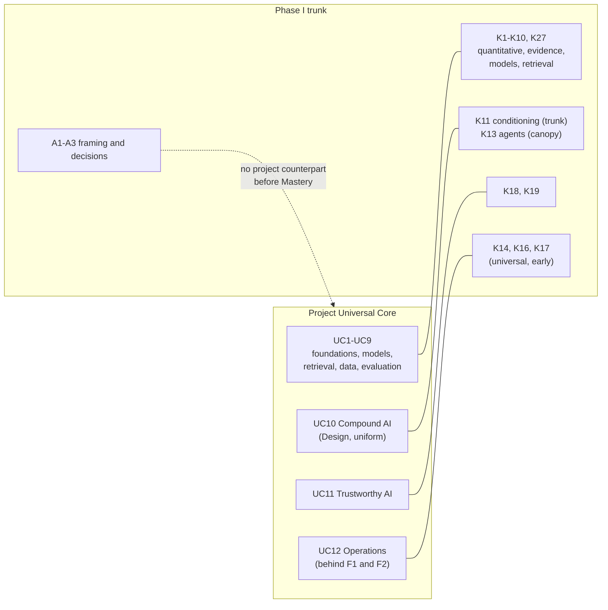

# Project-Wide Independence and Falsification Audit

| | |
| --- | --- |
| **Audit phase** | Phase II, adversarial comparison |
| **Audit date** | 2026-09-18 |
| **Produced by** | An independent auditing agent that had no part in writing the project's curriculum artifacts |
| **Compares** | [Phase I blind reconstruction](2026-09-18-independent-capability-reconstruction.md) (frozen) against [ROADMAP.md](../ROADMAP.md), [PROJECT-STATE.md](../PROJECT-STATE.md), [AGENTS.md](../AGENTS.md), [curriculum proposal](../design/curriculum-proposal.md), [landscape](2026-09-17-data-intelligence-landscape.md), [comparison](2026-09-17-roadmap-comparison.md), [resource coverage audit](2026-09-18-resource-coverage-audit.md) and [targeted resource research](2026-09-18-targeted-resource-research.md) |
| **Status** | **Evidence only.** Nothing in this report changes the curriculum, the proposal, `ROADMAP.md` or any other file |

This audit asks where the evidence shows that either map is wrong, incomplete, over-scoped, under-scoped, badly sequenced or wrongly weighted. It does not ask how well the two maps match. Where the independent evidence confirms the project, this report says so. Where the two maps conflict, the conflict is kept visible and is not smoothed over.

> ⚠️ Nothing in this document is curriculum.
>
> Every proposed change in [R](#r-required-project-changes) is a recommendation for human review. No curriculum change is authorized by this report.

## Contents

<b>Click to expand / collapse</b>

**Orientation**

- [A. Executive Summary](#a-executive-summary)
- [B. Audit Method](#b-audit-method)
- [C. Phase-I Integrity and Independence Record](#c-phase-i-integrity-and-independence-record)

**Independent map**

- [D. Independent Capability Reconstruction Summary](#d-independent-capability-reconstruction-summary)
- [E. Independent Knowledge Structure Summary](#e-independent-knowledge-structure-summary)
- [F. Independent Minimum Curriculum](#f-independent-minimum-curriculum)
- [G. Independent Recommended Curriculum](#g-independent-recommended-curriculum)

**Comparison and challenge**

- [H. Comparison With Existing Project](#h-comparison-with-existing-project)
- [I. Bias Audit](#i-bias-audit)
  - [I1. Anchoring](#i1-anchoring)
  - [I2. Confirmation](#i2-confirmation)
  - [I3. Resource-Induced Curriculum](#i3-resource-induced-curriculum)
  - [I4. Availability](#i4-availability)
  - [I5. LLM-Centricity](#i5-llm-centricity)
  - [I6. Recency](#i6-recency)
  - [I7. Historical Inertia](#i7-historical-inertia)
  - [I8. Granularity and Bloat](#i8-granularity-and-bloat)
- [J. Architecture Challenge](#j-architecture-challenge)
- [K. Missing Knowledge and Missing Questions](#k-missing-knowledge-and-missing-questions)
- [L. AC1 Investigation](#l-ac1-investigation)
- [M. K1 to K4 Verification](#m-k1-to-k4-verification)

**Resources**

- [N. Resource-Set Falsification](#n-resource-set-falsification)
- [O. Bundle Compression Analysis](#o-bundle-compression-analysis)
- [P. Minimum vs Recommended vs Current Comparison](#p-minimum-vs-recommended-vs-current-comparison)

**Conclusions**

- [Q. Falsification Questions](#q-falsification-questions)
- [R. Required Project Changes](#r-required-project-changes)
- [S. Things That Should Explicitly Remain Unchanged](#s-things-that-should-explicitly-remain-unchanged)
- [T. Uncertainties](#t-uncertainties)
- [U. Sources](#u-sources)

---

## A. Executive Summary

**Evidence labels.** Important conclusions carry a label and a confidence: **Observed** (directly supported by a source), **Inference** (reasoned from several observations), **Judgment** (a curriculum-design conclusion that cannot be established as fact) or **Uncertain**, each with **High**, **Medium** or **Low** confidence. They are written compactly, for example *[Inference, Medium]*.

**Overall result.** The two maps agree on the **content** of the universal core. They disagree on **what the curriculum is organized around** and on **depth and gating** in a small number of places.

**1. Strongest confirmation.** All twelve proposed Universal Core areas correspond to knowledge that the blind reconstruction placed in its universal trunk. The blind reconstruction did so without seeing the project's taxonomy, and it started from capabilities and failure evidence rather than from field maps. Several project decisions were reached independently:

- evaluation and data are the centre of the discipline;
- statistics is separate from mathematics and comes before evaluation;
- retrieval is taught as a discipline before retrieval-augmented systems;
- classical models come before deep learning;
- gradient-boosted trees are a required baseline;
- security is framed around the confusion of instructions and data, with containment rather than detection;
- the D&I/CS&E boundary is drawn by phenomenon;
- Modern AI Engineering is a practice layer rather than a stage.

*[Observed, High for the correspondence; Inference, Medium that it validates the design, because the two maps share some sources — see [C](#c-phase-i-integrity-and-independence-record)]*

**2. Largest disagreement.** The project never framed **problem framing, success specification and release decision-making** as a question to research. These are the blind reconstruction's capabilities A1–A3, rated *Everyone* at *Design* depth. In the proposal they appear first at Mastery (G1 design judgment), with fragments in E4 (baseline choice) and E10 (the metric versus the decision). The root cause is structural. The project's core was produced by compressing a **field map**: nineteen research areas taken from conference taxonomies became twelve Universal Core areas. Framing and requirements are not a research field, so they could never become a core area. *[Observed for the derivation chain; Judgment, Medium for the consequence]*

**3. Other material disagreements, in order of weight.**

| # | Disagreement | Project position | Independent position |
| --- | --- | --- | --- |
| 1 | Gating on the language-model lifecycle | F1 (Foundation Model Lifecycle, including the RL arc) is a prerequisite of F2, F4 **and** F5 | Monitoring, operations, cost and most security do not depend on post-training science |
| 2 | When distribution shift and monitoring arrive | First taught in F5 (Advanced), behind F1 and F2 | Universal at Implement depth, depending only on probability, generalization and evaluation |
| 3 | Depth of F2 Compound AI Systems | Uniform **Design** depth, including multi-agent orchestration, memory and interoperability | Action-taking systems at Understand for everyone and Design for many; composition, retrieval and conditioning at Design |
| 4 | Implementation depth for model internals | Implement **twice**: a transformer block in E5 and a full language model in E7, including a hand-written tokenizer and loading real weights | Understand, with one small implementation |
| 5 | Language Foundations as a separate block (E6) | Retained by human decision D2 | No universal capability requires language as a subject beyond tokenization and representation |
| 6 | ML-specific testing and versioning | A narrow reproducibility layer inside E10 (D5) | Data tests, model tests, evaluation in CI and lineage are universal at Implement depth |

**4. Resource set.** The 34-item provisional set is larger than necessary. Section [N](#n-resource-set-falsification) shows that about 34 mandatory items can fall to about 22 with no named loss of universal capability. The largest compressions:

- **F4:** nine items and about 230 pages can become four items plus a lab.
- **F3:** seven items can become four.
- **E2:** the micrograd lecture duplicates a baseline resource. The ML/DL book's Appendix A already implements reverse-mode differentiation on a toy computation graph *[Observed, High]*.
- ***NLP in Action*:** the book should leave the path entirely.

**5. Corrections K1–K4.**

- **K1 and K2 are confirmed from primary sources.** **K2 understates the correction.** The ML/DL book's own changelog states that chapter 15 covers SFT, RLHF, DPO, RAG, vector databases and tool connection **including MCP**, and that chapter 17 covers KV caching and speculative decoding. The resource coverage audit listed that changelog as directly read. Its claim that MCP-class content is "chronologically impossible for all resources" is therefore incorrect *[Observed, High]*.
- **K3** is a partial correction.
- **K4** is confirmed at Medium confidence.

**6. AC1.** The real statistical mismatch is **earlier than F3**. E10 already requires the learner to evaluate stochastic systems at Implement depth. That needs non-independence (clustered errors), variance across repeated trials and agreement statistics, and E3 as specified supplies none of them. F3 does **not** need generalizability-theory model fitting at universal Design depth. See [L](#l-ac1-investigation).

**7. Counts of proposed changes.** 0 Critical · 8 Important · 6 Optional · 5 Evidence Update Only.

**8. Final decision: Ready After Specific Corrections.** No unresolved issue requires another broad survey. The eight Important changes are bounded and can be made to the proposal before Baseline 1. Three narrow evidence gaps remain for resource selection, not for architecture (see [T](#t-uncertainties)).

[⬆ Back to Contents](#contents)

---

## B. Audit Method

**Order of work.**

1. Verified that the md5 hashes of all protected files and the Phase I SHA-256 matched the values in the brief before any other action.
2. Read the frozen Phase I artifact in full **first**.
3. Read in full, in chunks: ROADMAP.md, PROJECT-STATE.md, AGENTS.md, design/curriculum-proposal.md, the landscape, the comparison, the resource coverage audit and the targeted resource research. README.md was not needed and was not read.
4. Mapped each Phase I knowledge area (K1–K27) and capability (A1–A27) onto project blocks. Differences were then investigated rather than counted.
5. Verified K1–K4 against primary sources wherever they were reachable. The details are in [M](#m-k1-to-k4-verification).
6. Ran the bias audit, the architecture challenge, resource falsification and the falsification questions.
7. Wrote this file, checked every anchor and relative link with a script, and re-verified all hashes.

**Primary evidence gathered by this audit.** All downloads went to `/private/tmp/claude-501/phase2-audit/`:

| Item | Route | Used for |
| --- | --- | --- |
| *Speech and Language Processing*, ch 11, draft of 2026-08-19 | Authors' site PDF, extracted with `pdftotext` and searched for terms | K1 |
| `ageron/handson-mlp`: file list, `CHANGES.md`, `index.ipynb`, ch 2 and ch 15 notebooks, `Appendix_A_autodiff.ipynb` | GitHub API and raw files | K2, K3, the micrograd removal test |
| `HandsOnLLM/Hands-On-Large-Language-Models`: ch 12 notebook and README | GitHub raw files | K4 |
| O'Reilly product page; Google Books page | WebFetch (O'Reilly returned HTTP 403; Google Books showed no chapter headings) | K3 and K4 attempts |
| Two web searches | WebSearch | K3 and K4 attempts (summarized results only; treated as Indirect) |

**Tools not used.** The built-in browser pane was **not used**. No paywalled text was read. No package was installed. The repository `.venv` was not touched. `/Users/lakshmideepak/.claude/` was not read. No other agent or session was contacted.

> ⚠️ **Disclosure of an automatic tool side effect.** The first attempt to read the ch 11 PDF used WebFetch, which could not parse the binary. The tool reported that it had **automatically saved** the PDF under `/Users/lakshmideepak/.claude/projects/.../tool-results/`. This auditor did not request that save and did not open, list or read that path. The same PDF was then downloaded to the permitted temporary directory and read there. This matches the side effect the Phase I agent disclosed.

**What this audit could not do.** It could not read the body text of paid books. It re-ran none of the Phase I searches. It did not study any resource end to end, so learning costs are estimates built from the page and hour figures in the project's own artifacts.

[⬆ Back to Contents](#contents)

---

## C. Phase-I Integrity and Independence Record

### C1. Facts recorded as supplied by the orchestrator

| Fact | Value |
| --- | --- |
| Why a separate agent was used | The orchestrating session read and largely wrote the landscape, comparison, coverage audit, curriculum proposal, targeted resource research and PROJECT-STATE, so it could not honestly claim to be blind. Phase I was delegated to a separate blind agent, and Phase II to this independent auditor |
| Phase I brief | The owner's Phase I specification verbatim, with stricter file rules, plus four neutral scope statements in place of the governance files. No repository file could be read |
| Orchestrator's check of the Phase I tool log | 1 ToolSearch, 38 WebSearch, 7 WebFetch, 1 Write (the output file); zero local reads, listings, searches or shell commands |
| Side effect self-reported by the Phase I agent | A WebFetch of an unparseable PDF was auto-saved into a local tool-results directory. The agent did not open it |
| Frozen artifact | [2026-09-18-independent-capability-reconstruction.md](2026-09-18-independent-capability-reconstruction.md), SHA-256 `8cd1dedef0ce4f5b9823be3de3d8ad4269f15df7c92bbdc908bd53b1a693387b`, 102,545 bytes, written 2026-09-18 19:39:27 |
| Verified by this auditor | SHA-256 and byte count matched at the start and at the end of this audit ([R6](#r6-integrity-verification-at-completion)) |

### C2. This auditor's assessment of Phase I independence

**No detectable leakage of project-specific content.** A term scan of the Phase I artifact found none of these *[Observed, High]*:

- baseline resource titles or authors (*Hands-On*, *Speech and Language*, Raschka, Géron, Jurafsky, McKinney, *Practical SQL*, Alammar, Iusztin, *Designing Machine Learning Systems*);
- project structural vocabulary (Universal Core, Fundamentals, Mastery, Modern AI Engineering, parallel track, Compound AI, Evaluation Science, Trustworthy AI, Language Foundations);
- targeted-research resources (*Dive into Deep Learning*, *AI Measurement Science*, micrograd, CaMeL, the prompt-injection design-patterns paper).

"Advanced" appears once, as part of the title of Murphy's *Advanced Topics*. "D&I" and "CS&E" appear as abbreviations of the boundary wording in the scope statements. That is expected.

**Where Phase I shares sources with the project.** Agreement on these points is weaker evidence than it looks:

- Phase I relied on Huyen's *AI Engineering* structure (ten mentions), Kohavi et al., Sculley et al., Kapoor and Narayanan, Anthropic's two agent-engineering posts, Zheng et al. and Shankar et al.
- The landscape uses the same works (G14, M24, E18, M23, E1, E2, E16).
- The targeted research selects Huyen as its cross-block anchor (MS9) and Kohavi for experimentation (MS5).

Both maps' positions on compound systems, context budgets, evaluation-centrality and ML technical debt therefore rest partly on the **same small set of authorities**. This is **source-level convergence, not independent replication**. *[Observed for the overlap; Inference, Medium for the discount]*

**Anchoring on conventional structure.**

- The Phase I knowledge list (K1–K27) runs probability → linear algebra → optimization → generalization → model families → representations → foundation models → evaluation → data → retrieval. That is close to the chapter order of mainstream ML textbooks and of Stanford CS329S.
- The agent disclosed this risk (U10) and that background knowledge guided its search.
- The **capability** list (A1–A27), which Phase I says was fixed first, is much less conventional. Framing, success specification, release decisions and trade-off reasoning are not textbook chapters.

Conclusion: anchoring on convention mainly affected how knowledge was packaged, not which capabilities were found. *[Inference, Medium]*

**Evidence depth.**

- Phase I states that most items were assessed through search summaries. Five pages are marked Direct in its source list.
- The tool log shows seven WebFetch calls. One was the failed PDF; one is unaccounted for in the source table. This is a minor bookkeeping gap, not an integrity concern.
- Many Phase I labels of the form *Observed, High* rest on search snippets of well-known papers. They should be read as "Indirect but uncontroversial" (Phase I's own U9).

*[Observed]*

**Vocabulary in the brief.** The owner's specification named example subjects such as mathematics, statistics, machine learning, transformers, retrieval, agents, evaluation, security and serving as things not to assume. Phase I says it saw them. This is generic field vocabulary. It could have primed the knowledge list, but it could not have supplied the project's structure. *[Judgment, Medium]*

**Overall.** Phase I is a credible independent reconstruction of the **capability** layer. It is somewhat less independent at the **knowledge-packaging** layer, and it is not independent of the handful of practitioner authorities that everyone in this field cites. Its disagreements with the project are therefore more informative than its agreements. *[Judgment, Medium]*

### C3. Limits on this auditor's own independence

- This auditor read Phase I first and then the whole project. The Independent Recommended Curriculum in [G](#g-independent-recommended-curriculum) was written **after** reading the project, so it is anchored on both maps. It is labelled Judgment throughout and should be read as the auditor's recommendation, not as a second blind reconstruction.
- This auditor verified K1–K4 against primary sources but did **not** re-run the landscape's or Phase I's searches.

[⬆ Back to Contents](#contents)

---

## D. Independent Capability Reconstruction Summary

**Working definition reached in Phase I.** A strong AI engineer can turn an ill-defined goal into a system whose behaviour comes from learned models and external information, **and can produce trustworthy evidence about how well it works, why it fails and what it costs, across its lifetime**.

**How "universal capability" is defined.** Phase I calls a capability universal when it is required by nearly every strong AI engineer in Data and Intelligence (tier **Everyone**). It counts **19**: A1–A8, A10–A14 and A18–A23. Phase I warns that the count overstates the universal workload because several of these capabilities have shallow endpoints (its U12).

| Family | Everyone capabilities (endpoint) | Not universal |
| --- | --- | --- |
| Framing and deciding | A1 frame or decline learning (Design); A2 specify success (Design); A3 release decisions (Design) | — |
| Evidence | A4 data fitness (Implement); A5 offline evaluation (Design); A6 judge evidence (Understand to Implement); A7 open-ended evaluation (Design); A8 diagnose failures (Design) | A9 causal impact (Many) |
| Building | A10 choose approach (Design); A11 fit and diagnose training (Implement); A12 predict model behaviour (Understand); A13 compose with external information (Design); A14 condition at inference time (Implement) | A15 action-taking systems (Many); A16 adaptation (Many); A17 oversight design (Many) |
| Operating | A18 detect change (Implement); A19 cost/latency trade-offs (Understand); A20 reproducibility (Implement) | — |
| Protecting | A21 learned-system security (Design); A22 harms and governance (Use to Understand) | — |
| Reach | A23 appraise claims (Use) | A24 sequential decisions; A25 other modalities; A26 large-scale training; A27 advancing methods |

**Most consequential Phase I conclusions for this audit.**

1. Evidence and data machinery must be **built**. Model internals mostly need to be **understood** (its §6.2).
2. Evaluation is the only area whose universal endpoint is Design (§6.2).
3. The risk of LLM-centricity lies in emphasis and depth, not in what is included (§8.4).
4. Agent and prompt technique catalogues are the most likely source of time-sensitive bloat (§11.5).

[⬆ Back to Contents](#contents)

---

## E. Independent Knowledge Structure Summary

Phase I derives 27 knowledge areas and places them in zones.

| Zone | Areas | Universal endpoint |
| --- | --- | --- |
| **Trunk: quantitative core** | K1 probability; K2 linear algebra and calculus; K3 optimization; K4 generalization | K1 Understand + Implement; K2 Understand; K3 Understand + training loop; K4 Understand (deeply) |
| **Trunk: evidence and data** | K8 evaluation; K9 data; K27 numerical data work | K8 **Design**; K9 Implement; K27 Implement |
| **Trunk: how models work** | K5 model families; K6 representation learning; K7 foundation-model mechanics | K5 Implement (library); K6 Understand + a small network; K7 **Understand** |
| **Trunk: building and costing** | K10 retrieval (Design); K11 conditioning (Implement); K16 computational economics (Understand); K21 calibration (Understand) | as stated |
| **Trunk: operating and protecting** | K14 shift and monitoring (Implement); K17 ML engineering discipline (Implement); K18 security (Design, application level); K19 harm and governance (Understand) | as stated |
| **Canopy** | K12 adaptation (Implement); K13 agentic control (Design for many); K15 experimentation practice; K20 human interaction; K25 unsupervised and generative | Understand for everyone |
| **Branches** | Ranking and recommendation; vision; speech; forecasting; decision systems and RL; large-scale training; serving optimization; regulated assurance | Awareness for everyone |
| **Frontier** | Learning theory; architecture research; evaluation methodology; interpretability; alignment | — |

**Dependency facts used later in this audit.** These are from Phase I §5.1:

- K14 (shift and monitoring) depends only on K1, K4 and K8.
- K13 (agents) depends on K11, K8 and K18. It does **not** depend on post-training science.
- K16 (economics) depends on K6 and K7 plus general computing.
- K18 (security) depends on K7 and K11 plus general security.
- K5 comes **before** K6.

[⬆ Back to Contents](#contents)

---

## F. Independent Minimum Curriculum

Phase I's severe-budget **Minimum Viable Core** assumes about one third of the ideal study time. Weights are shares of that reduced budget.

| Unit | Content | Depth | Weight |
| --- | --- | --- | --- |
| MVC-1 Quantitative core | K1 (estimation, intervals, bootstrap, testing); K2 and K3 conceptually; K4 in depth | Understand; Implement for K1 | 14% |
| MVC-2 Evidence engineering | K8 in full: grader validation, temporal and grouped splits, leakage, repeated-trial reliability, slice analysis | **Design** | 20% |
| MVC-3 Data for learning | K9 plus K27 | Implement | 12% |
| MVC-4 How models work | K5 (linear models, boosted-tree baseline); K6; K7 | Understand; one small network, one tree baseline | 16% |
| MVC-5 Grounded systems | K10 and K11 | Design for K10; Implement for K11 | 14% |
| MVC-6 Operating | K14, K16, K17, K21 | Implement; Understand for K16 | 12% |
| MVC-7 Protecting | K18 and K19 | Design for K18; Understand for K19 | 8% |
| MVC-8 Actions and judgment | K13 principles; K15 principles; K26 critical reading | Understand | 4% |

**Removed in the minimum and the resulting loss.**

| Removed | Capability lost | Phase I verdict |
| --- | --- | --- |
| Adaptation beyond Understand | Carrying out a fine-tune yourself | Acceptable |
| Agentic Design depth | Designing complex agents with confidence | Acceptable only temporarily; the first thing to add back |
| Experimentation practice | Running A/B tests independently | Acceptable |
| Human interaction design | Weaker oversight and feedback design | Acceptable |
| Sequential decisions, modalities, large-scale training, generative depth | Specialist work in those areas | Acceptable |
| Derivations and practice-layer tooling | Reading theory-heavy papers; immediate productivity in a stack | Acceptable |

Evidence and data together take about a third of the budget.

[⬆ Back to Contents](#contents)

---

## G. Independent Recommended Curriculum

> ⚠️ This section is this auditor's **Judgment**, written after reading both maps. It is not a second blind reconstruction.

**What changes without the severe budget.** Relax the budget and keep the Phase I trunk at its stated depths, restoring the canopy at canopy depth. The result is close to the project's architecture with the following differences. Each is argued in [H](#h-comparison-with-existing-project) and [R](#r-required-project-changes).

| Unit | Recommended content and depth | Project equivalent |
| --- | --- | --- |
| **G-1 Programming and data work** | Python, querying, dataframes, exploratory analysis, plotting for diagnosis. Implement | E1 without database design, transactions and maintenance |
| **G-2 Mathematics** | Linear algebra, calculus, reverse mode on a toy graph, probability through likelihood, optimization behaviour, entropy. Understand, with Implement for GD and reverse mode | E2 (unchanged) |
| **G-3 Statistics and uncertainty** | Estimation, intervals, bootstrap, paired comparison, power, **non-independence and repeated-trial variance**, **agreement statistics**, calibration and selective prediction, confounding. Understand/Implement. Online-experiment practice as principle only | E3 with additions, and the experimentation part reduced |
| **G-4 Framing and success specification** | Framing a goal as prediction, ranking, generation or decision, or declining to use learning; asymmetric costs; acceptance criteria; non-learned baselines; release and rollback decisions. Design, taught as a strand through G-5, G-9 and G-12 | **Absent before Mastery** |
| **G-5 ML foundations** | As E4 | E4 |
| **G-6 Deep learning and representations** | As E5. The transformer block is implemented **once**. Vision at Use/Understand | E5, depth moderated |
| **G-7 Foundation-model mechanics** | Tokenization (consequences demonstrated by exercise), attention stack, next-token training, sampling, context limits, post-training at Understand, scaling. Implement one small model; no hand-written tokenizer or real-weight loading required | E6 + E7, merged and depth moderated |
| **G-8 Retrieval and ranking** | As E8 **plus ranking metrics (nDCG, MRR) and the ANN recall–latency trade-off** | E8 + the ranking-metric part of F6/EX8 |
| **G-9 Data for learning** | As E9 at Implement **plus distribution-shift types and train–serve skew as data phenomena** | E9 with shift added |
| **G-10 Evaluation and measurement** | As E10 **plus slice/disaggregated evaluation, repeated-trial reliability, and ML-specific tests and evaluation in CI** | E10 expanded |
| **G-11 Grounded and compound systems** | Design: composition, RAG on IR, structured generation, context budget, tool interfaces and least privilege, verification, least autonomy. Understand: multi-agent orchestration, memory architectures, interoperability standards | F2, depth stratified |
| **G-12 Operating learned systems** | Monitoring, feedback loops, cost and latency model, serving concepts, reproducibility and debt. **Prerequisites: G-9, G-10, G-7 — not the lifecycle block** | F5, un-gated |
| **G-13 Protecting** | As F4 | F4 |
| **G-14 Evaluation science** | As F3 | F3 |
| **G-15 Model lifecycle and adaptation** | Pretraining data, scaling, SFT, preference optimization and RLVR at Understand, including a **short** RL arc (MDP, policy, reward, KL) plus bandit/exploration awareness; one adaptation implemented; contested claims taught as contested | F1, lighter and not gating |
| **Extensions, specializations, frontier** | As EX1–EX9, SP1–SP10, RF1–RF8 | Unchanged |
| **Mastery / Research** | As G1–G4 and H1–H2 | Unchanged |

[⬆ Back to Contents](#contents)

---

## H. Comparison With Existing Project

**In this section:** [H1. Structural correspondence](#h1-structural-correspondence) · [H2. Topic-level classification](#h2-topic-level-classification)

### H1. Structural correspondence

The proposal's twelve Universal Core areas mapped onto the Phase I trunk:

| Project | Phase I equivalent | Verdict |
| --- | --- | --- |
| UC1 Programming and Data Handling | K27 | Confirmed |
| UC2 Mathematics | K2, K3, K1 (probability) | Confirmed |
| UC3 Statistics, Inference and Experimentation | K1, K21, K15 (principles) | Confirmed; experimentation over-scoped for universal; non-independence missing |
| UC4 ML Foundations | K4, K5 | Confirmed |
| UC5 Deep Learning and Representations | K6 | Confirmed; depth higher than needed |
| UC6 Language and Foundation Models | K7 (+ part of K12) | Confirmed as knowledge; E6 layer unsupported; depth higher than needed |
| UC7 Retrieval and Information Access | K10 | Confirmed; ranking metrics placed too late |
| UC8 Data for AI | K9 | Confirmed |
| UC9 Evaluation and Measurement | K8 | Confirmed; the strongest agreement |
| UC10 Compound AI Systems | K11 + K13 | Confirmed at the composition level; over-scoped at the agent level |
| UC11 Trustworthy AI | K18, K19 | Confirmed |
| UC12 AI Systems Engineering and Operations | K14, K16, K17 | Confirmed as content; mis-sequenced; testing under-specified |
| — | A1–A3 framing, specification, release decisions | **Missing** |

### H2. Topic-level classification

Classes are those of the owner's specification. Several classes may apply to one area. The label and confidence apply to the classification.

| Area | Classification | Reasoning | Evidence, confidence |
| --- | --- | --- | --- |
| E1 Programming and Data Handling | **Confirmed**. The database-design sub-scope (schema design, constraints, indexes, transactions) is **Boundary Misplacement** and **Resource-Induced** | Phase I puts querying in D&I and database design in CS&E (§7.2). E1's knowledge list reproduces the contents of *Practical SQL* | Observed correspondence; Inference, Medium |
| E2 Mathematics | **Confirmed** | Same content and depth as K2/K3 plus probability | Observed, High |
| E3 Statistics, Inference and Experimentation | **Confirmed** for inference and calibration. **Correct but Mis-scoped** for online-experiment design (universal need is principle; practice is canopy). **Under-specified** for non-independence, repeated-trial variance and agreement | Phase I K1, K15, K21; §11.3 | Inference, Medium |
| E4 ML Foundations | **Confirmed** | Including the gradient-boosting baseline and leakage-safe splits | Observed, High |
| E5 Deep Learning and Representations | **Confirmed**. **Over-specified** in requiring the transformer block to be implemented in addition to E7. Vision (D3) is **Correct but Mis-scoped** — Use/Understand suffices | K6 Understand + small network; duplicate from-scratch builds noted in audit H | Inference, Medium |
| E6 Language Foundations | **Historical Carryover** and **Unsupported** as a separate block. The tokenization part is Confirmed and belongs in E7 | No Phase I capability needs language as a subject beyond tokenization and representation. The comparison marked the evidence **low confidence**; D2 is a human decision | Judgment, Medium |
| E7 Foundation Model Mechanics | **Confirmed** as knowledge. **Over-specified** in depth sub-requirements. **Resource-Induced** in shape | K7 is Understand. Hand tokenization is met only by repository material (R8). E7's knowledge list reproduces the book's chapter list, including "loading and inspecting real weights" | Observed correspondence; Judgment, Medium |
| E8 Retrieval and Information Access | **Confirmed**. **Under-specified**: ranking metrics deferred to F6/EX8 | K10 includes nDCG, MRR and candidate generation plus reranking at universal Design | Inference, Medium |
| E9 Data for AI | **Confirmed**. **Under-specified** on distribution shift | K9 Implement; K14 shift universal | Observed, High |
| E10 Evaluation and Measurement | **Confirmed**. **Under-specified** on slices, repeated trials and ML tests | K8 content list; K17 | Observed, High |
| F1 Foundation Model Lifecycle | **Correct but Mis-scoped**: a prerequisite of three blocks that do not need it. RLVR, emergent misalignment and CoT faithfulness are **Premature as durable content** but correctly flagged as contested. The RL arc is **Supported with Modification** (see [J](#j-architecture-challenge)) | Phase I §5.1 dependencies; K7 Understand | Inference, Medium |
| F2 Compound AI Systems | **Confirmed** at the composition level. **Premature/Over-specified** at uniform Design for multi-agent orchestration, memory and interoperability | A13/A14 are universal; A15 is Many (Low confidence on speed of change) | Inference, Medium |
| F3 Evaluation Science | **Confirmed**. Trajectory evaluation at Design is **Premature** and correctly flagged as an open problem | K8 Design | Observed, High |
| F4 Trustworthy AI | **Confirmed** (security at Design, the rest at Understand). The resource bundle is **Over-specified** | K18, K19 | Observed, High |
| F5 AI Systems Engineering and Operations | **Confirmed** as content. **Correct but Mis-scoped** in stage and gating. **Under-specified** on ML testing | K14, K16, K17 universal and early | Observed, High |
| F6 Advanced Retrieval and Ranking | **Confirmed** as Advanced. Ranking metrics should move down to E8 | K10 | Inference, Medium |
| G Mastery (G1–G4) | **Confirmed** | G1 ≈ A1/A3 at depth; G2 ≈ A8; G3 ≈ A6/A23; selective depth matches branches | Inference, Medium |
| H Research (H1, H2) | **Confirmed** | H1 ≈ A23 at Use; H2 ≈ A27 Frontier | Inference, High |
| I Modern AI Engineering track | **Confirmed** | Matches Phase I's "practice layer" | Inference, Medium |
| EX1 RL | **Confirmed**; bandit/off-policy emphasis is under-weighted relative to LLM post-training | K22; branch "Decision systems" | Inference, Medium |
| EX2–EX7, EX9 | **Confirmed** | Branch and canopy placements agree | Inference, Medium |
| EX8 Ranking and Recommendation | **Confirmed** apart from ranking metrics | K10 | Inference, Medium |
| SP1–SP10, RF1–RF8 | **Confirmed** | Branch and frontier placements agree | Inference, Medium |
| P Boundary decisions | **Confirmed** (see [J](#j-architecture-challenge)) | Phase I §7.2 matches almost row for row | Observed, High |

[⬆ Back to Contents](#contents)

---

## I. Bias Audit

**In this section:** [I1](#i1-anchoring) · [I2](#i2-confirmation) · [I3](#i3-resource-induced-curriculum) · [I4](#i4-availability) · [I5](#i5-llm-centricity) · [I6](#i6-recency) · [I7](#i7-historical-inertia) · [I8](#i8-granularity-and-bloat)

### I1. Anchoring

**Finding: present, and the most consequential bias in the project.**

| Example | Evidence | Consequence |
| --- | --- | --- |
| **The core is a compression of a field map** | The proposal's table *How nineteen became twelve* maps each Universal Core area to landscape areas C1–C19 (only UC1 has no origin). The landscape built its areas from "field maps from independent communities" — AAAI/IJCAI keywords, arXiv categories, ACL/KDD/ICLR/NeurIPS calls | Engineering activities that are not research fields — framing, requirements, release decisions, ML testing — could not become core areas. This is the root of the largest disagreement. *[Observed chain; Inference, Medium consequence]* |
| **The "independent" landscape read AGENTS.md first** | The landscape's Research Record states that AGENTS.md was consulted before and during the reconstruction. AGENTS.md lists the lens contents (retrieval, memory, context, planning, verification, tools, evaluation, observability, security) and Modern AI Engineering contents | The landscape's anti-anchoring statement names only ROADMAP.md and README.md. It was not blind to the governance vocabulary. *[Observed, High]* |
| **Targeted research inherited the block list** | Section B: each thread "derived search concepts from the block's required capabilities **as written in the proposal**" | It could find better resources for existing blocks. It could not find missing blocks. F1, F6, E9 provenance and E10 were never researched for resources at all. *[Observed, High]* |
| **Baseline v0's shape survives** | E6 Language Foundations (from the NLP section), E7 = the §7.1 book, the NLP-then-LLM order | See [I3](#i3-resource-induced-curriculum) and [I7](#i7-historical-inertia) |

### I2. Confirmation

**Finding: present, moderate.**

- **Missed evidence that cut against the narrative.** The coverage audit lists `ageron/handson-mlp/CHANGES.md` as **directly read** and reports from it only the regressions: deployment only partially merged and SVMs moved online. The same 24-line file says chapter 15 teaches SFT, RLHF, DPO, RAG, vector databases and connecting tools "including using MCP", and chapter 17 covers KV caching and speculative decoding. The audit then states that MCP-class content is "chronologically impossible for all resources" and that every LLM-era resource predates the agent wave. The evidence contradicting that was in a file it had read. *[Observed, High]*
- **Removal tests test existence, never depth.** The proposal's anti-bloat test ([O](../design/curriculum-proposal.md#o-anti-bloat-audit)) asks "without this, the learner would be unable to…" for each area. It never asks whether the same capability survives at a lower depth, for example E7 at Understand or F2 agents at Understand. Every test of that form passes, so the test cannot reject depth. *[Observed form; Inference, Medium]*
- **Completeness challenges confirmed early choices.** Ten perspectives were applied, and the only anti-bloat finding (UC8, UC12) was "retained". No perspective asked whether a capability outside the landscape's taxonomy was missing. *[Observed]*
- **Counter-evidence of good practice.** The project reversed itself on NLP (D2 was recorded as a human judgment against low-confidence evidence). It recorded the corrections from its own research (PROJECT-STATE §6). It preserved uncertainty honestly. It kept calibration and four unresourced F2 capabilities despite having no resources for them. *[Observed]*

### I3. Resource-Induced Curriculum

**Finding: present in three places. The inverse effect is present once.**

| Case | Evidence | Assessment |
| --- | --- | --- |
| **E7 is the Raschka book** | E7's knowledge list — tokenization, positional information, attention stack, pretraining loop, decoding, *loading and inspecting real weights*, SFT for a downstream task, PEFT concept — follows the book's seven chapters and appendix E. The practice form ("construct a working small model end to end") is the book's project. The proposal calls it "the one construction this proposal treats as non-negotiable" | The knowledge is justified independently (K7). The **Implement** depth and specific sub-requirements are not (Phase I §11.5: "Model internals need Understand depth, not implementation"). Hand-written tokenization is then **not in the book** (R8), which shows the requirement was written from an expectation about a resource. *[Observed correspondence; Judgment, Medium causation]* |
| **EX2 "cheap because an existing resource covers it"** | Proposal D: "already covered at implementation depth by an existing resource, which makes the extension cheap" | A resource argument about **target depth** (Understand → Implement). Harmless for an extension, but it is resource-induced by the proposal's own words. *[Observed]* |
| **E1 database design** | E1 includes schema design, constraints, indexes and transactions; *Practical SQL* is recommended whole | Scope follows the book. *[Inference, Medium]* |
| **MS35: a 688-page paid book kept for one section** | Targeted research K and M | Resource-driven retention. The requirement (ANN recall–latency trade-off) is real, but it can be met by a short durable source or by an author-written note. *[Observed]* |
| **Inverse: framing and ML testing** | No baseline resource teaches problem framing or ML-specific testing. Neither became a block or a named research need | Consistent with the inverse effect. Because anchoring (I1) also explains this, the two causes cannot be separated. *[Inference, Low–Medium]* |

The project followed the resource-independence rule (spec §27) well in several places. Calibration, least autonomy, intervention budgets and failure-origin diagnosis were **kept** without any resource.

### I4. Availability

**Finding: present, moderate.**

- The landscape itself reports that C7 (foundation models) and C13 (compound systems) are the most detailed areas partly because of 2025–2026 publication volume (J8).
- The proposal carries this into F1, whose knowledge list names about fifteen distinct post-training and lifecycle topics.
- Fragmented subjects receive one line or none: framing and requirements, data validation, ML testing, human factors in labelling, selective prediction.

*[Observed; Inference, Medium]*

### I5. LLM-Centricity

**Finding: structural LLM-centricity in sequencing and depth; none in inclusion.** This agrees with Phase I's own prediction (§8.4).

| Structural test | Result |
| --- | --- |
| Are the core's inclusions modality-neutral? | **Yes.** E3, E4, E8, E9, E10, F3, F4 and F5 content applies to any learned system. Tabular baselines and a vision requirement are present. *[Observed]* |
| Does the dependency graph route non-LLM capability through LLM science? | **Yes.** F1 (FM lifecycle, including the post-training RL arc) is a prerequisite of F2, **F4 and F5**. A classical or recommender engineer cannot reach monitoring, drift or AI security without first completing LLM post-training science. *[Observed from proposal J]* |
| Which RL slice was made universal? | The **LLM post-training** slice (policy gradients, KL objectives). Not the product slice (bandits, exploration, off-policy evaluation), which Phase I and the landscape tie to recommendation and rollout decisions. *[Observed]* |
| Where is implementation depth concentrated? | E7, "singular and substantial". The only non-negotiable construction in the path is a language model. *[Observed]* |
| Non-LLM path test | A tabular/forecasting/recommendation engineer passes E1–E5, E8–E10, then waits behind E6–E7 and F1 before F5. The language layer adds a second mandatory text-only block (E6). *[Inference, Medium]* |

**Verdict.** This is not an LLM-engineer roadmap in content. It is a roadmap whose **critical path** runs through LLM mechanics and lifecycle. Changes R-I2 and R-I8 remove most of this at little cost. *[Judgment, Medium]*

### I6. Recency

| Element | Worth learning now | Established engineering practice | Durable curriculum knowledge |
| --- | --- | --- | --- |
| Least-autonomy principle; workflows versus agents | ✓ | ✓ | ✓ (control, verification, least privilege) |
| RAG built on IR | ✓ | ✓ | ✓ |
| Structured generation | ✓ | ✓ | ✓ (constrained decoding) |
| Context as a finite, non-uniform budget | ✓ | ✓ | Probably (measured degradation) |
| Multi-agent orchestration | ✓ | Narrow patterns only | **Not yet** (conditional value; preprint evidence) |
| Agent memory architectures | ✓ | Emerging | **Not yet** |
| Interoperability protocols | ✓ | ✓ (current specification) | Concept only |
| RLVR, CoT faithfulness, emergent misalignment | ✓ | Frontier-lab practice | Contested; teach as contested |
| Agent trajectory evaluation | ✓ | Emerging | **Open problem** |

**Finding.** The proposal's own "Durable Concepts Versus Current Practice" table in section I draws the right line. But F2's **Design** requirement and the targeted research's "Required" list pull current-practice items into permanent Advanced content: Kim et al. is a preprint whose numbers "will be superseded", and the vendor agent-evaluation post was placed on the normal path. *[Observed; Judgment, Medium]*

### I7. Historical Inertia

**Finding: limited.**

- The only substantive case is E6 Language Foundations. It was retained by human decision D2 against a low-confidence comparison finding, and it covers "how text classification and information extraction are formulated" and "linguistic units". Phase I found no universal capability requiring these beyond tokenization.
- EX3, EX4 and the CNN/RNN lineage in E5 are proportionate: lineage is kept as concept, depth goes to extensions.
- Classical AI search, logic and GAN depth were correctly kept out of the core.

*[Judgment, Medium]* Old knowledge that the project kept and Phase I independently justified — probability, generalization, trees, IR, experimental design, calibration — is **durable, not inertia**.

### I8. Granularity and Bloat

**Finding: present in the resource layer, not in the architecture.**

- The targeted research breaks each block into 11–13 capability rows (for example F4: 11 rows; F3: 12 rows).
- It then attaches at least one source per row and runs an anti-bloat test framed as "without it, the learner would not be adequately taught…".
- By construction that test is always passed: each item was chosen to cover a row. The result is 34 mandatory items, each "individually necessary".

This is exactly the chain named in the specification (§18 B8). Section [O](#o-bundle-compression-analysis) shows the rows compress to about 22 items without a named capability loss. *[Observed; Inference, Medium]* The **architecture** is not bloated: twelve Universal Core areas against Phase I's eight minimum units and about eighteen trunk areas is proportionate.

[⬆ Back to Contents](#contents)

---

## J. Architecture Challenge

Classes: **Independently Supported** · **Supported with Modification** · **Unresolved** · **Contradicted** · **Unnecessary Structure**.

| Assumption | Class | Reasoning | Label |
| --- | --- | --- | --- |
| **Universal Core count and boundaries (12)** | Supported with Modification | All twelve map onto the Phase I trunk. Add the framing strand. Narrow UC10's Design scope. Remove E6 as a separate block | Inference, Medium |
| **Fundamentals scope (E1–E10)** | Supported with Modification | Confirmed apart from: E3 experimentation practice (reduce), non-independence (add), E5/E7 duplicate implementation, E6, ranking metrics (add to E8), shift (add to E9/E10) | Inference, Medium |
| **Advanced scope (F1–F6)** | Supported with Modification | F1 gating contradicted; F2 depth stratified; F3–F4 confirmed; F5 un-gated; F6 confirmed | Inference, Medium |
| **Mastery design (G1–G4)** | Independently Supported | Phase I's Design-level capabilities A1, A3 and A8 match G1–G2, and selective branch depth matches G4. The Mastery design itself is right, but framing must not appear **first** at Mastery | Inference, Medium |
| **Research design (H1 universal, H2 optional)** | Independently Supported | A23 Everyone at Use; A27 Frontier | Inference, High |
| **Important Extensions (EX1–EX9)** | Supported with Modification | Move ranking metrics to E8. Give EX1 an explicit bandit and off-policy emphasis. Otherwise matches the Phase I canopy and branches | Inference, Medium |
| **Specializations (SP1–SP10)** | Independently Supported | Matches the Phase I branches | Inference, Medium |
| **Modern AI Engineering parallel track** | Independently Supported | Equivalent to Phase I's practice layer. The four phases and the D6 early entry are consistent with evidence that engineers learn by iterating | Inference, Medium |
| **Prerequisite ordering** | Supported with Modification | Confirmed: E2→E3→E10, E4→E5, E8 before RAG, E10 before F2. **Contradicted edges:** F1→F4 and F1→F5 as hard prerequisites (Phase I §5.1). F1→F2 should be reduced to the "prompt vs retrieve vs tune" decision, which E7 plus a short module can supply | Inference, Medium |
| **Depth assignments** | Supported with Modification | E10 Implement and F3 Design confirmed (K8). F4 security Design confirmed (K18). E7 Implement contested. F2 uniform Design over-specified. E9 near-Implement confirmed. Monitoring too late | Judgment, Medium |
| **D&I/CS&E boundary (section P)** | Independently Supported | Phase I §7.2 reaches the same splits for serving, distributed training, vector search, security, data pipelines, observability, protocols and HCI. Modifications: database design to CS&E (with ownership of querying unchanged); ML-specific testing belongs in D&I | Observed, High |
| **D1 chapter-level resource use** | Independently Supported | Phase I §1.2: importance separate from teachability | Judgment, High |
| **D2 Language Foundations block** | Unnecessary Structure (content partly supported) | Tokenization and embeddings belong in E7/E5. No universal capability needs the rest. D2 was a human decision and remains the owner's to keep | Judgment, Medium |
| **D3 vision in E5** | Supported with Modification | Phase I: awareness of non-text modalities is universal. Required *exposure* is supported; required *implementation* is not | Judgment, Medium |
| **D4 RL post-training subset in F1** | Supported with Modification | Phase I K22: Awareness universally, with post-training at Understand. A short arc is defensible if it stays short, adds bandit and exploration awareness, and does not gate F2/F4/F5 | Judgment, Medium |
| **D5 narrow reproducibility layer** | Supported with Modification | Phase I K17 is broader: data and model tests, evaluation in CI, lineage. The narrow layer is under-specified | Inference, Medium |
| **D6 early parallel-track entry** | Independently Supported | Consistent with Phase I's practice layer and with the "early access is not early mastery" safeguard | Judgment, Medium |
| **D7 security ownership split** | Independently Supported | Phase I §7.2 reaches the same split | Observed, High |

[⬆ Back to Contents](#contents)

---

## K. Missing Knowledge and Missing Questions

**Questions the project never formulated.** These matter more than missing bullets.

| # | Missing question | Why it matters | What Phase I found |
| --- | --- | --- | --- |
| **Q-1** | *What must an engineer be able to **decide** before building?* | The project asked what fields exist and what resources teach them, never what decisions precede a system | A1–A3: framing or declining learning, success specification with asymmetric costs, release decisions. All Everyone, at Design |
| **Q-2** | *What fails in deployed systems, and what capability prevents each failure?* | The project's evidence was field maps and resource contents. Failure taxonomies (Sculley, Kapoor and Narayanan, Paleyes, Cemri) appear only as supporting citations | Failure evidence drove Phase I's trunk: leakage, shift, entanglement and debt, grader bias, repeated-trial unreliability |
| **Q-3** | *Which prerequisites are genuinely needed, as opposed to conveniently ordered?* | The dependency map was built from resource prerequisite statements (audit G) and landscape arrows | Produces the F1 gating contradiction |
| **Q-4** | *What is the smallest resource portfolio?* | Targeted research asked what the best resource per block is | See [N](#n-resource-set-falsification) |
| **Q-5** | *How should engineers evaluate models they cannot inspect?* | Not asked | Phase I cites the fall in the Foundation Model Transparency Index (58 → 40) as raising the value of black-box evaluation. Partly covered by F3 |

**Missing knowledge by category.**

| Category | Missing or under-specified item | Where it should live | Label |
| --- | --- | --- | --- |
| Conceptual area | Problem framing, success specification, decision under uncertainty | A strand through E4, E10, F2 and F5 readiness | Judgment, Medium |
| Engineering capability | ML-specific testing: data validation tests, model behavioural tests, evaluation in CI, lineage | E10 / F5 (expands D5) | Observed need (Breck; Sculley), High |
| Dependency | Distribution shift before operations; non-independence before evaluating stochastic systems | E9/E10; E3 | Inference, Medium |
| Scientific perspective | Measurement of stochastic systems: repeated-trial variance, pass^k-style reliability as a universal concept | E3/E10 | Observed (τ-bench), Medium |
| Non-LLM perspective | Bandits and exploration awareness; offline and online disagreement in ranking and recommendation | D4 arc or E3; EX1/EX8 | Inference, Medium |
| Failure mode | Silent degradation of classical systems reachable without the LLM path; feedback loops introduced in Fundamentals | E9/E10 | Observed (Sculley), High |
| Evaluation perspective | Slice-based and disaggregated evaluation as a universal habit (currently only fairness in F4) | E10 | Observed (Phase I K8; K19), Medium |
| Human perspective | Selective prediction and deferral tied to calibration | E3/E10 | Observed (Guo), Medium |

[⬆ Back to Contents](#contents)

---

## L. AC1 Investigation

**The hypothesis as recorded.** F3 targets Design depth. Its main resource teaches reliability through generalizability theory and variance components. E3 contains no random-effects content, so F3 presupposes statistics that E3 does not supply.

**The question answered independently.** What statistical understanding does an AI engineer need to reason correctly about the reliability of evaluations at evaluation-science depth? This audit answers from capabilities A5–A7 and failure evidence, not from the textbook's contents.

| Need | Why the capability needs it | Depth required | Currently in |
| --- | --- | --- | --- |
| Sampling variability, standard errors, intervals, bootstrap | Any score is an estimate | Implement | E3 ✓ |
| Paired comparison on a shared test set; power and minimum detectable effect | Model comparison; sizing evaluation sets | Implement | E3 ✓ |
| **Non-independence: clustered items, shared prompts or passages, clustered standard errors** | LLM benchmarks group items; ignoring this overstates certainty | Understand + Use | **Missing** |
| **Variance across repeated trials of a stochastic system; pass@k vs pass^k** | Generative and agentic outputs vary run to run. Reliability ≠ average success (τ-bench) | Understand + Implement (simulation) | **Missing** (reaches F2/F3 only through resources) |
| **Agreement statistics (Cohen's/Fleiss' κ, Krippendorff's α) and why raw agreement misleads** | Human labels and model judges | Understand + Use | **Missing** as named content (F3 names judge validation only) |
| Multiple comparisons and test-set reuse | Leaderboards; iterative prompt tuning | Understand | E10 (test-set hygiene), partial |
| **Variance-component reasoning**: how much score variance comes from items, raters, seeds and prompts, and where to spend more samples | Designing an evaluation suite at Design depth | **Understand, through simulation or bootstrap** | Missing |
| Generalizability-theory model fitting (random-effects estimation) | Formal reliability coefficients for multi-facet designs | Optional / Mastery / evaluation-science specialization | Not needed universally |

**Comparison with the E3/F3 structure.**

1. The mismatch is **real**, but it sits **earlier than AC1 says**. E10 already requires Implement-level evaluation, and the parallel track's Phase 2 builds evaluation harnesses for stochastic applications. The first three missing items are therefore needed **before** F3. *[Inference, Medium]*
2. F3's reliability requirement at Design needs variance-component **reasoning**: which facet dominates, and where the next thousand samples should go. That can be taught through simulation built on the E3 bootstrap. It does not need random-effects model fitting. *[Judgment, Medium]*
3. Letting the selected textbook's chapter 5 set the prerequisite would impose generalizability-theory estimation on every learner. That is the resource-induced path the specification warns against.

**Conclusion.** *Another solution, combining two options.*

- **(a) E3 expands slightly.** Add non-independence and clustered errors, repeated-trial variance for stochastic systems, and agreement statistics (about 3–5 study hours on top of the existing E3 plan).
- **(b) F3 teaches variance-component reasoning locally, at Understand.** Use a simulation exercise. Generalizability-theory estimation becomes optional depth for G4 or an evaluation-science specialization.
- F3's Design depth stays as it is.

*Confidence: Medium.*

[⬆ Back to Contents](#contents)

---

## M. K1 to K4 Verification

| # | Correction | Primary evidence checked by this audit | Result | Classification | Confidence |
| --- | --- | --- | --- | --- | --- |
| **K1** | *Speech and Language Processing* ch 11 teaches late-interaction retrieval (ColBERT) and reranking at Understand. Learned sparse retrieval absent; nDCG/MRR absent; ANN mentioned only | Authors' PDF, draft dated **August 19, 2026**, title "Information Retrieval and Retrieval-Augmented Generation". §11.3 describes ColBERT with the MaxSim operator, Fig. 11.12 and a scoring equation; "ColBERT" appears 8 times. BM25-first-pass then full-encoder reranking of the top N is described in one paragraph; a RAG reranker in one sentence. SPLADE / "learned sparse": 0. nDCG, MRR, "reciprocal rank": 0. HNSW, IVF, product quantization: 0. ANN: one paragraph naming Faiss. "Average precision": 3 | Late interaction: **confirmed**. Learned sparse, nDCG, MRR and ANN claims: **confirmed**. Reranking "at Understand depth": **overstated**. It is a conceptual paragraph, closer to Awareness–Understand | **Confirmed Correction** (with a depth qualification on reranking) | High |
| **K2** | The ML/DL book contains a post-training and chatbot-system section with SFT, RLHF, DPO and MCP | `handson-mlp/CHANGES.md` (author, primary): ch 15 builds a transformer chatbot, "fine-tune a pretrained model using SFT, RLHF, and DPO", "RAG, vector databases, and how to connect the chatbot to tools, including using MCP". The notebook `15_transformers_for_nlp_and_chatbots.ipynb` has DPO and "Fine-Tuning a model using the TRL library" sections with SFT and DPO code. The same changelog says ch 17 covers KV caching, speculative decoding, GQA, MLA, FlashAttention, MoE, PEFT and parallelism | **Confirmed, and broader than stated.** The book also covers RAG, vector databases and tool use via MCP. This contradicts the coverage audit's claims that MCP-class content is "chronologically impossible for all resources" and that HOMLP covers C12/C13 only at "Ment". RLHF and MCP are in prose (per changelog), not notebook code | **Confirmed Correction** (under-stated) | High |
| **K3** | Ch 2 has "Launch, Monitor, and Maintain Your System". Read the audit as "no dedicated chapter", not zero coverage | Ch 2 notebook headings end at "Model persistence using joblib" (notebooks omit prose-only sections). O'Reilly returned HTTP 403; Google Books showed no headings; a web-search summary asserted the heading exists (Indirect). The changelog says the deployment chapter was "partially merged into Chapter 10" | Heading **not verified** from a primary source in this audit. It is plausible because prior editions carry this section in ch 2 (auditor's background knowledge). The correction's substance — some deployment content exists, but no dedicated chapter — is supported by the changelog | **Partial Correction** | Medium–Low |
| **K4** | *Hands-On LLMs* ch 12 has "Evaluating Generative Models" (word-level metrics, benchmarks, leaderboards, automated and human evaluation) | The ch 12 notebook covers SFT and preference tuning only (no evaluation code); the README lists ch 12 as "Fine-tuning Generation Models". A web-search summary reports the section and subsection names (Indirect). The auditor's background knowledge of the book is consistent | Section existence: likely. Depth: conceptual (no code) | **Confirmed Correction** | Medium |

> ⚠️ These are evidence corrections only.
>
> K1 makes the proposal's E8 "known gaps" line partly out of date ("late-interaction retrieval absent. Reranking thin"). K2 bears on the resourcing of F1, F2 and F5: a baseline resource already holds material the targeted research went looking for elsewhere. Neither correction requires a curriculum change by itself.

[⬆ Back to Contents](#contents)

---

## N. Resource-Set Falsification

**Scope.** The 34 mandatory items and one conditional item (MS1–MS35) from the targeted research, plus the baseline resources they interact with. Page and hour figures come from the targeted research unless marked otherwise. They are estimates *[Inference, Low–Medium]*.

### N1. Test 1 — individual removal

Only items whose removal loses **no named universal capability**, or loses one another retained item already supplies, are listed. All other items pass.

| Item | If removed, what learner capability is lost? | Verdict |
| --- | --- | --- |
| **MS3 micrograd** | None. *HOMLP* Appendix A (retained baseline) contains "Implementing a Toy Computation Graph", forward mode and **reverse-mode autodiff**, with 38 code cells *[Observed, High]*. The targeted research re-checked the repository only for probability notebooks | **Remove** (optional alternative) |
| **MS8 Guo et al.** (with MS7) | Only the reliability-diagram and ECE rationale, which MS7 defines. A short authored exercise covers ECE binning bias better (targeted research P3 already asks for one) | **Merge** into MS7 plus exercise |
| **MS10 Dibia** | The from-scratch agent loop. The targeted research names the fallback itself: an authored exercise modelled on CS329Z HW1. The item is unverified and self-published | **Replace** with an authored exercise |
| **MS14 Kim et al.** | "Multi-agent is conditional", also carried by MS15 (simple baselines are Pareto-competitive), MAST and the landscape's E5/E6 evidence. Its specific numbers "will be superseded" | **Move** to Modern Practice reference |
| **MS22 Kolter–Madry chs 1–4** | Implementing adversarial examples. Phase I places adversarial examples for non-text modalities at Understand; MS21 (NIST) explains evasion at mechanism level | **Move** to optional / branch |
| **MS23 Souly et al.** | One corrective finding about poisoning at scale. Fast-moving; MS21 covers poisoning | **Move** to Modern Practice reference |
| **MS24 Carlini, "Stealing"** | LLM-era extraction example; MS21 covers extraction | **Move** to optional |
| **MS17 CaMeL** | The reference design and its measured utility cost. MS16 teaches the same containment reasoning across six patterns | **Move** to optional companion |
| **MS27 Bean et al.** | Checklist; MS25 ch 11 has a construct-validity protocol | **Move** to optional |
| **MS28 van der Lee** | Human-evaluation study design, partly covered by MS25 ch 5 (agreement) and MS29 (annotation operations) | **Keep as optional**, or fold into an authored brief |
| **MS30 vendor agent-evaluation post** | Trajectory vocabulary. MS31 carries the validity reasoning; trajectory evaluation is an open problem | **Move** to Modern Practice (it was flagged as an exception already) |
| **MS34 Kurtic et al.** | Format-specific quantization guidance (ages quickly). The durable rule "measure accuracy on your task" is an authored sentence plus MS32 | **Move** to Modern Practice |
| **MS35 *NLP in Action* §10.3** | ANN index choice and vector quantization. Real E8 need (K10), but the HNSW paper (landscape E11) or vector-index library documentation plus an authored note is sufficient | **Remove**; remove the book from the path |
| **MS9 *AI Engineering*, ch 6 RAG pages** | RAG on IR fundamentals, also taught at code level by *Hands-On LLMs* ch 8 (retained baseline) and in prose by *HOMLP* ch 15 (K2). The targeted research says "one of them suffices" and leaves it unresolved | **Drop the ch 6 RAG pages** from the MS9 selection; keep the rest of MS9 |

### N2. Test 3 — learning cost, by block

| Block | Proposed load (evidence) | After compression | Main saving |
| --- | --- | --- | --- |
| E2 | D2L ~15 sections + Piech parts + a 2h25m lecture; 25–40 h | D2L + Piech + *HOMLP* App A | ~2.5 h and one resource |
| E3 | Data 8 (15–20 h) + Kohavi ~110 pp (paid) + Miller ~15 pp + calibration (2–3 h) | Data 8 + Miller + calibration + Kohavi chs 1, 2, 17, 21 only (~50 pp) + a 3–5 h AC1 addition | ~60 pp; the paid book becomes optional depth if chapter 1 (free) plus an authored brief is judged enough |
| F2 | ~71 pp *AI Engineering* + Dibia (unknown) + 5 papers | ~50 pp *AI Engineering* + 4 papers + authored exercises | Dibia; one paper; duplicated RAG |
| F3 | 7 items | 4 items (AIMS selected, Hardt selected, Husain–Shankar, ABC) | 3 items |
| F4 | ~230 pp across 9 items + 2 labs | ~110 pp across 4 items + 1 lab | ~120 pp and one lab |
| F5 | 56 pp + 3 short items | 56 pp + scaling-book §§1, 2, 4 + routing survey §§1–3 | One item |

### N3. Test 4 — marginal capability gain of the last item added

| Bundle | Last item added | Marginal capability | Verdict |
| --- | --- | --- | --- |
| E2 | micrograd | None beyond *HOMLP* App A | Challenge upheld |
| E3 | Guo et al. | Conceptual framing already in the scikit-learn guide | Challenge upheld |
| F2 | Kim et al. | Quantified multi-agent trade-offs (fragile numbers) | Challenge upheld: current practice |
| F3 | Anthropic agent-evaluation post | Vocabulary (task/trial, pass^k) | Upheld: the vocabulary can be authored; the post moves to the practice layer |
| F4 | Carlini "Stealing" / Souly | "More complete coverage" of attack families | Challenge upheld |
| F5 | Kurtic et al. | Current-format guidance | Upheld: practice layer |

### N4. Result

About 34 mandatory items → **about 22 mandatory items**, with several moved to the Modern Practice layer rather than deleted. Paid anchors fall from three to two if Kohavi becomes optional depth. **Capability lost:** implementing adversarial attacks yourself (branch-level); reading a from-scratch agent-framework book (replaced by an authored exercise); specific current numbers for multi-agent and quantization trade-offs (kept in the maintained practice layer). *[Judgment, Medium]*

[⬆ Back to Contents](#contents)

---

## O. Bundle Compression Analysis

Each item is placed in one of four roles: **Curriculum resource** · **Current-practice reference** · **Research paper** · **Optional depth**.

| Block | Curriculum resource (keep) | Current-practice reference (maintained list) | Research paper (read as evidence) | Optional depth |
| --- | --- | --- | --- | --- |
| **F4 (9 → 4 + lab)** | MS16 design patterns (conceptual anchor); MS21 NIST AI 100-2 selected (attack families); MS20 AgentDojo lab | OWASP lists, MITRE ATLAS, vendor agent-security posts, MS23 | MS19 "The Attacker Moves Second" (why detection fails); MS18 Greshake (short, founding) | MS17 CaMeL, MS22 Kolter–Madry, MS24 extraction |
| **F3 (7 → 4)** | MS25 AIMS (chs 1, 5 selected, 11 selected); MS26 Hardt (chs 11, 14); MS29 Husain–Shankar | MS30 agent-evaluation post; judge-reliability preprints | MS31 ABC | MS27 Bean, MS28 van der Lee, V4 Wallach |
| **F2 (7 → 4 + authored)** | MS9 *AI Engineering* (structured outputs, context, agents, memory, architecture); authored from-scratch agent exercise; authored material for the four unresourced capabilities | Vendor agent and context posts; protocol specifications; MS14 | MS11 Lost in the Middle; MS13 LLM-Modulo; MS15 AI Agents That Matter | MS12 Feng (or fold into authored material on autonomy levels) |
| **E3 (5 → 3–4)** | MS4 Data 8; MS6 Miller; MS7 scikit-learn calibration + authored exercise | — | — | MS5 Kohavi beyond chs 1, 2, 17, 21; MS8 Guo |
| **E2 (3 → 2 + baseline)** | MS1 D2L; MS2 Piech; *HOMLP* App A (baseline) | — | — | MS3 micrograd |
| **F5 (4 → 3)** | MS9 ch 9 and ch 10 sections; MS32 scaling book | MS34; provider caching docs | MS33 routing survey (selected) | CS336 lecture 10 |

**Should F4's nine items be a periodically maintained reading list rather than permanent curriculum?** Partly. The **anchor** is durable: instruction/data confusion, containment by architecture, adaptive-attack evaluation and attack families. It belongs in the curriculum. The **specific attacks, numbers and defenses** belong in the four-week-scan list. *[Judgment, Medium]*

[⬆ Back to Contents](#contents)

---

## P. Minimum vs Recommended vs Current Comparison

A = Phase I Minimum Viable Core ([F](#f-independent-minimum-curriculum)). B = Independent Recommended ([G](#g-independent-recommended-curriculum)). C = current proposal. There are no scores or rankings.

| Difference | Capability gained | Capability lost | Learning cost | Durability | Engineering relevance | Research relevance | Confidence |
| --- | --- | --- | --- | --- | --- | --- | --- |
| **Framing strand** (A, B have; C lacks before Mastery) | A1–A3: deciding what to build, what counts as success, when to ship | — | Low; mostly authored cases woven into existing blocks | Durable | Very high | Low | Medium |
| **E7 Implement a full LM** (C) vs Understand + small build (A) vs bounded build (B) | C: construction fluency; mechanism intuition from building | A: less mechanism intuition. B: no hand tokenizer or weight loading | C highest (a 368-page implementation book plus the repository); B about half; A low | Mechanism durable; GPT-2 specifics dated | Medium | Medium–High | Medium |
| **E5 + E7 double transformer build** (C) vs once (B) | Repetition | — | One build saved | — | — | — | Medium |
| **E6 Language Foundations** (C only) | Linguistic framing of text tasks | — | Small by design | Durable but role-dependent | Low–Medium | Medium (NLP) | Medium |
| **F1 as gate** (C) vs non-gating (A/B) | C: operations and security taught with post-training context | C: delays monitoring, cost and security for all learners | C adds the whole F1 before F5 | F1 contains contested content | High for LLM roles, low for others | High | Medium |
| **F2 uniform Design** (C) vs stratified (B) vs principles (A) | C: agent architecture capability | B/A: less agentic depth (Phase I: "most likely to be felt in 2026") | C highest; resources immature (4 capabilities unresourced) | Mixed | High now | Medium | Medium |
| **Monitoring/shift early** (A, B) vs late (C) | Silent-failure detection for every system, including classical | — | Low (concept in E9/E10) | Durable | High | Medium | High |
| **ML testing explicit** (A, B) vs narrow D5 (C) | Regression traceability; data tests | — | Low–Medium | Durable principles | High | Low | Medium |
| **Online experiment practice** (C universal) vs canopy (A, B) | C: independent A/B design | A/B: cannot run experiments independently | C ~110 pp (paid) | Durable | High for product roles | Low | Medium |
| **Ranking metrics in E8** (A, B) vs F6/EX8 (C) | Correct evaluation of rankers early | — | Very low | Durable | High | Medium | Medium |
| **Evaluation and data weight** | A: ~⅓ of budget. B: similar. C: no weights; estimated lower (model-construction blocks E4–E7 plus F1 carry the heaviest implementation) | — | — | Durable | Very high | High | Low (C's weights are not stated) |
| **Evaluation science F3 at Design** (B, C) vs K8 Design folded into MVC-2 (A) | Suite design, judge validation | — | Comparable | Durable core | High | High | High |

[⬆ Back to Contents](#contents)

---

## Q. Falsification Questions

| # | Question | Answer |
| --- | --- | --- |
| 1 | What evidence would cause you to remove a Universal Core area? | Evidence that the capability the area protects is **either** not required by nearly every strong engineer (a practice study showing most competent practitioners never exercise it and suffer no failures traceable to its absence), **or** fully produced by another area at the needed depth. For example, if E10 plus F3 fully delivered UC3's statistics, UC3 could merge. No such evidence was found for any of the twelve. *[Judgment, Medium]* |
| 2 | Which current Universal Core area has the weakest independent justification? | **UC10 Compound AI Systems as currently scoped.** Its composition core (RAG on IR, conditioning, structured generation, tool interfaces, verification) is trunk in Phase I. Its agent-autonomy part at **Design** is rated "Many" with Low confidence on how fast it becomes universal. The area survives; its universal depth does not. *(E6 is weaker still, but it is a layer inside UC6, not a core area.)* *[Inference, Medium]* |
| 3 | Which omitted area has the strongest case for inclusion? | **Problem framing, success specification and release decisions** (A1–A3): Everyone, Design, "Inference, High" in Phase I, and backed by CS329S, CMU's requirements focus and Huyen ch 1. *[Inference, Medium]* |
| 4 | Which current depth requirement appears unnecessarily high? | **F2 at uniform Design**, specifically multi-agent orchestration, memory architectures and interoperability. Second: E7's requirement to implement tokenization by hand and load real weights, which only repository material meets. *[Judgment, Medium]* |
| 5 | Which current requirement appears too shallow? | **Distribution shift, feedback loops and monitoring** for every learner. First introduced in F5 at Advanced, behind F1 and F2. Phase I: Implement, universal, Observed High (Sculley; Rabanser; Shankar). *[Inference, Medium]* |
| 6 | Which area appears most influenced by current LLM practice? | **F1 Foundation Model Lifecycle.** Its content list tracks 2025–2026 post-training literature, and it gates three otherwise modality-neutral blocks. *[Inference, Medium]* |
| 7 | Which area appears most influenced by historical curriculum tradition? | **E6 Language Foundations**, the survivor of Baseline v0's NLP section, kept by human decision against low-confidence evidence. *[Judgment, Medium]* |
| 8 | Which area appears most influenced by available resources? | **E7 Foundation Model Mechanics.** Knowledge list and practice form follow one book, and one requirement is then unmet by that book. *[Observed correspondence; Judgment, Medium]* |
| 9 | Where does the project appear to have asked the wrong question? | It asked **"what fields make up Data & Intelligence, and which can be compressed into a core?"** instead of **"what must the engineer be able to do, and what fails without it?"** Then, for resources, it asked **"what best teaches each row?"** instead of **"what is the smallest portfolio?"** *[Inference, Medium]* |
| 10 | What did the independent reconstruction discover that the project never explicitly considered? | (1) Framing, specification and release decisions as universal capabilities. (2) Reliability over repeated trials as a universal evaluation concept. (3) That monitoring and ML testing are universal Implement capabilities independent of foundation models. (4) An explicit **budget weighting**: evidence plus data take about ⅓. (5) Selective prediction and deferral linked to calibration. (6) The falling transparency of frontier models as a reason for black-box evaluation skill. *[Observed from Phase I]* |
| 11 | If 25% of the proposed curriculum had to disappear, what would you defer first, and what capability loss would result? | In order: (a) F2's agentic Design depth (multi-agent, memory, protocols) → Understand, practice moved to the parallel track; (b) F1 to a short Understand-level arc with one adaptation left optional; (c) E6 folded into E7; (d) F4's bundle to the 4-item anchor; (e) online-experiment practice in E3 to extension; (f) F6 to extension, keeping ranking metrics in E8; (g) E7 hand-tokenizer and weight-loading requirements. **Loss:** cannot confidently architect complex multi-agent systems (the loss Phase I expects to be felt most in 2026); cannot personally run post-training; cannot independently design and analyse online experiments; less linguistic grounding. The evidence, data, retrieval, security and operations capabilities are untouched. *[Judgment, Medium]* |
| 12 | If one area had to receive substantially more attention, which capability deficiency would justify that increase? | **Failure diagnosis across layers (A8) together with evidence about stochastic systems.** The targeted research found that "nothing teaches it systematically" to diagnose whether a failure started in data, retrieval, context, tool use or generation. Phase I rates A8 Everyone at Design. The project places it in F2 readiness and in Mastery G2 without resources. Without it, an engineer improves systems by guesswork. *[Inference, Medium]* |

[⬆ Back to Contents](#contents)

---

## R. Required Project Changes

**In this section:** [R1. Critical](#r1-critical) · [R2. Important](#r2-important) · [R3. Optional](#r3-optional) · [R4. Evidence Update Only](#r4-evidence-update-only) · [R5. Summary](#r5-summary) · [R6. Integrity Verification at Completion](#r6-integrity-verification-at-completion)

### R1. Critical

**None.** No finding shows that the current curriculum would, on completion, produce a meaningful capability defect. Framing (R-I1) comes closest: it has partial coverage in E4, E10, F2 and G1, but no dedicated teaching before Mastery. It is classified Important because a learner who completes the full path does meet it at G1.

### R2. Important

| ID | Current state | Independent finding | Evidence | Capability consequence | Proposed change | Learning-cost consequence | Confidence |
| --- | --- | --- | --- | --- | --- | --- | --- |
| **R-I1** | Framing and success specification appear first as Mastery G1. Fragments in E4 (baseline) and E10 (metric vs decision) | A1–A3 are Everyone, Design | Phase I §3; CS329S, CMU requirements focus, Huyen ch 1 (as cited by Phase I) | Graduates of Fundamentals/Advanced can build and evaluate, but are not taught to decide what to build, what "good" means with asymmetric costs, or when to ship or roll back | Add a **framing and decision strand**: readiness criteria in E4 (frame or decline learning, non-learned baseline), E10 (acceptance criteria, error-cost asymmetry) and F2/F5 (release and rollback decisions), with authored cases. No new block required | Low (about 6–10 h of authored cases) | Medium |
| **R-I2** | F1 is a hard prerequisite of F2, F4 and F5 | K13, K14, K16 and K18 do not depend on post-training science | Phase I §5.1; proposal J | Monitoring, cost and security are delayed for everyone; the critical path runs through LLM lifecycle science | Remove F1 → F4 and F1 → F5 as hard edges (soft "recommended" at most). Reduce F1 → F2 to the adaptation-decision subset | None; possibly negative (earlier access) | Medium |
| **R-I3** | Distribution shift and monitoring first taught in F5 | K14 universal at Implement | Sculley; Rabanser; Shankar 2022 (via Phase I) | A learner can finish Fundamentals able to build and evaluate a classical model without knowing it will degrade silently | Add shift types, train–serve skew, feedback loops and outcome monitoring at Understand to E9/E10. F5 keeps Design | Low (2–4 h; *Designing Machine Learning Systems* ch 8 already retained) | Medium–High |
| **R-I4** | F2 at uniform Design | Composition at Design; agentic autonomy at Understand for everyone and Design for many | Phase I A13–A15, K13, U3; landscape E5/E6; targeted research P | Over-investment in fast-moving content with four unresourced capabilities; risk of time-sensitive bloat | Stratify F2: **Design** for workflow composition, RAG on IR, structured generation, context budget, tool interfaces and least privilege, verification, least autonomy. **Understand** for multi-agent orchestration, memory architectures, interoperability standards. Move current practice to the parallel track | Negative (saves time) | Medium |
| **R-I5** | Reproducibility layer (D5) in E10; regression suites in F3; data validation absent | K17 universal at Implement: data tests, model tests, evaluation in CI, lineage, versioning of data, models, prompts and configuration | Breck (ML Test Score); Sculley; Phase I K17 | Regressions cannot be traced; data problems reach training silently | Expand D5 to "ML-specific testing and versioning" across E10 (data validation and behavioural tests, evaluation in CI) and F5 (lineage) | Low–Medium | Medium |
| **R-I6** | E3 lacks non-independence, repeated-trial variance and agreement statistics (AC1) | See [L](#l-ac1-investigation) | Miller; τ-bench; agreement literature | E10-level evaluation of stochastic systems overstates certainty; judges are validated with the wrong statistics | Add those three to E3. F3 teaches variance-component reasoning locally at Understand by simulation. Generalizability-theory estimation becomes optional | +3–5 h in E3; F3 unchanged or lighter | Medium |
| **R-I7** | 34 mandatory items (plus 1 conditional) | About 22 suffice | [N](#n-resource-set-falsification), [O](#o-bundle-compression-analysis); *HOMLP* App A (Observed) | None lost at universal level | Adopt the compression in [O](#o-bundle-compression-analysis) when resources are selected. Remove *NLP in Action* from the path. Settle the RAG duplication in favour of an already-retained resource | Saves about 120 pp in F4 and about 60 pp in E3, plus several items | Medium |
| **R-I8** | E7 at Implement with hand tokenization and real-weight loading; E5 also implements a transformer block | K7 Understand; one small build suffices | Phase I §6.2, §11.5; targeted research J | Specialist construction budget spent on every learner; a requirement only an unversioned repository meets | Build the transformer **once** (in E7). Drop "tokenization implemented" and "loading real weights" as universal requirements (keep them optional). Fold E6's tokenization and representation content into E7 (see R-O1) | Saves a substantial share of E5/E7 implementation time | Medium |

### R3. Optional

| ID | Change | Reason | Confidence |
| --- | --- | --- | --- |
| **R-O1** | Fold E6 into E5/E7 and retire it as a separate block (owner's decision D2 governs) | Unsupported as a separate block; small by design, so the saving is small | Medium |
| **R-O2** | Move nDCG, MRR and the ANN recall–latency trade-off explicitly into E8 | K10 universal; very cheap | Medium |
| **R-O3** | Move database design, transactions and maintenance from E1 to CS&E; keep querying | Boundary rule; *Practical SQL* scope effect | Medium |
| **R-O4** | Set D3 vision at Use/Understand (transfer learning on images), not a from-scratch build | Awareness of non-text modalities is universal; construction is not | Medium |
| **R-O5** | Add bandit and exploration awareness to the D4 arc; strengthen off-policy emphasis in EX1/EX8 | Non-LLM decision systems | Medium |
| **R-O6** | Add selective prediction and deferral to calibration in E3/E10 | Phase I K21 | Medium |

### R4. Evidence Update Only

| ID | Update | Where it applies |
| --- | --- | --- |
| **R-E1** | K1 confirmed: the NLP textbook teaches late interaction; reranking is one paragraph; ANN is a mention | Proposal E8 "known gaps"; coverage audit D6/E |
| **R-E2** | K2 is broader than recorded: *HOMLP* ch 15 covers SFT, RLHF, DPO, RAG, vector databases and tool use via MCP; ch 17 covers KV caching and speculative decoding. "MCP-class content chronologically impossible for all resources" and "every LLM-era resource predates the agent wave" are incorrect as stated | Coverage audit I5, E; PROJECT-STATE §5 item 9; targeted research F1/F2/F5 "fair competition" |
| **R-E3** | K3 partial and K4 confirmed (Medium) | Coverage audit D5, D10 |
| **R-E4** | The landscape's anti-anchoring statement should note that AGENTS.md (with lens and track topic lists) was read before the taxonomy was built | Landscape header |
| **R-E5** | Internal inconsistencies. PROJECT-STATE says "Curriculum Design — not yet started" although revision 2 of the proposal exists. The proposal says "eight ordering changes" but lists nine, and says "four Universal Core areas have no adequate resource" while section K lists six blocks | PROJECT-STATE §9; proposal R and A |

### R5. Summary

| Class | Count |
| --- | --- |
| Critical | 0 |
| Important | 8 |
| Optional | 6 |
| Evidence Update Only | 5 |

### R6. Integrity Verification at Completion

Recorded after this file was written. See the final message of the audit run for the command output. All nine listed md5 hashes and the Phase I SHA-256 were re-computed and **matched the values in the brief**. No repository file other than this one was created or modified.

[⬆ Back to Contents](#contents)

---

## S. Things That Should Explicitly Remain Unchanged

Each item below was tested and is supported by independent evidence. Changing it would need new evidence, not a new opinion.

| Keep | Why | Label |
| --- | --- | --- |
| Evaluation as a Fundamentals → Advanced spine (E10 → F3), with F3 at Design | Phase I's single Design-level universal area | Observed, High |
| Statistics as its own block, separate from mathematics and before evaluation | K1 dependency; A6 | Observed, High |
| Retrieval as a discipline before RAG | K10 before K13 | Inference, High |
| Classical ML before deep learning; gradient-boosted trees as a required baseline | Phase I §5.1 note; Grinsztajn | Observed, High |
| Data for AI as a core area | Amershi; Paleyes; Shankar | Observed, High |
| Security framed as containment and adaptive-attack evaluation, not detection lists; D7 split | Greshake; OWASP; Phase I K18 | Observed, High |
| D&I/CS&E boundary by phenomenon (section P) | Phase I §7 | Observed, High |
| Modern AI Engineering as a parallel practice layer; D6 early entry with "early access is not early mastery" | Phase I practice layer | Inference, Medium |
| Mastery as judgment plus selective depth; Research split into universal literacy and optional contribution | Phase I A23, A27 | Inference, Medium |
| Extension, Specialization and Frontier placements | Phase I branches and frontier | Inference, Medium |
| D1 chapter-level resource use; "resource boundaries do not determine curriculum boundaries" | Resource-independence rule | Judgment, High |
| Keeping unresourced capabilities rather than dropping them (calibration, least autonomy, failure-origin diagnosis) | Correct application of the resource-independence rule | Judgment, High |
| The honest labelling of contested frontier content in F1, F3 and F4 | Recency discipline | Observed |

[⬆ Back to Contents](#contents)

---

## T. Uncertainties

| # | Uncertainty | Effect if resolved the other way | Confidence in current position |
| --- | --- | --- | --- |
| T1 | Phase I and the project share practitioner sources (Huyen, Anthropic, Kohavi, Sculley). Agreement on compound systems and evaluation-centrality is partly shared-source convergence | Some confirmations weaken to "consistent with a shared authority" | Medium |
| T2 | How fast action-taking systems become universal (Phase I U3) | If they become universal within three years, F2's uniform Design depth becomes correct and R-I4 should be reversed | Low–Medium |
| T3 | Whether building a language model end to end is the cheapest route to mechanism understanding for most learners | If so, R-I8 weakens to "remove the duplicate build only" | Medium |
| T4 | Phase I evidence is largely Indirect (search summaries) | Individual *Observed* labels may weaken | Medium |
| T5 | K3 and K4 could not be verified from publisher tables of contents without the browser pane, which was deliberately not used | K3 might become a full correction or be withdrawn | Medium–Low |
| T6 | Learning-cost figures are estimates from the project's own artifacts, not measured study time | Compression savings may be larger or smaller | Low–Medium |
| T7 | This auditor's recommended curriculum ([G](#g-independent-recommended-curriculum)) is not blind | Readers should weight Phase I over [G](#g-independent-recommended-curriculum) where they differ | — |

**Narrow questions that remain open.** These concern resource selection, not architecture. No broad survey is warranted.

1. **F1 has never had targeted resource research.** Given K2, does *HOMLP* ch 15 plus the NLP textbook's post-training chapter cover F1 at Understand depth, leaving only the RL arc and contested-claims material to be authored?
2. Does *AI Engineering*'s retrieval-algorithms section (pp. 257–268) cover ANN index choice? This settles MS35's replacement.
3. Is chapter 1 of Kohavi et al. (free) plus an authored brief enough for the universal experimentation principle, with the paid chapters as optional depth?

[⬆ Back to Contents](#contents)

---

## U. Sources

**Repository artifacts** (read in full unless stated):

- [2026-09-18-independent-capability-reconstruction.md](2026-09-18-independent-capability-reconstruction.md) — Phase I, frozen
- [ROADMAP.md](../ROADMAP.md) · [PROJECT-STATE.md](../PROJECT-STATE.md) · [AGENTS.md](../AGENTS.md)
- [design/curriculum-proposal.md](../design/curriculum-proposal.md)
- [2026-09-17-data-intelligence-landscape.md](2026-09-17-data-intelligence-landscape.md)
- [2026-09-17-roadmap-comparison.md](2026-09-17-roadmap-comparison.md)
- [2026-09-18-resource-coverage-audit.md](2026-09-18-resource-coverage-audit.md)
- [2026-09-18-targeted-resource-research.md](2026-09-18-targeted-resource-research.md)

**Primary evidence retrieved by this audit** (all 2026-09-18):

| Source | Tier | Used for |
| --- | --- | --- |
| Jurafsky and Martin, *Speech and Language Processing*, ch 11 "Information Retrieval and Retrieval-Augmented Generation", draft of 2026-08-19 — https://web.stanford.edu/~jurafsky/slp3/11.pdf | Direct (full text searched) | K1 |
| `ageron/handson-mlp` repository listing — https://api.github.com/repos/ageron/handson-mlp/contents/ | Direct | K2, K3 |
| `ageron/handson-mlp/CHANGES.md` — https://github.com/ageron/handson-mlp/blob/main/CHANGES.md | Direct | K2, K3 |
| `handson-mlp` notebooks: `index.ipynb`, `02_end_to_end_machine_learning_project.ipynb`, `15_transformers_for_nlp_and_chatbots.ipynb`, `Appendix_A_autodiff.ipynb` — https://github.com/ageron/handson-mlp | Direct (headings and code) | K2, K3, micrograd removal test |
| `HandsOnLLM/Hands-On-Large-Language-Models` README and ch 12 notebook — https://github.com/HandsOnLLM/Hands-On-Large-Language-Models | Direct | K4 |
| O'Reilly product page for *HOMLP* — https://www.oreilly.com/library/view/hands-on-machine-learning/9798341607972/ | Failed (HTTP 403) | K3 attempt |
| Google Books page for *HOMLP* — https://books.google.co.in/books/about/Hands_On_Machine_Learning_with_Scikit_Le.html?id=2kiREQAAQBAJ | Direct (no headings shown) | K3 attempt |
| Web search results for the K3 and K4 headings | Indirect (summaries) | K3, K4 |

**Sources cited through the Phase I artifact or project reports and not re-retrieved here:** Sculley et al. 2015; Breck et al. 2017; Amershi et al. 2019; Paleyes et al. 2022; Shankar et al. 2022, 2024; Kapoor and Narayanan 2023; Rabanser et al. 2019; Guo et al. 2017; Yao et al. (τ-bench); Cemri et al. 2025; Grinsztajn et al. 2022; Greshake et al. 2023; Miller 2024; Stanford CS329S; CMU 17-645; Huyen, *AI Engineering*; Kohavi, Tang and Xu. See [Phase I §13](2026-09-18-independent-capability-reconstruction.md#13-sources) and [landscape L](2026-09-17-data-intelligence-landscape.md#l-sources).

[⬆ Back to Contents](#contents)

